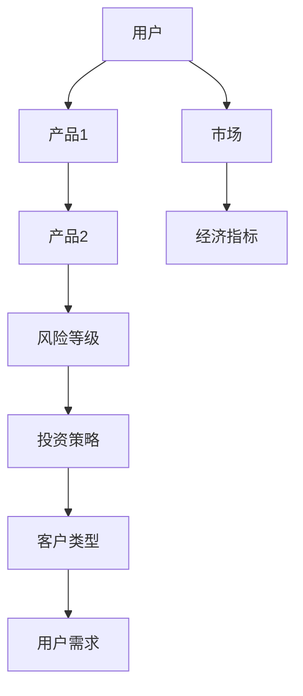
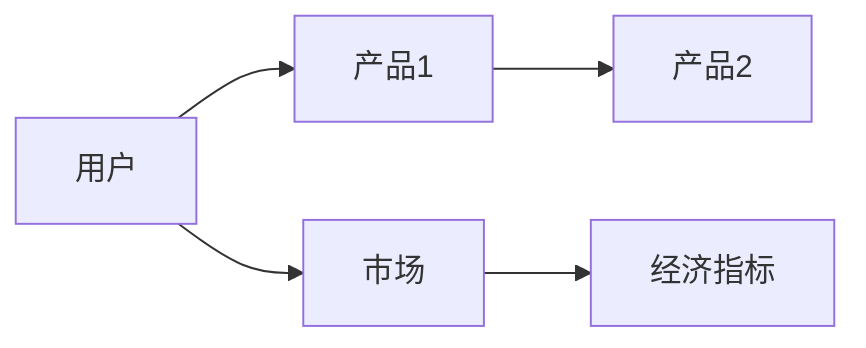
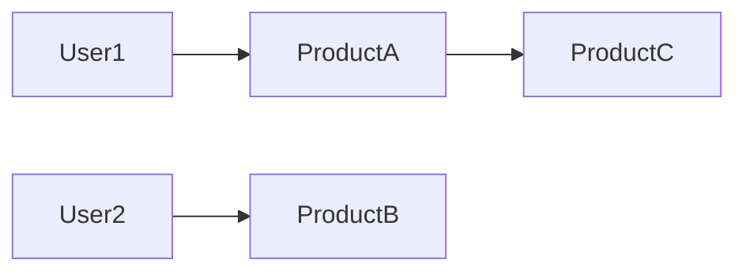
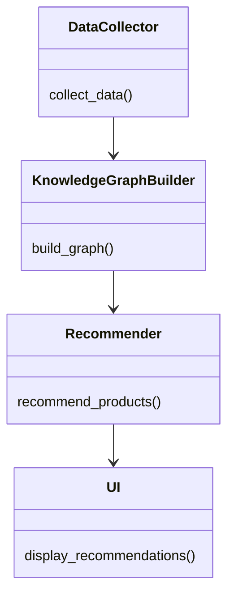

                 


# 《构建基于知识图谱的金融产品组合推荐引擎》

> 关键词：知识图谱，金融推荐系统，金融产品组合，推荐引擎，图嵌入算法，协同过滤，系统架构设计

> 摘要：本文详细探讨了如何构建基于知识图谱的金融产品组合推荐引擎。首先，我们介绍了知识图谱和推荐系统的基本概念，分析了传统推荐系统在金融领域的局限性，以及知识图谱如何增强推荐系统的性能。接着，我们详细讲解了知识图谱的构建方法、推荐算法的核心原理，以及如何将两者结合用于金融产品推荐。通过系统架构设计和项目实战，展示了如何构建一个高效的金融产品组合推荐引擎。最后，我们总结了项目成果，并提出了未来的发展方向和最佳实践建议。

---

# 第一部分: 背景介绍

## 第1章: 知识图谱与金融推荐系统概述

### 1.1 问题背景

#### 1.1.1 传统金融推荐系统的局限性
传统基于协同过滤的推荐系统在金融领域面临以下问题：
- 数据稀疏性：金融产品的用户评价数据通常较少，导致推荐结果不够准确。
- 过度依赖历史行为：无法充分利用产品本身的语义信息，导致推荐缺乏深度。
- �子里外性：推荐结果缺乏可解释性，用户难以理解推荐原因。

#### 1.1.2 知识图谱在金融领域的应用潜力
知识图谱通过将金融产品、客户、市场等实体及其关系表示为图结构，可以提供更丰富的语义信息，提升推荐系统的准确性和可解释性。

#### 1.1.3 金融产品组合推荐的核心问题
金融产品组合推荐需要考虑产品之间的关联性、客户风险偏好、市场动态等多个因素，构建一个动态、个性化的推荐系统。

### 1.2 问题描述

#### 1.2.1 金融产品推荐的定义
金融产品推荐是根据用户需求和市场数据，推荐适合的金融产品或产品组合的过程。

#### 1.2.2 知识图谱在推荐系统中的作用
知识图谱通过连接相关实体，提供上下文信息，增强推荐系统的语义理解和推理能力。

#### 1.2.3 金融产品组合推荐的目标
实现个性化的金融产品组合推荐，满足用户的多样化需求，同时降低投资风险。

### 1.3 问题解决

#### 1.3.1 知识图谱如何解决金融推荐问题
通过构建金融领域的知识图谱，整合产品属性、用户特征、市场动态等多维信息，提升推荐系统的智能性。

#### 1.3.2 基于知识图谱的推荐算法
结合图嵌入技术和协同过滤算法，利用知识图谱中的语义信息，生成更精准的推荐结果。

#### 1.3.3 知识图谱构建的关键步骤
- 数据收集与预处理
- 实体识别与关系抽取
- 图结构构建与存储
- 图嵌入表示学习

### 1.4 边界与外延

#### 1.4.1 金融产品推荐的边界
明确推荐系统的功能范围，如仅考虑用户的购买记录和市场数据，而不涉及实时交易数据。

#### 1.4.2 知识图谱的构建范围
限定知识图谱的构建范围，如仅涵盖金融产品、客户、市场三个主要实体。

#### 1.4.3 系统设计的约束条件
系统设计中需考虑性能、可扩展性、数据隐私等约束条件。

### 1.5 核心概念与结构

#### 1.5.1 知识图谱的核心要素
- 实体（Entity）：金融产品、客户、市场等。
- 关系（Relation）：产品之间的关联、客户与产品的关联等。
- 属性（Attribute）：产品的风险等级、客户的资产规模等。

#### 1.5.2 金融产品推荐系统的组成
- 数据采集模块：收集用户行为数据、产品数据等。
- 知识图谱构建模块：构建金融领域的知识图谱。
- 推荐算法模块：基于知识图谱进行推荐。
- 推荐结果展示模块：以用户友好的形式展示推荐结果。

#### 1.5.3 系统功能模块的划分
- 数据处理模块：负责数据清洗、预处理。
- 知识图谱构建模块：构建金融领域的知识图谱。
- 推荐引擎模块：基于知识图谱和用户数据，生成推荐结果。
- 用户界面模块：展示推荐结果，收集用户反馈。

## 第2章: 知识图谱与推荐系统的核心概念

### 2.1 知识图谱的核心原理

#### 2.1.1 知识图谱的定义
知识图谱是一种以图结构表示知识的语义网络，由实体和关系组成。

#### 2.1.2 知识图谱的构建方法
- 数据收集：从多种数据源获取数据。
- 实体识别与关系抽取：使用NLP技术提取实体及其关系。
- 图结构构建：将实体和关系组织成图结构。
- 图嵌入表示学习：通过深度学习技术生成节点的低维向量表示。

#### 2.1.3 知识图谱的存储与表示
知识图谱通常使用图数据库（如Neo4j）进行存储，常用属性图模型表示实体及其关系。

### 2.2 推荐系统的核心原理

#### 2.2.1 推荐系统的定义
推荐系统是根据用户的行为数据和偏好，推荐相关物品的系统。

#### 2.2.2 基于协同过滤的推荐算法
协同过滤通过寻找与目标用户行为相似的其他用户，推荐这些用户喜欢的物品。
- 基于用户的协同过滤：计算用户之间的相似度，推荐相似用户的喜欢物品。
- 基于物品的协同过滤：计算物品之间的相似度，推荐与目标用户喜欢的物品相似的其他物品。

#### 2.2.3 基于内容的推荐算法
基于物品的属性特征，生成推荐结果。例如，基于金融产品的属性特征（如风险等级、收益类型）进行推荐。

### 2.3 知识图谱与推荐系统的联系

#### 2.3.1 知识图谱在推荐系统中的应用
知识图谱可以为推荐系统提供丰富的语义信息，帮助推荐系统更好地理解用户需求和产品特征。

#### 2.3.2 知识图谱如何增强推荐系统的性能
通过引入实体关系信息，推荐系统可以进行跨领域的关联推理，提升推荐的准确性和可解释性。

#### 2.3.3 知识图谱与推荐系统的结合方式
- 在推荐过程中引入知识图谱的语义信息，增强推荐结果的关联性。
- 通过知识图谱进行冷启动问题的缓解，帮助新用户或新产品建立初始关联。

---

## 第3章: 知识图谱与推荐系统的属性对比

### 3.1 知识图谱的属性特征

| 属性 | 描述 |
|------|------|
| 结构特征 | 以图结构表示，包含实体和关系。 |
| 语义特征 | 提供丰富的语义信息，支持关联推理。 |
| 可扩展性 | 支持动态扩展，适应新实体和关系的加入。 |

### 3.2 推荐系统的属性特征

| 属性 | 描述 |
|------|------|
| 输入特征 | 用户行为数据、产品属性数据等。 |
| 输出特征 | 推荐结果列表。 |
| 算法复杂度 | 取决于具体算法，协同过滤算法复杂度较高。 |

### 3.3 知识图谱与推荐系统的对比

| 对比维度 | 知识图谱 | 推荐系统 |
|---------|--------|---------|
| 核心目标 | 表示知识关联 | 提供个性化推荐 |
| 数据需求 | 需要结构化知识数据 | 需要用户行为数据和产品数据 |
| 优势 | 提供语义理解能力 | 提高推荐准确性和个性化 |

### 3.4 实体关系图架构（Mermaid）



---

## 第4章: 算法原理

### 4.1 知识图谱构建算法

#### 4.1.1 图嵌入算法



```python
def graph_embedding_algorithm():
    nodes = [...]  # 实体节点
    edges = [...]  # 实体关系
    model = Node2Vec(nodes, edges)
    node_embeddings = model.train()
    return node_embeddings
```

#### 4.1.2 知识图谱构建流程

1. 数据收集与预处理。
2. 实体识别与关系抽取。
3. 图结构构建。
4. 图嵌入表示学习。

### 4.2 推荐算法

#### 4.2.1 协同过滤算法



```python
def collaborative_filtering(user_id):
    similar_users = find_similar_users(user_id)
    recommended_products = get_top_recommended_products(similar_users)
    return recommended_products
```

#### 4.2.2 基于内容的推荐算法

```python
def content_based_recommendation(product_id):
    similar_products = find_similar_products(product_id)
    return similar_products
```

---

## 第5章: 系统分析与架构设计

### 5.1 项目介绍

#### 5.1.1 项目背景
构建一个基于知识图谱的金融产品推荐引擎，旨在提升推荐的准确性和个性化。

#### 5.1.2 项目目标
实现一个高效、智能的金融产品组合推荐系统。

### 5.2 系统功能设计

#### 5.2.1 系统功能模块



#### 5.2.2 系统功能流程

1. 数据采集模块收集用户行为数据和产品数据。
2. 知识图谱构建模块处理数据，构建金融领域的知识图谱。
3. 推荐引擎模块基于知识图谱和用户数据，生成推荐结果。
4. 用户界面模块展示推荐结果，收集用户反馈。

### 5.3 系统架构设计

#### 5.3.1 系统架构图


#### 5.3.2 接口设计
- API接口定义：
  - `/api/recommend`：接收用户ID，返回推荐产品列表。
  - `/api/knowledge_graph`：返回知识图谱数据。

---

## 第6章: 项目实战

### 6.1 环境安装

#### 6.1.1 安装依赖

```bash
pip install neo4j
pip install numpy
pip install scikit-learn
```

### 6.2 核心代码实现

#### 6.2.1 数据预处理

```python
import pandas as pd

def preprocess_data(data):
    # 数据清洗和转换
    processed_data = data.dropna().astype('int')
    return processed_data
```

#### 6.2.2 知识图谱构建

```python
from neo4j import GraphDatabase

def build_knowledge_graph(driver, data):
    with driver.session() as session:
        # 插入实体和关系
        session.write_transaction(insert_entities, data)
        session.write_transaction(insert_relations, data)
    return True
```

#### 6.2.3 推荐算法实现

```python
def collaborative_filtering(user_id):
    # 计算用户相似度
    user_similarity = compute_similarity(user_id)
    # 获取相似用户的推荐产品
    recommendations = get_recommendations(user_similarity)
    return recommendations
```

### 6.3 代码解读与分析

#### 6.3.1 数据预处理
- 数据清洗：删除缺失值。
- 数据转换：将数据转换为适合算法处理的格式。

#### 6.3.2 知识图谱构建
- 使用Neo4j图数据库存储知识图谱。
- 插入实体和关系：将数据中的实体和关系插入到图数据库中。

#### 6.3.3 推荐算法实现
- 协同过滤算法：计算用户相似度，获取相似用户的推荐产品。
- 基于内容的推荐算法：通过产品属性进行推荐。

### 6.4 实际案例分析

#### 6.4.1 数据来源
- 用户行为数据：用户的购买记录、浏览记录等。
- 产品数据：产品的基本信息、风险等级等。

#### 6.4.2 实验结果
- 精准度：推荐结果与用户实际购买行为的匹配程度。
- 召回率：推荐结果中包含用户感兴趣产品的比例。
- 用户满意度：用户对推荐结果的满意度调查。

### 6.5 项目小结

---

## 第7章: 最佳实践与小结

### 7.1 最佳实践

#### 7.1.1 数据质量管理
- 确保数据的准确性和完整性，提升推荐系统的性能。

#### 7.1.2 知识图谱优化
- 定期更新知识图谱，保持其准确性和时效性。
- 优化图嵌入算法，提升节点表示的质量。

#### 7.1.3 系统性能优化
- 使用分布式计算框架（如Spark）处理大规模数据。
- 优化推荐算法，减少计算复杂度。

### 7.2 小结

通过本文的详细讲解，我们了解了如何构建基于知识图谱的金融产品组合推荐引擎。从知识图谱和推荐系统的原理，到具体的算法实现和系统架构设计，再到项目实战和最佳实践，我们为构建一个高效、智能的金融推荐系统提供了全面的解决方案。

### 7.3 注意事项

- 数据隐私和安全问题：在处理用户数据时，需严格遵守数据隐私法规。
- 系统可扩展性：设计时需考虑未来数据量增长的情况，确保系统的可扩展性。
- 算法选择：根据具体场景选择合适的算法，避免盲目使用最新技术。

### 7.4 拓展阅读

- 《图神经网络：理论与实践》
- 《推荐系统实战：方法、案例与技巧》
- 《金融产品组合优化与风险管理》

---

# 作者：AI天才研究院/AI Genius Institute & 禅与计算机程序设计艺术 /Zen And The Art of Computer Programming

---

**全文完**

