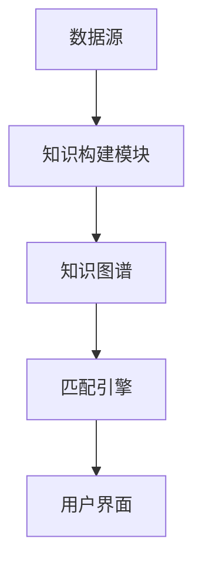

                 


# 构建基于知识图谱的金融产品适当性匹配引擎

> 关键词：知识图谱、金融产品匹配、适当性匹配、图谱构建、算法原理

> 摘要：本文详细探讨了如何利用知识图谱构建金融产品适当性匹配引擎。通过分析现有匹配方法的局限性，结合知识图谱的语义表示和关联分析能力，提出了一种基于知识图谱的匹配引擎设计方案。本文从背景介绍、核心概念、算法原理、系统架构设计、项目实战到最佳实践等方面进行了全面阐述，为读者提供了一套完整的解决方案。

---

## 第1章: 背景介绍与核心概念

### 1.1 问题背景

#### 1.1.1 金融产品适当性匹配的重要性
金融产品适当性匹配是金融服务业的核心环节之一。随着金融产品的种类不断增加，客户的需求也日益多样化。传统的基于规则的匹配方法难以应对复杂场景下的匹配需求，导致匹配效率低下、准确率不高。因此，如何高效、准确地进行金融产品匹配成为亟待解决的问题。

#### 1.1.2 当前金融产品匹配的主要挑战
1. **数据孤岛问题**：金融机构的数据分散在不同的系统中，难以统一管理和分析。
2. **语义理解不足**：传统匹配方法难以理解产品之间的语义关系，导致匹配结果不够精准。
3. **动态变化问题**：金融市场和客户需求不断变化，匹配系统需要具备动态更新能力。

#### 1.1.3 知识图谱在金融产品匹配中的作用
知识图谱通过构建金融产品的语义网络，能够有效地捕捉产品之间的关联性，帮助系统更好地理解客户需求，从而实现更精准的匹配。

### 1.2 问题描述

#### 1.2.1 金融产品匹配的核心问题
- 如何准确理解客户的需求和风险承受能力？
- 如何高效匹配适合客户的产品？

#### 1.2.2 知识图谱在金融产品匹配中的应用场景
- **产品语义表示**：通过知识图谱表示产品特性。
- **关联分析**：分析产品之间的关联性。
- **动态更新**：实时更新产品信息和市场变化。

#### 1.2.3 问题解决的目标与边界
目标：构建一个基于知识图谱的金融产品适当性匹配引擎，实现高效、精准的匹配。
边界：仅关注产品匹配，不涉及具体的产品交易和风险管理。

### 1.3 核心概念与联系

#### 1.3.1 知识图谱的定义与特点
- **定义**：知识图谱是一种以图结构形式表示知识的数据库，包含实体和关系。
- **特点**：
  - 高度结构化
  - 支持语义推理
  - 可扩展性强

#### 1.3.2 知识图谱在金融领域的应用
- **产品分类**：构建金融产品的分类体系。
- **语义表示**：表示产品的特性、风险和收益。
- **关联分析**：分析产品之间的关系和潜在风险。

---

## 第2章: 知识图谱的基本概念与特点

### 2.1 知识图谱的定义与特点

#### 2.1.1 知识图谱的定义
知识图谱是一种以图结构形式表示知识的数据库，包含实体（如人、组织、产品）及其关系。

#### 2.1.2 知识图谱的核心特点
- **语义丰富**：能够表示实体的属性和关系。
- **可扩展性**：支持动态添加新实体和关系。
- **关联性分析**：能够发现实体之间的隐含关系。

#### 2.1.3 知识图谱与传统数据库的区别
| 特性       | 传统数据库                 | 知识图谱                 |
|------------|--------------------------|--------------------------|
| 数据结构   | 行为数据、关系数据         | 图结构，包含实体和关系   |
| 查询能力   | 基于关键字查询             | 支持语义查询和路径分析   |
| 可扩展性   | 较低                      | 较高                      |

### 2.2 知识图谱在金融领域的应用

#### 2.2.1 金融领域的知识图谱构建
- **产品分类**：将金融产品按照类别、风险等级等进行分类。
- **语义表示**：表示产品的特性，如收益、风险、流动性。
- **关联分析**：分析产品之间的关联性，如替代产品、互补产品。

#### 2.2.2 知识图谱在金融产品匹配中的优势
- **语义理解**：能够理解产品之间的语义关系。
- **动态更新**：能够实时更新产品信息和市场变化。
- **关联性分析**：能够发现潜在的产品关系和风险。

---

## 第3章: 金融产品适当性匹配的核心概念

### 3.1 金融产品适当性匹配的定义

#### 3.1.1 金融产品适当性匹配的定义
金融产品适当性匹配是指根据客户的需求、风险承受能力和财务状况，推荐适合的金融产品。

#### 3.1.2 匹配的核心要素
- **客户特征**：包括风险偏好、投资目标、财务状况等。
- **产品特征**：包括收益、风险、流动性等。

#### 3.1.3 匹配的实现方式
- **基于规则的匹配**：根据预设规则进行匹配。
- **基于知识图谱的匹配**：利用知识图谱进行语义匹配。

### 3.2 知识图谱在匹配中的作用

#### 3.2.1 知识图谱的语义表示能力
- 通过知识图谱表示产品的特性、风险和收益。
- 通过语义分析理解客户的需求。

#### 3.2.2 知识图谱的关联性分析
- 分析产品之间的关联性，如替代产品、互补产品。
- 分析客户与产品的关联性。

#### 3.2.3 知识图谱的动态更新能力
- 实时更新产品信息和市场变化。
- 动态调整匹配策略。

### 3.3 核心概念对比表格

| 概念       | 传统匹配方法                | 基于知识图谱的匹配方法          |
|------------|---------------------------|-----------------------------|
| 匹配依据   | 预设规则                    | 语义分析和关联性分析          |
| 匹配效率   | 较低                       | 较高                          |
| 匹配精度   | 一般                       | 更高                          |

---

## 第4章: 知识图谱的构建与应用

### 4.1 知识图谱的构建流程

#### 4.1.1 数据收集
- 数据来源：金融机构内部数据、公开市场数据。
- 数据清洗：去除重复、错误数据。

#### 4.1.2 数据预处理
- 数据标准化：统一数据格式。
- 数据关联：建立实体之间的关联关系。

#### 4.1.3 知识图谱构建
- 使用图数据库（如Neo4j）构建知识图谱。
- 插入实体和关系。

#### 4.1.4 知识图谱优化
- 去冗余：去除多余的边和节点。
- 索引优化：优化查询性能。

### 4.2 知识图谱的应用

#### 4.2.1 产品分类
- 根据产品特性进行分类。
- 例如：将理财产品分为低风险、中风险、高风险三类。

#### 4.2.2 产品推荐
- 根据客户特征推荐适合的产品。
- 例如：根据客户的风险偏好推荐低风险理财产品。

#### 4.2.3 风险分析
- 分析产品之间的关联性，发现潜在风险。
- 例如：发现某些产品可能存在较高的关联风险。

---

## 第5章: 算法原理与数学模型

### 5.1 知识图谱匹配算法原理

#### 5.1.1 基于向量的匹配算法
- **原理**：将实体表示为向量，计算向量相似度。
- **步骤**：
  1. 将实体嵌入为向量。
  2. 计算向量相似度。
  3. 根据相似度排序，推荐最相似的产品。

#### 5.1.2 基于路径的匹配算法
- **原理**：通过分析实体之间的路径，发现潜在关系。
- **步骤**：
  1. 构建图结构。
  2. 分析路径。
  3. 根据路径权重进行匹配。

#### 5.1.3 组合匹配算法
- **原理**：结合向量和路径的匹配结果，进行综合匹配。
- **步骤**：
  1. 分别进行向量和路径匹配。
  2. 综合结果，推荐最优产品。

### 5.2 数学模型与公式

#### 5.2.1 向量相似度计算
$$ \text{相似度} = \frac{\mathbf{u} \cdot \mathbf{v}}{|\mathbf{u}| |\mathbf{v}|} $$
其中，$\mathbf{u}$和$\mathbf{v}$分别为两个向量。

#### 5.2.2 路径权重计算
$$ \text{权重} = \sum_{i=1}^{n} w_i $$
其中，$w_i$为路径上的边权重。

---

## 第6章: 系统架构设计与实现

### 6.1 系统架构设计

#### 6.1.1 系统组成
- **数据源**：金融机构内部数据和公开市场数据。
- **知识构建模块**：负责知识图谱的构建和优化。
- **匹配引擎**：负责客户与产品的匹配。
- **用户界面**：提供用户交互界面。

#### 6.1.2 系统架构图


#### 6.1.3 接口设计
- **输入接口**：客户特征和产品信息。
- **输出接口**：匹配结果和推荐产品。

### 6.2 系统实现

#### 6.2.1 核心代码实现
```python
class KnowledgeGraph:
    def __init__(self):
        self.graph = {}  # 图结构，键为节点，值为邻接节点

    def add_entity(self, entity):
        if entity not in self.graph:
            self.graph[entity] = []

    def add_relation(self, entity1, entity2):
        self.graph[entity1].append(entity2)
        self.graph[entity2].append(entity1)

    def get_neighbors(self, entity):
        return self.graph.get(entity, [])
```

#### 6.2.2 算法实现
```python
def vector_similarity(u, v):
    return np.dot(u, v) / (np.linalg.norm(u) * np.linalg.norm(v))

def path_matching(graph, start, end):
    # 简单的广度优先搜索
    visited = set()
    queue = deque([(start, 0)])
    while queue:
        node, weight = queue.popleft()
        if node == end:
            return weight
        for neighbor in graph[node]:
            if neighbor not in visited:
                visited.add(neighbor)
                queue.append((neighbor, weight + 1))
    return None
```

---

## 第7章: 项目实战与案例分析

### 7.1 项目实战

#### 7.1.1 环境安装
- **Python**：安装Python 3.x
- **图数据库**：安装Neo4j
- **依赖库**：安装networkx、numpy、scipy

#### 7.1.2 核心代码实现
```python
from neo4j import GraphDatabase
from neo4j.exceptions importNeo4j.exceptions importNeo4j.exceptions importNeo4j.exceptions

class KnowledgeGraphDB:
    def __init__(self, uri):
        self.driver = GraphDatabase.driver(uri)

    def create_product_node(self, product_id, product_name, risk_level):
        with self.driver.session() as session:
            session.run("CREATE (:Product {id: $id, name: $name, risk_level: $risk_level})", 
                        id=product_id, name=product_name, risk_level=risk_level)

    def create_customer_node(self, customer_id, customer_name, risk_preference):
        with self.driver.session() as session:
            session.run("CREATE (:Customer {id: $id, name: $name, risk_preference: $risk_preference})", 
                        id=customer_id, name=customer_name, risk_preference=risk_preference)

    def create_relationship(self, product_id, customer_id):
        with self.driver.session() as session:
            session.run("MATCH (p:Product {id: $p_id}), (c:Customer {id: $c_id}) CREATE (p)-[:RELEVANT_TO]->(c)", 
                        p_id=product_id, c_id=customer_id)
```

#### 7.1.3 案例分析
假设我们有以下产品和客户：
- 产品A：低风险，收益稳定
- 产品B：中风险，收益较高
- 客户X：风险偏好低，适合低风险产品

通过知识图谱匹配，系统会推荐产品A给客户X。

---

## 第8章: 总结与展望

### 8.1 总结
本文详细探讨了基于知识图谱的金融产品适当性匹配引擎的构建过程。通过知识图谱的强大语义表示能力和关联性分析能力，能够实现高效、精准的产品匹配。本文从背景介绍、核心概念、算法原理、系统架构设计到项目实战，为读者提供了一套完整的解决方案。

### 8.2 展望
未来，随着知识图谱技术的不断发展，金融产品匹配引擎将更加智能化和个性化。通过引入更多数据源和优化算法，匹配系统的准确性和效率将进一步提升。

---

## 作者

作者：AI天才研究院/AI Genius Institute & 禅与计算机程序设计艺术 /Zen And The Art of Computer Programming

