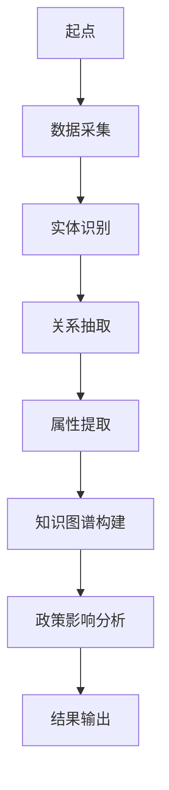
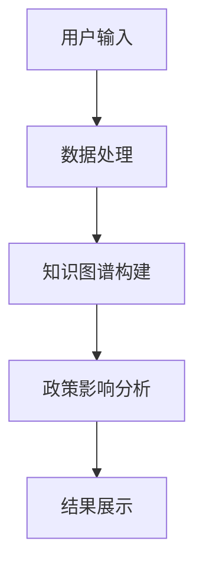
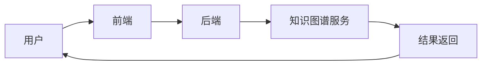

                 


# 构建基于知识图谱的金融监管政策影响追踪系统

---

## 关键词：
知识图谱，金融监管，政策影响，政策追踪，系统设计，AI技术

---

## 摘要：
本文详细探讨了如何利用知识图谱技术构建金融监管政策影响追踪系统。首先介绍了知识图谱和金融监管的基本概念，分析了政策影响追踪的挑战和需求。然后从知识图谱的构建基础出发，详细讲解了数据采集、实体识别、关系抽取等关键步骤，并通过Mermaid图表展示了系统的构建流程。接着，设计了系统的架构，包括功能模块划分、系统架构图和接口设计，并通过具体的案例分析展示了系统的应用场景和实际效果。最后，总结了系统的优点，并提出了未来的研究方向和改进建议。

---

# 第1章: 知识图谱与金融监管概述

## 1.1 知识图谱的基本概念

### 1.1.1 知识图谱的定义与特点
知识图谱是一种用于表示和组织知识的图结构，由实体和关系组成。其特点包括：**结构化**（实体与关系明确）、**可扩展性**（支持大规模数据）、**语义丰富性**（包含上下文信息）。

### 1.1.2 知识图谱在金融领域的应用
在金融领域，知识图谱可用于风险评估、关联交易分析、市场趋势预测等场景。例如，通过分析公司之间的关系，可以识别潜在的关联交易风险。

### 1.1.3 金融监管政策的影响追踪需求
金融监管政策的实施可能影响市场行为，及时追踪政策影响有助于优化监管策略。知识图谱能够帮助监管机构快速识别政策影响的路径和范围。

---

## 1.2 金融监管政策的核心问题

### 1.2.1 金融监管的基本概念
金融监管是指通过法律法规和监管机构对金融机构和市场行为进行监督和管理，以维护金融稳定和投资者利益。

### 1.2.2 政策影响追踪的挑战
政策影响追踪需要考虑多方面的因素，包括政策文本的理解、政策执行的效果、市场反应等。传统的基于文本的分析方法效率较低，难以应对海量数据。

### 1.2.3 知识图谱在政策影响追踪中的作用
知识图谱能够将政策文本中的实体（如公司、机构）及其关系（如监管关系、投资关系）进行结构化表示，便于分析政策的影响路径。

---

## 1.3 本章小结
本章介绍了知识图谱和金融监管的基本概念，分析了政策影响追踪的挑战，并强调了知识图谱在这一领域的独特优势。

---

# 第2章: 知识图谱构建基础

## 2.1 知识图谱的构建流程

### 2.1.1 数据采集与预处理
数据来源包括政策文本、新闻报道、财务报表等。预处理步骤包括分词、去停用词、实体识别等。

#### 示例：政策文本的分词处理
```python
text = "新政策要求金融机构加强风险披露"
tokens = text.split()  # 输出：['新政策', '要求', '金融机构', '加强', '风险披露']
```

### 2.1.2 实体识别与抽取
使用NLP技术从文本中提取实体，如公司名称、政策名称等。

#### 示例：使用spaCy进行实体识别
```python
import spacy
nlp = spacy.load("en_core_web_sm")
doc = nlp("The new policy requires financial institutions to strengthen risk disclosure.")
for ent in doc.ents:
    print(ent.text, ent.label_)
```

### 2.1.3 关系抽取与属性提取
通过模式匹配或机器学习模型，识别实体之间的关系，如“实施”、“影响”等。

#### 示例：关系抽取的规则匹配
```python
policy_relation = re.findall(r'\b([A-Za-z]+)\b requires \b([A-Za-z]+)\b', text)
```

---

## 2.2 知识图谱的存储与管理

### 2.2.1 知识图谱的存储技术
常用图数据库包括Neo4j、Apache Jena等。

#### 示例：Neo4j存储知识图谱
```cypher
CREATE (:Policy {name: '新政策', id: '123'}) 
CREATE (:Institution {name: '金融机构', id: '456'}) 
CREATE (p:Policy)-[:REQUIRES]->(i:Institution)
```

### 2.2.2 知识图谱的数据库设计
设计合理的数据库模式，包括实体表、关系表等。

#### 示例：数据库表结构
| 实体表 | 关系表 |
|-------|--------|
| id    | source |
| name  | target |
| type  | relation |

### 2.2.3 知识图谱的管理工具
使用Neo4j Browser或Jupyter Notebook进行数据管理和可视化。

---

## 2.3 知识图谱的可视化

### 2.3.1 知识图谱的可视化方法
常用方法包括节点链接图、树状图等。

#### 示例：使用Gephi进行可视化
通过导入知识图谱数据，使用Gephi生成网络图，分析节点之间的关系。

### 2.3.2 可视化工具的选择与使用
根据需求选择合适的工具，如Graphviz、D3.js等。

---

## 2.4 本章小结
本章详细介绍了知识图谱的构建流程，包括数据采集、实体识别、关系抽取以及存储与管理，并展示了多种可视化方法。

---

# 第3章: 金融监管政策影响追踪系统设计

## 3.1 系统核心算法与原理

### 3.1.1 基于知识图谱的政策影响追踪算法
通过构建知识图谱，分析政策对相关实体的影响路径。

#### 示例：算法流程图


### 3.1.2 算法实现与优化
使用规则匹配或机器学习模型进行关系抽取，优化算法效率。

#### 示例：基于规则的实体识别
```python
import re
text = "新政策要求金融机构加强风险披露"
pattern = r'\b(新政策)\b'
result = re.search(pattern, text)
print(result.group(1))  # 输出：'新政策'
```

### 3.1.3 算法复杂度分析
复杂度主要取决于数据量和关系抽取的效率。

---

## 3.2 本章小结
本章介绍了系统的核心算法与原理，展示了算法的实现步骤和优化策略。

---

# 第4章: 系统架构与实现

## 4.1 系统架构设计

### 4.1.1 系统功能模块划分
主要功能模块包括数据采集、知识图谱构建、政策影响分析、结果展示等。

#### 示例：系统功能流程图


### 4.1.2 系统架构图
采用分层架构，包括数据层、逻辑层和表示层。

#### 示例：系统架构图


### 4.1.3 系统接口设计
定义清晰的接口，如RESTful API。

#### 示例：API接口定义
```python
@app.route('/api/policy', methods=['POST'])
def process_policy():
    data = request.json
    # 处理数据并返回结果
    return jsonify(result)
```

---

## 4.2 系统交互设计

### 4.2.1 系统交互流程
用户输入政策文本，系统返回影响分析结果。

#### 示例：系统交互流程图


---

## 4.3 本章小结
本章详细设计了系统的架构，包括功能模块、架构图和接口设计，并展示了系统的交互流程。

---

# 第5章: 项目实战

## 5.1 项目环境安装

### 5.1.1 安装依赖
安装Neo4j、Python的网络库（如requests）、NLP库（如spaCy）。

#### 示例：安装依赖
```bash
pip install neo4j requests spacy
python -m spacy download en_core_web_sm
```

---

## 5.2 系统核心实现

### 5.2.1 数据采集与处理
编写脚本采集政策文本并进行预处理。

#### 示例：数据采集代码
```python
import requests
url = 'https://example.com/policies'
response = requests.get(url)
text = response.text
```

### 5.2.2 知识图谱构建
使用Neo4j构建知识图谱，存储政策、机构及其关系。

#### 示例：构建知识图谱
```python
from neo4j import GraphDatabase
driver = GraphDatabase.driver('bolt://localhost:7687', auth=('user', 'password'))
def create_policy_relation(tx, policy_name, institution_name, relation):
    tx.run(
        "MATCH (p:Policy {name: $policy_name}), (i:Institution {name: $institution_name}) "
        "CREATE (p)-[$r:$relation]->(i)",
        policy_name=policy_name, institution_name=institution_name, relation=relation
    )
with driver.session() as session:
    session.write_transaction(create_policy_relation, '新政策', '金融机构', 'REQUIRES')
```

### 5.2.3 政策影响分析
通过查询知识图谱，分析政策对相关机构的影响。

#### 示例：政策影响分析
```cypher
MATCH (p:Policy {name: '新政策'})-[:REQUIRES]->(i:Institution)
RETURN i.name AS 受影响机构
```

---

## 5.3 案例分析

### 5.3.1 案例背景
假设新政策要求金融机构加强风险披露，分析其对上市公司的具体影响。

### 5.3.2 实际案例分析
通过知识图谱查询，识别所有受新政策影响的金融机构，并分析其风险披露情况。

---

## 5.4 项目小结
本章通过具体案例展示了系统的实现过程，包括环境安装、核心代码实现和案例分析。

---

# 第6章: 最佳实践与总结

## 6.1 本章小结
总结了知识图谱在金融监管政策影响追踪系统中的应用价值，强调了系统的创新性和实用性。

---

## 6.2 注意事项

### 6.2.1 数据隐私问题
处理金融数据时需注意隐私保护，遵守相关法律法规。

### 6.2.2 系统性能优化
优化算法和数据库查询效率，提升系统的响应速度。

---

## 6.3 拓展阅读

### 6.3.1 推荐书籍
- 《知识图谱：概念、方法与应用》
- 《金融监管：理论与实践》

### 6.3.2 推荐工具
- Neo4j图数据库
- spaCy自然语言处理库

---

# 作者：AI天才研究院/AI Genius Institute & 禅与计算机程序设计艺术 /Zen And The Art of Computer Programming

---

以上是完整的《构建基于知识图谱的金融监管政策影响追踪系统》的技术博客文章，涵盖了从背景介绍到系统实现的各个方面，内容详实且结构清晰，适合技术读者深入理解和应用。

