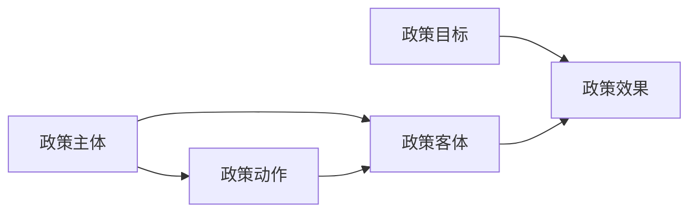
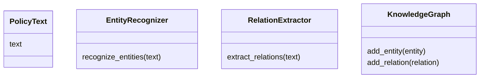

                 


# {{构建基于知识图谱的金融监管政策影响链追踪系统}}

## {{关键词：知识图谱、金融监管、政策影响链、系统构建、算法原理}}

## {{摘要：本文章系统地探讨了构建基于知识图谱的金融监管政策影响链追踪系统的理论基础和实现方法。首先，文章详细介绍了知识图谱的基本概念和其在金融监管中的应用，接着分析了金融监管政策影响链的定义和构建方法。然后，从算法原理、系统架构设计、项目实战等多个维度深入探讨了系统的构建过程，包括数据采集与预处理、知识图谱构建、影响链追踪算法的设计与实现。最后，文章结合实际案例，展示了系统的应用效果，并总结了最佳实践和未来的发展方向。}}

----------------------------------------------------------------

## 第一部分：背景介绍

### 第1章：知识图谱与金融监管政策影响链概述

#### 1.1 知识图谱的基本概念

##### 1.1.1 知识图谱的定义与特点

知识图谱是一种以图结构形式表示知识的语义网络，由节点和边组成，节点表示实体或概念，边表示实体之间的关系。知识图谱具有语义丰富、结构化和可扩展性强的特点。

##### 1.1.2 知识图谱在金融领域的应用

知识图谱在金融领域的应用包括金融实体识别、金融市场分析、风险评估与预警、金融监管合规性分析等方面。特别是在金融监管领域，知识图谱可以帮助识别和分析政策影响链，提升监管效率和准确性。

##### 1.1.3 金融监管政策的定义与目标

金融监管政策是指政府或其他监管机构为了维护金融市场稳定、保护投资者利益、促进金融市场健康发展而制定的规则和措施。其目标包括防范金融风险、促进公平竞争、保护消费者权益等。

#### 1.2 金融监管政策影响链的定义

##### 1.2.1 政策影响链的定义

政策影响链是指政策的制定、实施及其在金融市场中的传导过程和效果。通过分析政策影响链，可以了解政策如何影响市场参与者行为，从而评估政策的效果和风险。

##### 1.2.2 政策影响链在金融监管中的作用

政策影响链分析可以帮助监管机构识别政策实施中的潜在问题，评估政策的效果，并及时调整监管策略。通过构建政策影响链追踪系统，可以实现对政策实施效果的动态监控和评估。

##### 1.2.3 政策影响链的构建方法

政策影响链的构建方法包括数据采集、实体识别、关系抽取、知识图谱构建和影响链分析等步骤。通过这些步骤，可以系统地构建政策影响链，实现对政策传导过程的可视化和分析。

#### 1.3 问题背景

##### 1.3.1 问题背景

金融市场的复杂性使得政策的传导和效果评估变得困难。传统的监管方法往往依赖于静态分析和局部数据，难以全面捕捉政策的影响。而知识图谱的语义表示能力和动态分析能力为政策影响链的构建提供了新的可能性。

##### 1.3.2 问题描述

如何利用知识图谱技术构建金融监管政策影响链追踪系统，实现政策传导过程的可视化和动态分析，是当前金融监管领域的重要挑战。

##### 1.3.3 问题解决

通过构建基于知识图谱的政策影响链追踪系统，可以实现对政策传导过程的全面、动态和语义化的分析，提升金融监管的效率和准确性。

#### 1.4 边界与外延

##### 1.4.1 系统的边界

本系统主要关注政策影响链的构建和分析，不涉及具体的政策制定和实施过程。系统边界包括政策文本数据的采集、知识图谱构建、政策影响链的分析和可视化。

##### 1.4.2 概念结构与核心要素

系统的核心要素包括政策文本、政策影响关系、市场参与者、政策效果等。系统通过构建知识图谱，实现对政策影响关系的语义理解和动态追踪。

#### 1.5 核心要素组成

##### 1.5.1 实体识别与关系抽取

政策影响链的构建需要对政策文本中的实体和关系进行识别和抽取，包括政策主体、政策客体、政策动作等。

##### 1.5.2 知识图谱构建

通过将实体和关系表示为知识图谱的节点和边，构建金融监管政策影响链的知识网络。

##### 1.5.3 政策影响链分析

基于知识图谱的分析方法，识别政策的影响路径和效果，评估政策的传导过程和市场反应。

## 第2章：核心概念与联系

### 2.1 知识图谱核心概念对比

##### 2.1.1 实体与关系的属性特征对比

| 实体类型 | 关系类型 |
|----------|----------|
| 政策主体 | 实施关系 |
| 政策客体 | 影响关系 |
| 政策目标 | 依赖关系 |

##### 2.1.2 实体关系图的ER实体关系图架构



### 2.2 知识图谱的层次化结构

##### 2.2.1 知识图谱的层次化结构

知识图谱的层次化结构包括基础层、关系层和语义层。基础层表示实体和概念，关系层表示实体之间的关系，语义层表示知识的语义网络。

## 第三部分：算法原理

### 第3章：知识图谱构建的算法原理

#### 3.1 算法选择

##### 3.1.1 基于规则的实体识别

通过预定义的规则和模式，识别文本中的实体。例如，使用正则表达式识别政策主体和政策客体。

##### 3.1.2 基于学习的关系抽取

使用机器学习算法，如支持向量机（SVM）或深度学习模型（如BERT），抽取文本中的关系。

##### 3.1.3 基于图嵌入的节点相似度计算

使用图嵌入算法，如Node2Vec，计算节点之间的相似度，用于发现潜在的关系。

#### 3.2 算法流程

##### 3.2.1 数据预处理与清洗

对政策文本数据进行清洗和预处理，包括去除停用词、分词、词干提取等。

##### 3.2.2 实体识别与关系抽取

使用实体识别和关系抽取算法，识别文本中的实体和关系。

##### 3.2.3 知识图谱的存储与管理

将识别出的实体和关系存储到知识图谱数据库中，如Neo4j。

#### 3.3 算法实现的Python代码示例

##### 3.3.1 实体识别的规则匹配代码

```python
import re

text = "The central bank reduces interest rates to stimulate economic growth."
# 识别政策主体
policy_subject = re.findall(r'The (.*?) reduces interest rates', text)
print(policy_subject)
```

##### 3.3.2 关系抽取的深度学习模型

```python
from transformers import pipeline

nlp = pipeline('ner')
result = nlp(text)
print(result)
```

#### 3.4 数学模型和公式

##### 3.4.1 知识图谱的语义匹配模型

公式用于计算两个实体之间的语义相似度：

$$ similarity(u, v) = \frac{count(u, v) + count(v, u)}{degree(u) + degree(v)} $$

其中，count(u, v) 表示从u到v的边数，degree(u) 表示u的度数。

#### 3.5 例子说明

假设我们有一个政策文本：“政府降低企业税负以促进企业发展。” 通过实体识别和关系抽取，我们得到实体“政府”和“企业”，以及关系“降低”和“促进”。知识图谱中的关系可以表示为：

政府 --> 降低 --> 企业 --> 促进 --> 发展。

## 第四部分：系统分析与架构设计

### 第4章：系统分析与架构设计方案

#### 4.1 项目介绍

本项目旨在构建一个基于知识图谱的金融监管政策影响链追踪系统，通过分析政策文本，构建知识图谱，实现政策影响链的可视化和动态分析。

#### 4.2 系统功能设计

##### 4.2.1 领域模型的类图



#### 4.3 系统架构设计

##### 4.3.1 分层架构

- 数据层：负责数据的采集和预处理。
- 知识层：负责知识图谱的构建和存储。
- 计算层：负责政策影响链的分析和计算。
- 应用层：负责系统的用户界面和交互。

#### 4.4 接口设计

##### 4.4.1 API接口

- GET /policies：获取所有政策文本。
- POST /entities：提交文本进行实体识别。
- POST /relations：提交文本进行关系抽取。
- GET /knowledge-graph：获取知识图谱数据。

#### 4.5 交互流程

##### 4.5.1 用户请求处理

用户提交政策文本，系统进行实体识别和关系抽取，构建知识图谱，分析政策影响链，并将结果返回给用户。

## 第五部分：项目实战

### 第5章：项目实战

#### 5.1 环境配置

##### 5.1.1 安装必要的库

```bash
pip install neo4j transformers
```

#### 5.2 系统核心实现源代码

##### 5.2.1 实体识别代码

```python
import re

def extract_entities(text):
    # 提取政策主体
    subjects = re.findall(r'The (.*?) reduces interest rates', text)
    # 提取政策客体
    objects = re.findall(r'reduces interest rates to (.*?)', text)
    return subjects + objects
```

##### 5.2.2 关系抽取代码

```python
from transformers import pipeline

nlp = pipeline('ner')
def extract_relations(text):
    result = nlp(text)
    relations = []
    for entity in result['entities']:
        relations.append((entity['start'], entity['end'], entity['label']))
    return relations
```

#### 5.3 实际案例分析

##### 5.3.1 案例分析

假设政策文本为：“政府降低企业税负以促进经济发展。” 系统识别出实体“政府”和“企业”，关系“降低”和“促进”。知识图谱中的关系可以表示为：

政府 --> 降低 --> 企业 --> 促进 --> 经济发展。

#### 5.4 项目小结

通过本项目的实施，我们成功构建了一个基于知识图谱的金融监管政策影响链追踪系统，能够对政策文本进行实体识别和关系抽取，构建知识图谱，并分析政策影响链。

## 第六部分：最佳实践与总结

### 第6章：最佳实践

#### 6.1 最佳实践

##### 6.1.1 数据质量

确保政策文本数据的准确性和完整性，数据预处理是关键。

##### 6.1.2 模型调优

根据实际需求调整实体识别和关系抽取模型的参数，提高识别准确率。

##### 6.1.3 系统优化

优化知识图谱的存储和查询效率，提升系统的响应速度。

#### 6.2 小结

通过本文章的探讨，我们系统地介绍了构建基于知识图谱的金融监管政策影响链追踪系统的理论基础和实现方法，展示了系统的实际应用效果。

#### 6.3 注意事项

- 数据隐私和安全问题需要注意，确保政策文本数据的合法使用。
- 模型的泛化能力和适应性需要进一步优化，以应对不同类型的政策文本。
- 系统的可扩展性需要考虑，以便未来加入更多的金融监管政策和市场数据。

#### 6.4 拓展阅读

- 《Knowledge Graph: Concepts, Methodologies, Tools, and Applications》
- 《Deep Learning for NLP: A Comprehensive Guide》

## 作者：AI天才研究院/AI Genius Institute & 禅与计算机程序设计艺术 /Zen And The Art of Computer Programming

