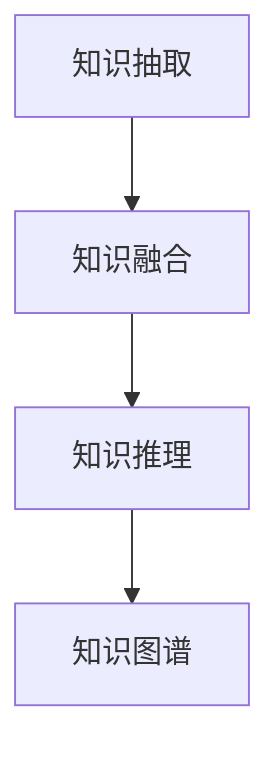

                 


# 《构建基于知识图谱的金融监管沙盒测试平台》

---

## 关键词：
- 知识图谱
- 金融监管
- 沙盒测试
- 系统架构
- 算法原理

---

## 摘要：
本文详细探讨了如何利用知识图谱技术构建一个高效的金融监管沙盒测试平台。首先，我们介绍了知识图谱和金融监管沙盒的基本概念，并分析了它们在金融监管中的应用前景。接着，我们深入讲解了知识图谱的核心概念与构建方法，包括知识抽取、融合和推理的算法原理。随后，我们设计了基于知识图谱的金融监管沙盒系统架构，详细阐述了系统功能模块、接口设计和交互流程。最后，我们通过实际案例展示了平台的实现过程，并总结了最佳实践经验和未来研究方向。

---

## 目录：

---

# 第一部分: 背景介绍

## 第1章: 知识图谱与金融监管沙盒概述

### 1.1 知识图谱的定义与特点
- **1.1.1 知识图谱的定义**
  - 知识图谱是一种以图结构表示知识的语义网络，由节点（实体）和边（关系）组成。
- **1.1.2 知识图谱的核心特点**
  - **结构化**: 通过实体和关系构建清晰的知识体系。
  - **语义化**: 能够表达实体之间的语义关系。
  - **可扩展性**: 支持大规模数据的集成与分析。
- **1.1.3 知识图谱与传统数据库的区别**
  - 知识图谱关注实体间的关系，而传统数据库关注数据的结构化存储。

### 1.2 金融监管沙盒的定义与特点
- **1.2.1 金融监管沙盒的定义**
  - 金融监管沙盒是一个受控的环境，允许金融机构在模拟的真实金融环境中测试新产品和服务。
- **1.2.2 金融监管沙盒的核心特点**
  - **隔离性**: 测试环境与真实环境隔离，避免风险外溢。
  - **可控性**: 通过设定规则和边界，确保测试过程的安全性。
  - **可扩展性**: 支持多种金融产品和服务的测试。
- **1.2.3 金融监管沙盒与传统监管方式的区别**
  - 传统监管依赖事后检查，而金融监管沙盒强调事前测试和风险控制。

### 1.3 知识图谱在金融监管中的应用前景
- **1.3.1 知识图谱的潜在应用领域**
  - 风险评估、关联交易分析、合规性检查等。
- **1.3.2 知识图谱在金融监管中的优势**
  - 提供全局视角，帮助发现隐藏的关联关系。
  - 支持复杂金融产品的建模与分析。
- **1.3.3 知识图谱应用的挑战与机遇**
  - 数据质量、模型复杂性是主要挑战，但也是提升监管效率的关键机遇。

### 1.4 本章小结
本章介绍了知识图谱和金融监管沙盒的基本概念，并分析了它们在金融监管中的应用前景。

---

# 第二部分: 核心概念与联系

## 第2章: 知识图谱的核心概念与原理

### 2.1 知识图谱的核心概念
- **2.1.1 实体与属性**
  - 实体：现实世界中的具体事物，如“公司”、“产品”。
  - 属性：描述实体的特征，如“公司名称”、“注册资本”。
- **2.1.2 关系与事实**
  - 关系：描述实体之间的关联，如“公司A投资公司B”。
  - 事实：基于实体和关系的陈述，如“公司A投资了公司B，金额为1000万元”。
- **2.1.3 知识图谱的构建流程**
  - 数据采集、知识抽取、知识融合、知识存储、知识推理。

### 2.2 知识图谱的构建方法
- **2.2.1 知识抽取**
  - 从文本中提取实体、关系和属性。
  - 常用技术：自然语言处理（NLP）、信息抽取（IE）。
- **2.2.2 知识融合**
  - 将多个来源的知识进行整合，消除冲突。
  - 方法：基于规则的融合、基于学习的融合。
- **2.2.3 知识推理**
  - 通过逻辑推理发现隐含的知识。
  - 方法：基于规则的推理、基于图的推理。

### 2.3 知识图谱的存储与表示
- **2.3.1 图数据库的使用**
  - 常用图数据库：Neo4j、Neo5j。
  - 数据存储方式：节点和边的存储。
- **2.3.2 知识图谱的表示方法**
  - 使用JSON-LD或RDF格式表示知识图谱。
- **2.3.3 知识图谱的查询语言**
  - 常用查询语言：SPARQL、Cypher。

### 2.4 本章小结
本章详细讲解了知识图谱的核心概念和构建方法。

---

## 第3章: 金融监管沙盒的核心概念与原理

### 3.1 金融监管沙盒的构建目标
- **3.1.1 模拟真实金融环境**
  - 通过模拟真实市场环境，测试金融产品的可行性和风险。
- **3.1.2 支持金融创新测试**
  - 为新产品和服务提供一个安全的测试环境。
- **3.1.3 提供监管合规保障**
  - 确保测试过程符合相关法律法规。

### 3.2 金融监管沙盒的功能模块
- **3.2.1 模拟环境搭建**
  - 创建与真实市场相似的虚拟环境。
- **3.2.2 金融产品测试**
  - 测试金融产品的合规性、风险性和可行性。
- **3.2.3 监管规则实现**
  - 在测试环境中实现监管规则，确保测试过程符合监管要求。

### 3.3 金融监管沙盒的实现流程
- **3.3.1 业务需求分析**
  - 明确测试目标和需求。
- **3.3.2 系统设计**
  - 设计系统架构和功能模块。
- **3.3.3 测试用例设计**
  - 编写测试用例，覆盖所有测试场景。
- **3.3.4 测试结果分析**
  - 分析测试结果，发现问题并优化系统。

### 3.4 本章小结
本章详细介绍了金融监管沙盒的核心概念和实现流程。

---

## 第4章: 知识图谱与金融监管沙盒的联系

### 4.1 知识图谱在金融监管中的作用
- **4.1.1 提供知识支持**
  - 通过知识图谱，可以快速获取相关实体和关系的信息。
- **4.1.2 支持决策分析**
  - 基于知识图谱的分析结果，辅助监管决策。
- **4.1.3 提高监管效率**
  - 知识图谱可以帮助发现潜在风险，提高监管效率。

### 4.2 知识图谱与金融监管沙盒的结合
- **4.2.1 知识图谱作为数据基础**
  - 知识图谱提供金融监管沙盒所需的知识支持。
- **4.2.2 知识图谱支持测试分析**
  - 通过知识图谱的分析功能，帮助测试人员更好地理解测试场景。
- **4.2.3 知识图谱提升监管能力**
  - 知识图谱帮助监管机构更好地理解和管理金融产品。

### 4.3 本章小结
本章分析了知识图谱与金融监管沙盒之间的联系，强调了知识图谱在金融监管中的重要作用。

---

# 第三部分: 算法原理

## 第5章: 知识图谱构建算法原理

### 5.1 知识抽取算法
- **5.1.1 基于规则的知识抽取**
  - 使用正则表达式提取特定模式的信息。
- **5.1.2 基于深度学习的知识抽取**
  - 使用CRF、LSTM等模型进行命名实体识别（NER）。

### 5.2 知识融合算法
- **5.2.1 基于规则的知识融合**
  - 根据预定义的规则合并冲突的知识。
- **5.2.2 基于学习的知识融合**
  - 使用机器学习模型自动学习融合规则。

### 5.3 知识推理算法
- **5.3.1 基于规则的知识推理**
  - 根据预定义的逻辑规则进行推理。
- **5.3.2 基于图的推理**
  - 使用图遍历算法（如BFS、DFS）进行路径推理。

### 5.4 算法流程图


### 5.5 本章小结
本章详细讲解了知识图谱构建的算法原理，包括知识抽取、融合和推理的过程。

---

# 第四部分: 系统架构与设计

## 第6章: 金融监管沙盒系统架构设计

### 6.1 项目背景
- 金融监管沙盒测试平台的建设背景和目标。

### 6.2 系统功能设计
- **6.2.1 领域模型**
  ```mermaid
  classDiagram
      class 实体管理 {
          实体信息管理
          实体关系管理
      }
      class 测试管理 {
          测试用例管理
          测试结果管理
      }
      class 监管规则管理 {
          规则定义
          规则执行
      }
      实体管理 --> 测试管理
      实体管理 --> 监管规则管理
      测试管理 --> 监管规则管理
  ```

### 6.3 系统架构设计
- **6.3.1 分层架构**
  ```mermaid
  architecture
      前端层
      应用层
      数据层
  ```
- **6.3.2 模块划分**
  - 实体管理模块、测试管理模块、监管规则管理模块。

### 6.4 系统接口设计
- **6.4.1 实体管理接口**
  - GET /entities: 获取所有实体信息。
  - POST /entities: 创建新的实体。
- **6.4.2 测试管理接口**
  - GET /test_cases: 获取所有测试用例。
  - POST /execute: 执行测试用例。

### 6.5 本章小结
本章详细设计了金融监管沙盒测试平台的系统架构和功能模块。

---

# 第五部分: 项目实战

## 第7章: 金融监管沙盒测试平台的实现

### 7.1 环境安装
- **7.1.1 开发环境**
  - 安装Python、Jupyter Notebook、Git。
- **7.1.2 依赖库安装**
  - 安装Neo4j、networkx、spacy。

### 7.2 核心功能实现
- **7.2.1 实体管理模块实现**
  ```python
  class EntityManager:
      def __init__(self):
          self.entities = {}

      def create_entity(self, name, properties):
          self.entities[name] = properties
  ```
- **7.2.2 测试管理模块实现**
  ```python
  class TestCaseManager:
      def __init__(self):
          self.test_cases = []

      def add_test_case(self, test_case):
          self.test_cases.append(test_case)
  ```

### 7.3 案例分析与实现
- **7.3.1 案例分析**
  - 某银行的理财产品测试。
- **7.3.2 实现步骤**
  - 数据准备、知识图谱构建、测试用例设计、测试执行、结果分析。

### 7.4 本章小结
本章通过实际案例展示了金融监管沙盒测试平台的实现过程。

---

# 第六部分: 最佳实践与总结

## 第8章: 项目经验总结

### 8.1 最佳实践
- **数据质量管理**
  - 确保数据的准确性和完整性。
- **系统可扩展性**
  - 设计模块化的系统架构，便于功能扩展。
- **安全性与合规性**
  - 确保系统符合相关法律法规。

### 8.2 小结
本章总结了项目实施中的经验教训，并提出了改进建议。

### 8.3 注意事项
- 确保系统设计的可扩展性和可维护性。
- 定期更新知识图谱数据，保持知识的时效性。

### 8.4 拓展阅读
- 推荐阅读《知识图谱实战》、《金融监管沙盒的设计与实现》。

---

## 作者信息

作者：AI天才研究院/AI Genius Institute & 禅与计算机程序设计艺术 /Zen And The Art of Computer Programming

---

以上是《构建基于知识图谱的金融监管沙盒测试平台》的技术博客文章的目录大纲。

