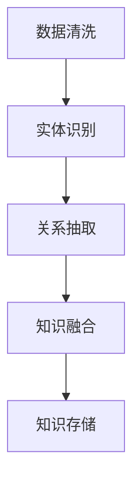

                 


---

# 《构建基于知识图谱的金融监管沙盒测试结果预测平台》

---

## 关键词：
- 知识图谱
- 金融监管沙盒
- 测试结果预测
- 人工智能
- 监管规则提取
- 系统架构设计

---

## 摘要：
本文详细探讨了基于知识图谱构建金融监管沙盒测试结果预测平台的理论基础、技术实现和系统设计。首先，我们介绍了金融监管沙盒的概念及其在风险评估中的重要性。接着，我们深入分析了知识图谱在金融监管中的应用潜力，提出了构建知识图谱的系统方法，并详细阐述了监管规则提取和测试结果预测的算法原理。通过构建领域模型和系统架构设计，我们展示了如何将知识图谱技术与金融监管沙盒测试结果预测相结合，最终实现了对金融产品风险的智能化预测和评估。本文还提供了具体的项目实现案例，分析了系统的优缺点，并提出了进一步优化的方向。

---

## 正文：

---

### 第一部分: 背景介绍

#### 第1章: 问题背景与需求分析

##### 1.1 问题背景
- 1.1.1 金融监管的现状与挑战  
  - 当前金融市场的复杂性和不确定性对监管提出了更高的要求。  
  - 传统监管手段难以应对新兴金融产品的风险评估需求。  
  - 知识图谱技术在金融领域的应用为监管提供了新的可能性。  

- 1.1.2 金融监管沙盒的概念与意义  
  - 金融监管沙盒的定义与作用。  
  - 通过沙盒测试，降低金融创新的风险。  
  - 沙盒测试结果预测在监管决策中的重要性。  

- 1.1.3 知识图谱在金融监管中的应用潜力  
  - 知识图谱在金融数据处理中的优势。  
  - 知识图谱如何支持监管规则的自动化提取。  
  - 知识图谱在风险预测中的应用价值。  

##### 1.2 问题描述
- 1.2.1 金融监管沙盒测试的目标与范围  
  - 测试目标：评估金融产品的风险性、合规性。  
  - 测试范围：涵盖产品设计、运营模式等多个方面。  

- 1.2.2 测试结果预测的核心问题  
  - 如何基于历史数据预测测试结果。  
  - 如何提取关键监管规则作为预测依据。  

- 1.2.3 知识图谱在测试结果预测中的作用  
  - 知识图谱如何整合多源数据。  
  - 知识图谱如何支持规则的动态更新。  

##### 1.3 问题解决思路
- 1.3.1 知识图谱构建的基本思路  
  - 数据清洗、实体识别、关系抽取的流程。  

- 1.3.2 金融监管规则的提取与建模  
  - 监管规则的提取方法。  
  - 规则建模的数学基础。  

- 1.3.3 测试结果预测的算法选择  
  - 机器学习算法的应用。  
  - 知识图谱与预测模型的结合。  

##### 1.4 边界与外延
- 1.4.1 系统边界定义  
  - 系统的输入输出范围。  

- 1.4.2 与相关系统的区别与联系  
  - 与传统监管系统的区别。  
  - 与其他知识图谱应用的区别。  

- 1.4.3 核心要素与组成结构  
  - 核心要素：数据源、知识图谱、预测模型。  

#### 第2章: 核心概念与联系

##### 2.1 核心概念原理
- 2.1.1 知识图谱的定义与特点  
  - 结构化、可扩展性、语义丰富性。  

- 2.1.2 金融监管沙盒的基本概念  
  - 实验性、监管性、风险性。  

- 2.1.3 测试结果预测的数学模型  
  - 预测模型的数学基础。  

##### 2.2 概念属性特征对比表格
| 概念       | 结构化程度 | 数据可视化 | 可扩展性 | 可解释性 |
|------------|------------|------------|----------|----------|
| 知识图谱    | 高         | 高         | 高       | 中       |
| 金融监管沙盒 | 低         | 低         | 低       | 高       |
| 测试结果预测 | 中         | 中         | 低       | 高       |

##### 2.3 ER实体关系图架构
```mermaid
er
actor: 用户
goal: 测试结果预测
knowledge_graph: 知识图谱
rules: 监管规则
test_cases: 测试用例
predictions: 预测结果
actor --> knowledge_graph: 构建知识图谱
knowledge_graph --> rules: 提取监管规则
rules --> test_cases: 生成测试用例
test_cases --> predictions: 预测结果
```

---

### 第二部分: 算法原理讲解

#### 第3章: 知识图谱构建算法

##### 3.1 算法流程


##### 3.2 Python代码实现
```python
from kgtool import kg
# 数据清洗
cleaned_data = kg.clean(raw_data)

# 实体识别
entities = kg.extract_entities(cleaned_data)

# 关系抽取
relations = kg.extract_relations(cleaned_data)

# 知识融合
merged_kg = kg.fuse(entities, relations)

# 知识存储
kg.store(merged_kg, "knowledge_graph.db")
```

##### 3.3 数学模型与公式
- 实体识别的数学模型：
  $$ P(entity) = \frac{count(entity)}{total\_tokens} $$
- 关系抽取的算法：
  $$ relation_{i,j} = argmax_{k} (similarity(s_i, s_j)) $$

---

### 第三部分: 系统分析与架构设计方案

#### 第4章: 系统分析与架构设计

##### 4.1 问题场景介绍
- 系统目标：构建金融监管沙盒测试结果预测平台。  
- 使用场景：金融机构的风险评估与合规性测试。  

##### 4.2 项目介绍
- 项目目标：利用知识图谱技术提升测试结果预测的准确性和效率。  
- 项目范围：涵盖知识图谱构建、监管规则提取、测试结果预测。  

##### 4.3 系统功能设计
- 功能模块：数据采集、知识图谱构建、规则提取、测试用例生成、预测模型训练。  
- 领域模型：
  ```mermaid
  classDiagram
  class 数据采集 {
    + 数据源
    + 数据清洗
  }
  class 知识图谱构建 {
    + 实体识别
    + 关系抽取
  }
  class 监管规则提取 {
    + 规则生成
    + 规则存储
  }
  class 测试用例生成 {
    + 用例设计
    + 用例执行
  }
  class 预测模型训练 {
    + 模型训练
    + 模型评估
  }
  数据采集 --> 知识图谱构建
  知识图谱构建 --> 监管规则提取
  监管规则提取 --> 测试用例生成
  测试用例生成 --> 预测模型训练
  ```

##### 4.4 系统架构设计
- 分层架构：数据层、知识层、规则层、预测层。  
- 架构图：
  ```mermaid
  architecture
  client
  [数据采集]
  client --> data_layer: 数据存储
  data_layer --> knowledge_layer: 知识图谱构建
  knowledge_layer --> rules_layer: 监管规则提取
  rules_layer --> predictions_layer: 测试结果预测
  ```

##### 4.5 系统接口设计
- 接口定义：RESTful API。  
- 交互流程：
  ```mermaid
  sequenceDiagram
  actor: 用户
  system: 服务端
  actor ->> system: 发送数据请求
  system ->> actor: 返回知识图谱数据
  actor ->> system: 提交测试用例
  system ->> actor: 返回预测结果
  ```

---

### 第四部分: 项目实战

#### 第5章: 项目实战

##### 5.1 环境安装与配置
- 安装依赖：Python、知识图谱工具包、机器学习库。  
- 环境配置：虚拟环境配置、数据存储配置。  

##### 5.2 系统核心实现
- 核心功能代码：
  ```python
  from kgtool import kg
  from sklearn import linear_model

  # 知识图谱构建
  kg = KnowledgeGraph()
  kg.load_data("data.csv")
  kg.build()

  # 监管规则提取
  rules = kg.extract_rules()

  # 测试用例生成
  test_cases = generate_test_cases(rules)

  # 预测模型训练
  model = linear_model.LinearRegression()
  model.fit(test_cases, actual_results)

  # 测试结果预测
  predictions = model.predict(new_test_cases)
  ```

##### 5.3 代码解读与分析
- 知识图谱构建：数据清洗、实体识别、关系抽取。  
- 监管规则提取：基于知识图谱的规则生成。  
- 测试用例生成：根据规则动态生成测试用例。  
- 预测模型训练：使用机器学习算法训练预测模型。  

##### 5.4 案例分析与解读
- 案例背景：某创新型金融产品的风险评估。  
- 数据输入：产品特性、历史测试结果。  
- 知识图谱构建：提取相关实体和关系。  
- 规则提取：生成监管规则。  
- 测试用例生成：根据规则生成测试用例。  
- 预测结果：模型预测测试结果并生成报告。  

##### 5.5 项目小结
- 项目成果：成功构建了预测平台。  
- 系统优缺点：优势明显，但在数据质量和模型解释性方面还有改进空间。  

---

### 第五部分: 最佳实践

#### 第6章: 最佳实践与总结

##### 6.1 小结
- 本项目成功将知识图谱技术应用于金融监管沙盒测试结果预测。  
- 平台实现了高效的知识构建、规则提取和预测功能。  

##### 6.2 注意事项
- 数据质量和完整性对系统性能影响重大。  
- 模型的可解释性需进一步优化。  
- 系统的可扩展性需考虑未来监管规则的变化。  

##### 6.3 拓展阅读
- 推荐阅读相关领域的最新研究论文。  
- 关注知识图谱在金融监管中的其他应用。  

---

## 作者：
AI天才研究院/AI Genius Institute  
禅与计算机程序设计艺术 /Zen And The Art of Computer Programming

