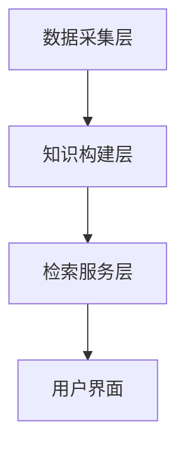

                 


# 构建基于知识图谱的金融研报智能检索系统

## 关键词：知识图谱、金融研报、智能检索、自然语言处理、系统架构

## 摘要：本篇文章详细探讨了如何利用知识图谱技术构建金融研报智能检索系统。首先，介绍了知识图谱的基本概念及其在金融领域的应用价值。接着，详细分析了金融研报智能检索系统的需求，并从算法原理、系统架构、项目实战等多个维度进行了深入探讨。最后，通过具体的案例分析和代码实现，展示了系统的构建过程，并总结了相关经验和最佳实践。

---

## 第1章 知识图谱的基本概念与应用

### 1.1 知识图谱的定义与特点

#### 1.1.1 知识图谱的定义
知识图谱是一种以图结构形式表示知识的语义网络，由实体（node）和关系（edge）组成。实体可以是人名、地名、组织、概念等，关系描述实体之间的关联。

#### 1.1.2 知识图谱的核心特点
- **语义性**：通过实体和关系描述事物之间的语义关联。
- **结构化**：以图结构的形式组织知识，便于计算机理解和推理。
- **可扩展性**：支持大规模数据的存储和处理。
- **动态性**：能够实时更新和扩展。

#### 1.1.3 知识图谱与传统数据库的区别
| 特性 | 传统数据库 | 知识图谱 |
|------|-------------|----------|
| 数据结构 | 行为数据，二维表 | 图结构，支持复杂关系 |
| 查询方式 | SQL查询，基于行和列 | SPARQL查询，支持复杂关联 |
| 应用场景 | 事务处理 | 知识推理、语义搜索 |

### 1.2 知识图谱在金融领域的应用

#### 1.2.1 金融领域的知识图谱应用场景
- **金融实体识别**：识别公司、股票、行业等实体。
- **金融关系抽取**：识别公司之间的并购关系、投资关系等。
- **语义理解**：理解研报中的隐含信息和语义关联。

#### 1.2.2 知识图谱在金融研报中的价值
- **提升检索效率**：通过语义理解快速定位相关研报。
- **增强信息关联性**：发现隐含的关系和模式。
- **支持智能决策**：基于知识图谱提供决策支持。

#### 1.2.3 知识图谱构建的必要性
- 金融数据复杂且关联性强。
- 研报内容丰富，需要高效组织和检索。

---

## 第2章 知识图谱的构建流程

### 2.1 知识图谱的构建步骤

#### 2.1.1 数据准备
- 数据来源：金融研报、新闻、公司公告等。
- 数据清洗：去除噪声数据，提取有用信息。

#### 2.1.2 知识抽取
- 实体识别：使用NLP技术识别文本中的实体。
- 关系抽取：识别实体之间的关系。

#### 2.1.3 知识建模
- 构建领域本体：定义金融领域的核心概念和关系。
- 创建知识图谱的Schema：定义实体和关系的结构。

#### 2.1.4 知识存储
- 使用图数据库：如Neo4j，存储实体和关系。
- 数据索引：优化查询效率。

### 2.2 知识图谱的表示方法

#### 2.2.1 实体与关系的表示
- 实体表示：使用节点表示，每个节点包含实体ID和属性。
- 关系表示：使用边表示，边包含关系类型和权重。

#### 2.2.2 知识图谱的存储方式
- 图数据库：支持复杂关系查询。
- 三元组存储：将知识表示为（主体，关系，宾体）的三元组。

#### 2.2.3 知识图谱的查询语言
- SPARQL：用于查询知识图谱中的数据。

---

## 第3章 知识图谱与自然语言处理的结合

### 3.1 自然语言处理的基本概念

#### 3.1.1 NLP的核心任务
- 分词：将文本分割成词或短语。
- 词性标注：标注每个词的词性。
- 实体识别：识别文本中的实体。
- 关系抽取：识别实体之间的关系。

### 3.2 知识图谱在NLP中的应用

#### 3.2.1 实体识别
- 使用CRF或BERT等模型进行实体识别。

#### 3.2.2 关系抽取
- 使用基于规则的方法或深度学习模型抽取关系。

#### 3.2.3 文本语义理解
- 使用知识图谱进行上下文理解，提升NLP任务的效果。

---

## 第4章 金融研报智能检索系统的需求分析

### 4.1 项目背景与目标

#### 4.1.1 项目背景
- 金融数据繁多，研报内容丰富，但检索效率低下。
- 需要一种高效的方法来组织和检索金融研报。

#### 4.1.2 项目目标
- 构建一个基于知识图谱的金融研报智能检索系统。
- 提升研报检索的准确性和效率。

### 4.2 系统功能需求

#### 4.2.1 数据采集模块
- 采集金融研报、新闻等数据。

#### 4.2.2 知识抽取模块
- 提取实体和关系。

#### 4.2.3 知识图谱构建模块
- 构建金融领域的知识图谱。

#### 4.2.4 智能检索模块
- 支持语义检索和基于知识图谱的关联检索。

---

## 第5章 系统架构设计

### 5.1 系统架构概述

#### 5.1.1 系统架构设计
- 分层架构：数据采集层、知识构建层、检索服务层。

#### 5.1.2 功能模块划分
- 数据采集模块：负责数据的采集和预处理。
- 知识构建模块：负责知识抽取和图谱构建。
- 智能检索模块：提供基于知识图谱的检索服务。

### 5.2 系统架构图


---

## 第6章 算法原理讲解

### 6.1 实体识别算法

#### 6.1.1 基于CRF的实体识别
- 使用条件随机场进行分词和词性标注。

#### 6.1.2 基于BERT的实体识别
- 使用预训练语言模型进行实体识别。

### 6.2 关系抽取算法

#### 6.2.1 基于规则的关系抽取
- 使用正则表达式提取特定关系。

#### 6.2.2 基于深度学习的关系抽取
- 使用卷积神经网络或循环神经网络提取关系。

---

## 第7章 项目实战

### 7.1 环境安装

#### 7.1.1 安装Python
```bash
python --version
```

#### 7.1.2 安装依赖库
```bash
pip install neo4j
pip install spacy
```

### 7.2 核心功能实现

#### 7.2.1 实体识别代码
```python
import spacy

nlp = spacy.load("en_core_web_sm")
text = "Apple invests in Google"
doc = nlp(text)
for ent in doc.ents:
    print(ent.text, ent.label_)
```

#### 7.2.2 知识图谱构建代码
```python
from neo4j import GraphDatabase

driver = GraphDatabase.driver("neo4j://localhost:7687")
session = driver.session()

# 创建节点
session.run("CREATE (:Company {name: 'Apple'})")
session.run("CREATE (:Company {name: 'Google'})")
session.run("CREATE (:Investment {amount: 1000000})")
session.run("MATCH (a:Company {name: 'Apple'}), (b:Company {name: 'Google'}) CREATE (a)-[r:INVESTED_IN]->(b)")
```

### 7.3 实际案例分析

#### 7.3.1 案例背景
- 数据来源：某公司的研报和新闻。

#### 7.3.2 系统实现
- 使用上述代码构建知识图谱，并进行智能检索。

---

## 第8章 最佳实践与总结

### 8.1 最佳实践
- 数据预处理是关键，确保数据质量。
- 知识图谱的构建需要结合领域知识。
- 系统优化：使用高效的图数据库和索引技术。

### 8.2 小结
通过构建基于知识图谱的金融研报智能检索系统，能够显著提升研报检索的效率和准确性。

### 8.3 注意事项
- 数据隐私和安全问题需要重视。
- 系统性能优化需要结合实际应用场景。

---

## 作者信息

作者：AI天才研究院/AI Genius Institute & 禅与计算机程序设计艺术 /Zen And The Art of Computer Programming

