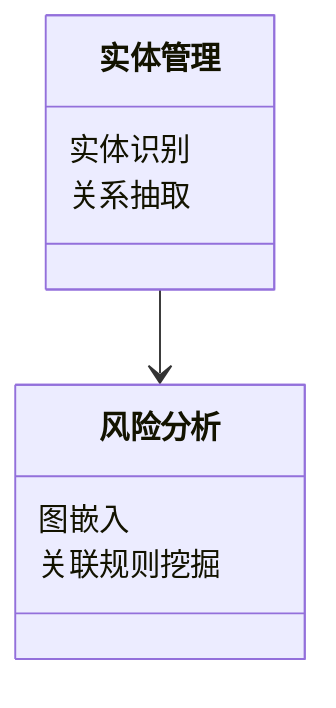
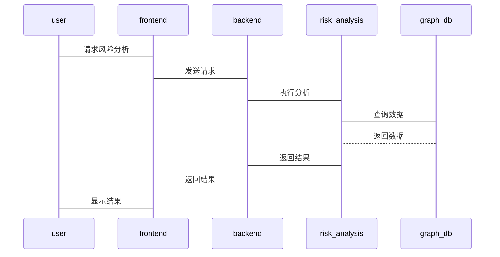

                 


# 构建基于知识图谱的金融风险关联分析系统

> 关键词：知识图谱，金融风险，关联分析，图嵌入，风险预警

> 摘要：本文详细探讨了如何利用知识图谱技术构建金融风险关联分析系统，从背景到实现，从理论到实践，系统地分析了构建该系统的必要性、方法和步骤。文章结合实际案例，深入讲解了知识图谱的构建、图嵌入算法、关联规则挖掘以及系统架构设计，为金融风险分析提供了新的思路和解决方案。

---

# 第1章 知识图谱与金融风险关联分析概述

## 1.1 问题背景与描述

### 1.1.1 金融风险分析的现状与挑战

在金融领域，风险分析是保障资金安全的核心任务。传统的方法依赖于统计模型和单点数据，难以捕捉复杂的关联关系。例如，2008年的金融危机暴露了传统模型在应对系统性风险时的局限性。

### 1.1.2 知识图谱技术的引入

知识图谱是一种以图结构形式表示知识的技术，能够将分散的数据连接起来，揭示数据之间的隐含关系。通过知识图谱，可以将金融数据中的实体（如公司、交易、资产）及其关系（如控股、投资、借贷）以图结构表示。

### 1.1.3 构建金融风险关联分析系统的意义

构建基于知识图谱的金融风险关联分析系统，可以实现对金融系统中潜在风险的早期预警和全面分析。通过关联分析，能够识别跨机构、跨市场的系统性风险，为金融监管和投资决策提供支持。

---

## 1.2 核心概念与联系

### 1.2.1 知识图谱的核心原理

知识图谱由实体（节点）和关系（边）组成，支持复杂的语义查询和关联分析。例如，通过知识图谱可以分析一家公司的供应链风险如何影响整个行业。

### 1.2.2 金融风险关联分析的定义

金融风险关联分析旨在识别不同金融实体之间的关联性，预测潜在的系统性风险。例如，通过分析A公司的债务违约风险，可以推断其上下游企业的潜在风险。

### 1.2.3 知识图谱与金融风险关联分析的关系

知识图谱为金融风险关联分析提供了数据结构和分析工具，使得复杂的金融关系可视化和可计算化。通过知识图谱，可以构建一个动态的风险网络，实时监控金融风险。

---

## 1.3 本章小结

本章介绍了金融风险分析的现状和挑战，阐述了知识图谱技术的核心原理及其在金融领域的应用潜力。构建基于知识图谱的金融风险关联分析系统，将为金融风险的早期预警和管理提供新的解决方案。

---

# 第2章 知识图谱构建与管理

## 2.1 知识图谱构建流程

### 2.1.1 数据采集与预处理

数据来源包括企业年报、新闻报道、政府公告等。预处理步骤包括数据清洗、实体识别和标准化。

### 2.1.2 实体识别与关系抽取

使用自然语言处理技术从文本数据中提取实体和关系。例如，从新闻中提取“公司A投资公司B”这样的关系。

### 2.1.3 知识图谱构建

将提取的实体和关系整合成图结构，形成知识图谱。例如，使用Neo4j构建企业之间的投资关系图。

---

## 2.2 知识图谱存储与管理

### 2.2.1 图数据库的选择与使用

推荐使用Neo4j或TigerGraph等图数据库，支持高效的查询和存储。

### 2.2.2 知识图谱的更新与维护

定期更新知识图谱，确保数据的准确性和及时性。例如，当公司合并时，更新知识图谱中的实体关系。

---

## 2.3 本章小结

本章详细介绍了知识图谱的构建流程和管理方法，为后续的金融风险关联分析奠定了基础。

---

# 第3章 金融风险关联分析算法原理

## 3.1 图嵌入算法

### 3.1.1 Word2Vec在图中的应用

Word2Vec用于将文本数据映射为向量，应用于图中时，可以将节点表示为低维向量，便于后续分析。

### 3.1.2 Node2Vec算法原理

Node2Vec是一种基于随机游走的图嵌入算法，能够捕捉节点之间的语义关系。例如，可以用于分析公司之间的关联性。

### 3.1.3 图嵌入算法的优缺点对比

| 算法 | 优点 | 缺点 |
|------|------|------|
| Word2Vec | 易实现 | 不适用于复杂图结构 |
| Node2Vec | 捕捉语义关系 | 计算复杂度较高 |

---

## 3.2 关联规则挖掘

### 3.2.1 Apriori算法原理

Apriori算法用于发现关联规则，例如“购买债券的客户更可能购买股票”。在金融领域，可以用于发现风险关联规则。

### 3.2.2 关联规则在金融风险中的应用

例如，通过关联规则挖掘发现某类资产的波动可能影响另一类资产的风险。

---

## 3.3 本章小结

本章介绍了图嵌入和关联规则挖掘算法，为金融风险关联分析提供了算法基础。

---

# 第4章 系统分析与架构设计

## 4.1 项目介绍

### 4.1.1 项目目标

构建一个基于知识图谱的金融风险关联分析系统，实现风险的早期预警和关联分析。

### 4.1.2 项目范围

包括数据采集、知识图谱构建、风险分析算法实现和结果可视化。

### 4.1.3 项目利益相关者

包括金融机构、投资者和监管机构。

---

## 4.2 系统功能设计

### 4.2.1 领域模型设计（Mermaid类图）



---

## 4.3 系统架构设计

### 4.3.1 分层架构设计（Mermaid架构图）

```mermaid
browser
    /- https --> frontend
frontend
    /- http --> backend
backend
    /- http --> database
    /- http --> risk_analysis
risk_analysis
    /- http --> graph_db
```

### 4.3.2 系统接口设计

- 前端接口：提供用户交互界面，展示风险分析结果。
- 后端接口：接收用户请求，调用风险分析模块。
- 数据库接口：存储知识图谱和分析结果。

### 4.3.3 系统交互流程（Mermaid序列图）



---

## 4.4 本章小结

本章通过系统分析和架构设计，明确了金融风险关联分析系统的实现方案。

---

# 第5章 项目实战

## 5.1 环境安装与配置

### 5.1.1 开发环境搭建

安装Python、Jupyter Notebook、Neo4j和相关库（如networkx、py2neo）。

### 5.1.2 依赖库安装

使用pip安装必要的库：`pip install neo4j py2neo networkx`.

---

## 5.2 核心代码实现

### 5.2.1 数据预处理代码

```python
import pandas as pd
import re

def preprocess(text):
    # 提取公司名称
    company = re.findall(r'公司名称：(.*?) ', text)
    return company[0] if company else ''

data = pd.read_csv('financial_data.csv')
data['company'] = data['text'].apply(preprocess)
```

### 5.2.2 知识图谱构建代码

```python
from py2neo import Graph, Node, Relationship

graph = Graph('http://localhost:7474', user='neo4j', password='password')

def create_nodes_and_edges(df):
    for _, row in df.iterrows():
        company = Node('Company', name=row['company'])
        graph.create(company)

# 假设df包含公司间的关系
for _, row in df.iterrows():
    company1 = graph.nodes('Company').match(name=row['company1']).first()
    company2 = graph.nodes('Company').match(name=row['company2']).first()
    relationship = Relationship(company1, 'INVESTED_IN', company2)
    graph.create(relationship)
```

### 5.2.3 风险关联分析算法实现

```python
import networkx as nx

def calculate_similarity(G, node1, node2):
    return nx.simrank_similarity(G, node1, node2)

similarity = calculate_similarity(graph, '公司A', '公司B')
print(f'相似度：{similarity}')
```

---

## 5.3 案例分析与解读

### 5.3.1 实际案例分析

以某次金融危机为例，分析公司之间的投资关系和风险传播路径。

### 5.3.2 系统功能演示

展示系统如何实时分析公司风险，并生成风险预警报告。

### 5.3.3 案例总结与优化建议

总结分析结果，提出优化系统的方法，如增加实时数据更新和多模态数据融合。

---

## 5.4 本章小结

本章通过实际案例和代码实现，展示了如何构建和应用基于知识图谱的金融风险关联分析系统。

---

# 第6章 总结与展望

## 6.1 系统总结

### 6.1.1 系统功能总结

系统实现了知识图谱构建、风险关联分析和风险预警功能。

### 6.1.2 系统性能总结

系统能够高效处理大规模金融数据，提供实时风险分析结果。

### 6.1.3 系统应用价值总结

系统为金融机构提供了新的风险分析工具，有助于降低系统性风险。

---

## 6.2 未来展望

### 6.2.1 技术发展展望

未来可以结合机器学习和深度学习技术，进一步提高风险预测的准确性。

### 6.2.2 应用场景扩展

可以扩展到更多金融领域，如信用评估和市场风险分析。

### 6.2.3 系统优化方向

优化知识图谱构建算法，提高系统的扩展性和实时性。

---

## 6.3 本章小结

本章总结了系统的实现成果，并展望了未来的发展方向。

---

# 第7章 最佳实践与注意事项

## 7.1 最佳实践 tips

### 7.1.1 数据质量管理

确保数据的准确性和完整性，避免数据偏差影响分析结果。

### 7.1.2 算法选择与调优

根据具体场景选择合适的算法，并进行参数调优。

### 7.1.3 系统性能优化

通过分布式计算和缓存技术，提高系统的处理能力。

---

## 7.2 注意事项

### 7.2.1 数据隐私保护

确保数据的安全性和合规性，遵守相关法律法规。

### 7.2.2 系统稳定性保障

设计完善的容错机制和备份策略，确保系统的稳定运行。

---

## 7.3 本章小结

本章提供了系统建设和使用的最佳实践和注意事项，帮助读者更好地应用知识图谱技术进行金融风险分析。

---

# 作者：AI天才研究院/AI Genius Institute & 禅与计算机程序设计艺术 /Zen And The Art of Computer Programming

---

以上是《构建基于知识图谱的金融风险关联分析系统》的技术博客文章的完整目录和内容框架。通过逐步分析和详细讲解，本文系统地介绍了如何利用知识图谱技术构建金融风险关联分析系统，为金融领域的风险管理和预警提供了新的思路和解决方案。

