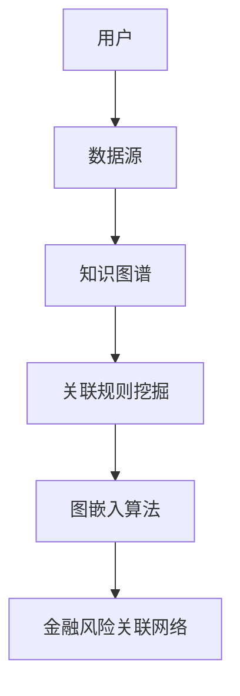

                 


# 构建基于知识图谱的金融风险关联网络

> 关键词：知识图谱，金融风险，关联网络，图嵌入，关联规则挖掘

> 摘要：本文旨在探讨如何利用知识图谱构建金融风险关联网络。通过分析知识图谱的核心概念、构建方法及在金融风险中的应用，结合关联规则挖掘和图嵌入算法，提出一种基于知识图谱的金融风险关联网络构建方法。本文详细介绍了从数据预处理、实体识别、关系抽取到图模型构建的全过程，并通过实际案例展示了系统的应用场景和实现方案，为金融风险管理和预警提供新的思路。

---

## 第一部分: 知识图谱与金融风险关联网络概述

### 第1章: 知识图谱与金融风险关联网络的背景介绍

#### 1.1 知识图谱的基本概念
知识图谱是一种以图结构形式表示知识的语义网络，由节点（实体）和边（关系）构成。节点代表实体或概念，边表示实体之间的关系。知识图谱的构建通常包括数据预处理、实体识别、关系抽取和图模型构建等步骤。

- 数据预处理：清洗数据，去除噪声，提取有用信息。
- 实体识别：从文本中识别出实体（如公司、人名、组织等）。
- 关系抽取：识别实体之间的关系（如“是”、“属于”、“参与”等）。
- 图模型构建：将实体和关系组织成图结构，形成知识图谱。

#### 1.2 金融风险的基本概念
金融风险是指在金融活动中可能发生的损失或不确定性。常见的金融风险包括市场风险、信用风险、流动性风险和操作风险等。金融风险的分析通常涉及多方面的数据，如市场数据、财务数据、交易数据等。

- 市场风险：由于市场波动导致的资产损失。
- 信用风险：由于债务人违约导致的损失。
- 流动性风险：无法及时以合理价格变现资产的风险。
- 操作风险：由于内部操作失误或外部事件导致的损失。

#### 1.3 知识图谱在金融风险中的应用
知识图谱可以用于金融风险的关联分析，帮助识别风险源、传播路径和影响范围。通过构建金融风险关联网络，可以更好地理解风险之间的相互作用，从而提高风险管理的效率和准确性。

- 金融风险关联网络：将金融风险的各个要素（如公司、交易、市场）作为节点，风险之间的关联关系作为边，构建一个图结构。
- 知识图谱的优势：能够捕捉隐含的关系，发现潜在的风险传播路径。

### 第2章: 知识图谱与金融风险关联网络的核心概念

#### 2.1 知识图谱的构建方法
知识图谱的构建方法通常包括数据预处理、实体识别、关系抽取和图模型构建等步骤。

- 数据预处理：清洗数据，去除噪声，提取有用信息。
- 实体识别：从文本中识别出实体（如公司、人名、组织等）。
- 关系抽取：识别实体之间的关系（如“是”、“属于”、“参与”等）。
- 图模型构建：将实体和关系组织成图结构，形成知识图谱。

#### 2.2 知识图谱的属性特征对比
知识图谱的属性特征可以通过对比分析来理解其核心要素。

| 属性 | 描述 |
|------|------|
| 实体 | 表示具体的概念或对象，如公司、人名、组织等。 |
| 关系 | 表示实体之间的关联，如“是”、“属于”、“参与”等。 |
| 属性 | 表示实体的特征或属性，如公司类型、行业等。 |

#### 2.3 知识图谱的ER实体关系图

```mermaid
erDiagram
    actor 用户 {
        +int 用户ID
        +string 用户名
        +string 密码
    }
    actor 数据源 {
        +int 数据ID
        +string 数据类型
        +string 数据内容
    }
    actor 知识图谱 {
        +int 图谱ID
        +string 图谱名称
        +string 图谱描述
    }
    用户 --> 数据源: 提供数据
    数据源 --> 知识图谱: 构建图谱
```

---

## 第二部分: 知识图谱与金融风险关联网络的核心概念

### 第3章: 知识图谱与金融风险关联网络的构建方法

#### 3.1 金融风险关联网络的构建步骤
构建金融风险关联网络通常包括以下步骤：

1. 数据收集：收集与金融风险相关的数据，如市场数据、财务数据、交易数据等。
2. 数据预处理：清洗数据，去除噪声，提取有用信息。
3. 实体识别：识别数据中的实体（如公司、交易、市场）。
4. 关系抽取：识别实体之间的关系（如交易关系、市场影响关系）。
5. 图模型构建：将实体和关系组织成图结构，形成金融风险关联网络。

#### 3.2 知识图谱的图嵌入算法
图嵌入算法是一种将图结构数据转换为低维向量的方法，常用于知识图谱的表示学习。

- 节点嵌入：将图中的节点（实体）映射到低维向量空间。
- 边嵌入：将图中的边（关系）映射到低维向量空间。

#### 3.3 金融风险关联网络的关联规则挖掘
关联规则挖掘是一种从数据中发现关联关系的方法，常用于知识图谱中的关系抽取。

- 关联规则：表示两个或多个项之间的频繁共现关系。
- 支持度：表示规则在数据中的频繁程度。
- 置信度：表示规则的正确性。

#### 3.4 金融风险关联网络的数学模型

关联规则挖掘的数学模型如下：

支持度公式：
$$ \text{支持度} = \frac{\text{事务中同时包含A和B的次数}}{\text{总事务数}} $$

置信度公式：
$$ \text{置信度} = \frac{\text{支持度}(A \cap B)}{\text{支持度}(A)} $$

#### 3.5 金融风险关联网络的系统架构设计



---

## 第三部分: 知识图谱与金融风险关联网络的构建方法

### 第4章: 知识图谱与金融风险关联网络的算法实现

#### 4.1 知识图谱的关联规则挖掘算法
关联规则挖掘算法是一种从数据中发现关联关系的方法，常用于知识图谱中的关系抽取。

- 频繁项集：在数据中频繁出现的项的集合。
- 关联规则：表示两个或多个项之间的频繁共现关系。

#### 4.2 金融风险关联网络的图嵌入算法
图嵌入算法是一种将图结构数据转换为低维向量的方法，常用于知识图谱的表示学习。

- 节点嵌入：将图中的节点（实体）映射到低维向量空间。
- 边嵌入：将图中的边（关系）映射到低维向量空间。

#### 4.3 金融风险关联网络的系统实现

```python
# 环境安装
pip install networkx
pip install numpy
pip install pandas
pip install matplotlib
pip install pymermaid
```

#### 4.4 金融风险关联网络的代码实现

```python
import networkx as nx
import matplotlib.pyplot as plt

# 创建图
G = nx.Graph()

# 添加节点
G.add_nodes_from(['公司A', '公司B', '公司C', '市场D', '交易E'])

# 添加边
G.add_edges_from([('公司A', '公司B'), ('公司B', '公司C'), ('公司C', '市场D'), ('市场D', '交易E')])

# 绘制图
nx.draw(G, node_size=1500, node_color='red', edge_color='blue', with_labels=True)
plt.show()
```

#### 4.5 金融风险关联网络的案例分析
通过实际案例分析，展示如何利用知识图谱构建金融风险关联网络，并进行风险传播路径分析。

---

## 作者

作者：AI天才研究院/AI Genius Institute & 禅与计算机程序设计艺术 /Zen And The Art of Computer Programming

---

通过本文的详细讲解，我们可以看到，构建基于知识图谱的金融风险关联网络是一个复杂但具有重要意义的任务。通过结合知识图谱的构建方法和金融风险的分析方法，我们可以更有效地识别和管理金融风险。未来的研究可以进一步优化算法和系统架构，以应对更复杂的金融风险挑战。

