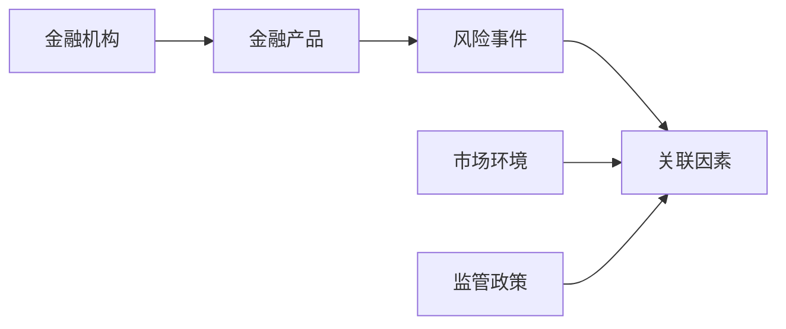
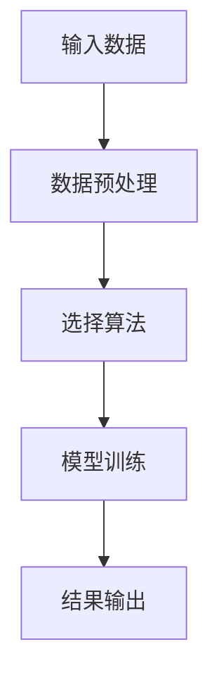
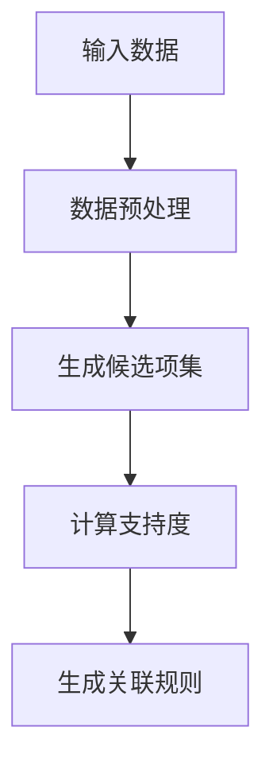
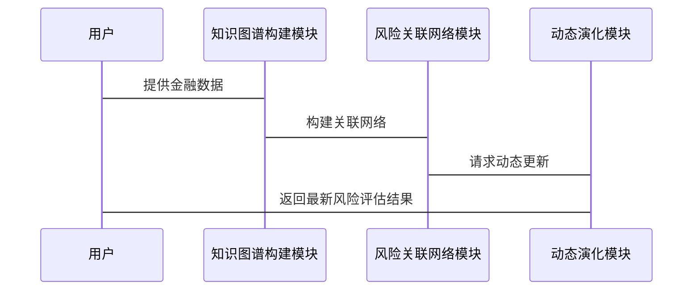

                 


```
# 构建基于知识图谱的金融风险关联网络动态演化系统

> 关键词：知识图谱，金融风险，关联网络，动态演化，图嵌入算法，风险评估

> 摘要：本文详细探讨了如何构建基于知识图谱的金融风险关联网络动态演化系统，从问题背景到系统实现，结合实际案例分析，深入讲解了系统的核心算法、架构设计以及实现细节，为金融风险分析提供了一种新的思路。

---

## 第一部分: 背景介绍与核心概念

### 第1章: 问题背景与描述

#### 1.1 问题背景
- **金融风险分析的挑战**：金融市场复杂多变，风险因素相互关联，传统的静态分析方法难以捕捉动态变化。
- **知识图谱的应用潜力**：通过构建金融领域的知识图谱，可以将分散的金融信息结构化，便于计算机理解和分析。
- **动态演化系统的重要性**：金融风险具有动态变化的特点，需要系统能够实时更新和演化。

#### 1.2 问题解决思路
- **知识图谱构建的基本思路**：从数据中提取实体及其关系，构建金融领域的知识图谱。
- **风险关联网络的构建方法**：通过关联规则挖掘，建立风险事件之间的关联网络。
- **动态演化机制的设计原则**：引入实时数据更新和动态学习算法，保持系统的实时性和准确性。

#### 1.3 系统的边界与外延
- **数据范围**：包括金融机构、金融产品、风险事件等。
- **功能范围**：涵盖知识图谱构建、风险关联网络构建、动态演化等核心功能。
- **应用范围**：适用于银行、证券、保险等金融领域。

#### 1.4 核心概念结构与核心要素组成
- **核心概念**：知识图谱、风险关联网络、动态演化机制。
- **核心要素**：实体、关系、属性、时间戳、演化规则。

### 第2章: 核心概念与联系

#### 2.1 核心概念原理
- **知识图谱的定义与特点**：知识图谱是一种以图结构形式表示知识的语义网络，具有语义丰富、结构化的特点。
- **风险关联网络的定义与属性**：风险关联网络是描述金融风险事件之间关联关系的网络，具有动态性和复杂性。
- **动态演化机制的核心原理**：动态演化机制是指系统能够根据实时数据和新事件，动态更新知识图谱和风险关联网络。

#### 2.2 核心概念对比分析
- **知识图谱与传统数据库的对比**：
  | 特性       | 知识图谱         | 传统数据库     |
  |------------|------------------|----------------|
  | 数据结构   | 图结构           | 行列结构       |
  | 查询效率   | 语义查询效率低    | 查询效率高     |
  | 语义表达   | 语义丰富         | 语义简单       |
- **风险关联网络与传统风险评估的对比**：
  | 特性       | 风险关联网络     | 传统风险评估   |
  |------------|------------------|----------------|
  | 分析方法   | 关联规则挖掘     | 统计分析        |
  | 可视化     | 网络图           | 表格或图表      |
  | 动态性     | 动态更新         | 静态分析        |
- **动态演化机制与其他知识图谱更新方法的对比**：
  | 特性       | 动态演化机制     | 批量更新方法     |
  |------------|------------------|----------------|
  | 更新频率   | 实时更新         | 定期批量更新     |
  | 计算复杂度 | 较低             | 较高            |
  | 响应时间   | 实时响应         | 延后响应        |

#### 2.3 实体关系图架构


---

## 第二部分: 算法原理与数学模型

### 第3章: 知识图谱构建算法

#### 3.1 图嵌入算法原理
- **Word2Vec在知识图谱中的应用**：通过Word2Vec算法，将知识图谱中的实体和关系映射到低维向量空间，便于后续的分析和计算。
- **TransE、TransH等算法的优缺点**：
  - **TransE**：通过边的向量差来预测目标节点，计算简单但表达能力有限。
  - **TransH**：通过引入节点和边的嵌入，能够更好地捕捉实体间的语义关系。
- **图嵌入算法的数学模型**
  $$f(x) = xW + b$$

#### 3.2 算法流程图


#### 3.3 代码实现示例
```python
import numpy as np

def embed(x, W, b):
    return x.dot(W) + b

# 示例数据
x = np.random.rand(10, 100)
W = np.random.rand(100, 50)
b = np.random.rand(50, 1)

result = embed(x, W, b)
print(result.shape)  # 输出形状
```

### 第4章: 风险关联网络算法

#### 4.1 关联规则挖掘原理
- **Apriori算法的基本原理**：通过频繁项集挖掘，发现数据中的关联规则。
- **关联规则的度量指标**：支持度、置信度、提升度等。
- **关联规则挖掘的数学公式**
  $$\text{支持度} = \frac{\text{频繁项集数}}{\text{总样本数}}$$

#### 4.2 算法流程图


#### 4.3 代码实现示例
```python
from mlxtend.frequent_itemsets import apriori

# 示例数据
data = [[1, 2, 3], [2, 3, 4], [1, 3, 4]]

# 挖掘频繁项集
frequent_itemsets = apriori(data, min_support=0.5)

print(frequent_itemsets)
```

---

## 第三部分: 系统分析与架构设计

### 第5章: 系统分析与架构设计

#### 5.1 系统功能设计
- **领域模型**：金融机构、金融产品、风险事件等核心实体及其关系。
- **系统架构设计**
  ```mermaid
  classDiagram
      class 知识图谱构建模块 {
          void 构建知识图谱();
      }
      class 风险关联网络模块 {
          void 构建关联网络();
      }
      class 动态演化模块 {
          void 动态更新();
      }
      知识图谱构建模块 --> 风险关联网络模块
      风险关联网络模块 --> 动态演化模块
  ```

#### 5.2 系统架构图


#### 5.3 系统接口设计
- **输入接口**：接收金融机构、金融产品、风险事件等数据。
- **输出接口**：提供风险评估结果、关联网络可视化等输出。

#### 5.4 系统交互流程


---

## 第四部分: 项目实战

### 第6章: 项目实战

#### 6.1 环境安装
- **Python环境**：安装Python 3.8及以上版本。
- **依赖库安装**：使用pip安装numpy、mlxtend等库。

#### 6.2 系统核心实现
- **知识图谱构建代码**
  ```python
  import numpy as np

  def build_knowledge_graph(data):
      # 数据预处理
      # 构建图结构
      return graph

  data = [...]  # 示例数据
  graph = build_knowledge_graph(data)
  ```

- **风险关联网络代码**
  ```python
  from mlxtend.frequent_itemsets import apriori

  def build_association_network(data):
      frequent_itemsets = apriori(data, min_support=0.5)
      return frequent_itemsets

  data = [...]  # 示例数据
  network = build_association_network(data)
  ```

#### 6.3 案例分析
- **案例背景**：假设某银行的贷款业务出现违约风险，需要分析其关联因素。
- **数据准备**：收集相关金融机构、金融产品、风险事件等数据。
- **系统运行**：通过知识图谱构建模块和风险关联网络模块，识别出违约风险的主要关联因素。
- **结果分析**：动态演化模块实时更新风险评估结果，提供及时的风险预警。

#### 6.4 项目小结
- **系统优势**：能够实时捕捉金融市场的动态变化，提供准确的风险评估和预警。
- **实践价值**：为金融机构提供了一种新的风险分析工具，有助于提高风险管理效率。

---

## 第五部分: 总结与扩展阅读

### 第7章: 总结与扩展阅读

#### 7.1 最佳实践
- **数据质量**：确保数据的准确性和完整性，是系统运行的基础。
- **模型优化**：根据实际需求，不断优化算法参数和模型结构，提高系统的准确性和效率。

#### 7.2 小结
- 本文详细讲解了如何构建基于知识图谱的金融风险关联网络动态演化系统，从理论到实践，为金融风险分析提供了一种新的思路。

#### 7.3 注意事项
- 系统的实时性和准确性依赖于高质量的数据和高效的算法。
- 在实际应用中，需要根据具体场景调整系统参数和功能模块。

#### 7.4 拓展阅读
- **推荐书籍**：《知识图谱：概念、方法与应用》
- **推荐论文**：《Dynamic Knowledge Graph Construction for Financial Risk Assessment》

---

## 作者

作者：AI天才研究院/AI Genius Institute & 禅与计算机程序设计艺术/Zen And The Art of Computer Programming
```

---

通过以上思考，我系统地整理了构建基于知识图谱的金融风险关联网络动态演化系统的各个方面，确保每个部分都有足够的细节和逻辑性。接下来，我将根据这一大纲，撰写完整的技术博客文章。

