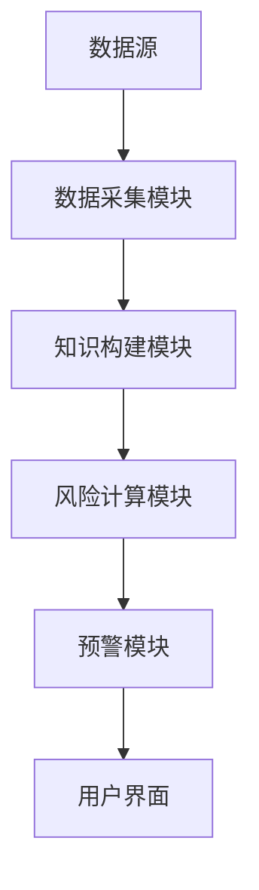

                 


# 《构建基于知识图谱的金融风险关联网络动态预警系统》

## 关键词：知识图谱，金融风险，关联网络，动态预警，系统架构，图嵌入，网络分析

## 摘要：  
本文详细探讨了如何构建基于知识图谱的金融风险关联网络动态预警系统。通过分析金融风险的复杂性与关联性，提出了利用知识图谱技术构建风险关联网络的方法，并结合动态预警机制，实现对金融风险的实时监测与预警。文章从知识图谱的基本概念出发，深入讲解了图嵌入与网络表示学习的算法原理，详细分析了系统架构设计与实现过程，并通过实际案例展示了系统的应用效果。最后，总结了该系统的优缺点及未来的发展方向。

---

# 第1章: 知识图谱与金融风险关联网络概述

## 1.1 知识图谱的基本概念

### 1.1.1 知识图谱的定义与特点  
知识图谱是一种以图结构形式表示知识的技术，通过节点（实体）和边（关系）的组合，构建出语义丰富的知识网络。其特点包括：  
- **语义丰富性**：能够表示实体之间的复杂关系。  
- **动态性**：支持实时更新，反映最新知识。  
- **可扩展性**：能够处理大规模数据。  

### 1.1.2 知识图谱在金融领域的应用  
在金融领域，知识图谱可以用于：  
- **风险评估**：识别关联风险。  
- **情报分析**：挖掘隐性关联。  
- **智能投顾**：提供个性化服务。  

### 1.1.3 金融风险关联网络的定义  
金融风险关联网络是指通过知识图谱构建的金融实体及其关联关系的网络，用于分析和预警金融风险。

## 1.2 金融风险关联网络的构建背景

### 1.2.1 金融风险的复杂性与关联性  
金融风险具有复杂性和关联性，单一机构的风险可能引发连锁反应。  
例如，2008年金融危机就是由次级贷款违约引发的系统性风险。

### 1.2.2 知识图谱在金融风险预警中的优势  
知识图谱能够捕捉金融实体之间的隐性关联，帮助发现潜在风险。

### 1.2.3 金融风险关联网络的目标与意义  
目标是构建一个动态更新的风险网络，实现风险的实时监测与预警。

## 1.3 动态预警系统的核心要素

### 1.3.1 动态预警的定义与特点  
动态预警是指系统能够实时更新和响应新的风险信息，具有实时性和动态性。

### 1.3.2 金融风险关联网络的核心要素  
- 实体：如公司、机构、个人等。  
- 关系：如投资、借贷、担保等。  
- 风险指标：如信用评分、资产负债率等。  

### 1.3.3 知识图谱在动态预警中的作用  
通过实时更新知识图谱，动态预警系统能够捕捉最新的风险信息。

## 1.4 本章小结  
本章介绍了知识图谱的基本概念，分析了金融风险关联网络的构建背景，并阐述了动态预警系统的核心要素。

---

# 第2章: 知识图谱的核心概念与原理

## 2.1 知识图谱的构建流程

### 2.1.1 数据采集与预处理  
- 数据来源：新闻、财报、公告等。  
- 数据清洗：去除重复、噪声数据。  

### 2.1.2 知识抽取与表示  
- 实体识别：使用NLP技术提取实体。  
- 关系抽取：识别实体之间的关系。  

### 2.1.3 知识融合与存储  
- 数据融合：消除冲突，保持一致性。  
- 数据存储：使用图数据库（如Neo4j）存储。  

## 2.2 知识图谱的表示方法

### 2.2.1 实体与关系的定义  
- 实体：如公司、机构。  
- 关系：如“投资于”、“控股”。  

### 2.2.2 知识图谱的存储与查询  
- 使用图数据库进行高效查询。  
- 查询语言：如Cypher。  

## 2.3 知识图谱的动态更新机制

### 2.3.1 动态更新的必要性  
- 数据变化：如公司收购、高管变动。  
- 新闻事件：如负面新闻。  

### 2.3.2 动态更新的实现方法  
- 增量更新：仅更新变化的部分。  
- 定期更新：周期性地更新整个图谱。  

## 2.4 本章小结  
本章详细介绍了知识图谱的构建流程、表示方法和动态更新机制。

---

# 第3章: 图嵌入与网络表示学习

## 3.1 图嵌入的基本原理

### 3.1.1 图嵌入的定义  
图嵌入是将图中的节点映射到低维向量空间的技术。  
例如，TransE模型将节点表示为向量。

### 3.1.2 图嵌入的目标  
通过学习节点的向量表示，捕捉节点的语义信息。  

## 3.2 图嵌入算法的实现

### 3.2.1 TransE模型  
- 原理：通过边的转移来学习节点向量。  
- 公式：$$ \mathbf{h}_b = \mathbf{h}_a + \mathbf{r} $$  

### 3.2.2 TransH模型  
- 改进：引入节点的嵌入空间和关系的嵌入空间。  
- 公式：$$ \mathbf{h}_b = \mathbf{h}_a + \mathbf{r} $$  

## 3.3 网络表示学习的应用

### 3.3.1 节点分类  
- 应用：识别高风险节点。  
- 方法：使用图嵌入后的向量进行分类。  

### 3.3.2 链路预测  
- 应用：预测潜在的关联关系。  
- 方法：基于向量相似度。  

## 3.4 本章小结  
本章介绍了图嵌入的基本原理和具体算法，并探讨了其在金融风险预警中的应用。

---

# 第4章: 网络分析与风险传播模型

## 4.1 网络分析的基本方法

### 4.1.1 网络中心性分析  
- 度中心性：度数高的节点风险更大。  
- PageRank算法：用于衡量节点的重要性。  

### 4.1.2 网络社区发现  
- 社区发现：识别风险集中区域。  
- 方法：如Louvain算法。  

## 4.2 风险传播模型的构建

### 4.2.1 风险传播的定义  
风险从一个节点向其他节点扩散的过程。  

### 4.2.2 风险传播模型的实现  
- 模型：如标签传播算法。  
- 步骤：初始化风险值，逐步传播。  

## 4.3 本章小结  
本章介绍了网络分析的基本方法和风险传播模型的构建。

---

# 第5章: 系统分析与架构设计

## 5.1 问题场景介绍

### 5.1.1 金融风险预警的挑战  
- 数据分散：多源异构数据。  
- 关联复杂：实体之间的多重关系。  

### 5.1.2 系统目标  
- 实时监测：动态更新风险网络。  
- 智能预警：识别潜在风险。  

## 5.2 系统功能设计

### 5.2.1 功能模块  
- 数据采集模块：从多种来源获取数据。  
- 知识构建模块：构建知识图谱。  
- 风险计算模块：计算风险指标。  
- 预警模块：生成预警信息。  

### 5.2.2 功能流程  
1. 数据采集：获取金融数据。  
2. 知识构建：构建知识图谱。  
3. 风险计算：计算风险值。  
4. 预警生成：输出预警信息。  

## 5.3 系统架构设计

### 5.3.1 系统架构图  


### 5.3.2 接口设计  
- 数据接口：与数据源对接。  
- API接口：提供预警信息查询。  

## 5.4 本章小结  
本章设计了系统的功能模块和架构，并通过接口设计实现了各模块的交互。

---

# 第6章: 项目实战与案例分析

## 6.1 环境配置

### 6.1.1 技术栈选择  
- 语言：Python。  
- 工具：Neo4j（图数据库）、TensorFlow（深度学习）。  

### 6.1.2 环境安装  
- 安装依赖：pip install neo4j，pip install tensorflow。  

## 6.2 系统核心实现

### 6.2.1 数据采集与预处理  
```python
import neo4j
from neo4j import GraphDatabase
from neo4j.exceptions import ServiceUnavailable
```

### 6.2.2 知识图谱构建  
```python
def create_graph(neo4j_uri):
    driver = GraphDatabase.driver(neo4j_uri)
    session = driver.session()
    try:
        session.run("CREATE (a:Company {name: 'Company A'})")
        session.run("CREATE (b:Company {name: 'Company B'})")
        session.run("MATCH (a:Company {name: 'Company A'}), (b:Company {name: 'Company B'}) CREATE (a)-[:INVESTED]->(b)")
    except ServiceUnavailable:
        print("Failed to connect to database")
    finally:
        session.close()
```

### 6.2.3 动态更新实现  
```python
def update_graph(neo4j_uri, company_name, new_info):
    driver = GraphDatabase.driver(neo4j_uri)
    session = driver.session()
    try:
        session.run(f"MATCH (a:Company {{name: '{company_name}'}}) SET a.risk_score = {new_info}")
    except ServiceUnavailable:
        print("Failed to connect to database")
    finally:
        session.close()
```

## 6.3 案例分析

### 6.3.1 数据来源与处理  
- 数据来源：新闻、财报、公告。  
- 数据清洗：去除重复和噪声数据。  

### 6.3.2 知识图谱构建与分析  
- 构建知识图谱：包括公司、投资关系等。  
- 风险计算：使用标签传播算法计算风险值。  

### 6.3.3 预警生成与展示  
- 预警生成：根据风险值生成预警信息。  
- 展示：通过用户界面展示预警结果。  

## 6.4 本章小结  
本章通过实际案例展示了系统的实现过程，并验证了系统的有效性。

---

# 第7章: 总结与展望

## 7.1 系统总结

### 7.1.1 系统优势  
- 语义丰富：知识图谱能够捕捉隐性关联。  
- 动态更新：实时反映最新风险信息。  

### 7.1.2 系统不足  
- 计算复杂：大规模图数据处理较慢。  
- 数据依赖：预警效果依赖于数据质量。  

## 7.2 未来展望

### 7.2.1 技术优化  
- 引入实时数据流处理技术。  
- 使用更高效的图嵌入算法。  

### 7.2.2 应用拓展  
- 应用于其他领域：如网络安全、公共卫生。  

## 7.3 本章小结  
本章总结了系统的优缺点，并展望了未来的发展方向。

---

# 附录: 参考文献

## 附录A: 知识图谱相关工具  
-Neo4j：图数据库。  
-Neo4j-Bolt：驱动程序。  

## 附录B: 算法实现代码  
- 图嵌入算法的Python实现。  

## 附录C: 系统架构图  
-系统架构的详细Mermaid图。  

---

# 索引

---

作者：AI天才研究院/AI Genius Institute & 禅与计算机程序设计艺术 /Zen And The Art of Computer Programming

