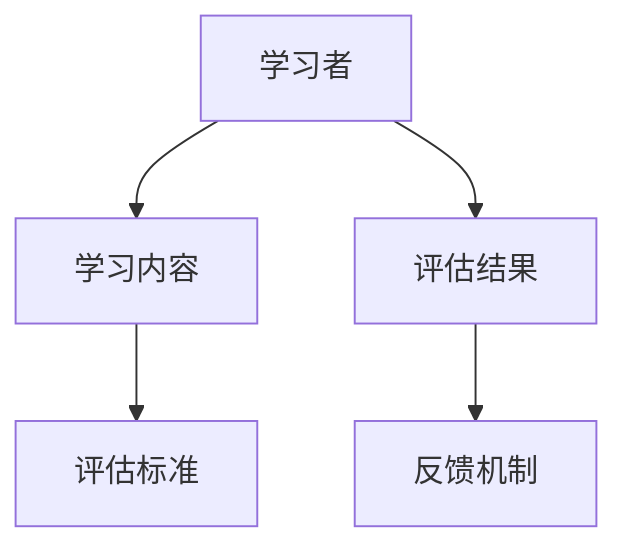
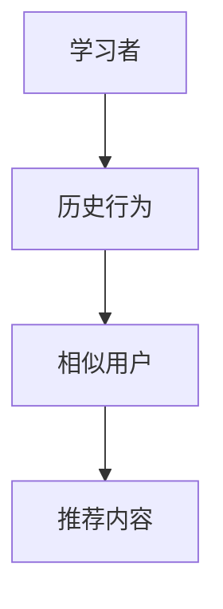
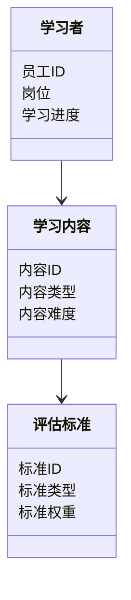
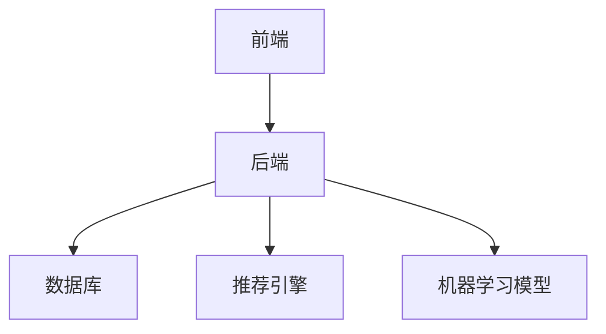
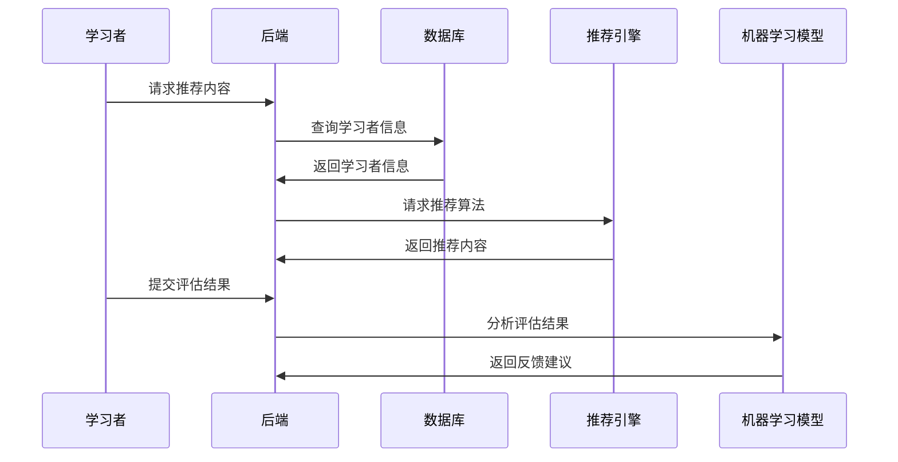

                 


# 构建智能企业合规培训系统：个性化学习内容与评估的自动化

## 关键词：企业合规培训、个性化学习、自动化评估、推荐算法、系统架构

## 摘要：本文探讨了构建智能企业合规培训系统的方法，重点分析了个性化学习内容与自动化评估的实现。通过推荐算法和系统架构设计，提出了一种高效的解决方案，帮助企业在合规培训中实现智能化、个性化和自动化的目标。

---

# 第一部分：背景与核心概念

## 第1章：企业合规培训的智能化需求

### 1.1 合规培训的重要性
#### 1.1.1 企业合规培训的核心目标
企业合规培训旨在确保员工了解并遵守相关法律法规和企业政策，降低法律风险，提升企业合规性。传统培训模式存在内容单一、缺乏针对性、反馈滞后等问题，难以满足现代企业的多样化需求。

#### 1.1.2 合规培训的传统模式与局限性
传统合规培训通常采用统一的课程和评估方式，忽视了员工的个体差异和岗位需求。这种模式可能导致学习效率低下，员工参与度不高，且难以实现精准的评估和反馈。

#### 1.1.3 智能化合规培训的必要性
随着企业规模的扩大和法规的复杂化，传统的培训模式已无法满足需求。智能化合规培训通过个性化学习和自动化评估，能够提高培训效果，降低成本，并实现快速反馈。

### 1.2 个性化学习与自动化评估的挑战
#### 1.2.1 个性化学习的需求分析
个性化学习需要根据员工的岗位、技能水平和学习偏好定制学习内容，确保学习的高效性和针对性。

#### 1.2.2 自动化评估的关键技术
自动化评估需要通过算法对员工的学习行为和成果进行实时分析，生成个性化的评估报告，并提供反馈建议。

#### 1.2.3 系统化合规培训的未来趋势
未来的合规培训将更加注重智能化和个性化，通过大数据和人工智能技术实现精准的培训管理和效果评估。

### 1.3 本章小结
本章介绍了企业合规培训的重要性及其智能化需求，指出了传统模式的局限性，并提出了个性化学习和自动化评估的必要性和挑战。

## 第2章：智能企业合规培训系统的概念与架构

### 2.1 核心概念与定义
#### 个性化学习内容
个性化学习内容是指根据员工的具体需求和学习进度定制的学习材料，包括视频、文档、测试等。

#### 自动化评估
自动化评估是指通过算法对员工的学习行为和成果进行实时分析和评分，无需人工干预。

#### 系统架构
系统架构包括前端界面、后端逻辑、数据存储和第三方服务（如推荐引擎、机器学习模型）。

### 2.2 核心概念对比表
| 概念 | 特征 | 优势 |
|------|------|------|
| 个性化学习 | 针对性、动态性 | 提高学习效率 |
| 自动化评估 | 自动化、实时性 | 降低人工成本 |

### 2.3 实体关系图


### 2.4 本章小结
本章定义了智能企业合规培训系统的核心概念，并通过对比表和实体关系图展示了系统的整体架构。

---

# 第二部分：算法原理

## 第3章：推荐算法

### 3.1 基于协同过滤的推荐算法
#### 3.1.1 算法原理
协同过滤算法通过分析用户的历史行为和相似用户的偏好，推荐相似内容。

#### 3.1.2 优缺点
优点：简单易实现，适合数据量小的情况。缺点：推荐结果可能不够精准。

### 3.2 基于聚类的推荐算法
#### 3.2.1 算法原理
聚类算法通过将用户或内容分成不同的类别，推荐与用户同一类的内容。

#### 3.2.2 优缺点
优点：适合数据量大、用户多样性高的情况。缺点：计算复杂度较高。

### 3.3 推荐算法流程图


### 3.4 本章小结
本章介绍了推荐算法的原理和优缺点，展示了协同过滤和聚类算法的应用。

## 第4章：评估算法

### 4.1 基于机器学习的评估模型
#### 4.1.1 算法原理
机器学习模型通过分析学习者的特征和行为，预测其学习效果。

#### 4.1.2 数学模型
$$ y = \theta x + b $$
其中，$y$ 是预测结果，$\theta$ 是权重，$x$ 是输入特征，$b$ 是偏置。

### 4.2 评估指标
#### 准确率
$$ \text{准确率} = \frac{\text{正确预测数}}{\text{总预测数}} $$

#### 召回率
$$ \text{召回率} = \frac{\text{正确预测数}}{\text{实际正例数}} $$

### 4.3 本章小结
本章介绍了基于机器学习的评估模型及其数学模型，展示了准确率和召回率的计算方法。

---

# 第三部分：系统分析与设计

## 第5章：系统功能设计

### 5.1 领域模型


### 5.2 系统架构设计


### 5.3 接口设计
#### API 接口
- `/api/recommend`：获取推荐内容
- `/api/assessment`：获取评估结果

### 5.4 交互流程图


### 5.5 本章小结
本章设计了系统的功能模块和架构，展示了接口和交互流程。

---

# 第四部分：项目实战

## 第6章：环境安装与核心代码实现

### 6.1 环境安装
- Python 3.8+
- Flask 框架
- Scikit-learn 库

### 6.2 核心代码实现
#### 推荐算法实现
```python
from sklearn.metrics.pairwise import cosine_similarity

def collaborative_filtering(user_item_matrix):
    similarities = cosine_similarity(user_item_matrix)
    return similarities
```

#### 评估模型实现
```python
from sklearn.linear_model import LinearRegression

model = LinearRegression()
model.fit(X, y)
```

### 6.3 案例分析
通过一个实际案例，展示了如何使用推荐算法和评估模型实现个性化学习和自动化评估。

### 6.4 本章小结
本章介绍了项目环境的安装和核心代码的实现，展示了推荐算法和评估模型的应用。

---

# 第五部分：最佳实践与小结

## 第7章：最佳实践

### 7.1 项目实施中的注意事项
- 数据隐私保护
- 系统性能优化
- 用户体验设计

### 7.2 小结
本章总结了项目实施中的注意事项和经验教训，为后续项目提供了参考。

## 第8章：未来展望

### 8.1 技术发展趋势
- 更智能的推荐算法
- 更精准的评估模型
- 更高效的系统架构

### 8.2 本章小结
本章展望了未来的发展趋势，指出了系统优化和技术创新的方向。

---

# 作者：AI天才研究院 & 禅与计算机程序设计艺术

---

通过以上目录大纲，可以清晰地看到文章的结构和内容安排。每一章都围绕一个主题展开，从背景到核心概念，再到算法实现和系统设计，最后到项目实战和总结，逻辑清晰，内容详实。

