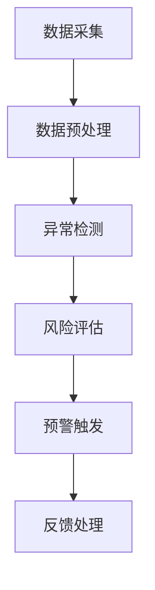
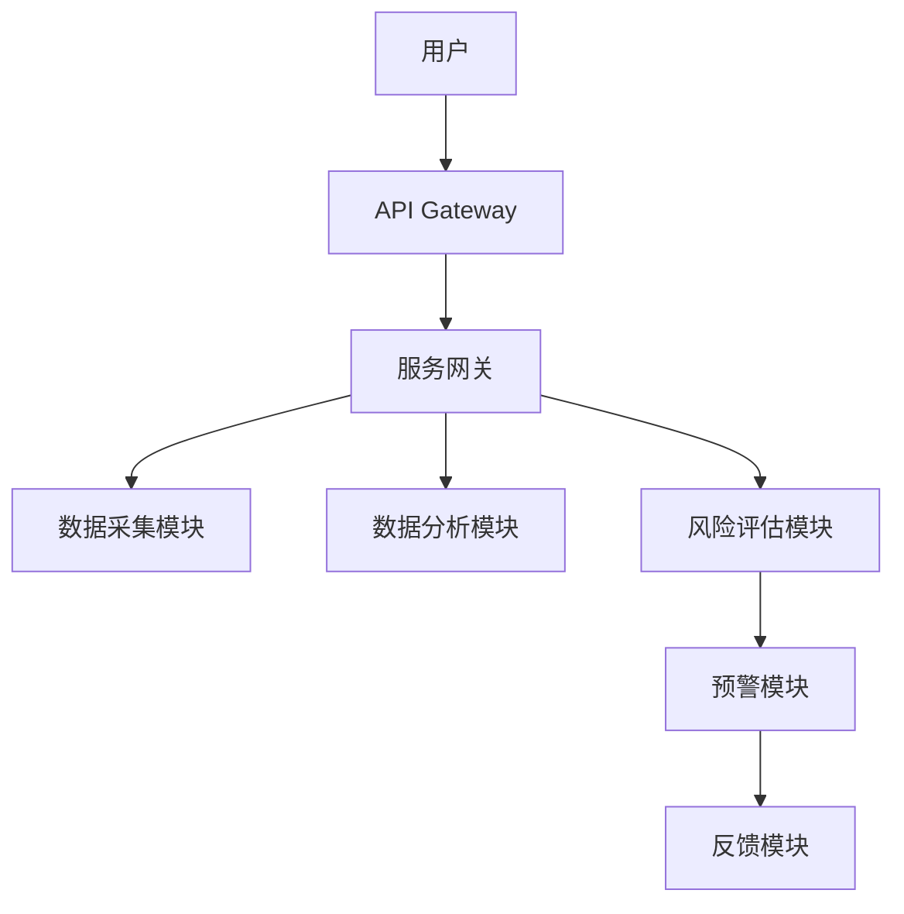

                 


# 构建智能企业合规管理系统：实时监控与预警机制

## 关键词：企业合规管理，实时监控，预警机制，智能系统，数据处理，机器学习

## 摘要：  
随着企业规模的不断扩大和业务复杂性的增加，合规管理变得越来越重要。传统的合规管理方式依赖人工操作，效率低下且容易出错。为了解决这一问题，智能企业合规管理系统应运而生。本文将详细介绍如何构建一个基于实时监控和预警机制的智能合规管理系统，涵盖从背景介绍到系统设计、项目实战的各个方面。通过本文，读者将了解如何利用现代技术手段提升企业合规管理的效率和准确性。

---

## 第一部分：智能企业合规管理系统的背景与核心概念

### 第1章：企业合规管理的背景与挑战

#### 1.1 企业合规管理的背景
- **合规管理的定义与重要性**  
  合规管理是指企业为了遵守相关法律法规、行业标准和企业内部政策，对自身的业务活动进行监督、检查和调整的过程。合规管理是企业风险管理的重要组成部分，直接关系到企业的可持续发展和声誉。  

- **核心概念术语说明**  
  - **合规性**：企业行为符合相关法律法规、标准和政策的程度。  
  - **风险评估**：识别和评估企业合规风险的过程。  
  - **实时监控**：通过自动化技术实时采集和分析数据，及时发现和处理合规问题。  
  - **预警机制**：基于数据分析，提前预测和提醒潜在的合规风险。  

- **问题背景与问题描述**  
  随着全球化和数字化的深入，企业面临越来越复杂的合规要求。传统的人工合规管理方式效率低、覆盖面有限，难以应对快速变化的合规环境。此外，企业内部数据分散、信息孤岛问题严重，进一步增加了合规管理的难度。  

- **问题解决与边界外延**  
  智能企业合规管理系统通过自动化数据采集、分析和预警，能够显著提高合规管理的效率和准确性。系统的边界包括从数据采集到风险评估，再到预警反馈的全过程，覆盖企业内外部的所有相关数据源。

#### 1.2 传统合规管理的局限性
- **效率低下**  
  传统合规管理主要依赖人工检查，耗时长、成本高，难以覆盖所有业务场景。  
- **主观性强**  
  人工判断容易受到个人经验和主观因素的影响，导致合规判断的不准确。  
- **缺乏实时性**  
  传统合规管理通常是定期进行的，无法及时发现和处理潜在风险，可能导致合规问题的积累和爆发。  

#### 1.3 智能合规管理系统的必要性
- **提升效率**  
  智能系统通过自动化技术，大幅减少人工干预，提高合规管理效率。  
- **增强准确性**  
  利用机器学习和大数据分析技术，系统能够更准确地识别合规风险。  
- **实时监控与预警**  
  系统能够实时采集和分析数据，提前发现潜在风险，避免问题扩大化。  

---

### 第2章：智能合规管理系统的概念与技术基础

#### 2.1 智能合规管理系统的定义
- **定义**  
  智能合规管理系统是一种基于人工智能和大数据技术的企业合规管理解决方案，能够实现数据的实时采集、分析和预警，帮助企业在复杂环境中高效、准确地完成合规任务。  

- **核心特征**  
  - **实时性**：数据采集和分析实时进行，确保合规风险能够被及时发现。  
  - **智能化**：利用机器学习算法，系统能够自动学习和优化，提高风险识别能力。  
  - **可扩展性**：系统架构灵活，能够适应不同规模和业务模式的企业需求。  

#### 2.2 智能合规管理系统的技术基础
- **数据采集与处理技术**  
  系统需要从企业内部和外部数据源（如ERP系统、社交媒体、法律法规数据库等）实时采集数据，并进行清洗和预处理。  

- **数据分析与挖掘技术**  
  利用大数据分析和机器学习技术，对采集的数据进行深入分析，识别潜在的合规风险。  

- **人工智能与机器学习技术**  
  通过训练模型，系统能够自动识别异常行为和潜在风险，实现智能化的合规管理。  

---

## 第二部分：智能合规管理系统的核心概念与联系

### 第3章：合规管理体系的结构与功能

#### 3.1 合规管理体系的组成
- **数据采集模块**  
  负责从企业内外部数据源采集合规相关的数据，如合同、财务数据、员工行为记录等。  

- **数据分析模块**  
  对采集的数据进行清洗、转换和分析，识别潜在的合规风险。  

- **风险评估模块**  
  根据分析结果，评估合规风险的严重性和影响范围，确定优先处理的事项。  

- **预警与反馈模块**  
  根据风险评估结果，触发预警机制，通知相关人员采取措施，并将处理结果反馈到系统中。  

#### 3.2 合规管理系统的功能设计
- **数据采集与预处理**  
  从多个数据源采集数据，并进行清洗、去重和格式转换，确保数据的准确性和一致性。  

- **风险识别与评估**  
  利用机器学习算法，对数据进行分析，识别潜在的合规风险，并评估其影响。  

- **预警机制与反馈**  
  根据风险评估结果，设置预警阈值，当风险超过阈值时，系统自动触发预警，并提供处理建议。  

- **报告与分析**  
  生成合规管理报告，记录风险识别、评估和处理的全过程，为企业的决策提供支持。  

---

### 第4章：合规管理系统的实体关系分析

#### 4.1 实体关系图（ER图）
```mermaid
erd
  %%{init: 'es6'}
  title 合规管理系统 ER 图
  rectangle 实体1
    属性1
    属性2
  end
  rectangle 实体2
    属性3
    属性4
  end
  rectangle 实体3
    属性5
    属性6
  end
  实体1 --> 实体2: 关系
  实体2 --> 实体3: 关系
```

#### 4.2 核心概念对比分析
| 概念 | 属性1 | 属性2 | 属性3 |
|------|-------|-------|-------|
| 数据采集模块 | 数据源 | 数据格式 | 数据处理方式 |
| 数据分析模块 | 分析方法 | 算法模型 | 分析结果 |
| 风险评估模块 | 风险指标 | 风险等级 | 处理建议 |

---

## 第三部分：智能合规管理系统的算法原理与数学模型

### 第5章：算法原理与数学模型

#### 5.1 实时监控与预警机制的算法原理


#### 5.2 数学模型与公式
- **异常检测模型**  
  异常检测可以通过统计方法或机器学习方法实现。以下是一个简单的统计模型：  
  $$ P(X \leq x) = \frac{1}{\sigma \sqrt{2\pi}} \int_{-\infty}^{x} e^{-t^2/(2\sigma^2)} dt $$  
  其中，\( x \) 是数据点，\( \sigma \) 是标准差，\( \pi \) 是圆周率。  

- **风险评估模型**  
  风险评估可以通过概率论中的贝叶斯定理来实现：  
  $$ P(A|B) = \frac{P(B|A) \cdot P(A)}{P(B)} $$  
  其中，\( A \) 是风险事件，\( B \) 是相关证据。  

---

## 第四部分：系统分析与架构设计

### 第6章：系统分析与架构设计方案

#### 6.1 问题场景介绍
- **业务背景**  
  某企业希望提升其合规管理能力，减少人为错误，提高效率。  

#### 6.2 项目介绍
- **项目目标**  
  构建一个实时监控与预警的智能合规管理系统，覆盖企业的主要业务流程。  

#### 6.3 系统功能设计
- **功能模块**  
  - 数据采集模块：从ERP、财务系统等数据源采集数据。  
  - 数据分析模块：对数据进行清洗、分析和建模。  
  - 风险评估模块：识别潜在风险并评估其影响。  
  - 预警与反馈模块：触发预警并反馈处理结果。  

#### 6.4 系统架构设计


---

## 第五部分：项目实战与代码实现

### 第7章：项目实战

#### 7.1 环境安装
- **Python环境**：安装Python 3.8及以上版本。  
- **依赖库安装**：使用pip安装numpy、pandas、scikit-learn等库。  

#### 7.2 核心代码实现
```python
import numpy as np
import pandas as pd
from sklearn.ensemble import IsolationForest

# 数据采集与预处理
data = pd.read_csv('compliance_data.csv')
data = data.dropna().reset_index(drop=True)

# 异常检测模型训练
model = IsolationForest(n_estimators=100, random_state=42)
model.fit(data)

# 风险评估
def risk_assessment(score):
    if score < -3:
        return '高风险'
    elif score < -1:
        return '中风险'
    else:
        return '低风险'

# 预警机制
def trigger_alarm(risk_level):
    if risk_level == '高风险':
        print(f'触发高风险预警：{risk_level}')
    elif risk_level == '中风险':
        print(f'触发中风险预警：{risk_level}')
```

#### 7.3 实际案例分析
- **案例背景**  
  某企业发现其财务数据中存在异常交易，需要通过系统进行实时监控和预警。  

- **数据处理与分析**  
  使用IsolationForest算法对财务数据进行异常检测，识别出可疑交易。  

- **风险评估与预警**  
  根据异常检测结果，评估风险等级并触发相应预警。  

---

## 第六部分：总结与展望

### 第8章：总结与展望

#### 8.1 最佳实践 Tips
- **数据质量管理**：确保数据的准确性和完整性，是系统运行的基础。  
- **模型优化**：定期更新和优化机器学习模型，提高风险识别能力。  

#### 8.2 项目小结
通过本文的介绍，读者可以了解到如何构建一个智能企业合规管理系统，包括系统设计、算法实现和项目实战等内容。  

#### 8.3 注意事项
- **数据隐私与安全**：在数据采集和处理过程中，需注意保护企业数据的隐私和安全。  
- **系统稳定性**：确保系统的高可用性和稳定性，避免因系统故障导致合规问题。  

#### 8.4 拓展阅读
- 推荐阅读《大数据分析与机器学习实战》和《企业风险管理与内部控制》等书籍，深入了解相关领域的知识。

---

## 作者信息

作者：AI天才研究院（AI Genius Institute） & 禅与计算机程序设计艺术（Zen And The Art of Computer Programming）

---

通过本文的详细讲解，读者可以系统地了解智能企业合规管理系统的构建过程，从理论到实践，逐步掌握实时监控与预警机制的核心技术。希望本文能够为企业的合规管理提供有价值的参考和指导。

