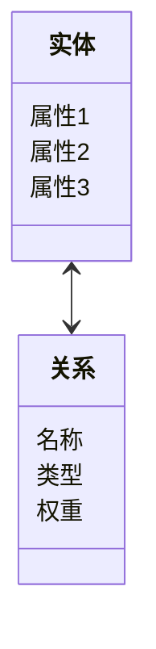

                 


# 构建智能企业知识图谱：深化领域理解与应用

## 关键词：知识图谱、企业知识管理、智能构建、领域理解、应用场景

## 摘要：知识图谱是一种强大的工具，用于企业内部知识的组织与管理。本文将详细探讨构建智能企业知识图谱的核心概念、构建方法、系统架构设计、项目实战以及最佳实践。通过这些内容，读者将能够深入了解如何在企业中深化领域理解，并有效应用知识图谱来提升业务能力。

---

## 第一部分：知识图谱概述

### 第1章：知识图谱的定义与背景

#### 1.1 知识图谱的基本概念

知识图谱是一种以图结构形式表示知识的语义网络，由实体、属性和关系组成。实体是现实世界中的具体事物或概念，属性描述实体的特征，关系表示实体之间的关联。

- 实体：如“公司”、“员工”、“项目”等。
- 属性：如“员工的年龄”、“项目的预算”等。
- 关系：如“员工参与项目”、“项目依赖部门”等。

知识图谱的核心目标是将分散在企业各处的知识进行整合，形成一个统一、结构化的知识网络，以便于查询、推理和应用。

#### 1.2 知识图谱的发展背景

随着企业数字化转型的推进，知识管理的重要性日益凸显。企业内部积累了大量的数据和信息，但这些信息通常分散在不同的系统中，难以被有效利用。知识图谱的出现为企业提供了一种新的知识管理方式，能够将隐性知识和显性知识有机结合，形成可计算的知识体系。

知识图谱起源于语义网络和本体论研究，近年来随着大数据和人工智能技术的发展，逐渐在企业中得到广泛应用。知识图谱在企业中的应用价值包括知识检索效率提升、知识推理能力增强、跨系统知识整合等。

### 第2章：知识图谱的核心概念与联系

#### 2.1 知识图谱的核心要素

知识图谱的核心要素包括实体、属性和关系：

- 实体：知识图谱中的基本单元，代表具体的事物或概念。
- 属性：描述实体的特征或状态，通常以键值对的形式存在。
- 关系：描述实体之间的关联，通常由关系类型和参与实体组成。

知识图谱的构建流程包括数据准备、知识抽取、知识建模和知识融合四个阶段。通过这些步骤，将分散的、异构的数据整合成一个统一的知识网络。

#### 2.2 知识图谱的实体关系图

以下是知识图谱的实体关系图示例：


图中展示了“员工”参与“项目”的关系，以及“项目”所属的“部门”。

#### 2.3 知识图谱的领域模型

以下是知识图谱的领域模型示例：



该图展示了实体和关系之间的关联，实体通过关系连接起来，形成一个完整的知识网络。

---

## 第二部分：知识图谱的构建方法

### 第3章：知识图谱的构建流程

#### 3.1 数据准备

数据准备是知识图谱构建的第一步，主要包括数据源的选择与获取、数据清洗与预处理、数据格式的标准化。

- 数据源选择：根据企业的实际需求，选择合适的数据源，如数据库、文档、知识库等。
- 数据清洗：去除噪声数据，确保数据的准确性和一致性。
- 数据格式标准化：将数据转换为统一的格式，便于后续处理。

#### 3.2 知识抽取与建模

知识抽取与建模是构建知识图谱的核心步骤，主要包括实体识别与抽取、关系抽取与建模、知识图谱的构建算法。

- 实体识别：通过自然语言处理技术，从文本中提取出实体。
- 关系抽取：识别实体之间的关系，并将其建模为关系三元组。
- 知识图谱构建：将抽取的实体和关系整合成一个知识图谱，通常采用基于规则或基于机器学习的算法。

#### 3.3 知识融合与优化

知识融合与优化是确保知识图谱质量的关键步骤，主要包括知识融合的方法、知识图谱的优化策略、知识图谱的质量评估。

- 知识融合：将多个来源的知识进行合并，消除冲突，提高知识的准确性和完整性。
- 知识图谱优化：通过规则或算法对知识图谱进行优化，如去除冗余关系、合并相似实体等。
- 质量评估：通过一定的指标和方法，评估知识图谱的质量，如覆盖率、准确性等。

### 第4章：知识图谱的构建工具与技术

#### 4.1 知识抽取工具

知识抽取工具是构建知识图谱的重要工具，主要包括基于规则的抽取工具、基于机器学习的抽取工具、基于深度学习的抽取工具。

- 基于规则的抽取工具：通过预定义的规则，从文本中提取特定的信息。
- 基于机器学习的抽取工具：利用机器学习算法，如支持向量机、随机森林等，进行特征提取和分类。
- 基于深度学习的抽取工具：使用深度学习模型，如BERT、LSTM等，进行语义理解与信息抽取。

#### 4.2 知识建模技术

知识建模技术是构建知识图谱的核心技术，主要包括基于本体的建模技术、基于图数据库的建模技术、基于语义网络的建模技术。

- 基于本体的建模技术：通过本体论方法，定义实体和关系的层次结构。
- 基于图数据库的建模技术：利用图数据库，如Neo4j，进行高效的图结构存储和查询。
- 基于语义网络的建模技术：通过语义网络理论，构建知识图谱的语义表示。

---

## 第三部分：知识图谱的系统架构设计

### 第5章：知识图谱的系统架构设计

#### 5.1 系统功能设计

知识图谱系统的功能设计包括数据预处理模块、知识抽取模块、知识建模模块、知识融合模块。

- 数据预处理模块：负责数据的清洗、转换和标准化。
- 知识抽取模块：负责实体识别、关系抽取等任务。
- 知识建模模块：负责构建知识图谱的结构化表示。
- 知识融合模块：负责知识的合并与优化。

#### 5.2 系统架构设计

知识图谱系统的架构设计包括分层架构、模块化设计、接口设计。

- 分层架构：将系统划分为数据层、逻辑层和表现层，各层之间通过接口进行通信。
- 模块化设计：将系统功能模块化，如数据预处理模块、知识抽取模块等。
- 接口设计：定义模块之间的接口，确保系统的可扩展性和可维护性。

#### 5.3 系统交互设计

知识图谱系统的交互设计包括用户界面设计、交互流程设计、用户权限管理。

- 用户界面设计：提供直观的用户界面，方便用户进行知识查询和管理。
- 交互流程设计：设计用户与系统之间的交互流程，确保操作的便捷性和高效性。
- 用户权限管理：根据用户角色，进行权限控制，确保系统的安全性。

---

## 第四部分：知识图谱的项目实战

### 第6章：知识图谱的项目实战

#### 6.1 项目背景与目标

项目背景：某企业希望通过构建知识图谱，整合内部知识资源，提升知识管理效率。

项目目标：构建一个涵盖企业组织架构、项目管理、知识库等领域的知识图谱。

#### 6.2 环境搭建

- 数据库选择：使用Neo4j作为图数据库，用于存储知识图谱。
- 开发工具：使用Python编程语言，搭配Py2neo库进行图数据库操作。

#### 6.3 核心代码实现

以下是知识图谱构建的核心代码示例：

```python
from py2neo import Graph, Node, Relationship

# 连接数据库
graph = Graph("http://localhost:7474", auth=("neo4j", "password"))

# 创建节点
employee = Node("Employee", name="小明", age=30)
project = Node("Project", name="项目A", budget=100000)
department = Node("Department", name="研发部")

# 创建关系
relationship = Relationship(employee, "参与", project)
relationship2 = Relationship(project, "属于", department)

# 将节点和关系添加到图中
graph.create(employee, project, department, relationship, relationship2)
```

#### 6.4 实际案例分析

通过上述代码，我们可以构建一个简单的知识图谱，展示“小明”参与“项目A”，并且“项目A”属于“研发部”。这种结构化的知识表示，使得企业能够轻松进行知识查询和推理。

#### 6.5 项目总结

通过该项目实战，我们能够体会到知识图谱构建的流程和方法。从数据准备到知识抽取，再到知识建模和知识融合，每一步都需要精心设计和实施。同时，选择合适的工具和技术，能够显著提高知识图谱的构建效率和质量。

---

## 第五部分：最佳实践与未来趋势

### 第7章：最佳实践与未来趋势

#### 7.1 最佳实践

- 数据质量是关键：确保数据的准确性和完整性。
- 知识抽取要精准：选择合适的技术和工具，提高抽取的准确率。
- 知识融合要合理：通过合理的融合策略，提升知识图谱的质量。

#### 7.2 未来趋势

知识图谱的发展趋势包括：

- 与大模型结合：将知识图谱与大语言模型结合，提升知识的理解和应用能力。
- 实时更新：实现知识图谱的实时更新，确保知识的时效性。
- 多模态知识图谱：结合文本、图像、视频等多种数据形式，构建多模态的知识图谱。

---

## 结语

构建智能企业知识图谱是一项复杂而重要的任务，它不仅能够帮助企业整合分散的知识资源，还能够通过智能推理和应用，提升企业的核心竞争力。通过本文的详细讲解，读者能够系统地了解知识图谱的构建方法和应用技巧，并能够在实际工作中灵活运用这些知识。

---

## 作者

作者：AI天才研究院 & 禅与计算机程序设计艺术

