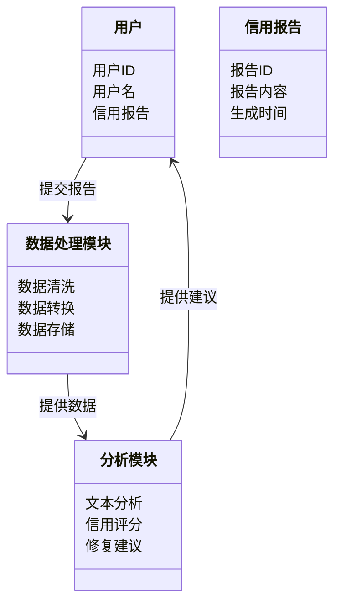
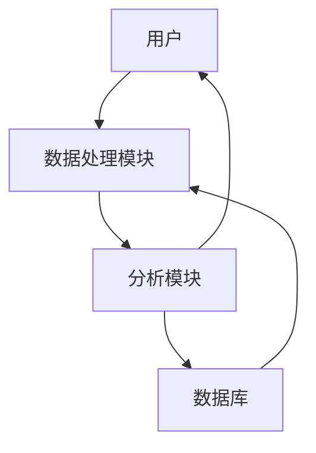
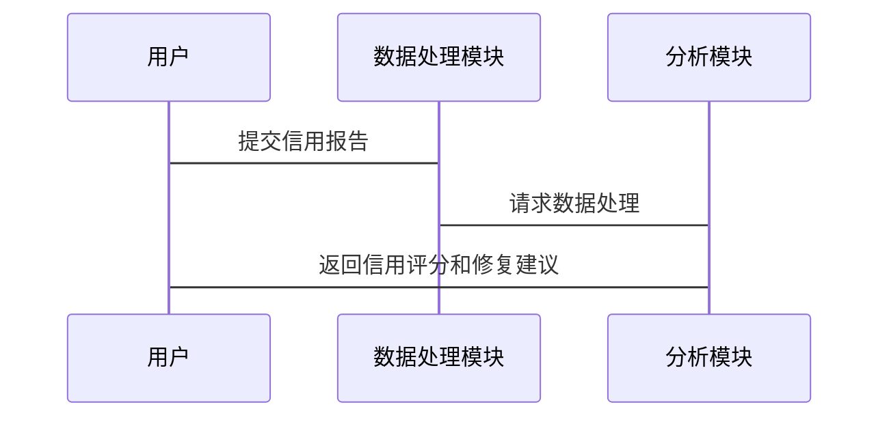

                 


# 构建智能化的个人信用修复助手系统

## 关键词：个人信用修复，人工智能，自然语言处理，机器学习，系统架构

## 摘要：本文详细介绍了如何利用人工智能技术构建智能化的个人信用修复助手系统。通过分析信用修复的背景与意义，探讨了自然语言处理和机器学习在信用评估中的应用，提出了系统的设计与实现方案，并通过实际案例展示了系统的功能与优势。本文旨在为信用修复领域提供一种高效、智能的解决方案。

---

# 第一部分: 个人信用修复助手系统的背景与概述

## 第1章: 个人信用修复的概念与重要性

### 1.1 信用修复的背景与意义

#### 1.1.1 信用修复的定义与内涵
信用修复是指通过合法手段，纠正和改善个人或企业的信用记录，以提升信用评分或信用等级的过程。随着社会信用体系的完善，信用修复在个人和企业的日常生活中扮演着越来越重要的角色。

#### 1.1.2 个人信用修复的重要性
个人信用记录直接影响个人的贷款申请、信用卡额度、就业机会等。通过智能化的信用修复助手，个人可以更高效地了解自身信用状况，制定修复计划，并监控修复进展。

#### 1.1.3 智能化信用修复助手的价值
智能化信用修复助手通过自动化数据处理、智能分析和实时反馈，能够显著提高信用修复的效率和准确性，帮助用户快速改善信用状况。

---

### 1.2 个人信用修复的现状与挑战

#### 1.2.1 传统信用修复的局限性
传统的信用修复过程通常依赖人工操作，耗时长、成本高，且容易受到主观因素的影响。

#### 1.2.2 人工智能在信用修复中的应用潜力
人工智能技术（如自然语言处理和机器学习）能够快速处理大量数据，发现潜在问题，并提供个性化修复建议。

---

## 第2章: 智能化信用修复助手的必要性

### 2.1 传统信用修复的痛点

#### 2.1.1 数据获取与处理的复杂性
传统信用修复需要手动收集和分析大量的信用报告，数据清洗和预处理耗时耗力。

#### 2.1.2 信用评估的不准确性
由于人为因素的影响，传统信用评估可能存在偏差，导致修复建议不够精准。

#### 2.1.3 缺乏实时反馈
传统信用修复过程缺乏实时监控和反馈，用户无法及时了解修复进展。

### 2.2 智能化信用修复助手的优势

#### 2.2.1 提高效率与准确性
通过自动化数据处理和机器学习模型，智能化信用修复助手能够快速生成准确的信用评估报告。

#### 2.2.2 实时数据分析与反馈
系统可以实时监控信用数据的变化，及时提供修复建议和反馈。

#### 2.2.3 个性化修复方案
基于用户的信用状况和行为数据，系统能够制定个性化的修复计划，提高修复效果。

---

# 第二部分: 个人信用修复助手系统的核心概念与技术联系

## 第3章: 核心概念与技术联系

### 3.1 信用数据的来源与处理

#### 3.1.1 信用数据的来源
信用数据通常来源于信用报告、银行流水、消费记录等。以下是信用数据来源的分类：

1. **信用报告**：包括个人的借贷记录、还款情况等。
2. **银行流水**：反映个人的收入和支出情况。
3. **消费记录**：包括信用卡消费、网购记录等。

#### 3.1.2 数据处理流程
数据处理流程包括数据清洗、数据转换、数据集成和数据存储等步骤。

---

### 3.2 自然语言处理技术

#### 3.2.1 文本分析与信息提取
自然语言处理（NLP）技术可以对信用报告中的文本信息进行分析，提取关键信息（如逾期记录、欠款金额等）。

#### 3.2.2 信用报告解读的NLP模型
通过NLP模型，系统可以自动识别信用报告中的负面信息，并生成修复建议。

#### 3.2.3 语义理解与上下文分析
系统能够理解信用报告中的上下文信息，提供更精准的修复建议。

---

## 第4章: 机器学习与预测模型

### 4.1 机器学习在信用评估中的应用

#### 4.1.1 常见信用评估模型
常用的信用评估模型包括逻辑回归、决策树、随机森林等。

#### 4.1.2 信用评分模型的构建
通过机器学习算法，系统可以构建信用评分模型，评估用户的信用风险。

#### 4.1.3 模型优化与调优
通过交叉验证和网格搜索等方法，优化模型的性能，提高预测准确性。

---

# 第三部分: 个人信用修复助手系统的算法原理

## 第5章: 算法原理与实现

### 5.1 文本挖掘与信用信息提取

#### 5.1.1 文本预处理
文本预处理包括分词、去除停用词、词干提取等步骤。

#### 5.1.2 TF-IDF特征提取
TF-IDF（Term Frequency-Inverse Document Frequency）是一种常用的文本特征提取方法，用于衡量词的重要性。

#### 5.1.3 LDA主题建模
LDA（Latent Dirichlet Allocation）是一种主题建模方法，用于发现文本中的主题分布。

---

### 5.2 信用评估的机器学习模型

#### 5.2.1 逻辑回归模型
逻辑回归是一种常用的分类算法，适用于二分类问题，如信用风险评估。

#### 5.2.2 支持向量机（SVM）
SVM是一种监督学习算法，适用于小样本数据的分类任务。

#### 5.2.3 随机森林模型
随机森林是一种基于决策树的集成学习算法，适用于高维数据的分类和回归任务。

---

## 第6章: 算法实现与优化

### 6.1 算法实现步骤

#### 6.1.1 数据集准备
收集和整理信用数据，进行数据清洗和预处理。

#### 6.1.2 特征提取
使用NLP技术提取文本特征，构建特征向量。

#### 6.1.3 模型训练
选择合适的机器学习算法，训练信用评估模型。

#### 6.1.4 模型评估
通过准确率、召回率等指标评估模型的性能。

---

### 6.2 模型优化与调优

#### 6.2.1 超参数优化
使用网格搜索或随机搜索方法，优化模型的超参数。

#### 6.2.2 正则化方法
通过L1/L2正则化防止过拟合，提高模型的泛化能力。

#### 6.2.3 集成学习
通过集成学习方法（如投票、堆叠）进一步提高模型的性能。

---

# 第四部分: 个人信用修复助手系统的系统分析与架构设计

## 第7章: 系统分析与架构设计

### 7.1 问题场景介绍

#### 7.1.1 用户需求
用户希望通过系统快速了解自身的信用状况，并获得个性化的修复建议。

#### 7.1.2 系统目标
系统旨在通过智能化分析和预测，帮助用户改善信用状况。

---

### 7.2 系统功能设计

#### 7.2.1 领域模型设计
以下是系统领域的类图：



#### 7.2.2 系统架构设计
以下是系统架构图：



---

### 7.3 系统接口设计

#### 7.3.1 API接口
系统提供以下API接口：

1. 提交信用报告接口
2. 获取信用评分接口
3. 获取修复建议接口

#### 7.3.2 接口交互流程
以下是系统接口的交互流程图：



---

## 第8章: 项目实战

### 8.1 环境安装

#### 8.1.1 Python环境配置
安装Python 3.8及以上版本，安装必要的库（如scikit-learn、nltk、pandas等）。

#### 8.1.2 数据集准备
收集信用报告数据，进行数据清洗和预处理。

---

### 8.2 系统核心实现

#### 8.2.1 数据处理模块实现

```python
import pandas as pd
from sklearn.preprocessing import StandardScaler

# 数据清洗
def data_cleaning(data):
    # 删除缺失值
    data = data.dropna()
    # 处理异常值
    scaler = StandardScaler()
    data[['amount', 'balance']] = scaler.fit_transform(data[['amount', 'balance']])
    return data

# 数据转换
def data_transformation(data):
    # 分词处理
    from nltk.tokenize import word_tokenize
    data['text_features'] = data['report_content'].apply(word_tokenize)
    return data
```

#### 8.2.2 分析模块实现

```python
from sklearn.feature_extraction.text import TfidfVectorizer
from sklearn.naive_bayes import MultinomialNB

# 特征提取
vectorizer = TfidfVectorizer()
X = vectorizer.fit_transform(data['report_content'])

# 模型训练
model = MultinomialNB()
model.fit(X, data['label'])

# 模型预测
new_report = ["借款逾期记录"]
X_new = vectorizer.transform([new_report])
predicted = model.predict(X_new)
print(predicted)
```

---

### 8.3 实际案例分析

#### 8.3.1 案例背景
用户A的信用报告显示有多次逾期记录，信用评分为500分。

#### 8.3.2 系统分析
系统通过NLP技术提取文本特征，结合机器学习模型，预测用户的信用评分为500分，并建议用户在接下来的6个月内偿还逾期款项。

#### 8.3.3 修复建议
1. 提前偿还逾期款项。
2. 保持良好的还款记录。
3. 减少高风险的信贷行为。

---

## 第9章: 最佳实践与总结

### 9.1 小结

通过智能化的信用修复助手系统，用户可以快速了解自身的信用状况，并获得个性化的修复建议。系统通过自然语言处理和机器学习技术，提高了信用评估的效率和准确性。

---

### 9.2 注意事项

1. 数据隐私保护：系统需要严格遵守数据隐私保护法规，确保用户数据的安全。
2. 模型优化：定期更新模型，提高预测准确性。
3. 用户教育：加强对用户的信用知识教育，帮助用户更好地理解和使用系统。

---

### 9.3 拓展阅读

1. **《Python机器学习实战》**：深入讲解机器学习算法的实现与应用。
2. **《自然语言处理入门》**：介绍NLP技术的基本概念与实际应用。
3. **《信用评分模型》**：详细讲解信用评分模型的构建与优化。

---

## 作者：AI天才研究院/AI Genius Institute & 禅与计算机程序设计艺术 /Zen And The Art of Computer Programming

---

通过以上内容，我们详细介绍了如何构建智能化的个人信用修复助手系统。从背景分析到系统设计，再到项目实战，本文为读者提供了一套完整的解决方案，帮助用户高效地改善信用状况。

