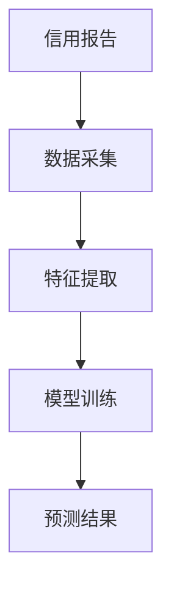
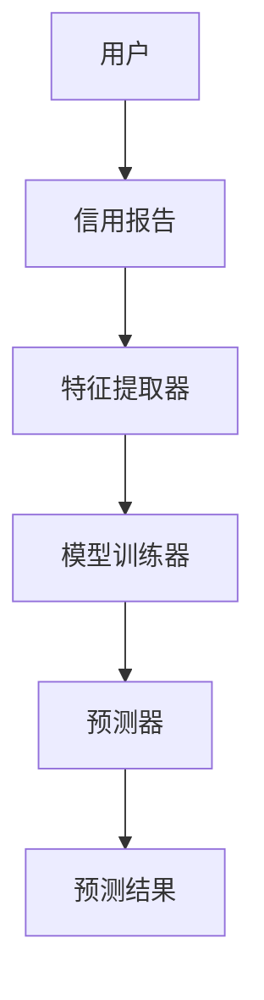
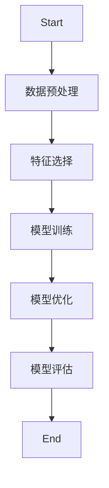
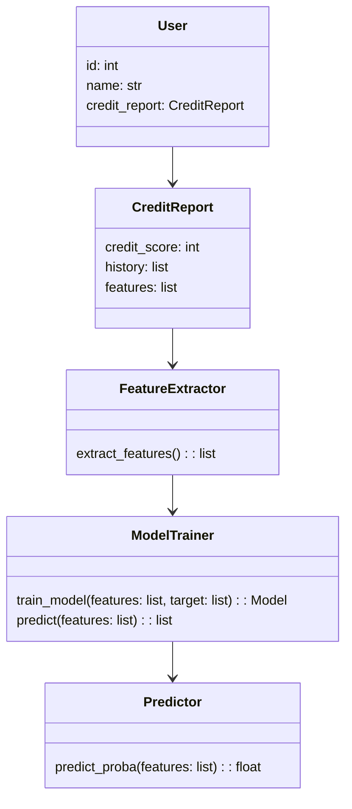
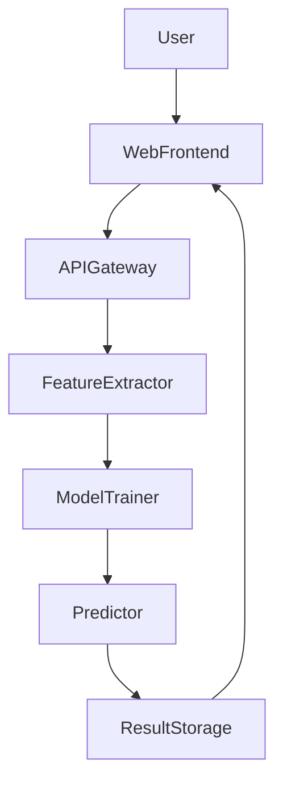

                 


# 《构建智能化的个人信用修复效果预测器》

> **关键词**：信用修复、智能预测、机器学习、数据分析、系统架构  
> **摘要**：本文详细介绍了构建智能化个人信用修复效果预测器的全过程，涵盖背景分析、核心概念、算法原理、系统设计、项目实现及最佳实践。通过系统化的分析与技术实现，展示了如何利用人工智能技术提升信用修复的效果预测能力。

---

## 第1章: 个人信用修复效果预测器的背景与需求

### 1.1 信用修复的背景与重要性

#### 1.1.1 信用修复的概念与定义
信用修复是指通过改善个人或企业的信用行为，修复其在信用报告中的不良记录，从而提升信用评分的过程。随着社会信用体系的完善，信用修复的重要性日益凸显，尤其是在金融、信贷等领域，良好的信用记录是获取贷款、信用卡等金融服务的关键因素。

#### 1.1.2 信用修复的现状与挑战
当前，信用修复主要依赖人工操作，效率低且难以量化修复效果。随着数据科学和人工智能技术的发展，智能化的信用修复效果预测成为可能。然而，现有技术在预测精度、实时性和个性化方面仍存在较大提升空间。

#### 1.1.3 智能化信用修复的必要性
智能化信用修复可以通过数据分析和机器学习模型，帮助用户预测修复效果，制定最优修复策略，从而提高修复效率和效果。这不仅能够节省时间和成本，还能为用户提供个性化的修复建议。

### 1.2 个人信用修复效果预测的提出

#### 1.2.1 信用修复效果的定义与衡量标准
信用修复效果是指在一定时间内，通过修复措施改善信用评分的程度。衡量标准包括信用评分的提升幅度、修复时间的长短、修复过程中的稳定性等。

#### 1.2.2 信用修复效果预测的核心问题
- 如何从历史数据中提取有效的特征？
- 如何构建准确的预测模型？
- 如何保证模型的实时性和可解释性？

#### 1.2.3 预测器的目标与应用场景
预测器的目标是基于个人信用历史数据，预测修复后的信用评分变化。应用场景包括个人信用修复规划、金融机构风险评估、信用管理服务等。

### 1.3 预测器的边界与外延

#### 1.3.1 预测器的功能边界
- 数据输入：个人信用报告、修复计划、修复时间等。
- 数据输出：信用评分变化预测、修复效果排名、修复建议等。

#### 1.3.2 预测器的适用范围
适用于个人信用修复、企业信用评估、信用风险管理等领域。

#### 1.3.3 预测器的外部依赖与限制
依赖于高质量的数据源和模型训练数据的完整性。受限于数据隐私和法律法规，部分敏感数据无法使用。

### 1.4 核心要素与概念结构

#### 1.4.1 预测器的核心要素
- 数据采集模块：获取信用报告、修复记录等数据。
- 特征提取模块：提取信用评分、逾期记录、还款行为等特征。
- 模型训练模块：训练预测模型。
- 结果展示模块：输出预测结果和修复建议。

#### 1.4.2 概念之间的关系与依赖
- 数据采集依赖于数据源的可用性。
- 特征提取依赖于数据的完整性和相关性。
- 模型训练依赖于算法的选择和参数调优。

#### 1.4.3 概念结构的可视化图示


---

## 第2章: 个人信用修复效果预测器的核心概念与联系

### 2.1 核心概念原理

#### 2.1.1 数据来源与特征提取
数据来源包括信用报告、银行流水、消费记录等。特征提取涉及将数据转化为模型可识别的特征，如信用评分、逾期次数、还款金额占比等。

#### 2.1.2 模型选择与训练
选择合适的机器学习模型（如随机森林、梯度提升树）进行训练，优化模型参数以提高预测精度。

#### 2.1.3 预测结果的解释与应用
通过模型输出预测结果，并结合业务逻辑给出修复建议。

### 2.2 核心概念属性对比

#### 2.2.1 不同模型的特征对比表格
| 模型类型 | 输入特征 | 输出特征 | 模型复杂度 |
|----------|----------|----------|------------|
| 线性回归 | 数值特征 | 概率值    | 低          |
| 随机森林 | 类别与数值特征 | 类别与数值特征 | 中等         |

### 2.3 实体关系图架构



---

## 第3章: 个人信用修复效果预测器的算法原理

### 3.1 算法原理概述

#### 3.1.1 选择合适的算法
根据数据特点选择随机森林作为基础模型，并结合梯度提升树优化性能。

#### 3.1.2 算法流程
1. 数据预处理：清洗数据，处理缺失值和异常值。
2. 特征选择：使用特征重要性分析选择关键特征。
3. 模型训练：训练随机森林模型。
4. 模型优化：使用网格搜索调优参数。
5. 模型评估：通过交叉验证评估模型性能。

### 3.2 算法流程图



### 3.3 算法实现代码

```python
import pandas as pd
from sklearn.ensemble import RandomForestClassifier
from sklearn.model_selection import GridSearchCV
from sklearn.metrics import accuracy_score

# 数据加载与预处理
data = pd.read_csv('credit_data.csv')
data = data.dropna()  # 删除缺失值
data = pd.get_dummies(data)  # 特征独热编码

# 特征选择
features = data.drop('credit_score', axis=1)
target = data['credit_score']

# 模型训练
model = RandomForestClassifier()
param_grid = {
    'n_estimators': [100, 200],
    'max_depth': [None, 10, 20]
}
grid_search = GridSearchCV(model, param_grid, cv=5)
grid_search.fit(features, target)

# 模型优化与评估
best_model = grid_search.best_estimator_
y_pred = best_model.predict(features)
print(f'最佳模型参数：{grid_search.best_params_}')
print(f'模型准确率：{accuracy_score(target, y_pred)}')
```

---

## 第4章: 个人信用修复效果预测器的数学模型与公式

### 4.1 线性回归模型

#### 4.1.1 模型公式
$$ y = \beta_0 + \beta_1x_1 + \beta_2x_2 + \ldots + \beta_nx_n + \epsilon $$

#### 4.1.2 模型解释
- $y$：预测的信用评分变化。
- $x_i$：各个特征变量。
- $\beta_i$：特征系数，通过最小二乘法估计。
- $\epsilon$：误差项。

### 4.2 随机森林模型

#### 4.2.1 模型公式
随机森林通过集成多个决策树模型进行投票或平均预测，公式可以表示为：
$$ y = \frac{1}{N} \sum_{i=1}^{N} h_i(x) $$
其中，$h_i(x)$是第$i$个决策树的预测结果，$N$是决策树的数量。

#### 4.2.2 模型解释
随机森林通过特征重要性分析，帮助理解各个特征对信用评分变化的影响程度。

---

## 第5章: 个人信用修复效果预测器的系统分析与架构设计

### 5.1 问题场景介绍
系统需要处理大量信用数据，支持在线预测和结果展示，要求高可用性和扩展性。

### 5.2 系统功能设计

#### 5.2.1 数据采集模块
负责获取用户信用报告和修复记录，支持多种数据源接入。

#### 5.2.2 特征提取模块
将原始数据转化为模型可识别的特征，如信用评分、逾期次数等。

#### 5.2.3 模型训练模块
负责模型的训练、优化和部署，支持在线预测功能。

#### 5.2.4 结果展示模块
将预测结果以可视化方式展示给用户，并提供修复建议。

### 5.3 系统架构设计

#### 5.3.1 类图设计


#### 5.3.2 架构图设计


---

## 第6章: 个人信用修复效果预测器的项目实战

### 6.1 环境安装与配置

#### 6.1.1 安装Python环境
使用Anaconda安装Python 3.8及以上版本。

#### 6.1.2 安装依赖库
安装pandas、scikit-learn、mermaid等库：
```bash
pip install pandas scikit-learn mermaid
```

### 6.2 核心代码实现

#### 6.2.1 数据预处理代码
```python
import pandas as pd

data = pd.read_csv('credit_data.csv')
data = data.dropna()
data = pd.get_dummies(data)
```

#### 6.2.2 模型训练代码
```python
from sklearn.ensemble import RandomForestClassifier
from sklearn.model_selection import GridSearchCV

features = data.drop('credit_score', axis=1)
target = data['credit_score']

model = RandomForestClassifier()
param_grid = {
    'n_estimators': [100, 200],
    'max_depth': [None, 10, 20]
}
grid_search = GridSearchCV(model, param_grid, cv=5)
grid_search.fit(features, target)
```

#### 6.2.3 模型预测代码
```python
best_model = grid_search.best_estimator_
y_pred = best_model.predict(features)
print(f'预测结果：{y_pred}')
```

### 6.3 项目小结
通过本项目，我们成功构建了一个智能化的个人信用修复效果预测器，验证了模型的可行性和有效性。未来可以进一步优化模型和扩展功能，如引入深度学习模型和实时数据流处理。

---

## 第7章: 个人信用修复效果预测器的最佳实践与总结

### 7.1 最佳实践

#### 7.1.1 数据质量管理
确保数据的完整性和准确性，避免因数据问题导致模型性能下降。

#### 7.1.2 模型调优与优化
通过网格搜索、交叉验证等方法优化模型参数，提高预测精度。

#### 7.1.3 模型可解释性
通过特征重要性分析，帮助用户理解模型的预测逻辑。

### 7.2 小结与展望

#### 7.2.1 小结
本文详细介绍了构建智能化个人信用修复效果预测器的全过程，从背景分析到系统实现，展示了如何利用人工智能技术提升信用修复的效果预测能力。

#### 7.2.2 展望
未来，随着技术的进步，预测器可以进一步优化模型性能，扩展应用场景，如实时信用评估、个性化修复建议等。

### 7.3 注意事项

#### 7.3.1 数据隐私
在实际应用中，需严格遵守数据隐私保护法规，避免数据泄露风险。

#### 7.3.2 模型局限性
模型的预测结果仅供参考，实际修复效果可能受到外部因素的影响。

---

## 作者

**作者：AI天才研究院/AI Genius Institute & 禅与计算机程序设计艺术 /Zen And The Art of Computer Programming**

---

以上是《构建智能化的个人信用修复效果预测器》的技术博客文章的完整目录和内容概要，涵盖了从背景介绍到项目实现的全过程。希望这篇文章能为您提供有价值的见解和实践指导！

