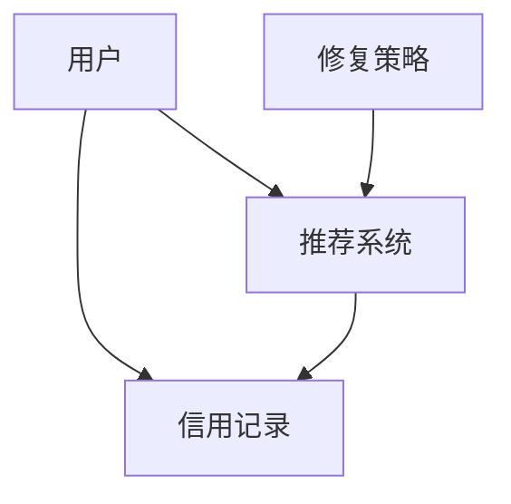
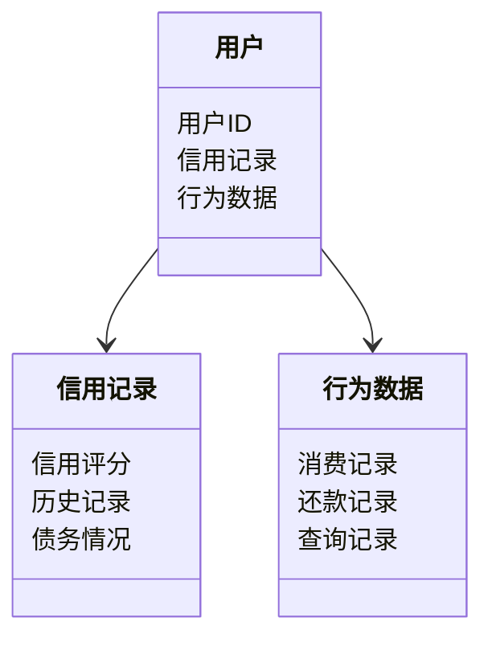
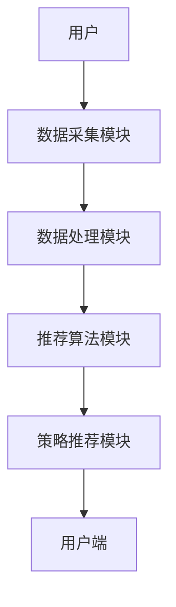
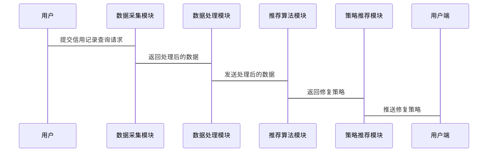

                 


# 构建智能化的个人信用修复策略推荐系统

## 关键词：
信用修复，推荐系统，人工智能，大数据，算法优化

## 摘要：
在现代社会中，个人信用修复的重要性日益凸显。然而，传统的信用修复方式效率低下，难以满足用户需求。本文将介绍如何利用人工智能和大数据技术，构建智能化的个人信用修复策略推荐系统。通过分析用户的信用状况和行为数据，结合推荐算法，为用户提供个性化的修复策略，帮助其快速恢复良好的信用记录。

---

# 第一部分: 背景介绍

## 第1章: 个人信用修复与推荐系统概述

### 1.1 信用修复的定义与重要性

#### 1.1.1 信用修复的定义
信用修复是指通过合法手段，纠正因个人或企业信用记录中的错误或不良信息，从而改善信用评分的过程。它旨在帮助用户重建信任，恢复良好的信用状态。

#### 1.1.2 信用修复的重要性
- 信用修复直接影响个人或企业的融资能力。
- 良好的信用记录是获得贷款、信用卡和其他金融服务的前提条件。
- 信用修复有助于个人或企业摆脱不良信用的影响，提升社会信任度。

#### 1.1.3 信用修复的法律与社会意义
- 信用修复是保护个人隐私和合法权益的重要手段。
- 在法律层面上，许多国家和地区都有明确的信用修复机制，以确保信用评分的公正性。

### 1.2 个人信用修复的现状与挑战

#### 1.2.1 当前信用修复的主要方式
- 通过正式渠道提交异议申请。
- 与相关机构协商，消除不良记录。
- 通过时间推移，自然改善信用评分。

#### 1.2.2 信用修复过程中的主要问题
- 修复过程复杂，耗时较长。
- 用户缺乏专业的指导，难以选择最优修复策略。
- 传统修复方式缺乏个性化，难以满足不同用户的需求。

#### 1.2.3 智能化信用修复的必要性
- 提高信用修复的效率和成功率。
- 为用户提供个性化的修复方案，降低修复成本。
- 帮助用户更好地理解信用修复的过程和方法。

### 1.3 信用修复推荐系统的背景与目标

#### 1.3.1 信用修复推荐系统的定义
信用修复推荐系统是一种基于人工智能和大数据技术，通过分析用户的信用记录和行为数据，为其推荐最优信用修复策略的系统。

#### 1.3.2 系统的目标与功能
- 目标：帮助用户快速、有效地修复信用记录。
- 功能：
  - 数据采集与分析：收集用户的信用数据和行为数据。
  - 策略推荐：基于数据分析结果，为用户推荐最优的修复策略。
  - 监测与反馈：实时监测信用修复进度，并根据反馈调整修复方案。

#### 1.3.3 系统的应用场景与用户群体
- 应用场景：个人信用修复、企业信用修复、信用评分优化等。
- 用户群体：有不良信用记录的个人或企业，需要改善信用评分的用户。

---

# 第二部分: 核心概念与联系

## 第3章: 核心概念原理

### 3.1 信用修复推荐系统的原理

#### 3.1.1 系统的基本原理
- 数据采集：收集用户的信用记录、消费行为、还款记录等数据。
- 数据分析：利用大数据技术对数据进行清洗、处理和分析。
- 策略推荐：基于分析结果，结合推荐算法，为用户推荐最优的信用修复策略。

#### 3.1.2 系统的工作流程
1. 数据采集：获取用户的信用记录和行为数据。
2. 数据处理：清洗数据，提取关键特征。
3. 算法分析：利用推荐算法生成修复策略。
4. 策略推荐：将修复策略推送至用户端。
5. 监测与反馈：实时监测修复进度，调整策略。

#### 3.1.3 系统的输入与输出
- 输入：用户的信用记录、消费数据、行为数据。
- 输出：个性化的信用修复策略、修复进度监测报告。

### 3.2 核心概念的属性特征对比

| 概念 | 定义 | 特征 | 优势 | 局限性 |
|------|------|------|------|--------|
| 信用修复 | 改善信用记录 | 针对性、个性化、实时性 | 提高效率、降低成本 | 依赖数据质量、算法复杂 |
| 推荐系统 | 基于数据推荐方案 | 数据驱动、智能化、动态调整 | 提高用户满意度 | 需要大量数据支持 |

### 3.3 ER实体关系图



---

# 第三部分: 算法原理讲解

## 第4章: 推荐算法原理

### 4.1 协同过滤算法

#### 4.1.1 协同过滤的定义
协同过滤是一种基于用户相似性或物品相似性的推荐算法。它通过分析用户的行为数据，找到与目标用户行为相似的其他用户，推荐这些用户喜欢的物品。

#### 4.1.2 基于用户的协同过滤
- 步骤：
  1. 找出与目标用户行为相似的其他用户。
  2. 推荐这些用户喜欢的物品给目标用户。
- 优点：推荐结果具有较高的个性化。
- 缺点：计算复杂度较高。

#### 4.1.3 基于物品的协同过滤
- 步骤：
  1. 找出与目标用户感兴趣物品相似的其他物品。
  2. 推荐这些相似物品给目标用户。
- 优点：计算复杂度较低。
- 缺点：推荐结果可能缺乏个性化。

### 4.2 基于内容的推荐算法

#### 4.2.1 基于内容的推荐定义
基于内容的推荐算法是通过分析物品的属性特征，为用户推荐与其兴趣相符的物品。

#### 4.2.2 基于内容的推荐实现
- 步骤：
  1. 提取物品的特征向量。
  2. 计算目标用户与物品的相似度。
  3. 推荐相似度最高的物品给用户。

#### 4.2.3 基于内容的推荐优缺点
- 优点：推荐结果具有较高的准确性。
- 缺点：需要大量的特征提取和计算。

---

## 第5章: 算法实现与优化

### 5.1 协同过滤算法的实现

```python
def collaborative_filtering(user_matrix):
    # 计算用户相似度矩阵
    similarity_matrix = user_matrix.T.dot(user_matrix)
    # 去除对角线上的1
    similarity_matrix = similarity_matrix - np.identity(similarity_matrix.shape[0])
    # 返回相似度最高的用户
    return similarity_matrix.argmax(axis=1)
```

### 5.2 基于内容的推荐算法实现

```python
def content_based_recommendation(item_features):
    # 计算物品的相似度矩阵
    similarity_matrix = item_features.T.dot(item_features)
    # 返回相似度最高的物品
    return similarity_matrix.argmax(axis=1)
```

---

# 第四部分: 系统分析与架构设计方案

## 第6章: 系统设计与架构

### 6.1 系统需求分析

#### 6.1.1 功能需求
- 数据采集：收集用户的信用记录和行为数据。
- 数据处理：清洗数据，提取关键特征。
- 算法分析：利用推荐算法生成修复策略。
- 策略推荐：将修复策略推送至用户端。
- 监测与反馈：实时监测修复进度，调整策略。

#### 6.1.2 性能需求
- 响应时间：系统应在合理时间内完成数据处理和推荐过程。
- 可扩展性：系统应支持大量用户的接入。

### 6.2 领域模型设计



### 6.3 系统架构设计



### 6.4 系统接口设计

- 数据采集模块接口：
  - 输入：用户ID
  - 输出：用户的信用记录和行为数据
- 数据处理模块接口：
  - 输入：原始数据
  - 输出：处理后的数据
- 推荐算法模块接口：
  - 输入：处理后的数据
  - 输出：修复策略
- 策略推荐模块接口：
  - 输入：修复策略
  - 输出：推荐结果

### 6.5 系统交互流程



---

# 第五部分: 项目实战

## 第7章: 项目实现

### 7.1 环境搭建与数据准备

#### 7.1.1 环境搭建
- 安装Python、Pandas、Scikit-learn等库。
- 安装推荐算法库（如 Surprise）。

#### 7.1.2 数据准备
- 数据来源：公开信用数据集、模拟数据。
- 数据格式：结构化数据，包括用户ID、信用评分、消费记录等。

### 7.2 系统核心实现

#### 7.2.1 数据采集模块实现
```python
import pandas as pd

def load_data():
    # 加载信用数据
    credit_data = pd.read_csv('credit.csv')
    return credit_data
```

#### 7.2.2 数据处理模块实现
```python
from sklearn.preprocessing import StandardScaler

def preprocess_data(data):
    # 数据清洗
    data_clean = data.dropna()
    # 标准化处理
    scaler = StandardScaler()
    processed_data = scaler.fit_transform(data_clean)
    return processed_data
```

#### 7.2.3 推荐算法实现
```python
from surprise import SVD

def collaborative_filtering(processed_data):
    # 初始化SVD模型
    model = SVD()
    # 训练模型
    model.fit(processed_data)
    return model
```

### 7.3 代码解读与分析

#### 7.3.1 数据采集模块
- 功能：加载信用数据。
- 输入：文件路径。
- 输出：处理后的数据。

#### 7.3.2 数据处理模块
- 功能：清洗数据，标准化处理。
- 输入：原始数据。
- 输出：标准化后的数据。

#### 7.3.3 推荐算法模块
- 功能：基于协同过滤算法生成修复策略。
- 输入：处理后的数据。
- 输出：推荐结果。

### 7.4 实际案例分析

#### 7.4.1 案例背景
- 用户A：信用评分为600，有逾期还款记录。
- 目标：修复信用评分至700以上。

#### 7.4.2 系统推荐策略
1. 提供还款计划建议，帮助用户按时还款。
2. 建议用户减少高风险消费行为。
3. 监测修复进度，动态调整修复策略。

#### 7.4.3 修复过程分析
- 通过系统推荐，用户按时还款，信用评分逐步提升。
- 修复过程中，系统实时监测修复进度，动态调整修复策略。

### 7.5 项目小结

---

# 第六部分: 最佳实践

## 第8章: 最佳实践与注意事项

### 8.1 系统优化建议
- 数据层面：
  - 增加数据维度，提升推荐精度。
  - 定期更新数据，保持推荐结果的准确性。
- 算法层面：
  - 结合多种推荐算法，提升推荐效果。
  - 定期优化算法参数，提升推荐效率。

### 8.2 系统维护与更新
- 数据维护：
  - 定期更新用户数据，保持数据的实时性。
  - 清洗无效数据，提升系统运行效率。
- 算法维护：
  - 定期更新推荐算法，提升推荐效果。
  - 监测算法性能，及时调整参数。

### 8.3 使用注意事项
- 用户隐私保护：
  - 确保用户数据的安全性，防止数据泄露。
  - 遵守相关法律法规，保护用户隐私。
- 系统稳定性：
  - 定期监测系统运行状态，及时发现并解决问题。
  - 制定应急方案，确保系统稳定运行。

## 第9章: 总结与展望

### 9.1 小结
本文详细介绍了如何构建智能化的个人信用修复策略推荐系统，从背景介绍到算法实现，再到项目实战，全面阐述了系统的构建过程。通过系统的构建，用户可以快速、有效地修复信用记录，提升信用评分。

### 9.2 展望
未来，随着人工智能和大数据技术的不断发展，信用修复推荐系统将更加智能化、个性化。推荐算法将更加精准，系统将更加高效。信用修复推荐系统将在更多领域得到应用，为用户提供更优质的服务。

---

## 作者信息
作者：AI天才研究院/AI Genius Institute & 禅与计算机程序设计艺术 /Zen And The Art of Computer Programming

