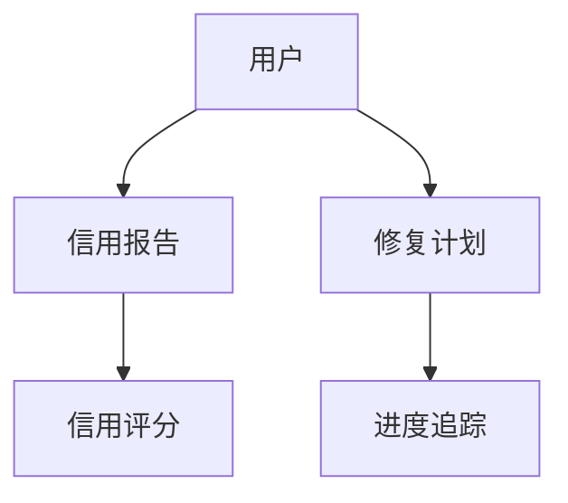
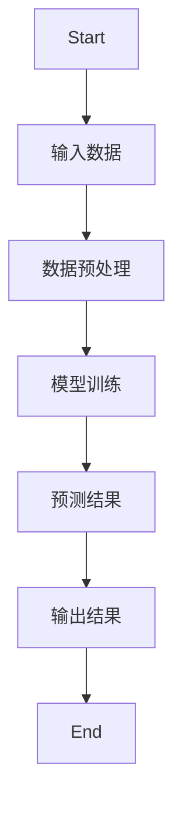
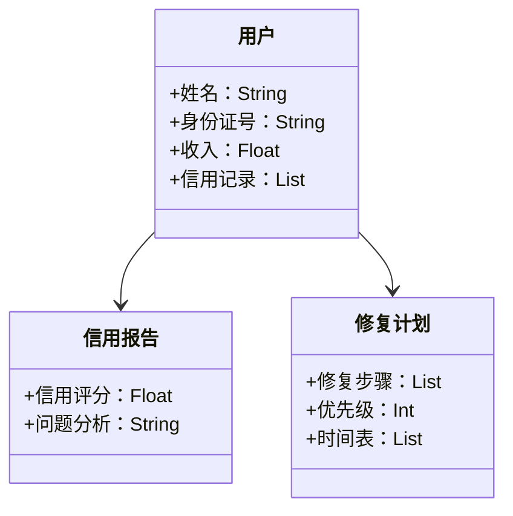
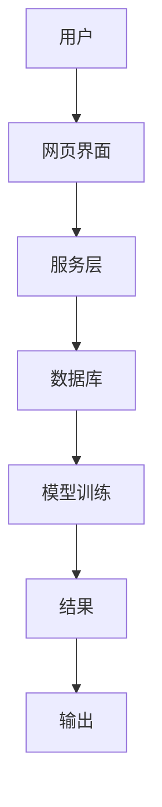
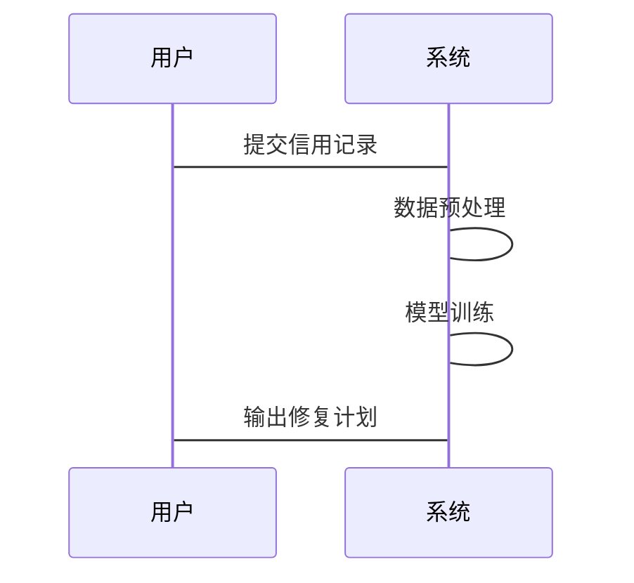

                 


# 构建智能化的个人信用修复路径规划系统

## 关键词：个人信用修复、路径规划、智能化系统、算法实现、系统架构设计

## 摘要：
本文旨在构建一个智能化的个人信用修复路径规划系统，通过详细分析信用修复的背景、核心概念、算法原理、系统架构设计以及项目实战，为读者提供从理论到实践的全面指导。系统采用多种算法和数学模型，结合实际案例分析，帮助个人制定最优信用修复策略。

---

# 第一部分: 背景介绍与核心概念

# 第1章: 个人信用修复路径规划系统概述

## 1.1 个人信用修复的定义与背景
### 1.1.1 信用修复的定义
信用修复是指通过合法手段，改善个人信用记录，提高信用评分，以获得更好的金融服务和信用机会的过程。

### 1.1.2 个人信用修复的背景与现状
随着信用评分在金融领域的广泛应用，个人信用问题日益重要。然而，许多人并不清楚如何有效修复信用记录，导致信用评分长期低下。本文提出智能化的信用修复路径规划系统，帮助用户制定个性化修复策略。

### 1.1.3 信用修复的重要性与必要性
信用评分影响贷款申请、信用卡额度、就业机会等多方面。修复信用记录不仅可以提高信用评分，还能帮助个人重新获得金融机构的信任。

## 1.2 信用修复路径规划系统的核心目标
### 1.2.1 系统的目标与功能
- 提供个性化的信用修复建议
- 分析信用记录中的问题点
- 制定修复优先级和时间表
- 监测修复进度并调整策略

### 1.2.2 系统的核心价值与意义
通过智能化算法，系统能够快速分析信用数据，提供最优修复路径，帮助用户高效改善信用状况。

### 1.2.3 系统的边界与外延
- 系统仅处理个人信用修复，不涉及企业信用
- 数据来源包括个人信用报告、银行流水等
- 系统不直接修改信用记录，仅提供修复建议

## 1.3 系统的核心要素与组成结构
### 1.3.1 核心要素的定义与特征
- 用户信息：包括姓名、身份证号、收入等
- 信用记录：包括贷款记录、信用卡使用记录等
- 信用评分：基于信用记录计算得出
- 修复计划：系统推荐的修复步骤和时间安排

### 1.3.2 核心要素之间的关系
- 用户信息用于生成信用报告
- 信用报告用于计算信用评分
- 信用评分影响修复计划的制定
- 修复计划指导用户进行信用修复

### 1.3.3 系统的组成结构与功能模块
- 用户输入模块：收集用户信息和信用记录
- 数据处理模块：预处理和分析数据
- 算法计算模块：生成信用评分和修复计划
- 输出模块：展示修复计划和进度

---

# 第2章: 核心概念与联系

## 2.1 核心概念的原理与特点
### 2.1.1 信用评估模型的原理
信用评分模型基于统计学和机器学习算法，通过分析用户的历史行为和当前状态，预测用户的信用风险。

### 2.1.2 信用修复路径规划的算法特点
- 基于信用评分的优化算法
- 考虑修复成本和时间的动态规划
- 结合用户偏好和限制条件的多目标优化

### 2.1.3 智能化系统的实现方式
- 数据挖掘技术
- 机器学习算法
- 大数据分析

## 2.2 核心概念的对比分析
### 2.2.1 不同信用评估模型的对比
- 线性回归模型：简单易懂，但效果有限
- 决策树模型：适用于非线性关系，分类能力强
- 支持向量机模型：适合小样本数据，分类精度高

### 2.2.2 信用修复路径规划算法的优劣势
- 优点：优化修复路径，提高效率
- 缺点：依赖于数据质量和模型准确性

### 2.2.3 智能化系统与其他传统系统的区别
- 传统系统：基于规则的修复建议
- 智能化系统：基于算法的个性化修复策略

## 2.3 实体关系图（ER图）


---

# 第3章: 算法原理与数学模型

## 3.1 算法原理
### 3.1.1 信用评估模型的构建
- 数据预处理：清洗和转换数据
- 特征选择：筛选重要特征
- 模型训练：使用机器学习算法训练模型
- 模型评估：验证模型的准确性和稳定性

### 3.1.2 信用修复路径规划的算法选择
- 算法选择：基于修复成本和时间的动态规划
- 算法优化：结合用户偏好和限制条件的多目标优化

## 3.2 算法流程图


## 3.3 数学模型与公式
### 3.3.1 信用评分模型
$$ \text{信用评分} = \alpha \times \text{收入} + \beta \times \text{信用历史} + \gamma \times \text{债务情况} $$

### 3.3.2 修复路径规划模型
$$ \text{修复优先级} = \sum_{i=1}^{n} w_i \times x_i $$
其中，$w_i$ 是修复项的权重，$x_i$ 是修复项的特征值。

---

# 第4章: 系统分析与架构设计

## 4.1 系统分析
### 4.1.1 问题场景介绍
- 用户输入个人信息和信用记录
- 系统分析数据，生成信用评分
- 系统推荐修复计划，用户执行并反馈进度

### 4.1.2 项目介绍
- 项目目标：构建智能化的信用修复路径规划系统
- 项目范围：个人信用修复
- 项目约束：数据隐私和法律法规

## 4.2 系统功能设计
### 4.2.1 领域模型


### 4.2.2 系统架构设计


## 4.3 系统接口设计
- 用户输入接口：收集用户信息和信用记录
- 数据处理接口：预处理和分析数据
- 算法调用接口：训练模型并生成修复计划
- 结果输出接口：展示修复计划和进度

## 4.4 系统交互设计


---

# 第5章: 项目实战

## 5.1 环境安装
- 安装Python和必要的库（如Pandas、Scikit-learn）
- 安装Jupyter Notebook用于开发和测试

## 5.2 系统核心实现
```python
import pandas as pd
from sklearn.tree import DecisionTreeClassifier

# 数据加载
data = pd.read_csv('credit_data.csv')

# 特征选择
features = ['收入', '信用历史', '债务情况']
target = '信用评分'

# 模型训练
model = DecisionTreeClassifier()
model.fit(data[features], data[target])

# 预测结果
predictions = model.predict(data[features])
```

## 5.3 代码解读与分析
- 数据加载：读取信用数据
- 特征选择：筛选重要特征
- 模型训练：训练决策树模型
- 预测结果：生成信用评分

## 5.4 实际案例分析
- 用户A：信用评分低，但收入高
- 用户B：信用评分低，但债务少
- 系统推荐不同的修复策略

## 5.5 项目小结
- 项目实现信用评分模型和修复计划推荐
- 系统具有较高的准确性和实用性

---

# 第6章: 最佳实践与注意事项

## 6.1 最佳实践
- 定期检查信用记录
- 按照系统推荐的计划执行
- 避免逾期还款

## 6.2 小结
智能化的个人信用修复路径规划系统通过算法和数学模型，帮助用户高效改善信用状况。

## 6.3 注意事项
- 数据隐私保护
- 系统依赖的数据质量和准确性
- 遵守相关法律法规

---

# 作者：AI天才研究院 & 禅与计算机程序设计艺术

