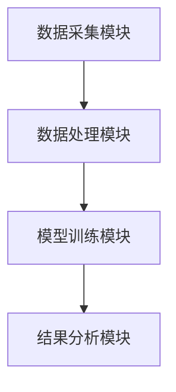

                 


# 构建智能化的个人信用分数影响因子分析器

---

## 关键词：个人信用评分、影响因子分析、机器学习、数据分析、信用风险评估

---

## 摘要：  
本文详细探讨了如何利用数据分析和机器学习技术构建智能化的个人信用分数影响因子分析器。文章从信用评分的核心概念出发，逐步分析影响因子的分类与特征，深入讲解相关算法的原理与实现，最后通过实际案例展示系统的构建与应用。通过本文，读者可以全面理解个人信用评分的影响因素，并掌握如何利用技术手段进行智能化分析。

---

# 第一部分: 个人信用分数影响因子分析器的背景与核心概念

---

## 第1章: 个人信用分数与影响因子概述

### 1.1 个人信用评分的重要性

#### 1.1.1 信用评分的定义与作用  
信用评分是衡量个人信用状况的重要指标，广泛应用于金融、信贷等领域。它是基于个人的历史行为、财务状况等信息，通过模型计算得出的分数，反映了个人的信用风险。

#### 1.1.2 信用评分在金融领域的应用  
信用评分在银行贷款审批、信用卡额度确定、个人信贷风险评估等方面具有重要作用。高信用评分意味着较低的违约风险，反之则可能面临更高的利率或被拒绝贷款。

#### 1.1.3 智能化信用评分分析的必要性  
随着数据的爆炸式增长和人工智能技术的快速发展，传统的信用评分模型逐渐暴露出局限性。智能化的信用评分分析器能够更好地捕捉非线性关系，挖掘隐含的影响因子，从而提升评分的准确性。

---

### 1.2 个人信用分数影响因子分析的背景

#### 1.2.1 信用评分分析的现状  
传统的信用评分模型主要依赖于少量的直接财务指标，忽略了行为数据、社交数据等间接因素。随着数据获取能力的提升，越来越多的非传统因子被引入信用评分分析。

#### 1.2.2 数据驱动决策的兴起  
大数据技术的发展使得金融机构能够收集和分析海量数据，为信用评分分析提供了更多的可能性。数据驱动决策逐渐成为信用评分领域的重要趋势。

#### 1.2.3 人工智能在信用评分中的应用  
机器学习算法（如随机森林、XGBoost）在信用评分中的应用越来越广泛。这些算法能够自动提取特征，发现传统模型难以捕捉的复杂关系。

---

## 第2章: 个人信用影响因子的分类与特征

### 2.1 信用影响因子的分类

#### 2.1.1 基本信息类因子  
包括年龄、性别、职业、收入等基本信息。这些因子反映了个人的基本信用资质。

#### 2.1.2 财务状况类因子  
包括信用卡使用情况、贷款还款记录、资产负债情况等。这些因子直接反映了个人的财务健康状况。

#### 2.1.3 行为记录类因子  
包括消费行为、还款行为、社交行为等。这些因子反映了个人的信用行为模式。

#### 2.1.4 其他辅助类因子  
包括芝麻信用评分、社交网络影响力等其他辅助性指标。

---

### 2.2 各类因子的特征对比

#### 2.2.1 因子特征对比表格  
| 类别             | 特征描述                     | 示例                         |
|------------------|----------------------------|------------------------------|
| 基本信息类因子   | 年龄、性别、职业            | 年龄：25-60岁；性别：男/女  |
| 财务状况类因子   | 信用卡额度、贷款记录        | 信用卡额度：$0-$10,000       |
| 行为记录类因子   | 还款准时性、消费习惯         | 还款准时性：按时还款率90%     |
| 其他辅助类因子   | 社交影响力、芝麻信用评分     | 芝麻信用评分：350-850         |

#### 2.2.2 因子特征的属性分析  
- **可量化性**：大部分因子都可以通过数据量化，如收入、消费金额等。
- **相关性**：不同因子之间可能存在高度相关性，如收入与消费能力密切相关。
- **时序性**：行为记录类因子具有明显的时序性特征。

#### 2.2.3 因子特征的权重分配  
在实际分析中，不同因子对信用评分的影响权重不同。例如，还款记录通常比年龄对信用评分的影响更大。

---

### 2.3 个人信用影响因子的ER实体关系图

```mermaid
erd
actor CreditScoreAnalyzer;
database CreditDB;
schema CreditSchema;

entity PersonalInfo {
    key: PersonID (Integer,PK)
    fields: Name (String), Age (Integer), Gender (String), Occupation (String)
}

entity FinancialData {
    key: FinancialID (Integer,PK)
    fields: CreditCardLimit (Integer), LoanHistory (String), AssetValue (Integer)
}

entity BehaviorRecord {
    key: BehaviorID (Integer,PK)
    fields: RepaymentHistory (String), ConsumptionPattern (String), SocialNetworkSize (Integer)
}

PersonalInfo -[1..n] -> BehaviorRecord: "关联行为记录"
PersonalInfo -[1..n] -> FinancialData: "关联财务数据"
```

---

# 第二部分: 个人信用分数影响因子分析的算法原理

---

## 第3章: 信用影响因子分析的算法基础

### 3.1 线性回归模型

#### 3.1.1 线性回归的定义与原理  
线性回归是一种经典的统计学习方法，用于预测连续型变量。其基本假设是因变量与自变量之间存在线性关系。

#### 3.1.2 线性回归的数学模型  
$$ y = \beta_0 + \beta_1x_1 + \beta_2x_2 + ... + \beta_nx_n $$  
其中，$y$ 是信用评分，$x_i$ 是各个影响因子，$\beta_i$ 是对应因子的系数。

#### 3.1.3 线性回归的优缺点  
优点：简单易懂，计算效率高。缺点：只能处理线性关系，无法捕捉复杂特征。

---

### 3.2 逻辑回归模型

#### 3.2.1 逻辑回归的定义与原理  
逻辑回归用于分类问题，适用于二分类场景，如判断个人是否违约。

#### 3.2.2 逻辑回归的数学模型  
$$ P(y=1|x) = \frac{1}{1 + e^{-(\beta_0 + \beta_1x_1 + ... + \beta_nx_n)}} $$  

#### 3.2.3 逻辑回归的优缺点  
优点：适合二分类问题，输出概率形式。缺点：只能处理线性可分问题。

---

### 3.3 随机森林算法

#### 3.3.1 随机森林的定义与原理  
随机森林是一种基于决策树的集成学习算法，通过随机采样和特征选择来降低模型过拟合的风险。

#### 3.3.2 随机森林的数学模型  
随机森林由多个决策树组成，最终结果是各树投票决定。

#### 3.3.3 随机森林的优缺点  
优点：能够处理非线性关系，鲁棒性强。缺点：计算复杂度较高。

---

### 3.4 XGBoost算法

#### 3.4.1 XGBoost的定义与原理  
XGBoost是基于梯度提升树的算法，通过正则化和剪枝优化模型性能。

#### 3.4.2 XGBoost的数学模型  
$$ \text{损失函数} = \sum_{i=1}^n (y_i - \hat{y}_i)^2 $$  
其中，$\hat{y}_i$ 是模型预测值，$y_i$ 是真实值。

#### 3.4.3 XGBoost的优缺点  
优点：性能优越，支持并行计算。缺点：参数调优复杂。

---

## 第4章: 信用影响因子分析的算法实现

### 4.1 环境安装与配置

#### 4.1.1 Python环境安装  
```bash
python --version
pip install numpy pandas scikit-learn xgboost
```

#### 4.1.2 数据集准备  
下载公开信用评分数据集（如Kaggle上的个人信用评分数据）。

---

### 4.2 核心代码实现

#### 4.2.1 数据预处理  
```python
import pandas as pd
import numpy as np

# 加载数据
data = pd.read_csv('credit_score.csv')

# 处理缺失值
data = data.dropna()

# 标签编码
from sklearn.preprocessing import LabelEncoder

le = LabelEncoder()
data['Gender'] = le.fit_transform(data['Gender'])
```

#### 4.2.2 特征选择  
```python
from sklearn.feature_selection import SelectKBest, chi2

selector = SelectKBest(score_func=chi2, k=10)
selected_features = selector.fit_transform(data.drop('CreditScore', axis=1), data['CreditScore'])
```

#### 4.2.3 模型训练与评估  
```python
from sklearn.model_selection import train_test_split
from sklearn.metrics import accuracy_score

X_train, X_test, y_train, y_test = train_test_split(selected_features, data['CreditScore'], test_size=0.2)

# 使用XGBoost模型
import xgboost as xgb

model = xgb.XGBRegressor(n_estimators=100, learning_rate=0.1, max_depth=6)
model.fit(X_train, y_train)

# 预测与评估
y_pred = model.predict(X_test)
print("模型准确率:", accuracy_score(y_test, y_pred))
```

---

## 第5章: 项目实战——构建智能化的个人信用分数影响因子分析器

### 5.1 系统功能设计

#### 5.1.1 数据采集模块  
从数据库或文件中读取信用评分数据。

#### 5.1.2 数据处理模块  
对数据进行清洗、特征提取和标准化处理。

#### 5.1.3 模型训练模块  
使用随机森林或XGBoost算法训练信用评分预测模型。

#### 5.1.4 结果分析模块  
输出各个影响因子的权重，分析各因子对信用评分的影响程度。

---

### 5.2 系统架构设计



---

## 第6章: 总结与展望

### 6.1 本章小结  
本文详细介绍了如何构建智能化的个人信用分数影响因子分析器，涵盖了从背景分析到算法实现的全过程。

### 6.2 最佳实践 Tips  
- 数据预处理是关键，需仔细清洗和特征选择。
- 算法选择需结合实际场景，非线性问题优先考虑随机森林或XGBoost。
- 模型调优和验证是提升准确率的重要环节。

### 6.3 未来展望  
随着AI技术的进步，信用评分分析将更加智能化和个性化，实时评分和动态调整将成为可能。

---

## 作者：AI天才研究院/AI Genius Institute & 禅与计算机程序设计艺术 /Zen And The Art of Computer Programming

