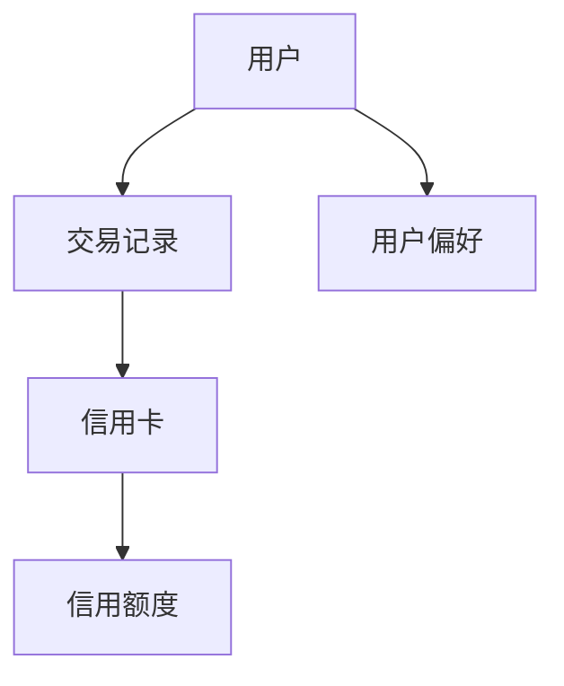
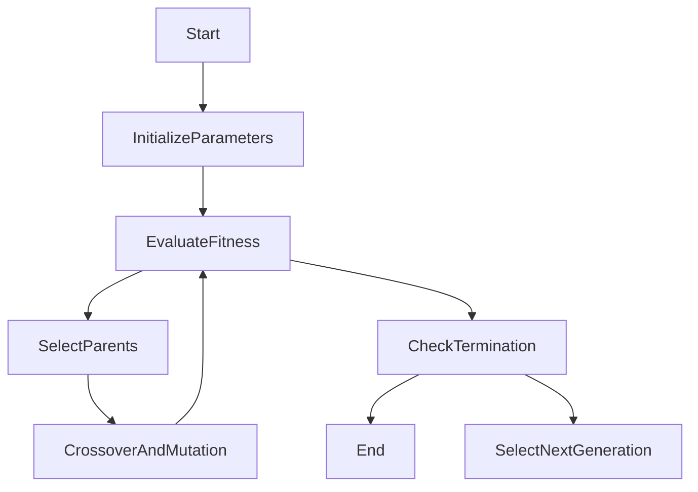
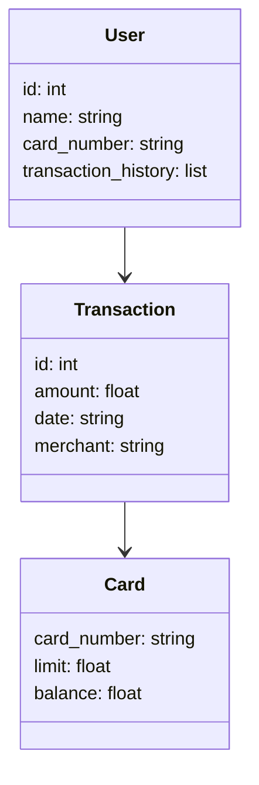
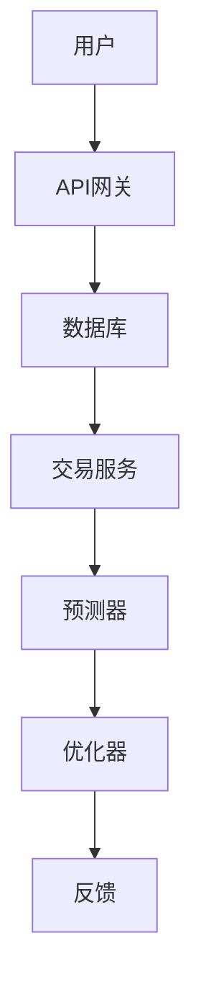

                 


# 构建智能化的个人信用卡使用行为优化助手

## 关键词
智能化、信用卡、行为优化、机器学习、数据隐私

## 摘要
随着信用卡的普及，个人财务管理变得越来越复杂。本文章介绍了如何构建一个智能化的个人信用卡使用行为优化助手，帮助用户减少超支、优化消费结构、降低利息支出，并实现财务目标。文章详细探讨了优化助手的核心算法原理、系统架构设计、项目实现及实际案例，为读者提供了一套完整的解决方案。

---

## 第一部分: 背景介绍与问题分析

### 第1章: 背景介绍与问题分析

#### 1.1 问题背景
- **问题背景**: 随着信用卡的普及，越来越多的人开始依赖信用卡进行日常消费，但由于缺乏有效的管理，许多人陷入了超支和高利息债务的困境。  
- **概念定义**: 信用卡使用行为优化助手是一种基于人工智能的工具，旨在通过分析用户的信用卡交易数据，提供个性化的消费建议和行为优化方案。  
- **解决方法**: 利用机器学习算法分析用户的消费数据，预测未来的消费行为，并提出优化建议，帮助用户避免超支和优化还款计划。  
- **边界与外延**: 本工具仅针对个人信用卡使用行为的优化，不涉及其他类型的金融产品，且不处理用户的隐私数据。

---

## 第二部分: 核心概念与联系

### 第2章: 核心概念与联系

#### 2.1 核心概念原理
- **数据采集与分析**: 通过API接口获取用户的信用卡交易数据，包括消费金额、时间、地点、商户类型等信息。  
- **机器学习模型**: 使用监督学习算法（如随机森林、XGBoost）对用户的行为进行分类和预测。  
- **规则引擎与决策树**: 基于用户的历史行为数据，构建规则引擎，制定消费限额和优先还款规则。

#### 2.2 核心概念属性特征对比表
| 概念       | 数据来源   | 数据格式   | 数据频率   |
|------------|------------|------------|------------|
| 交易记录   | 银行API     | 结构化数据  | 每天更新   |
| 消费行为   | 用户输入    | 非结构化数据| 每周更新   |
| 信用额度   | 银行系统    | 结构化数据  | 每月更新   |

#### 2.3 ER实体关系图


---

## 第三部分: 算法原理讲解

### 第3章: 算法原理讲解

#### 3.1 优化算法
- **遗传算法**: 通过模拟自然选择的过程，逐步优化消费行为的决策树。  
- **模拟退火**: 通过随机扰动和全局搜索，找到最优的消费计划。  
- **数学模型**:  
  - 目标函数：最小化超支次数和利息支出。  
  $$ \text{目标函数} = \min \left( \sum_{i=1}^{n} (消费_i - 收入_i) \times 利率 \right) $$  
  - 约束条件：  
  $$ \sum_{i=1}^{n} 消费_i \leq 信用额度 $$  

#### 3.2 算法流程图


---

## 第四部分: 系统分析与架构设计

### 第4章: 系统分析与架构设计

#### 4.1 系统分析
- **问题场景**: 用户通过信用卡进行日常消费，但由于缺乏有效的管理，导致超支和高利息支出。  
- **项目介绍**: 构建一个基于机器学习的信用卡使用行为优化助手，帮助用户优化消费行为。

#### 4.2 系统功能设计
- **领域模型**:  


- **系统架构设计**:  


---

## 第五部分: 项目实战

### 第5章: 项目实战

#### 5.1 环境安装
- **技术选型**:  
  - 前端: React  
  - 后端: Python（Django框架）  
  - 数据库: PostgreSQL  
  - 机器学习: Scikit-learn  

#### 5.2 核心代码实现
- **数据处理代码**:  
```python
import pandas as pd
from sklearn.ensemble import RandomForestClassifier

# 加载数据
data = pd.read_csv('transactions.csv')

# 数据预处理
data.dropna(inplace=True)
data['is_over_limit'] = data['amount'].apply(lambda x: 1 if x > data['limit'].mean() else 0)

# 模型训练
model = RandomForestClassifier()
model.fit(data[['amount', 'merchant_type']], data['is_over_limit'])
```

- **优化策略生成代码**:  
```python
def generate_optimization_strategy(transactions, limit):
    # 计算超支次数
    over_limit_count = sum(1 for t in transactions if t['amount'] > limit)
    # 生成优化策略
    strategy = {
        'daily_limit': limit / 2,
        'priority_repayment': 'high_interest'
    }
    return strategy
```

#### 5.3 项目小结
- **实现细节**: 通过机器学习模型预测用户的超支行为，并生成个性化的优化策略。  
- **案例分析**: 通过一个实际案例，展示优化助手如何帮助用户减少超支并优化还款计划。  

---

## 第六部分: 总结与展望

### 第6章: 总结与展望

#### 6.1 最佳实践
- **数据隐私**: 确保用户的交易数据不会被泄露。  
- **模型迭代**: 定期更新机器学习模型，以适应用户的消费行为变化。  

#### 6.2 项目总结
- **成功经验**: 成功构建了一个基于机器学习的信用卡使用行为优化助手，帮助用户优化消费行为。  
- **挑战与不足**: 数据获取难度较大，用户隐私保护需要加强。  

#### 6.3 未来展望
- **技术创新**: 探索更先进的机器学习算法，提高优化助手的智能化水平。  
- **应用场景**: 将优化助手推广到更多的金融领域，帮助用户实现更高效的财务管理。

---

## 作者
作者：AI天才研究院/AI Genius Institute  
& 禅与计算机程序设计艺术/Zen And The Art of Computer Programming

