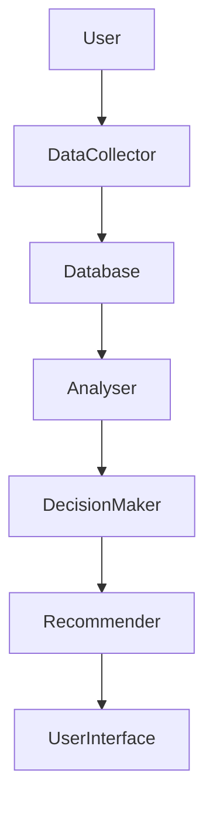

                 


# 《构建智能化的个人信用卡管理助手》

> 关键词：智能化、信用卡管理、机器学习、自然语言处理、系统架构

> 摘要：本文详细探讨了构建智能化个人信用卡管理助手的背景、核心技术、系统架构及实现方案。通过分析智能化管理的核心概念、算法原理和系统设计，结合实际应用场景，提出了基于机器学习和自然语言处理的解决方案，为读者提供了一个全面的技术实现框架。

---

## 第一部分：智能化个人信用卡管理助手的背景与需求

### 第1章：个人信用卡管理的智能化需求

#### 1.1 信用卡管理的现状与挑战

传统的信用卡管理方式存在诸多痛点。首先，用户通常需要在多个平台之间手动记录和同步交易信息，效率低下。其次，面对海量的交易数据，用户难以快速识别异常交易或优化消费习惯。最后，传统管理方式缺乏智能化的提醒和建议，用户难以充分利用信用卡的优惠和权益。

#### 1.2 智能化管理的核心概念

智能化个人信用卡管理助手通过整合机器学习和自然语言处理技术，帮助用户实现交易数据的自动采集、智能分析和决策支持。其核心功能包括：

1. **数据采集与整理**：自动从银行系统获取交易数据，整理并分类。
2. **智能分析与提醒**：通过算法识别异常交易、预测消费趋势，并提供优化建议。
3. **交互设计与用户体验**：通过友好的用户界面和自然语言交互，提升用户体验。

#### 1.3 智能化管理的实现路径

智能化管理的实现路径主要包括数据采集与处理、智能分析与决策，以及交互设计与用户体验优化。通过这些步骤，用户能够实现信用卡管理的自动化和智能化。

---

## 第二部分：智能化管理的核心技术与算法原理

### 第2章：智能化管理的核心概念与联系

#### 2.1 核心概念原理

智能化个人信用卡管理助手的核心原理在于数据驱动和人工智能技术的应用。通过收集和分析用户的交易数据，利用机器学习算法进行分类、聚类和预测，从而实现智能决策。

#### 2.2 核心概念属性特征对比

以下是传统管理与智能化管理在核心概念上的对比：

| **对比维度** | **传统管理** | **智能化管理** |
|--------------|--------------|----------------|
| 数据采集     | 手动记录     | 自动采集       |
| 数据分析     | 简单统计     | 智能分析       |
| 决策支持     | 无           | 基于算法推荐   |

#### 2.3 ER实体关系图

以下是系统的ER实体关系图：

```mermaid
erDiagram
    user {
        User
        CreditCard
        Transaction
    }
    User -> CreditCard: owns
    CreditCard -> Transaction: has
    Transaction -> User: belongsTo
```

---

### 第3章：智能化管理的算法原理

#### 3.1 基于机器学习的信用卡管理算法

**分类算法在信用评估中的应用**：

分类算法可以用于识别用户的信用风险。例如，使用逻辑回归模型对用户的交易数据进行分类，预测其信用风险。

**数学模型**：

$$ P(y|x) = \frac{P(x|y)P(y)}{P(x)} $$

其中，$P(y|x)$ 是后验概率，$P(x|y)$ 是似然概率，$P(y)$ 是先验概率，$P(x)$ 是边缘概率。

**聚类算法在交易行为分析中的应用**：

聚类算法可以用于识别用户的交易模式。例如，使用K-means算法将用户的交易数据分为不同的类别，识别异常交易。

**数学公式**：

$$ d(x, y) = \sqrt{(x_1 - y_1)^2 + (x_2 - y_2)^2} $$

其中，$d(x, y)$ 是两个点之间的距离。

**回归算法在信用额度预测中的应用**：

回归算法可以用于预测用户的信用额度。例如，使用线性回归模型，根据用户的交易数据预测其信用额度。

**数学公式**：

$$ y = \beta_0 + \beta_1x + \epsilon $$

其中，$y$ 是预测值，$\beta_0$ 是截距，$\beta_1$ 是回归系数，$x$ 是自变量，$\epsilon$ 是误差项。

#### 3.2 自然语言处理在信用卡管理中的应用

**情感分析在客户反馈处理中的应用**：

通过情感分析技术，可以识别客户反馈中的情感倾向，帮助银行更好地理解客户需求。

**实体识别在交易信息提取中的应用**：

实体识别可以用于从文本中提取交易信息，例如交易金额、交易时间等。

**语义理解在用户需求分析中的应用**：

语义理解技术可以帮助系统理解用户的意图，例如识别用户的需求是查询交易记录还是优化消费习惯。

---

## 第三部分：智能化管理系统的架构与设计

### 第4章：智能化管理系统架构设计

#### 4.1 系统功能设计

**数据采集模块**：负责从银行系统获取交易数据，整理并分类。

**数据分析模块**：对交易数据进行分析，识别异常交易和消费趋势。

**智能决策模块**：根据分析结果，提供优化建议和决策支持。

**用户交互模块**：通过友好的用户界面和自然语言交互，提升用户体验。

#### 4.2 系统架构设计

系统的架构设计采用微服务架构，各个模块独立运行，通过API进行通信。

**系统架构图**：



#### 4.3 系统接口设计

**数据接口设计**：定义数据采集模块与银行系统的接口，确保数据的准确传输。

**用户接口设计**：设计友好的用户界面，包括交易记录、消费分析、优化建议等功能。

**第三方服务接口设计**：与银行系统、支付平台等第三方服务进行接口对接，确保数据的实时性和准确性。

#### 4.4 系统交互设计

**用户与系统的交互流程**：

1. 用户登录系统，进入交易记录页面。
2. 系统自动展示最近的交易记录。
3. 用户可以通过搜索或筛选功能，查看特定的交易记录。
4. 系统根据用户的交易数据，提供消费趋势分析和优化建议。

**系统内部模块的交互流程**：

1. 数据采集模块从银行系统获取交易数据。
2. 数据分析模块对交易数据进行分析，识别异常交易。
3. 智能决策模块根据分析结果，生成优化建议。
4. 用户交互模块将优化建议展示给用户。

---

## 结语

通过本文的详细探讨，我们了解了构建智能化个人信用卡管理助手的背景、核心技术、系统架构及实现方案。未来，随着人工智能和大数据技术的不断发展，智能化管理助手将更加智能化和个性化，为用户带来更高效、更便捷的信用卡管理体验。

---

**作者：AI天才研究院/AI Genius Institute & 禅与计算机程序设计艺术 /Zen And The Art of Computer Programming**

