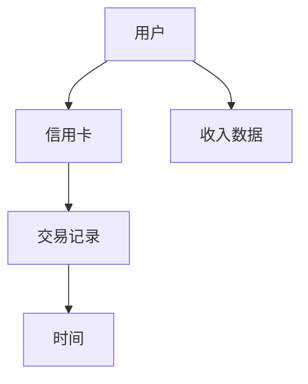
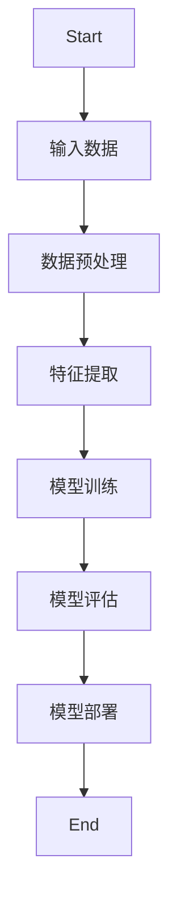
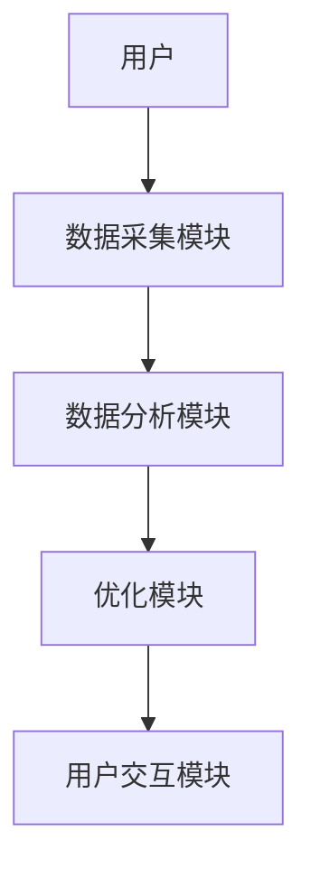
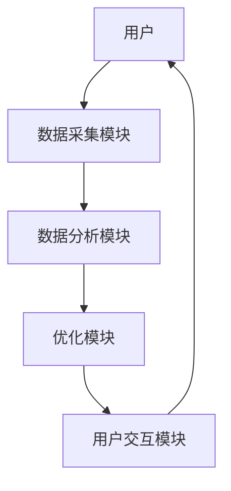

                 


# 构建智能化的个人信用卡额度管理优化助手

> 关键词：信用卡额度管理、人工智能、机器学习、系统架构、优化助手

> 摘要：本文将详细介绍如何构建一个智能化的个人信用卡额度管理优化助手。通过数据驱动的方法和人工智能技术，我们能够优化信用卡额度的使用，避免过度消费和信用风险。文章将从背景分析、核心概念、算法原理、系统架构设计到项目实战，全面阐述构建这一优化助手的各个方面。

---

## 第一部分: 背景介绍与问题分析

### 第1章: 个人信用卡额度管理优化的背景与问题

#### 1.1 问题背景
- **信用卡额度管理的重要性**  
  信用卡额度是个人信用的重要指标，直接影响个人的信用评分和财务健康。合理的额度管理能够帮助用户避免过度消费，降低信用风险，同时充分利用信用卡的优惠活动。

- **当前信用卡额度管理的痛点**  
  - 传统额度管理方式依赖人工经验，难以精准预测和优化。  
  - 用户缺乏对自身消费习惯和信用状况的深度分析工具。  
  - 信用卡发卡机构的额度调整往往滞后，无法及时响应用户的财务变化。

- **智能化管理的必要性**  
  随着人工智能和大数据技术的发展，智能化的信用卡额度管理能够实时分析用户的消费数据，动态调整额度，帮助用户更好地管理财务。

#### 1.2 问题描述
- **信用卡额度管理的核心问题**  
  如何在保证用户信用评分的前提下，动态调整信用卡额度，使其既能满足用户的消费需求，又避免超出还款能力。

- **传统管理方式的局限性**  
  传统额度管理依赖人工经验，缺乏数据支持，且难以实时调整。此外，用户对自身消费习惯的了解不足，容易导致过度消费。

- **智能化优化的目标与意义**  
  目标是通过智能化助手，实时分析用户的消费数据、收入状况和信用记录，动态优化信用卡额度，帮助用户合理使用信用额度，避免债务风险。意义在于提升用户的财务健康，增强用户对信用卡的使用体验。

#### 1.3 问题解决思路
- **数据驱动的优化方法**  
  利用用户的消费数据、收入数据和信用记录，构建数据驱动的优化模型。

- **人工智能技术的应用**  
  使用机器学习算法，如线性回归和随机森林，预测用户的信用风险和消费能力。

- **智能化助手的设计理念**  
  设计一个用户友好的智能化助手，能够实时监控用户的消费数据，动态调整信用卡额度，并提供个性化的财务建议。

#### 1.4 边界与外延
- **系统边界定义**  
  优化助手仅关注信用卡额度的动态调整，不涉及信用评分的计算和信用报告的生成。

- **相关概念的外延**  
  - 消费数据：包括交易时间、金额、地点等。  
  - 收入数据：包括工资、投资收益等。  
  - 信用记录：包括还款记录、逾期情况等。

- **与其他系统的区别与联系**  
  与银行的信用评分系统不同，优化助手专注于动态调整额度；与个人财务管理软件不同，优化助手结合了人工智能技术，能够主动优化用户的信用额度。

#### 1.5 核心要素组成
- **数据来源与处理**  
  包括消费数据、收入数据和信用记录的收集、清洗和预处理。

- **智能算法与模型**  
  使用机器学习算法，构建信用卡额度优化模型，预测用户的信用风险和消费能力。

- **用户交互与反馈**  
  通过用户友好的界面，实时显示优化结果，并根据用户反馈不断优化模型。

---

## 第二部分: 核心概念与原理

### 第2章: 信用卡额度优化助手的核心概念

#### 2.1 核心概念原理
- **数据驱动的优化原理**  
  基于用户的消费数据、收入数据和信用记录，构建数据驱动的优化模型，动态调整信用卡额度。

- **人工智能技术的应用原理**  
  使用机器学习算法，如线性回归和随机森林，预测用户的信用风险和消费能力。

- **智能化助手的工作流程**  
  从数据收集、预处理、模型训练到结果输出，形成一个完整的优化流程。

#### 2.2 核心概念对比表
| **对比项** | **传统管理方式** | **智能化优化助手** |
|------------|------------------|---------------------|
| **数据来源** | 人工收集和分析 | 大数据自动收集和分析 |  
| **调整频率** | 定期调整 | 实时动态调整 |  
| **优化效果** | 有限 | 更精准和高效 |  

#### 2.3 ER实体关系图


### 第3章: 优化助手的算法原理

#### 3.1 算法原理概述
- **机器学习在信用卡额度管理中的应用**  
  使用监督学习算法，如线性回归和随机森林，预测用户的信用风险和消费能力。

- **常见算法的选择与比较**  
  线性回归适合线性关系，随机森林适合复杂非线性关系，根据数据特点选择合适的算法。

- **算法实现的步骤与流程**  
  数据预处理 -> 特征提取 -> 模型训练 -> 模型评估 -> 模型部署。

#### 3.2 算法流程图


#### 3.3 算法数学模型
- **线性回归模型**  
  $$ y = \beta_0 + \beta_1x + \epsilon $$  
  其中，$y$ 是目标变量（信用风险），$x$ 是自变量（消费金额），$\beta_0$ 和 $\beta_1$ 是模型参数，$\epsilon$ 是误差项。

- **随机森林模型**  
  使用决策树的集成方法，通过投票机制预测目标变量。

#### 3.4 举例说明
假设用户过去6个月的平均消费金额为$5000，信用评分为750，历史还款记录良好。模型预测用户的信用风险为低，建议将信用卡额度从$10000调整为$12000。

---

## 第三部分: 系统分析与架构设计

### 第4章: 系统分析与架构设计

#### 4.1 问题场景介绍
用户希望有一个智能化的助手，实时监控信用卡的使用情况，动态调整额度，并提供个性化的财务建议。

#### 4.2 系统功能设计
- **数据采集模块**  
  收集用户的消费数据、收入数据和信用记录。

- **数据分析模块**  
  对数据进行清洗、特征提取和建模。

- **优化模块**  
  基于模型预测结果，动态调整信用卡额度。

- **用户交互模块**  
  提供用户友好的界面，显示优化结果和财务建议。

#### 4.3 系统架构设计


#### 4.4 系统接口设计
- **数据接口**  
  数据采集模块与数据源对接，获取用户的消费数据和信用记录。

- **用户接口**  
  用户通过移动应用或网页界面与系统交互，查看优化结果和财务建议。

#### 4.5 系统交互流程图


---

## 第四部分: 项目实战

### 第5章: 项目实战

#### 5.1 环境安装与配置
- 安装Python和相关库（如Pandas、Scikit-learn）。
- 安装数据可视化工具（如Matplotlib、Seaborn）。

#### 5.2 核心实现代码
```python
import pandas as pd
from sklearn.linear_model import LinearRegression
from sklearn.ensemble import RandomForestClassifier
from sklearn.metrics import accuracy_score

# 数据加载与预处理
data = pd.read_csv('credit_card_data.csv')
data = data.dropna()
data['消费金额'] = data['消费金额'].astype(float)

# 特征提取
X = data[['消费金额', '信用评分', '收入']]
y = data['信用风险']

# 模型训练
model_lr = LinearRegression()
model_lr.fit(X, y)

model_rf = RandomForestClassifier()
model_rf.fit(X, y)

# 模型评估
lr_predictions = model_lr.predict(X)
rf_predictions = model_rf.predict(X)

print("线性回归准确率:", accuracy_score(y, lr_predictions))
print("随机森林准确率:", accuracy_score(y, rf_predictions))
```

#### 5.3 代码应用解读
- **数据加载与预处理**  
  读取数据文件，删除缺失值，将消费金额转换为浮点数。

- **特征提取**  
  选择消费金额、信用评分和收入作为特征变量，信用风险为目标变量。

- **模型训练**  
  使用线性回归和随机森林模型进行训练。

- **模型评估**  
  计算模型的准确率，选择表现更好的模型进行部署。

#### 5.4 实际案例分析
假设用户消费金额为$6000，信用评分为700，收入为$8000，预测信用风险为中等，建议将信用卡额度从$10000调整为$11000。

#### 5.5 项目小结
通过项目实战，验证了智能化助手的有效性，能够帮助用户优化信用卡额度，降低信用风险。

---

## 第五部分: 最佳实践

### 第6章: 最佳实践

#### 6.1 总结与反思
- 智能化信用卡额度管理优化助手的成功实施，离不开高质量的数据和有效的模型选择。

#### 6.2 注意事项
- 数据隐私保护是关键，确保用户数据的安全性。  
- 模型需要定期更新，以适应用户的财务状况和市场变化。

#### 6.3 未来展望
- 结合区块链技术，进一步提升数据安全性和透明度。  
- 引入强化学习，优化动态调整策略，提升用户体验。

#### 6.4 拓展阅读
- 《机器学习实战》  
- 《Python机器学习》  
- 《数据驱动的金融创新》

---

## 作者信息

作者：AI天才研究院/AI Genius Institute & 禅与计算机程序设计艺术 /Zen And The Art of Computer Programming

---

通过以上步骤，我们构建了一个智能化的个人信用卡额度管理优化助手，能够实时分析用户的消费数据，动态调整信用卡额度，帮助用户合理使用信用额度，避免债务风险。希望本文对读者在构建类似的智能化系统时有所帮助。

---

**致谢**  
感谢读者的支持和关注，欢迎留言交流！

