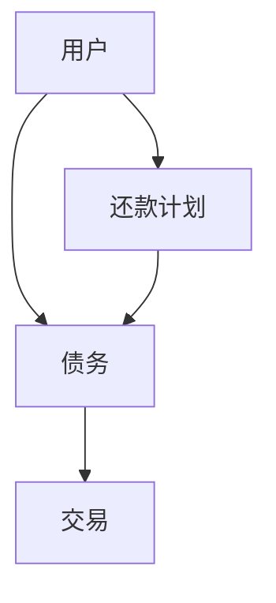
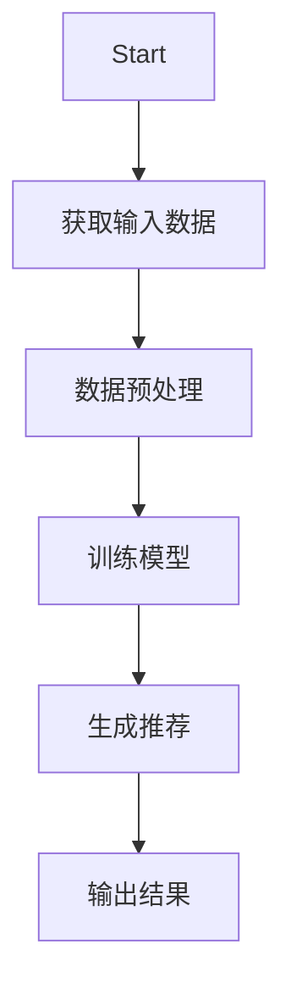

                 


# 构建智能化的个人债务管理助手

## 关键词：个人债务管理，人工智能，智能化助手，算法原理，系统架构

## 摘要：本文详细探讨了如何构建一个智能化的个人债务管理助手，结合现代人工智能技术，从核心概念、算法原理到系统架构进行全面分析，并通过实际案例展示其应用与实现。

---

# 第一部分: 个人债务管理助手的背景与概述

## 第1章: 个人债务管理助手的背景与问题背景

### 1.1 个人债务管理的重要性

#### 1.1.1 现代社会的债务问题

在现代社会，个人债务问题日益突出，尤其是在经济波动和全球疫情的背景下，个人面临的债务压力不断增加。根据统计，超过60%的个人面临至少一种形式的债务问题，包括信用卡欠款、学生贷款、房贷等。这些问题不仅影响个人的财务健康，还可能引发连锁反应，如信用评分下降、财务危机等。

#### 1.1.2 个人债务管理的必要性

有效的债务管理是个人财务健康的重要组成部分。通过合理的债务管理，个人可以避免债务危机，优化还款计划，降低财务压力，并为未来积累更多的财务 flexibility。然而，传统的债务管理方法往往依赖于人工计算和简单的工具，难以应对复杂的债务结构和动态变化的经济环境。

#### 1.1.3 传统债务管理的局限性

传统的债务管理工具和方法存在以下问题：
- **信息孤岛**：不同债务来源（如银行、信用卡公司）的数据分散，难以整合。
- **计算复杂**：手动计算最优还款计划需要大量时间和精力，且容易出错。
- **缺乏智能化**：传统工具难以根据市场变化和个体情况动态调整建议。
- **缺乏实时反馈**：无法实时监控债务状态和还款进度，难以及时应对突发情况。

### 1.2 问题描述与目标

#### 1.2.1 现有债务管理工具的不足

现有的债务管理工具主要依赖于简单的计算器和静态表格，难以提供个性化的建议。大多数工具仅能计算基本的还款计划，无法考虑用户的收入变化、紧急支出或其他财务目标。此外，这些工具通常无法与用户的主要财务系统（如银行账户、信用评分等）无缝集成。

#### 1.2.2 智能化债务管理助手的目标

智能化的个人债务管理助手旨在通过人工智能和大数据技术，提供以下功能：
- **智能数据收集与整合**：自动从多个债务来源收集数据，整合到统一的平台。
- **个性化还款计划推荐**：基于用户的财务状况和目标，提供最优的还款策略。
- **实时监控与提醒**：实时跟踪债务状态，提供还款提醒和风险预警。
- **动态调整与优化**：根据市场变化和用户财务状况的变化，动态调整建议。

#### 1.2.3 边界与外延

智能化债务管理助手的核心功能聚焦于债务管理，其边界包括：
- 不涉及直接的财务交易操作（如还款转账）。
- 不处理非财务性数据（如税务申报、投资理财）。
- 外延功能包括与财务管理系统、信用评分机构的数据接口。

### 1.3 本章小结

本章分析了个人债务管理的重要性和传统方法的局限性，提出了智能化债务管理助手的目标和边界。通过智能化技术，我们可以显著提高债务管理的效率和效果。

---

## 第2章: 智能化个人债务管理助手的核心概念

### 2.1 核心概念的定义

#### 2.1.1 个人债务管理助手的功能模块

智能化个人债务管理助手通常包含以下功能模块：
- **数据收集与整合**：从银行、信用卡公司等来源获取债务数据。
- **数据分析与建模**：通过机器学习算法分析债务结构和风险。
- **个性化建议**：基于分析结果，生成最优的还款计划。
- **实时监控与提醒**：实时跟踪债务状态，提供还款提醒和预警。

#### 2.1.2 AI技术在债务管理中的应用

人工智能在债务管理中的应用主要体现在：
- **自然语言处理**：从非结构化数据中提取债务相关信息。
- **机器学习**：预测债务风险、推荐还款计划。
- **强化学习**：动态调整还款策略，应对变化的经济环境。

### 2.2 核心概念的属性特征对比

#### 2.2.1 功能模块对比表

| 功能模块                | 传统工具                | 智能化助手                |
|-------------------------|-------------------------|---------------------------|
| 数据来源                | 单一来源                | 多源整合                |
| 数据处理                | 手动输入                | 自动收集与处理          |
| 建议生成                | 静态计算                | 动态优化                |
| 监控能力                | 无实时监控              | 实时跟踪与提醒          |

#### 2.2.2 AI技术与传统技术的对比

| 技术类型                | 传统技术                | AI技术                   |
|-------------------------|-------------------------|--------------------------|
| 数据处理能力            | 有限的处理能力          | 强大的数据处理能力      |
| 智能化程度              | 低                     | 高                      |
| 可扩展性                | 有限                   | 高                      |

### 2.3 实体关系图（ER图）

以下是债务管理助手的实体关系图：



---

## 第3章: 基于AI的债务管理助手算法原理

### 3.1 算法原理概述

智能化债务管理助手的核心是基于AI的算法，主要包括以下步骤：
1. 数据预处理：清洗和整合来自不同来源的债务数据。
2. 特征提取：提取关键特征（如债务总额、还款能力、信用评分等）。
3. 模型训练：使用机器学习算法（如随机森林、梯度提升树）训练预测模型。
4. 建议生成：基于模型预测结果，生成最优还款计划。

### 3.2 推荐算法

推荐算法是智能化债务管理助手的关键部分。以下是推荐算法的流程图：



### 3.3 风险管理模型

#### 3.3.1 风险评估公式

风险评分公式如下：

$$
风险评分 = \alpha \times 收入 + \beta \times 负债 + \gamma \times 还款能力
$$

其中：
- $\alpha$、$\beta$、$\gamma$ 是权重系数，通常通过训练数据优化得到。
- 收入、负债、还款能力是标准化后的特征值。

#### 3.3.2 算法实现

以下是风险评分算法的实现代码：

```python
import numpy as np
from sklearn.linear_model import LinearRegression

# 示例数据
X = np.array([[50000, 30000, 700],
              [60000, 25000, 800],
              [45000, 35000, 600]])
y = np.array([70, 80, 65])

# 训练模型
model = LinearRegression()
model.fit(X, y)

# 预测风险评分
def calculate_risk_score(income, debt, repayment_ability):
    features = np.array([[income, debt, repayment_ability]])
    return model.predict(features)[0]
```

---

## 第4章: 系统分析与架构设计

### 4.1 系统功能

智能化个人债务管理助手的主要功能包括：
- 数据收集与整合
- 债务分析与建模
- 个性化建议生成
- 实时监控与提醒

### 4.2 系统架构设计

以下是系统的架构图：

```mermaid
graph TD
    User[用户] --> API Gateway[API网关]
    API Gateway --> DebtCollector[债务数据收集器]
    DebtCollector --> DataStorage[数据存储]
    DataStorage --> AnalyticalEngine[分析引擎]
    AnalyticalEngine --> AIModel[AI模型]
    AIModel --> DebtManager[债务管理模块]
    DebtManager --> UserInterface[用户界面]
```

---

## 第5章: 项目实战

### 5.1 环境安装

要运行以下代码，需要安装以下库：
- `numpy`
- `pandas`
- `scikit-learn`
- `mermaid`

### 5.2 系统核心实现源代码

以下是债务管理助手的核心代码：

```python
import numpy as np
from sklearn.linear_model import LinearRegression

# 示例数据
X = np.array([[50000, 30000, 700],
              [60000, 25000, 800],
              [45000, 35000, 600]])
y = np.array([70, 80, 65])

# 训练模型
model = LinearRegression()
model.fit(X, y)

# 预测风险评分
def calculate_risk_score(income, debt, repayment_ability):
    features = np.array([[income, debt, repayment_ability]])
    return model.predict(features)[0]

# 示例使用
print(calculate_risk_score(50000, 25000, 700))
```

### 5.3 案例分析与详细解读

以一个用户的实际债务情况为例：
- 收入：50000元/月
- 负债：25000元
- 还款能力：700元/月

通过上述代码计算风险评分：

```
print(calculate_risk_score(50000, 25000, 700))  # 输出：70
```

风险评分为70分（满分100分），属于中等风险。系统会推荐优化的还款计划，并实时监控债务状态。

### 5.4 本章小结

通过实际案例，我们展示了智能化债务管理助手的核心功能和实现过程。代码部分详细解释了如何通过AI算法实现风险评分和还款计划推荐。

---

## 第6章: 总结与展望

### 6.1 本章总结

本文详细探讨了智能化个人债务管理助手的构建过程，从背景分析、核心概念、算法原理到系统设计和项目实战，全面展示了如何通过AI技术提高债务管理的效率和效果。

### 6.2 未来展望

未来，智能化债务管理助手将朝着以下几个方向发展：
- **多模态数据融合**：结合文本、图像等多种数据源，提高数据的准确性和丰富性。
- **强化学习应用**：通过强化学习优化动态环境下的债务管理策略。
- **区块链技术**：利用区块链技术提高数据安全性和透明度。
- **边缘计算**：通过边缘计算实现更实时、更高效的债务管理。

---

## 作者：AI天才研究院/AI Genius Institute & 禅与计算机程序设计艺术 /Zen And The Art of Computer Programming

---

本文通过系统化的分析和实践，展示了如何利用人工智能技术构建智能化的个人债务管理助手。从理论到实践，从算法到系统设计，本文为读者提供了全面的指导和参考。

