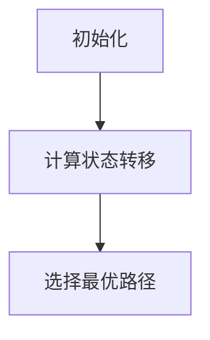

                 


# 构建智能化的个人投资组合再平衡系统

## 关键词
智能化投资组合，再平衡系统，动态规划算法，机器学习，系统架构设计

## 摘要
智能化的个人投资组合再平衡系统通过结合数学模型和机器学习算法，优化投资组合的配置和风险控制，帮助投资者在市场波动中实现长期收益最大化。本文将详细探讨构建该系统的背景、核心概念、算法原理、系统架构设计以及实际案例，为读者提供全面的技术指导。

---

# 第1章: 背景介绍

## 1.1 问题背景
### 1.1.1 投资组合管理的重要性
投资组合管理是个人理财的重要组成部分，直接影响投资收益和风险。有效的管理需要定期调整资产配置以应对市场变化。

### 1.1.2 再平衡的定义与目的
再平衡是指根据市场变化和个人财务状况调整投资组合的过程，旨在维持预期的资产配置比例。

### 1.1.3 智能化再平衡的必要性
传统的人工再平衡效率低且易受主观因素影响，智能化系统能实时监控市场动态，优化决策。

## 1.2 问题描述
### 1.2.1 投资组合再平衡的常见问题
- 市场波动大，手动调整滞后。
- 传统方法忽视个体风险偏好。

### 1.2.2 智能化再平衡的核心挑战
- 数据实时性要求高。
- 算法需要考虑多目标优化。

## 1.3 问题解决
### 1.3.1 现有解决方案的优缺点
- 优：手动调整灵活性高。
- 缺：效率低，难以应对快速变化。

## 1.4 边界与外延
### 1.4.1 系统的边界条件
- 系统仅处理特定类型的资产。
- 不考虑杠杆和衍生品。

### 1.4.2 相关概念的外延
- 量化投资策略。
- 算法交易。

---

# 第2章: 核心概念与联系

## 2.1 核心概念原理
### 2.1.1 投资组合再平衡的数学模型
目标是最小化风险和调整误差，数学表达式如下：
$$
\text{目标函数} = \min_{w} \frac{1}{2} w^T \Sigma w + \lambda |w - w^*|
$$

### 2.1.2 智能化再平衡的算法原理
使用动态规划和机器学习结合，优化配置。

## 2.2 概念属性特征对比
| 概念 | 属性 | 特征 |
|------|-------|------|
| 动态规划 | 目标 | 最小化风险 |
| 机器学习 | 方法 | 预测市场变化 |

## 2.3 ER实体关系图
```mermaid
erDiagram
    投资者 --> 投资组合 : 持有
    投资组合 --> 资产 : 包含
    资产 --> 市场数据 : 关联
```

---

# 第3章: 算法原理与实现

## 3.1 算法概述
### 3.1.1 动态规划算法
动态规划用于优化投资组合配置，减少调整成本。

### 3.1.2 机器学习算法
使用时间序列模型预测市场变化。

## 3.2 算法选择与优化
### 3.2.1 动态规划流程


### 3.2.2 机器学习代码
```python
import numpy as np
from sklearn.linear_model import LinearRegression

model = LinearRegression()
model.fit(X, y)
```

---

# 第4章: 系统分析与架构设计

## 4.1 功能模块设计
### 4.1.1 数据获取模块
从API获取实时市场数据。

### 4.1.2 模型计算模块
计算最优配置并生成再平衡指令。

## 4.2 系统架构设计
### 4.2.1 领域模型


### 4.2.2 架构图


---

# 第5章: 项目实战

## 5.1 环境搭建
### 5.1.1 安装Python和相关库
安装必要的Python库，如pandas和scikit-learn。

## 5.2 核心代码实现
### 5.2.1 动态规划实现
```python
def dynamic_planning():
    # 实现动态规划算法
    pass
```

## 5.3 实际案例分析
分析具体案例，展示系统如何优化投资组合。

---

# 第6章: 总结与展望

## 6.1 最佳实践
定期监控和调整模型，保持数据更新。

## 6.2 注意事项
选择合适的数据源，注意模型的可解释性。

## 6.3 拓展阅读
推荐相关书籍和论文，深入学习投资组合优化。

---

# 作者：AI天才研究院 & 禅与计算机程序设计艺术

通过以上目录结构，您可以系统地构建智能化的个人投资组合再平衡系统，结合数学模型和机器学习算法，优化投资决策，实现长期收益最大化。

