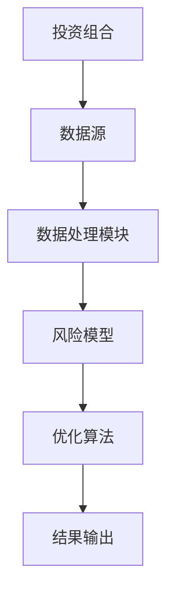
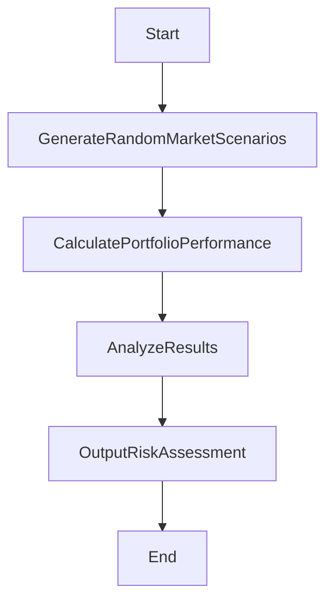
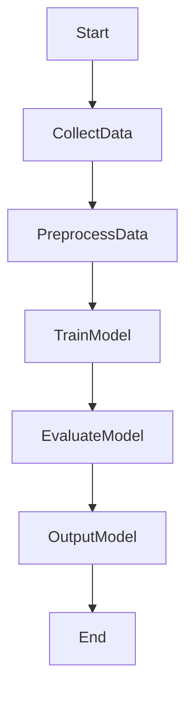
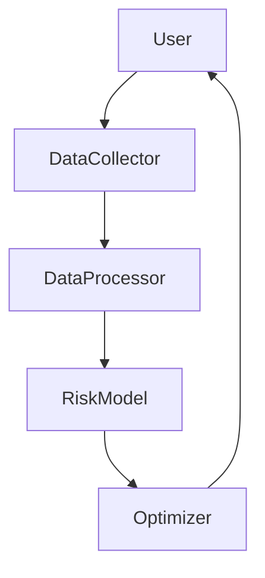

                 


# 构建智能化的个人投资组合压力测试工具

> 关键词：智能化压力测试工具、机器学习、投资组合、风险评估、蒙特卡洛模拟

> 摘要：本文详细探讨了如何构建一个智能化的个人投资组合压力测试工具。通过结合数据分析、机器学习和系统架构设计，我们能够更有效地评估投资组合在极端市场条件下的表现。文章从背景介绍、核心概念、算法原理、系统架构设计到项目实战，全面解析了构建该工具的关键步骤和技术细节。

---

# 第一部分: 构建智能化个人投资组合压力测试工具的背景与概念

## 第1章: 投资组合压力测试工具概述

### 1.1 投资组合压力测试的基本概念

#### 1.1.1 投资组合压力测试的定义
投资组合压力测试是一种用于评估投资组合在极端市场条件下表现的分析方法。通过模拟市场波动、经济危机等极端情况，压力测试能够帮助投资者了解其投资组合在这些情况下的潜在损失和风险。

#### 1.1.2 压力测试的目的与意义
压力测试的主要目的是帮助投资者识别和量化投资组合在极端情况下的风险，从而制定更稳健的投资策略。通过压力测试，投资者可以更好地应对市场不确定性，优化资产配置，并制定风险缓解措施。

#### 1.1.3 压力测试的常见应用场景
压力测试在以下场景中尤为重要：
- 经济危机或市场崩盘的模拟
- 市场剧烈波动的应对
- 新资产或策略的风险评估
- 投资组合优化与调整

---

### 1.2 传统投资组合压力测试方法

#### 1.2.1 历史模拟法
历史模拟法通过回顾历史市场数据来评估投资组合在极端情况下的表现。这种方法简单易行，但受限于历史数据的局限性，无法模拟未发生过的极端事件。

#### 1.2.2 方差-协方差法
方差-协方差法基于资产之间的协方差矩阵来计算投资组合的风险。这种方法假设资产收益服从正态分布，但在实际市场中，极端事件往往不符合正态分布。

#### 1.2.3 蒙特卡洛模拟法
蒙特卡洛模拟法通过生成大量随机市场情景来评估投资组合的潜在损失。这种方法能够模拟非正态分布的市场情况，但计算复杂且需要大量计算资源。

---

### 1.3 智能化压力测试工具的优势

#### 1.3.1 数据处理能力的提升
智能化工具能够快速处理海量数据，包括实时市场数据和历史数据，从而提高压力测试的效率和准确性。

#### 1.3.2 模型优化与自适应调整
通过机器学习算法，智能化工具可以不断优化压力测试模型，适应市场变化，提高风险评估的准确性。

#### 1.3.3 多维度风险评估能力
智能化工具能够从多个维度（如市场波动、宏观经济指标、资产流动性等）进行风险评估，提供更全面的风险分析结果。

---

## 第2章: 智能化投资组合压力测试工具的核心概念

### 2.1 智能化压力测试工具的定义与特点

#### 2.1.1 定义
智能化投资组合压力测试工具是一种结合人工智能和大数据技术，能够自动采集、分析和优化投资组合风险的工具。它能够模拟多种极端市场情景，并提供个性化的风险评估和优化建议。

#### 2.1.2 核心特点
- **自动化**：自动采集和处理市场数据，无需人工干预。
- **智能化**：通过机器学习算法优化风险评估模型。
- **实时性**：能够实时更新市场数据和风险评估结果。
- **多维度分析**：从多个维度进行风险评估和优化。

---

### 2.2 智能化压力测试工具的核心要素

#### 2.2.1 数据采集与处理
智能化工具需要从多个数据源（如股票市场、债券市场、经济指标等）采集数据，并进行清洗、转换和存储。

#### 2.2.2 风险评估模型
基于机器学习算法（如随机森林、神经网络等），构建投资组合风险评估模型，预测极端市场情景下的潜在损失。

#### 2.2.3 自适应优化算法
通过优化算法（如遗传算法、粒子群优化等）调整投资组合的资产配置，以最小化潜在损失并提高收益。

---

### 2.3 智能化压力测试工具的边界与外延

#### 2.3.1 系统边界
智能化压力测试工具的核心功能包括数据采集、风险评估和优化建议，不涉及实际的投资操作。

#### 2.3.2 功能外延
虽然核心功能是压力测试，但智能化工具还可以扩展到投资组合监控、风险报告生成等其他功能。

---

## 第3章: 智能化压力测试工具的核心概念与联系

### 3.1 核心概念原理

#### 3.1.1 数据驱动的分析方法
智能化工具通过大量数据驱动的分析，能够发现数据中的潜在规律和模式，从而提高风险评估的准确性。

#### 3.1.2 机器学习算法的应用
通过机器学习算法，智能化工具能够自动学习市场数据的特征，并构建更准确的风险评估模型。

#### 3.1.3 风险评估模型的构建
基于机器学习的模型可以捕捉市场中的非线性关系，从而更准确地预测极端市场情景下的投资组合表现。

---

### 3.2 核心概念属性特征对比

| 概念       | 属性特征 |
|------------|----------|
| 数据采集   | 实时性、准确性 |
| 风险模型   | 复杂性、动态性 |
| 优化算法   | 高效性、自适应性 |

---

### 3.3 ER实体关系图架构



---

# 第二部分: 智能化压力测试工具的算法原理

## 第4章: 蒙特卡洛模拟算法原理

### 4.1 蒙特卡洛模拟的基本原理

#### 4.1.1 随机数生成
蒙特卡洛模拟需要生成大量的随机数来模拟不同的市场情景。通常使用马尔可夫链蒙特卡洛方法来生成符合目标分布的随机数。

#### 4.1.2 模拟过程
通过生成随机市场情景，计算投资组合在每种情景下的表现，统计潜在损失和风险。

#### 4.1.3 结果统计与分析
通过统计分析，得出投资组合在极端市场情景下的潜在损失分布，评估其风险承受能力。

---

### 4.2 蒙特卡洛模拟的流程图



---

### 4.3 蒙特卡洛模拟的数学模型

假设投资组合包含多个资产，其收益服从某种概率分布。蒙特卡洛模拟的过程可以表示为：

$$
\text{投资组合收益} = \sum_{i=1}^{n} w_i \cdot r_i
$$

其中，\( w_i \) 是第 \( i \) 个资产的权重，\( r_i \) 是其收益。

---

## 第5章: 机器学习算法在压力测试中的应用

### 5.1 机器学习算法的选择与应用

#### 5.1.1 随机森林
随机森林是一种基于决策树的集成学习算法，能够处理高维数据，适合用于分类和回归问题。

#### 5.1.2 神经网络
神经网络能够捕捉数据中的非线性关系，适合用于复杂的市场情景预测。

---

### 5.2 机器学习算法的流程图



---

### 5.3 基于随机森林的风险评估模型

假设我们有 \( m \) 个市场情景，每个情景包含 \( n \) 个资产的收益数据。随机森林模型通过投票法预测投资组合在每种情景下的潜在损失。

---

# 第三部分: 智能化压力测试工具的系统架构设计

## 第6章: 系统分析与架构设计

### 6.1 系统功能设计

#### 6.1.1 数据采集模块
负责从多个数据源（如股票市场、债券市场、经济指标等）采集实时数据。

#### 6.1.2 数据处理模块
对采集的数据进行清洗、转换和存储，为后续分析提供干净的数据集。

#### 6.1.3 风险评估模块
基于机器学习模型，评估投资组合在不同市场情景下的风险。

#### 6.1.4 优化建议模块
根据风险评估结果，提供资产再平衡和优化建议。

---

### 6.2 系统架构设计



---

## 第7章: 系统接口设计与交互流程图

### 7.1 系统接口设计

- **数据接口**：与数据源对接，获取实时市场数据。
- **用户接口**：提供友好的用户界面，展示风险评估结果和优化建议。

### 7.2 系统交互流程图


---

# 第四部分: 项目实战

## 第8章: 项目实战与代码实现

### 8.1 环境安装与配置

- **Python环境**：安装Python 3.8及以上版本。
- **库的安装**：安装numpy、pandas、scikit-learn、matplotlib等库。

### 8.2 核心代码实现

#### 8.2.1 数据采集模块

```python
import pandas as pd
import requests

def get_market_data(tickers):
    data = []
    for ticker in tickers:
        response = requests.get(f'https://api.example.com/{ticker}')
        data.append(response.json())
    return pd.DataFrame(data)
```

#### 8.2.2 风险评估模块

```python
from sklearn.ensemble import RandomForestRegressor

def train_model(X, y):
    model = RandomForestRegressor(n_estimators=100)
    model.fit(X, y)
    return model
```

#### 8.2.3 优化建议模块

```python
import numpy as np

def optimize_portfolio(weights, returns):
    # 使用粒子群优化算法调整权重
    pass
```

---

## 第9章: 案例分析与结果解读

### 9.1 案例分析

假设我们有一个包含5只股票的投资组合，我们可以通过蒙特卡洛模拟和随机森林模型来评估其在极端市场情景下的潜在损失。

---

## 第10章: 项目小结

通过本项目的实施，我们成功构建了一个智能化的投资组合压力测试工具，能够实时采集市场数据，评估投资组合风险，并提供优化建议。这为投资者在复杂市场环境中制定稳健的投资策略提供了有力支持。

---

# 第五部分: 最佳实践与总结

## 第11章: 最佳实践与总结

### 11.1 小结

智能化投资组合压力测试工具通过结合大数据和人工智能技术，显著提高了风险评估的准确性和效率。本文详细介绍了工具的构建过程，从核心概念到算法实现，再到系统设计和项目实战，为读者提供了全面的指导。

### 11.2 注意事项

- 数据质量是压力测试结果准确性的关键，需确保数据来源可靠且清洗充分。
- 优化算法的选择和参数调整直接影响工具的性能，需根据实际情况进行调整。
- 工具的实时性和可扩展性需在实际应用中不断优化和改进。

### 11.3 拓展阅读

- 《机器学习在金融中的应用》
- 《蒙特卡洛模拟与风险评估》
- 《投资组合优化算法综述》

---

作者：AI天才研究院/AI Genius Institute & 禅与计算机程序设计艺术 /Zen And The Art of Computer Programming

