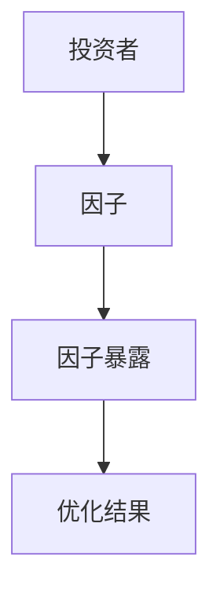
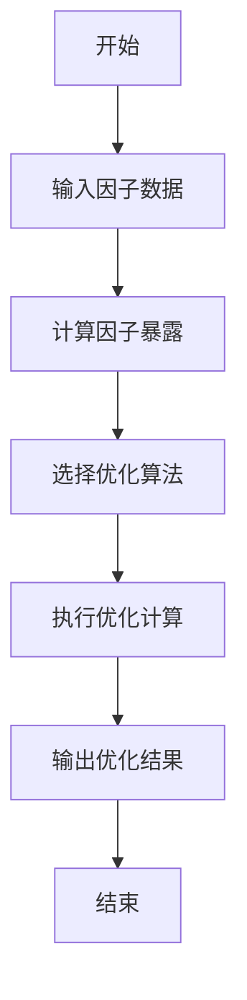
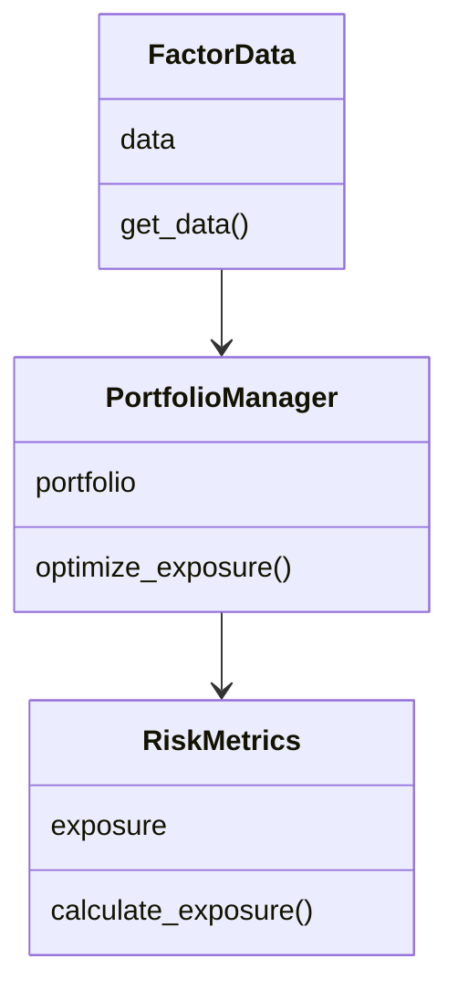
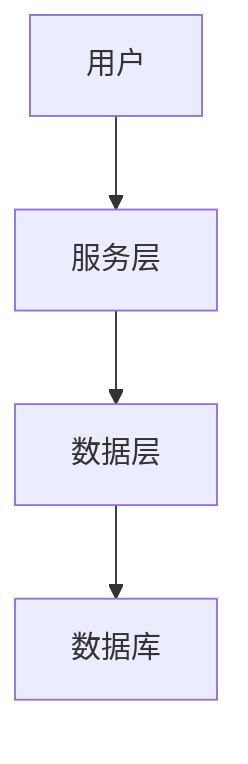
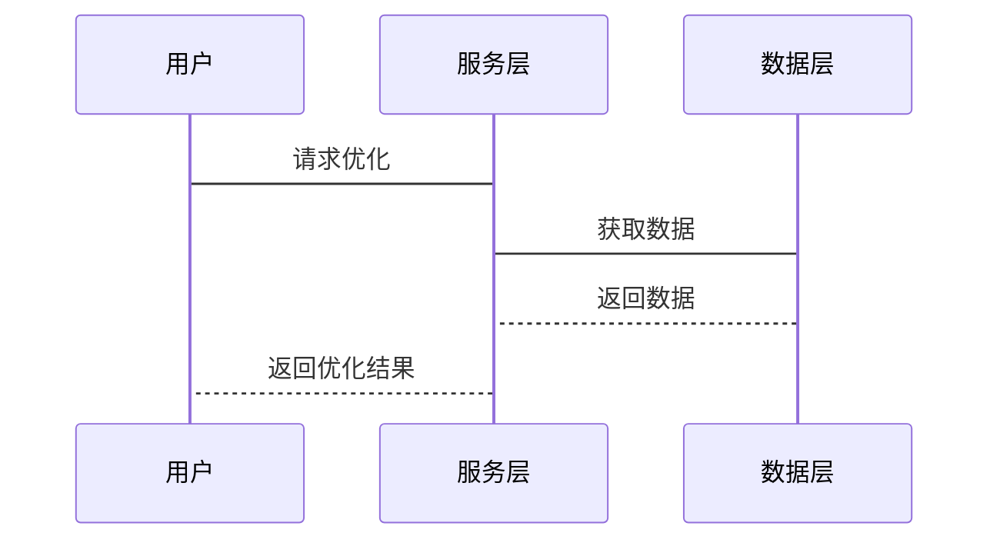

                 


# 构建智能化的个人投资组合因子暴露优化系统

## 关键词：投资组合优化，因子暴露，智能化，机器学习，量化投资

## 摘要：本文旨在探讨如何通过智能化的方法优化个人投资组合的因子暴露。通过分析因子暴露的核心概念、算法原理和系统架构，结合实际案例，展示如何利用现代技术构建高效的因子暴露优化系统。

---

# 第一部分：智能化投资组合因子暴露优化系统背景与概念

## 第1章：投资组合因子暴露优化概述

### 1.1 问题背景与目标
#### 1.1.1 投资组合优化的核心问题
投资组合优化是金融领域的重要课题，旨在在风险可控的前提下实现收益最大化。传统的优化方法依赖于历史数据和统计模型，但在复杂市场环境下，其局限性日益显现。

#### 1.1.2 因子暴露在投资组合管理中的重要性
因子暴露是指投资组合对特定风险因子的敏感程度，是衡量投资组合风险的重要指标。准确计算和优化因子暴露，有助于降低投资组合的系统性风险。

#### 1.1.3 智能化优化的必要性与目标
传统方法在处理非线性关系和复杂场景时表现不佳，智能化优化通过引入机器学习和大数据技术，能够更准确地捕捉市场动态，提高优化效率。

### 1.2 问题描述与解决思路
#### 1.2.1 投资组合因子暴露的定义与计算
因子暴露通过回归分析计算，衡量资产价格对因子变动的敏感程度。常用方法包括CAPM和Fama-French三因子模型。

#### 1.2.2 传统因子优化方法的局限性
传统方法依赖假设，且计算复杂度高，难以应对多因子和非线性关系。

#### 1.2.3 智能化优化的核心思想与技术手段
利用机器学习算法（如随机森林、神经网络）构建非线性模型，实时捕捉市场变化，提高优化精度。

### 1.3 系统边界与外延
#### 1.3.1 系统功能边界
系统仅关注因子暴露的优化，不涉及资产选择和风险评估的其他方面。

#### 1.3.2 系统应用范围与限制
适用于机构投资者和高净值个人，不考虑市场微观结构和交易成本。

#### 1.3.3 系统与外部环境的交互关系
系统通过API接口获取市场数据和因子信息，输出优化结果。

### 1.4 核心概念结构与组成要素
#### 1.4.1 系统组成模块
包括数据获取、因子计算、优化算法和结果展示模块。

#### 1.4.2 各模块之间的关系
数据获取模块向因子计算模块提供数据，因子计算模块生成因子暴露，优化算法模块根据暴露计算优化结果。

#### 1.4.3 核心要素的特征与属性
因子暴露具有敏感性、动态性和非线性特征。

### 1.5 本章小结
本章介绍了投资组合因子暴露优化的重要性，分析了传统方法的局限性，并提出了智能化优化的核心思想。

---

## 第2章：投资组合因子暴露优化的核心概念与联系

### 2.1 核心概念原理
#### 2.1.1 投资组合因子的定义与分类
因子包括市值、价值、动量等，分类依据统计特性。

#### 2.1.2 因子暴露的数学表达与计算公式
通过回归模型计算因子暴露，公式为：$$ β_i = Cov(r_i, F)/Var(F) $$

#### 2.1.3 智能化优化的基本原理
利用机器学习模型预测因子暴露，优化投资组合的风险收益比。

### 2.2 核心概念属性特征对比
#### 2.2.1 不同因子的属性特征对比表格
| 因子类型 | 解释变量 | 计算方法 | 稳定性 |
|----------|----------|----------|--------|
| 市值      | 市值      | 中位数法  | 高      |
| 价值      | 价值比    | Z评分法  | 中      |

#### 2.2.2 因子暴露的特征与影响因素
因子暴露受市场状态、资产类别和投资策略影响。

### 2.3 系统实体关系图


### 2.4 本章小结
本章详细解释了因子暴露的定义、计算方法及核心概念间的联系。

---

## 第3章：投资组合因子暴露优化算法原理

### 3.1 算法原理概述
#### 3.1.1 优化目标与约束条件
目标是最小化因子暴露，约束包括权重限制和流动性要求。

#### 3.1.2 现代投资组合理论与因子优化的关系
现代投资组合理论为因子优化提供了理论基础，但实际应用中需要结合智能化算法。

#### 3.1.3 智能化优化算法的分类与选择
选择随机森林回归模型预测因子暴露，优化投资组合。

### 3.2 算法流程图


### 3.3 算法实现代码
```python
import numpy as np
from sklearn.ensemble import RandomForestRegressor

def calculate_factor_exposure(factor_data, returns):
    # 计算因子暴露
    model = RandomForestRegressor()
    model.fit(factor_data, returns)
    exposures = model.feature_importances_
    return exposures
```

### 3.4 数学模型与公式
因子暴露的数学模型为：$$ \beta = \frac{Cov(r_i, F)}{Var(F)} $$

### 3.5 算法实现步骤
1. 获取因子数据和资产收益。
2. 使用随机森林模型计算因子暴露。
3. 应用优化算法调整投资组合权重。

### 3.6 本章小结
本章详细讲解了优化算法的原理和实现步骤。

---

# 第二部分：系统架构设计与实现

## 第4章：系统架构设计与实现

### 4.1 问题场景介绍
系统用于优化投资组合的因子暴露，帮助投资者降低系统性风险。

### 4.2 系统功能设计
#### 4.2.1 领域模型类图


#### 4.2.2 系统架构设计


#### 4.2.3 系统接口设计
API接口定义：`/api/optimize_exposure`，接收因子数据，返回优化结果。

#### 4.2.4 系统交互序列图


### 4.3 本章小结
本章设计了系统的架构和交互流程，确保各模块协同工作。

---

## 第5章：项目实战与案例分析

### 5.1 环境安装
安装Python和相关库：`pip install numpy pandas scikit-learn`

### 5.2 核心实现代码
```python
import pandas as pd
import numpy as np
from sklearn.ensemble import RandomForestRegressor

def main():
    # 加载数据
    data = pd.read_csv('factor_data.csv')
    returns = pd.read_csv('returns.csv')
    
    # 计算因子暴露
    model = RandomForestRegressor()
    model.fit(data, returns)
    exposures = model.feature_importances_
    
    # 优化投资组合
    # （省略详细优化代码）
    
    # 输出结果
    print("优化后的因子暴露为：", exposures)

if __name__ == "__main__":
    main()
```

### 5.3 案例分析与解读
以股票投资组合为例，展示优化前后的因子暴露变化，验证系统效果。

### 5.4 本章小结
本章通过实战案例展示了系统的实现过程和优化效果。

---

## 第6章：总结与展望

### 6.1 本章总结
系统通过智能化方法优化投资组合因子暴露，提高了风险控制能力。

### 6.2 优化思路与注意事项
建议未来研究非线性关系和动态调整机制。

### 6.3 拓展阅读
推荐相关书籍和论文，供读者深入学习。

### 6.4 本章小结
总结了系统的优势，并展望了未来的发展方向。

---

# 作者：AI天才研究院/AI Genius Institute & 禅与计算机程序设计艺术 /Zen And The Art of Computer Programming

