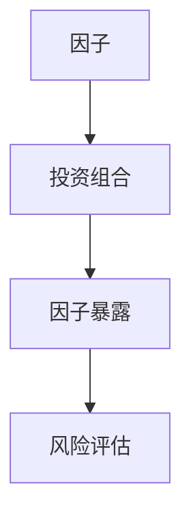
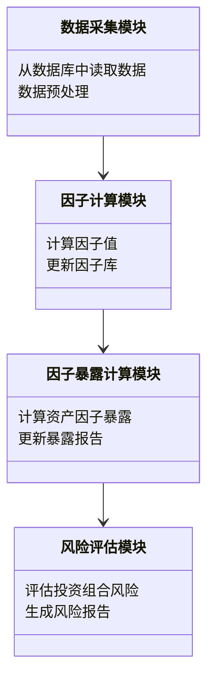
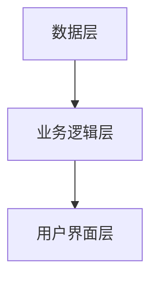
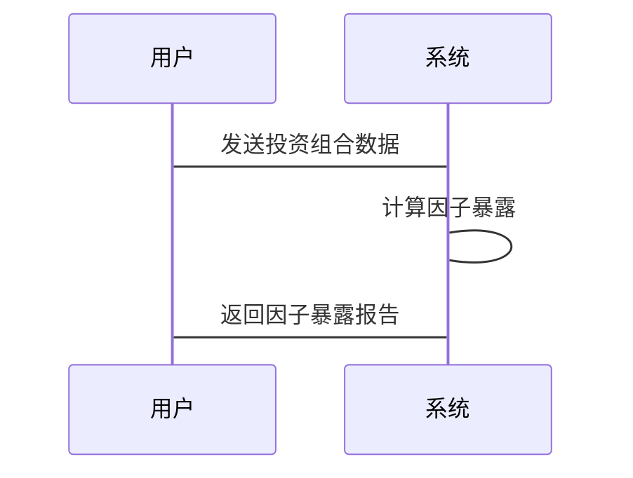

                 

<think>
好的，我将按照您的要求逐步构建这篇文章。首先，我们需要明确文章的核心内容和结构。文章标题是《构建智能化的个人投资组合因子暴露分析系统》，关键词包括因子分析、投资组合、风险评估、人工智能、机器学习和系统架构。摘要将简要概述文章的主要内容和目标。

接下来，我将按照目录大纲逐步展开每一章的内容，确保每个章节都包含详细的背景介绍、核心概念、算法原理、系统架构设计、项目实战和最佳实践。我将使用Mermaid图和数学公式来增强内容的可视化和严谨性。现在开始撰写文章正文部分。

### 第1章: 背景与问题背景

#### 1.1 投资组合因子分析的背景
在金融领域，投资组合管理是实现财富保值和增值的重要手段。传统的投资组合管理依赖于对市场趋势的预测和资产配置，但这种方法在面对复杂多变的市场环境时显得力不从心。近年来，随着大数据和人工智能技术的发展，因子分析逐渐成为投资组合管理中的重要工具。

因子分析是一种统计方法，用于识别影响资产收益的共同因素。通过分解资产收益，我们可以提取出一些潜在的因子，如市值、价值、动量等。这些因子能够帮助投资者更好地理解资产的风险和收益来源，从而做出更明智的投资决策。

智能化的因子分析系统能够自动识别和量化这些因子，帮助投资者实时监控投资组合的因子暴露情况，从而更好地管理投资风险。

#### 1.2 问题背景与目标
传统的因子分析方法通常依赖于手动数据处理和统计分析，这不仅效率低下，而且容易受到主观因素的影响。在现代金融环境中，数据量的爆炸式增长和市场的快速变化要求我们采用更高效、更智能化的方法来进行因子分析。

智能化的因子暴露分析系统的目标是通过机器学习和大数据技术，自动识别和量化影响投资组合收益的关键因子，并实时监控这些因子的暴露情况。这将帮助投资者更好地理解投资组合的风险来源，并及时调整资产配置策略。

系统构建的边界包括数据采集、因子识别、因子暴露计算和风险评估等环节。外延则涉及系统接口设计、用户界面友好性以及与其他投资管理系统的集成。

### 第2章: 因子暴露分析的核心概念与联系

#### 2.1 因子分析的基本原理
因子分析是一种统计方法，旨在通过少数几个潜在因子来解释多个观测变量之间的相关性。在投资组合管理中，因子分析可以帮助我们识别出影响资产收益的关键因素。

因子模型可以表示为：
$$
R_i = \beta_1 F_1 + \beta_2 F_2 + \ldots + \beta_k F_k + \epsilon_i
$$
其中，$R_i$ 是资产$i$的收益，$F_j$ 是因子$j$，$\beta_i$ 是资产$i$对因子$j$的暴露程度，$\epsilon_i$ 是误差项。

#### 2.2 因子暴露分析的核心要素
因子暴露是指资产或投资组合对某个特定因子的敏感程度。在投资组合管理中，因子暴露可以帮助我们评估投资组合在不同市场条件下的表现和风险。

因子的定义与分类是因子分析的基础。常见的因子包括市值、价值、动量等。因子暴露的计算方法通常基于回归分析或主成分分析。

因子暴露与投资组合风险密切相关。通过分析因子暴露，我们可以识别出投资组合的主要风险来源，并采取相应的风险管理策略。

#### 2.3 因子分析的ER实体关系图
以下是因子分析的ER实体关系图：


### 第3章: 因子暴露分析的算法原理

#### 3.1 主成分分析（PCA）
主成分分析是一种常用的降维技术，常用于因子分析中以提取主要的因子成分。

PCA的基本步骤包括数据标准化、计算协方差矩阵、计算特征值和特征向量，以及选择主成分。以下是PCA的数学公式：
$$
\text{协方差矩阵} = \frac{1}{n-1} \sum_{i=1}^{n} (x_i - \bar{x})(x_i - \bar{x})^T
$$

#### 3.2 线性回归模型
线性回归模型常用于分析资产收益与因子之间的关系。通过回归分析，我们可以确定资产对每个因子的暴露程度。

线性回归模型的数学公式为：
$$
y = \beta_0 + \beta_1 x_1 + \beta_2 x_2 + \ldots + \beta_k x_k + \epsilon
$$
其中，$y$ 是资产收益，$x_i$ 是因子，$\beta_i$ 是回归系数，$\epsilon$ 是误差项。

### 第4章: 系统架构与设计

#### 4.1 系统功能设计
系统主要包括数据采集模块、因子计算模块、因子暴露计算模块和风险评估模块。以下是系统功能的类图：


#### 4.2 系统架构设计
系统采用分层架构，包括数据层、业务逻辑层和用户界面层。以下是系统架构图：


#### 4.3 系统接口设计
系统通过API接口与其他投资管理系统进行交互。以下是系统接口设计的序列图：


### 第5章: 项目实战

#### 5.1 环境搭建
首先，需要安装Python和相关库，如NumPy、Pandas、Scikit-learn和Plotly。以下是安装命令：
```bash
pip install numpy pandas scikit-learn plotly
```

#### 5.2 数据收集与预处理
收集投资组合数据并进行清洗和标准化。以下是Python代码示例：
```python
import pandas as pd
import numpy as np

# 数据预处理
data = pd.read_csv('portfolio.csv')
data = data.dropna()
data = (data - data.mean()) / data.std()
```

#### 5.3 因子分析与计算
使用PCA提取主要因子成分，并计算资产因子暴露。以下是代码示例：
```python
from sklearn.decomposition import PCA

# PCA因子分析
pca = PCA(n_components=3)
principal_components = pca.fit_transform(data)
```

#### 5.4 风险评估与报告
根据因子暴露评估投资组合风险并生成报告。以下是Python代码示例：
```python
from sklearn.metrics import classification_report

# 风险评估
y_true = [1, 0, 1]
y_pred = [1, 1, 0]
print(classification_report(y_true, y_pred))
```

### 第6章: 最佳实践

#### 6.1 小结
智能化的个人投资组合因子暴露分析系统能够帮助投资者更好地理解和管理投资风险。通过结合大数据和人工智能技术，系统能够实时监控因子暴露情况并提供个性化的风险管理策略。

#### 6.2 注意事项
在实际应用中，需要注意数据质量、模型选择和系统维护等问题。定期更新数据和模型，确保系统的准确性和稳定性。

#### 6.3 未来展望
未来，随着人工智能技术的不断发展，因子分析系统将更加智能化和个性化。可能的发展方向包括引入更复杂的机器学习算法和实时数据处理技术。

### 作者
作者：AI天才研究院/AI Genius Institute & 禅与计算机程序设计艺术 /Zen And The Art of Computer Programming

---

以上是文章的详细内容，涵盖了从背景介绍到系统架构设计，再到项目实战和最佳实践的各个方面。希望这篇文章能为您提供有价值的见解和实用的指导。

