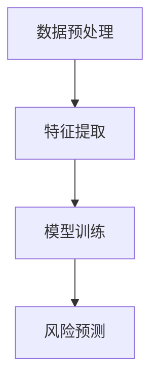
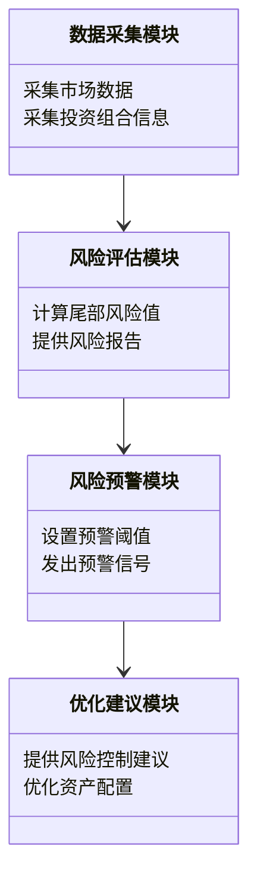
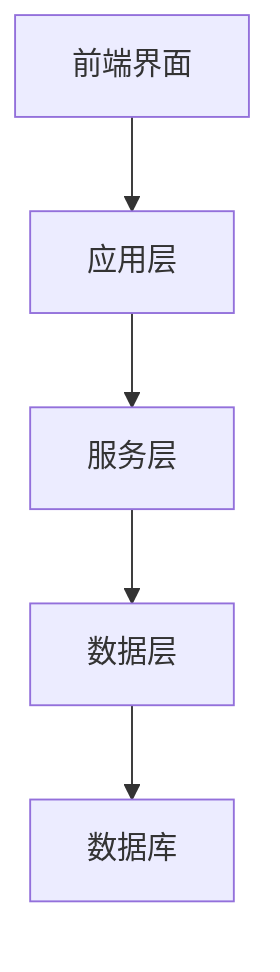
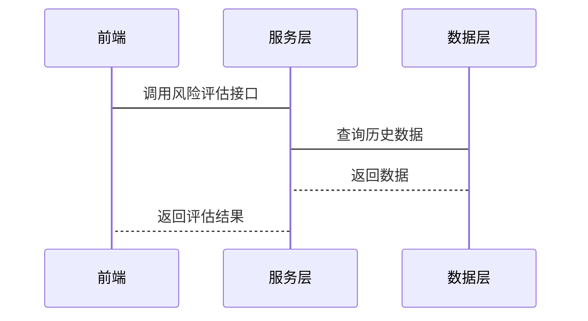

                 


# 构建智能化的个人投资组合尾部风险评估系统

> 关键词：尾部风险、投资组合、风险评估、人工智能、系统架构、机器学习

> 摘要：本文详细探讨了如何利用人工智能和机器学习技术构建智能化的个人投资组合尾部风险评估系统。通过系统化的分析和设计，结合实际案例，本文为投资者提供了一种高效、可靠的尾部风险评估方法，帮助其在复杂多变的金融市场中做出更明智的投资决策。

---

## 第一部分：个人投资组合尾部风险评估系统背景介绍

### 第1章：尾部风险与投资组合评估概述

#### 1.1 尾部风险的定义与特征

##### 1.1.1 尾部风险的定义
尾部风险是指在投资组合中，由于某些资产或市场条件的变化，导致投资组合出现极端损失的概率。这种风险通常发生在概率分布的“尾部”，即低概率但高影响的事件。

##### 1.1.2 尾部风险的特征
- **低概率性**：尾部风险事件的发生概率较低，但一旦发生，可能造成重大损失。
- **高影响性**：尾部风险事件往往会导致投资组合的大幅波动或损失。
- **不可预测性**：尾部风险通常难以通过传统统计方法预测。

##### 1.1.3 尾部风险与投资组合的关系
尾部风险是投资组合整体风险的重要组成部分。传统的风险评估方法通常关注平均情况下的波动性，而尾部风险关注的是极端情况下的损失。

---

#### 1.2 投资组合评估的基本概念

##### 1.2.1 投资组合的定义
投资组合是指投资者持有的多种资产的集合，旨在通过多样化来降低风险。

##### 1.2.2 投资组合的风险与收益
投资组合的风险通常包括市场风险、流动性风险、信用风险等。收益则与资产的配置和市场表现密切相关。

##### 1.2.3 尾部风险在投资组合中的重要性
尾部风险是投资组合整体风险的重要组成部分，尤其是在市场出现极端波动时，尾部风险可能对投资组合造成毁灭性影响。

---

#### 1.3 智能化尾部风险评估的必要性

##### 1.3.1 传统风险评估方法的局限性
传统的风险评估方法通常基于均值-方差模型，难以捕捉极端事件的发生。

##### 1.3.2 智能化评估的优势
人工智能和机器学习技术能够通过大数据分析和复杂模型，捕捉尾部风险的特征，提供更准确的评估。

##### 1.3.3 技术驱动的金融创新
智能化尾部风险评估系统的应用，标志着金融风险管理从传统统计方法向智能化、数据驱动的转变。

---

#### 1.4 本章小结
本章介绍了尾部风险的定义、特征及其在投资组合中的重要性，并强调了智能化尾部风险评估的必要性。

---

### 第2章：尾部风险评估系统的核心概念与联系

#### 2.1 尾部风险评估的核心原理

##### 2.1.1 数据驱动的分析方法
尾部风险评估需要依赖大量的历史数据，通过分析这些数据来识别潜在的极端事件。

##### 2.1.2 统计模型与机器学习算法
常用的统计模型包括VaR（Value at Risk）和CVaR（Conditional Value at Risk）。机器学习算法如随机森林和神经网络也可以用于尾部风险的预测。

##### 2.1.3 系统化评估流程
尾部风险评估的流程通常包括数据收集、特征提取、模型训练和结果分析。

---

#### 2.2 核心概念对比分析

##### 2.2.1 尾部风险与系统性风险对比
| 对比维度 | 尾部风险 | 系统性风险 |
|----------|----------|------------|
| 影响范围 | 个别资产或市场 | 整个市场或经济系统 |
| 发生概率 | 低概率 | 较高概率 |
| 预测难度 | 高 | 较低 |

##### 2.2.2 尾部风险与非尾部风险的特征对比
| 对比维度 | 尾部风险 | 非尾部风险 |
|----------|----------|------------|
| 概率分布 | 尾部区域 | 中间区域 |
| 损失幅度 | 高 | 中等 |
| 预测难度 | 高 | 低 |

##### 2.2.3 传统风险评估与智能化评估对比
| 对比维度 | 传统风险评估 | 智能化风险评估 |
|----------|---------------|---------------|
| 数据依赖 | 较低 | 高 |
| 模型复杂度 | 简单 | 复杂 |
| 预测精度 | 中等 | 高 |

---

#### 2.3 实体关系图（ER图）架构

```mermaid
er
    entity 尾部风险 {
        id
        风险值
        时间戳
        投资组合ID
    }
    entity 投资组合 {
        id
        资产配置
        风险承受能力
    }
    entity 市场数据 {
        id
        资产价格
        时间戳
    }
    尾部风险 -> 投资组合: 所属投资组合
    尾部风险 -> 市场数据: 数据来源
```

---

## 第二部分：算法原理讲解

### 第3章：基于机器学习的尾部风险预测算法

#### 3.1 算法选择与原理

##### 3.1.1 算法选择
常用的机器学习算法包括随机森林、梯度提升树（如XGBoost）、神经网络等。其中，梯度提升树在处理分类和回归问题时表现优异。

##### 3.1.2 算法流程
1. 数据预处理：清洗、特征提取。
2. 模型训练：使用历史数据训练模型。
3. 风险预测：输入当前数据，预测尾部风险值。

---

#### 3.2 算法流程图



---

#### 3.3 算法实现代码

```python
import numpy as np
import pandas as pd
from sklearn.ensemble import GradientBoostingRegressor
from sklearn.metrics import mean_squared_error

# 数据加载
data = pd.read_csv('risk_data.csv')

# 特征与标签分离
X = data.drop('risk_value', axis=1)
y = data['risk_value']

# 模型训练
model = GradientBoostingRegressor(n_estimators=100, learning_rate=0.1, max_depth=3)
model.fit(X, y)

# 预测
new_data = pd.read_csv('new_data.csv')
new_X = new_data.drop('risk_value', axis=1)
predictions = model.predict(new_X)

# 评估
mse = mean_squared_error(new_data['risk_value'], predictions)
print(f"均方误差: {mse}")
```

---

#### 3.4 数学模型与公式

##### 3.4.1 风险预测公式
尾部风险值可以通过以下公式进行预测：
$$
\hat{y} = \beta_0 + \beta_1x_1 + \beta_2x_2 + \ldots + \beta_nx_n
$$

其中，$\hat{y}$ 是预测的风险值，$\beta$ 是模型参数，$x$ 是输入特征。

##### 3.4.2 模型评估公式
均方误差（MSE）公式为：
$$
MSE = \frac{1}{N}\sum_{i=1}^{N}(y_i - \hat{y}_i)^2
$$

---

## 第三部分：系统分析与架构设计方案

### 第4章：系统架构设计

#### 4.1 问题场景介绍
系统需要实时监控投资组合的尾部风险，提供风险预警和优化建议。

#### 4.2 系统功能设计

##### 4.2.1 系统功能模块
- 数据采集模块：收集市场数据和投资组合信息。
- 风险评估模块：计算尾部风险值。
- 风险预警模块：提供实时预警。
- 优化建议模块：给出风险控制建议。

##### 4.2.2 领域模型类图



---

### 第5章：系统架构与接口设计

#### 5.1 系统架构设计

##### 5.1.1 整体架构图



#### 5.2 系统接口设计

##### 5.2.1 API接口定义
- `GET /api/risk/assess`: 获取投资组合的尾部风险评估结果。
- `POST /api/risk/预警设置`: 设置风险预警阈值。

##### 5.2.2 序列图



---

## 第四部分：项目实战

### 第6章：项目实战

#### 6.1 环境安装

##### 6.1.1 安装Python环境
使用Anaconda或virtualenv安装Python 3.8及以上版本。

##### 6.1.2 安装依赖库
安装以下库：
```
pip install numpy pandas scikit-learn mermaid4jupyter jupyterlab
```

---

#### 6.2 核心代码实现

##### 6.2.1 数据加载与处理
```python
import pandas as pd
import numpy as np
from sklearn.model_selection import train_test_split
from sklearn.ensemble import GradientBoostingRegressor
from sklearn.metrics import mean_squared_error

# 加载数据
data = pd.read_csv('risk_data.csv')

# 分割数据
X = data.drop(columns=['risk_value'])
y = data['risk_value']
X_train, X_test, y_train, y_test = train_test_split(X, y, test_size=0.2, random_state=42)

# 训练模型
model = GradientBoostingRegressor(n_estimators=100, learning_rate=0.1, max_depth=3, random_state=42)
model.fit(X_train, y_train)

# 预测
y_pred = model.predict(X_test)

# 评估
mse = mean_squared_error(y_test, y_pred)
print(f"均方误差: {mse}")
```

---

#### 6.3 项目总结

##### 6.3.1 成功经验
- 数据清洗和特征选择是关键。
- 梯度提升树模型表现优异。

##### 6.3.2 经验教训
- 尾部风险的低概率性导致模型训练难度大。
- 数据质量对模型性能影响显著。

---

## 第五部分：最佳实践

### 第7章：最佳实践

#### 7.1 实战经验总结

##### 7.1.1 小贴士
- 定期更新模型，避免过时。
- 结合多种算法，提高预测精度。

##### 7.1.2 注意事项
- 数据来源要可靠。
- 模型要定期调优。
- 风险预警阈值要合理设置。

##### 7.1.3 未来研究方向
- 研究更先进的机器学习算法，如深度学习。
- 结合自然语言处理，分析新闻和公告对尾部风险的影响。

---

## 附录

### A. 术语表

- **VaR**：Value at Risk，风险价值，衡量投资组合在给定置信水平下的最大损失。
- **CVaR**：Conditional Value at Risk，条件风险价值，衡量超过VaR的平均损失。

### B. 参考文献

1. 《机器学习实战》
2. 《Python机器学习》
3. 《投资组合管理》

---

## 作者信息

作者：AI天才研究院/AI Genius Institute & 禅与计算机程序设计艺术 /Zen And The Art of Computer Programming

---

通过以上目录大纲和文章内容，我们可以看到构建智能化的个人投资组合尾部风险评估系统需要从理论到实践的系统性设计和实现。

