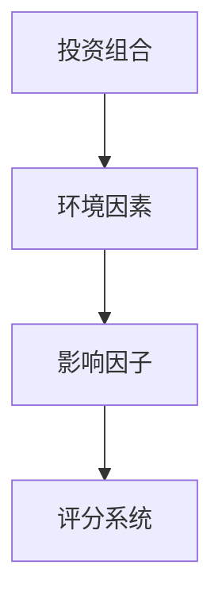
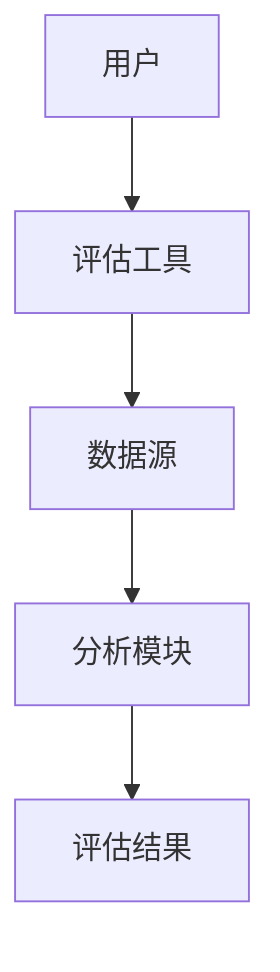
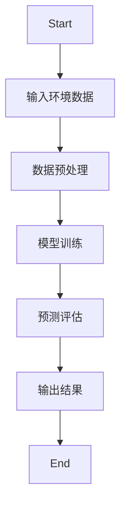
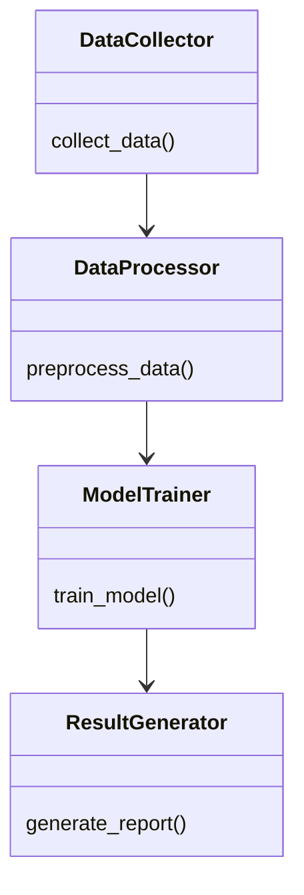
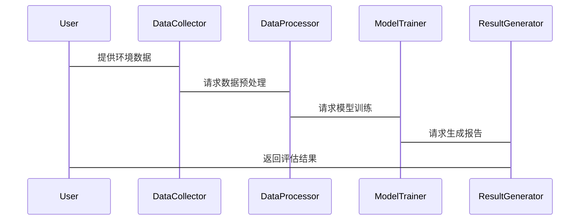

                 


# 构建智能化的个人投资组合环境因素评估工具

> 关键词：个人投资组合，环境因素评估，智能化工具，机器学习，大数据分析

> 摘要：本文将详细介绍如何构建一个智能化的个人投资组合环境因素评估工具。通过结合机器学习和大数据分析技术，我们能够更精准地评估投资组合中的环境因素，从而优化投资决策。本文从背景介绍、核心概念、算法原理、系统架构设计到项目实战，全面解析构建该工具的关键步骤和方法。

---

# 第1章: 个人投资组合与环境因素评估的背景

## 1.1 个人投资组合的核心概念

### 1.1.1 投资组合的基本定义
投资组合是指将资金分配到不同资产（如股票、债券、基金等）上的策略，目的是在风险和收益之间找到最佳平衡点。一个有效的投资组合能够最大化收益并最小化风险。

### 1.1.2 环境因素在投资中的重要性
环境因素包括市场波动、经济指标、政策变化、公司基本面等，这些因素都会影响投资组合的表现。例如，宏观经济政策的变化可能导致市场波动，从而影响投资组合的价值。

### 1.1.3 智能化评估工具的必要性
传统的投资组合评估方法依赖于人工分析，存在效率低、主观性强、覆盖面窄等问题。随着大数据和人工智能技术的发展，智能化评估工具能够更高效、更准确地分析环境因素，为投资决策提供支持。

## 1.2 问题背景与挑战

### 1.2.1 当前投资环境的复杂性
现代金融市场复杂多变，受多种因素影响，如全球经济形势、地缘政治、技术创新等。投资者需要实时跟踪和分析大量信息，以做出明智的投资决策。

### 1.2.2 环境因素对投资决策的影响
环境因素直接影响投资组合的表现。例如，行业政策的变化可能导致某些行业的股票价格波动，宏观经济指标（如GDP增长率、利率变动）也会影响市场的整体走势。

### 1.2.3 传统评估方法的局限性
传统评估方法通常依赖于历史数据分析和人工经验判断，难以及时捕捉市场变化，且可能存在主观偏差。此外，传统方法难以处理大量非结构化数据，如新闻、社交媒体信息等。

## 1.3 智能化评估工具的解决方案

### 1.3.1 AI与大数据技术的应用
智能化评估工具利用机器学习算法分析海量数据，提取有用的信息，帮助投资者做出更精准的决策。例如，自然语言处理技术可以分析新闻和社交媒体，识别市场情绪。

### 1.3.2 智能化工具的核心优势
- **高效性**：自动化数据处理和分析，节省时间和成本。
- **准确性**：基于大量数据和复杂模型，提供更精准的评估结果。
- **实时性**：能够实时跟踪市场动态，及时调整投资策略。

### 1.3.3 工具的边界与外延
智能化工具主要用于辅助决策，而非替代人类判断。它可以帮助投资者识别潜在风险和机会，但最终的决策仍需结合人类的判断和经验。

## 1.4 核心概念与联系

### 1.4.1 环境因素评估的实体关系图


---

# 第2章: 环境因素评估工具的核心概念与联系

## 2.1 核心概念原理

### 2.1.1 环境因素的分类
环境因素可以分为宏观经济因素、行业因素、公司因素等。例如，宏观经济因素包括GDP增长率、通货膨胀率、利率等；行业因素包括行业政策、竞争状况等。

### 2.1.2 智能化评估的基本原理
智能化评估工具通过收集和分析环境数据，利用机器学习模型生成评估结果。模型可以是回归模型、时间序列模型或其他复杂的深度学习模型。

### 2.1.3 工具与用户交互的逻辑
用户输入投资组合信息和环境数据，工具通过算法生成评估报告，提供优化建议。

## 2.2 核心概念属性特征对比

| 概念       | 属性         | 特征                                   |
|------------|--------------|----------------------------------------|
| 投资组合   | 组合性       | 资产多样性                             |
| 环境因素   | 影响力       | 风险因素                               |
| 智能工具   | 学习能力     | 数据处理能力                           |

## 2.3 实体关系图



---

# 第3章: 环境因素评估工具的算法原理

## 3.1 算法概述

### 3.1.1 基于机器学习的评估模型
常用的机器学习模型包括线性回归、随机森林、神经网络等。选择模型时需要考虑数据的特征和复杂度。

### 3.1.2 算法选择的依据
根据数据类型和业务需求选择合适的算法。例如，时间序列数据可以使用ARIMA模型，分类问题可以使用随机森林或支持向量机。

### 3.1.3 算法流程图


## 3.2 算法实现

### 3.2.1 Python代码实现
```python
import pandas as pd
from sklearn.model import LinearRegression

# 数据预处理
data = pd.read_csv('environment_factors.csv')
X = data.drop('target', axis=1)
y = data['target']

# 模型训练
model = LinearRegression()
model.fit(X, y)

# 预测评估
predictions = model.predict(X)
```

### 3.2.2 数学模型和公式
线性回归模型的公式为：
$$ y = \beta_0 + \beta_1x_1 + \beta_2x_2 + ... + \beta_nx_n + \epsilon $$

其中，$\beta_i$ 是回归系数，$\epsilon$ 是误差项。

### 3.2.3 模型优化
通过交叉验证选择最优模型参数，例如选择合适的正则化参数或调整学习率。

---

# 第4章: 系统分析与架构设计

## 4.1 系统功能设计

### 4.1.1 功能模块
- 数据采集模块：从多个数据源获取环境数据。
- 数据分析模块：对数据进行清洗和特征提取。
- 模型训练模块：训练机器学习模型。
- 结果展示模块：生成评估报告并提供优化建议。

### 4.1.2 领域模型类图


### 4.1.3 接口设计
- 数据采集模块提供API接口，接收环境数据。
- 分析模块提供API接口，接收预处理后的数据。
- 模型训练模块提供API接口，接收训练数据。
- 结果展示模块提供API接口，返回评估结果。

### 4.1.4 交互流程图


---

# 第5章: 项目实战

## 5.1 环境安装

### 5.1.1 安装Python和必要的库
```bash
pip install pandas scikit-learn matplotlib
```

### 5.1.2 数据源配置
配置数据源，例如连接数据库或设置API密钥。

## 5.2 核心代码实现

### 5.2.1 数据采集
```python
import requests

def fetch_data(api_key):
    response = requests.get(f'https://api.example.com/environment_factors?api_key={api_key}')
    return response.json()
```

### 5.2.2 数据分析
```python
import pandas as pd

def preprocess_data(data):
    df = pd.DataFrame(data)
    df = df.dropna()
    return df
```

### 5.2.3 模型训练
```python
from sklearn.model import LinearRegression

def train_model(X, y):
    model = LinearRegression()
    model.fit(X, y)
    return model
```

### 5.2.4 结果展示
```python
import matplotlib.pyplot as plt

def plot_results(predictions, actual):
    plt.scatter(actual, predictions)
    plt.xlabel('Actual Values')
    plt.ylabel('Predicted Values')
    plt.show()
```

## 5.3 案例分析与结果展示

### 5.3.1 案例背景
假设我们有一个包含经济指标和市场情绪的环境因素数据集。

### 5.3.2 数据处理
```python
data = fetch_data(api_key='your_api_key')
df = preprocess_data(data)
```

### 5.3.3 模型训练
```python
model = train_model(df[['GDP', 'Market Sentiment']], df['Target'])
```

### 5.3.4 结果分析
```python
plot_results(model.predict(df[['GDP', 'Market Sentiment']]), df['Target'])
```

---

# 第6章: 总结与展望

## 6.1 项目总结
通过构建智能化的个人投资组合环境因素评估工具，我们能够更高效、更准确地评估投资组合的风险和收益。工具的核心优势在于其自动化和智能化，能够帮助投资者做出更明智的决策。

## 6.2 未来展望
未来，随着人工智能和大数据技术的不断发展，智能化工具将变得更加智能和精准。我们可以进一步优化模型，引入更多的环境因素，提升评估的准确性和实时性。

---

# 作者：AI天才研究院 & 禅与计算机程序设计艺术

---

通过以上目录结构，我们可以逐步构建一个完整的智能化个人投资组合环境因素评估工具，从理论到实践，帮助投资者优化其投资策略。

