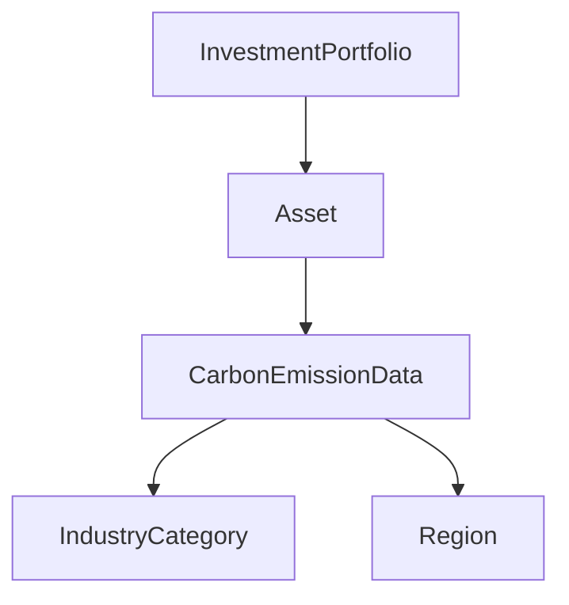
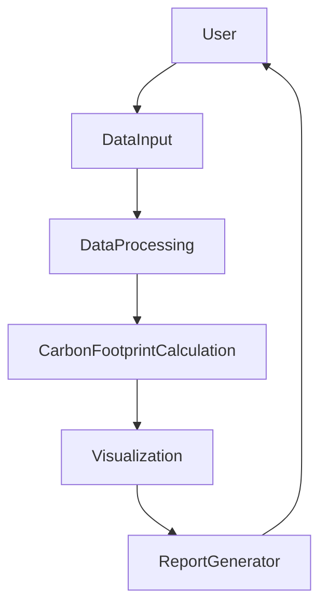

                 


# 构建智能化的个人投资组合碳足迹评估工具

> 关键词：智能化投资工具、碳足迹评估、个人投资组合、绿色金融、可持续发展

> 摘要：随着全球对碳中和目标的重视，个人投资者越来越关注其投资组合对环境的影响。本文旨在探讨如何构建一个智能化的个人投资组合碳足迹评估工具，帮助投资者量化其投资行为的环境影响，从而做出更环保的投资决策。文章从背景与问题描述、碳足迹计算方法、智能化算法设计、系统架构实现、项目实战等方面展开详细论述，结合实际案例和代码实现，为读者提供全面的技术指导。

---

# 第一部分: 背景与问题描述

## 第1章: 碳中和目标与投资责任

### 1.1 碳中和目标的全球背景
- **1.1.1 全球气候变化的严峻性**：全球气温上升、极端天气频发，迫使各国政府将碳中和列为国家战略。
- **1.1.2 个人责任的觉醒**：从企业到个人，都在寻求降低碳排放的方法。
- **1.1.3 投资领域的影响**：绿色金融、ESG投资理念的兴起。

### 1.2 投资组合碳足迹的核心问题
- **1.2.1 碳足迹的定义**：资产或投资组合在整个生命周期中产生的温室气体排放总量。
- **1.2.2 投资组合的复杂性**：涉及多种资产类型，如股票、债券、基金等，每种资产的碳排放来源不同。
- **1.2.3 智能化评估的必要性**：传统手动计算耗时且不准确，智能化工具可提高效率和精确度。

### 1.3 本章小结
- 本章介绍了碳中和目标的全球背景，阐述了个人投资者在这一目标中的责任，重点分析了投资组合碳足迹评估的核心问题及其智能化的必要性。

---

# 第二部分: 碳足迹计算方法论

## 第2章: 碳足迹计算的核心原理

### 2.1 碳足迹的计算框架
- **2.1.1 生命周期评价（LCA）方法**：从原材料提取、生产、使用到废弃的全生命周期评估。
- **2.1.2 碳排放因子**：单位资产或服务的碳排放量，通常以吨二氧化碳当量（tCO2e）表示。
- **2.1.3 综合评估模型**：将各资产的碳排放量加权求和，得出投资组合的整体碳足迹。

### 2.2 投资组合碳足迹的影响因素
- **2.2.1 资产构成**：不同资产的碳排放强度差异显著，例如化石能源类资产的碳排放较高。
- **2.2.2 地理位置**：不同地区的碳排放因子可能不同，例如电力来源可能影响投资组合的碳排放。
- **2.2.3 时间维度**：动态调整投资组合时，需考虑实时碳排放数据的变化。

### 2.3 核心概念与联系
- **2.3.1 实体关系图（ER图）**：展示了投资组合、资产、碳排放数据之间的关系。


---

## 第3章: 智能化碳足迹评估算法

### 3.1 算法原理与流程
- **3.1.1 数据收集与预处理**：从公开数据库或API获取资产信息和碳排放数据。
- **3.1.2 碳排放因子计算**：基于历史数据，计算每种资产的碳排放因子。
- **3.1.3 投资组合碳足迹评估**：通过加权计算得出整体碳足迹。

### 3.2 算法实现代码
```python
import pandas as pd

def calculate_carbon_emission(weights, emissions):
    # 权重和排放因子均为 pandas Series
    return (weights * emissions).sum()

# 示例数据
weights = pd.Series([0.4, 0.3, 0.2, 0.1], index=['股票', '债券', '基金', '黄金'])
emissions = pd.Series([1.5, 0.8, 2.0, 0.5], index=['股票', '债券', '基金', '黄金'])

carbon_emission = calculate_carbon_emission(weights, emissions)
print(f"投资组合的碳排放量为：{carbon_emission} tCO2e")
```

### 3.3 算法优化与改进
- **3.3.1 动态调整模型**：引入实时碳排放数据，优化评估结果。
- **3.3.2 机器学习应用**：使用回归模型预测未来碳排放趋势，提供前瞻性评估。

---

## 第4章: 系统架构设计

### 4.1 系统功能设计
- **4.1.1 数据输入模块**：用户输入投资组合信息。
- **4.1.2 数据处理模块**：清洗和转换数据，提取特征。
- **4.1.3 碳足迹计算模块**：基于算法计算碳足迹。
- **4.1.4 可视化展示模块**：生成图表和报告。

### 4.2 系统架构图


### 4.3 关键技术实现
- **4.3.1 数据存储**：使用数据库存储资产和碳排放数据。
- **4.3.2 算法实现**：在后端使用Python或R语言实现计算逻辑。
- **4.3.3 可视化工具**：使用D3.js或Tableau生成交互式图表。

---

## 第5章: 项目实战与案例分析

### 5.1 项目环境安装
```bash
pip install pandas numpy matplotlib flask
```

### 5.2 核心代码实现
```python
from flask import Flask, request, jsonify

app = Flask(__name__)

@app.route('/calculate-carbon', methods=['POST'])
def calculate_carbon():
    data = request.json
    weights = pd.Series(data['weights'])
    emissions = pd.Series(data['emissions'])
    result = calculate_carbon_emission(weights, emissions)
    return jsonify({'carbon_emission': result})

if __name__ == '__main__':
    app.run(debug=True)
```

### 5.3 案例分析
- **案例1**：假设某投资者的投资组合为股票（40%）、债券（30%）、基金（20%）、黄金（10%），对应的碳排放因子分别为1.5、0.8、2.0、0.5。计算其碳足迹为：
$$ \text{碳足迹} = 0.4 \times 1.5 + 0.3 \times 0.8 + 0.2 \times 2.0 + 0.1 \times 0.5 = 1.15 \, \text{tCO2e} $$

---

## 第6章: 总结与展望

### 6.1 最佳实践
- 定期更新碳排放数据。
- 结合ESG评分，提供更全面的评估。

### 6.2 注意事项
- 数据来源的可靠性。
- 模型的适用性与局限性。

### 6.3 拓展阅读
- 参考文献：[《碳中和目标下的绿色投资策略》](#)。
- 推荐工具：[在线碳足迹计算器](#)。

---

作者：AI天才研究院/AI Genius Institute & 禅与计算机程序设计艺术 /Zen And The Art of Computer Programming

---

通过本文的详细阐述，读者可以系统地了解智能化个人投资组合碳足迹评估工具的构建过程，从理论到实践，逐步掌握实现方法。希望本文能为绿色金融和可持续投资领域提供有价值的参考与指导。

