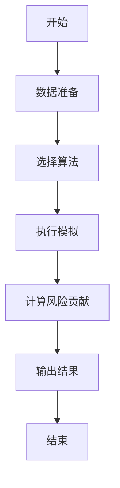
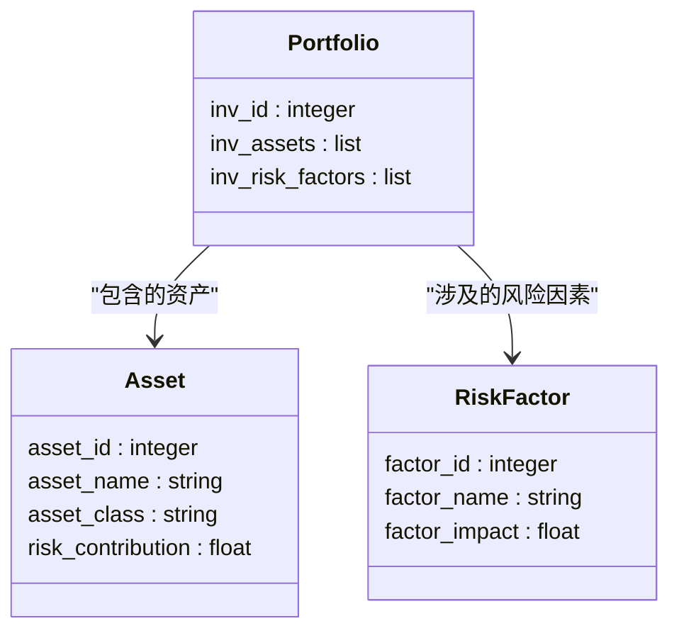
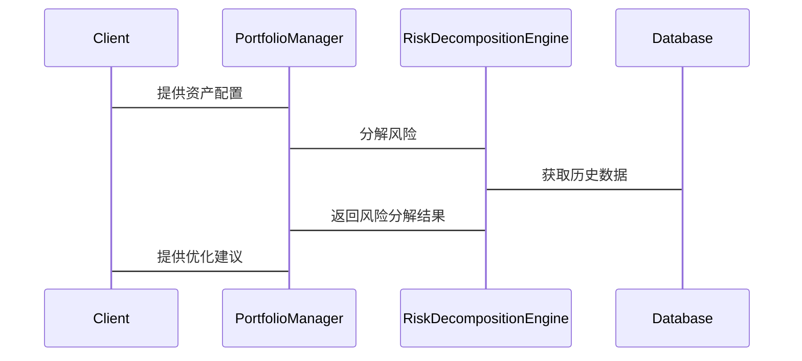

                 


# 构建智能化的个人投资组合风险分解系统

> 关键词：投资组合，风险分解，人工智能，机器学习，系统架构

> 摘要：本文详细探讨了构建智能化的个人投资组合风险分解系统的各个方面，包括背景介绍、核心概念、算法原理、系统架构设计、项目实战以及最佳实践。通过理论与实践相结合的方式，为读者提供一套完整的解决方案，帮助个人投资者有效管理投资风险。

---

# 第一部分: 背景介绍与核心概念

## 第1章: 个人投资组合风险分解的背景与问题

### 1.1 问题背景

#### 1.1.1 个人投资组合管理的重要性
个人投资组合管理是实现财务目标的关键，涉及资产配置、风险控制和收益最大化。有效的风险管理能帮助投资者在市场波动中保持稳定收益。

#### 1.1.2 风险分解在投资组合管理中的作用
风险分解是将整体投资组合风险分解为各个资产或资产类别贡献的过程，有助于识别和管理风险来源，优化投资组合。

#### 1.1.3 当前投资组合风险管理的挑战
传统方法依赖经验判断，难以量化和动态调整。市场波动和复杂性增加，需要更智能化的方法来应对。

### 1.2 问题描述

#### 1.2.1 投资组合风险的多维度性
风险来源包括市场风险、流动性风险、信用风险等，需综合考虑多个因素。

#### 1.2.2 风险分解的复杂性
不同资产类别和市场条件下的风险分解复杂，需要系统化的方法。

#### 1.2.3 传统方法的局限性
传统方法难以实时更新和动态调整，缺乏数据驱动的决策支持。

### 1.3 问题解决思路

#### 1.3.1 智能化投资组合管理的必要性
利用人工智能和大数据技术，实现投资组合的动态优化和风险控制。

#### 1.3.2 风险分解系统的目标
量化各资产的风险贡献，提供实时监控和调整建议，优化投资组合表现。

#### 1.3.3 系统设计的核心要素
数据采集、风险模型、优化算法、用户界面和实时监控。

### 1.4 系统的边界与外延

#### 1.4.1 系统功能边界
仅处理投资组合风险分解，不涉及具体交易执行。

#### 1.4.2 与外部系统的交互
与数据源、投资管理平台和市场数据接口交互。

#### 1.4.3 系统的可扩展性
支持新增资产类别和风险模型，适应不同投资者需求。

### 1.5 核心概念与要素组成

#### 1.5.1 投资组合的构成要素
资产、权重、风险因子、收益目标。

#### 1.5.2 风险分解的数学模型
现代投资组合理论，因子分解模型。

#### 1.5.3 智能化系统的组成部分
数据采集模块、风险评估模块、优化模块、用户界面。

---

# 第二部分: 核心概念与联系

## 第2章: 核心概念与系统架构

### 2.1 核心概念原理

#### 2.1.1 资产配置与风险分解
资产配置决定投资组合的风险和收益，风险分解量化各资产贡献。

#### 2.1.2 机器学习在风险评估中的应用
使用机器学习模型预测市场风险和资产相关性。

#### 2.1.3 系统智能化的核心算法
因子分析、蒙特卡洛模拟、线性回归等。

### 2.2 核心概念对比分析

#### 2.2.1 资产配置与风险分解的对比
资产配置是全局优化，风险分解是局部分析；前者决定整体风险，后者量化各部分贡献。

#### 2.2.2 传统方法与智能化方法的对比
传统方法依赖经验，智能化方法数据驱动，实时调整。

#### 2.2.3 不同风险分解模型的对比
传统VaR与现代因子分解法在准确性和计算复杂度上各有优劣。

### 2.3 系统架构的ER实体关系图

```mermaid
erDiagram
    inv Portfolio {
        inv_id : integer
        inv_name : string
        inv_assets : many
        inv_risk_factors : many
    }
    asset {
        asset_id : integer
        asset_name : string
        asset_class : string
        risk_contribution : float
    }
    risk_factor {
        factor_id : integer
        factor_name : string
        factor_impact : float
    }
    Portfolio o--asset : "包含的资产"
    Portfolio o--risk_factor : "涉及的风险因素"
```

---

# 第三部分: 算法原理

## 第3章: 算法原理与实现

### 3.1 选择合适的算法

#### 3.1.1 蒙特卡洛模拟
用于模拟市场波动，评估投资组合在不同情景下的表现。

#### 3.1.2 因子分解模型
将市场风险分解为几个主要因子，如市值、价值、动量等。

### 3.2 算法流程图



### 3.3 Python代码实现

```python
import numpy as np
from sklearn.linear_model import LinearRegression

def calculate_risk_contribution(weights, returns, factors):
    model = LinearRegression()
    model.fit(factors, returns)
    beta = model.coef_
    risk_contribution = beta * weights
    return risk_contribution

weights = np.array([0.3, 0.4, 0.3])
returns = np.array([0.1, 0.2, 0.15])
factors = np.array([[1, 0, 0], [0, 1, 0], [0, 0, 1]])

result = calculate_risk_contribution(weights, returns, factors)
print(result)
```

### 3.4 数学模型与公式

现代投资组合理论中，风险分解可以通过回归模型表示：

$$
R_p = \beta^T F + \epsilon
$$

其中，\( R_p \) 是投资组合的收益，\( F \) 是因子矩阵，\( \beta \) 是因子暴露，\( \epsilon \) 是残差。

---

# 第四部分: 系统分析与架构设计

## 第4章: 系统架构设计

### 4.1 问题场景介绍

#### 4.1.1 投资者使用场景
投资者输入资产配置，系统分解风险并提供优化建议。

#### 4.1.2 系统功能需求
实时风险评估、动态调整建议、历史数据分析。

### 4.2 系统功能设计

#### 4.2.1 领域模型类图



#### 4.2.2 系统架构图


#### 4.2.3 系统接口设计
API接口：获取资产数据、计算风险贡献、返回优化建议。

#### 4.2.4 系统交互流程图



---

# 第五部分: 项目实战

## 第5章: 项目实战与案例分析

### 5.1 环境安装

#### 5.1.1 安装Python与相关库
安装Python 3.8及以上版本，安装pandas、numpy、scikit-learn等库。

### 5.2 系统核心实现

#### 5.2.1 风险分解模块

```python
def decompose_portfolio_risk(weights, returns, factors):
    model = LinearRegression()
    model.fit(factors, returns)
    beta = model.coef_
    risk_contribution = beta * weights
    return risk_contribution

weights = np.array([0.2, 0.3, 0.5])
returns = np.array([0.1, 0.2, 0.15])
factors = np.array([[1, 0, 0], [0, 1, 0], [0, 0, 1]])

result = decompose_portfolio_risk(weights, returns, factors)
print(result)
```

#### 5.2.2 优化模块

```python
def optimize_portfolio(weights, returns, risk_free_rate):
    return (returns - risk_free_rate) * weights

weights = np.array([0.3, 0.4, 0.3])
returns = np.array([0.1, 0.2, 0.15])
risk_free_rate = 0.05

result = optimize_portfolio(weights, returns, risk_free_rate)
print(result)
```

### 5.3 代码应用解读与分析

#### 5.3.1 风险分解代码解读
使用线性回归模型，计算各资产对整体风险的贡献。

#### 5.3.2 优化代码解读
计算各资产的超额收益，确定最优权重。

### 5.4 实际案例分析

#### 5.4.1 数据准备与输入
收集资产的历史收益和因子数据。

#### 5.4.2 系统运行与结果输出
运行代码，获得风险分解结果和优化建议。

#### 5.4.3 结果分析与解释
解释风险分解结果，优化投资组合。

### 5.5 项目小结

#### 5.5.1 项目总结
系统实现了智能化风险分解，优化了投资组合。

#### 5.5.2 经验总结
数据质量关键，模型选择影响结果，系统需定期更新。

---

# 第六部分: 最佳实践与小结

## 第6章: 最佳实践与总结

### 6.1 最佳实践

#### 6.1.1 数据收集与处理
确保数据准确、完整，选择合适的数据源。

#### 6.1.2 模型选择与调优
根据实际情况选择模型，进行参数调整。

#### 6.1.3 系统维护与更新
定期更新模型，适应市场变化。

### 6.2 小结

#### 6.2.1 项目目标达成
实现了智能化的风险分解系统，优化了投资组合。

#### 6.2.2 系统优势
动态调整、实时监控、数据驱动。

### 6.3 注意事项

#### 6.3.1 数据质量
数据错误会影响结果，需严格控制。

#### 6.3.2 模型选择
不同模型适用于不同情况，需谨慎选择。

#### 6.3.3 系统维护
定期更新数据和模型，保持系统有效性。

### 6.4 拓展阅读

#### 6.4.1 推荐书籍
《Python机器学习实战》、《投资学》。

#### 6.4.2 在线资源
建议阅读相关技术博客和学术论文。

---

# 作者

作者：AI天才研究院/AI Genius Institute & 禅与计算机程序设计艺术 /Zen And The Art of Computer Programming

