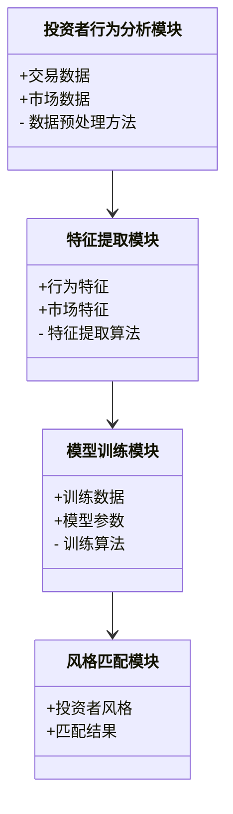
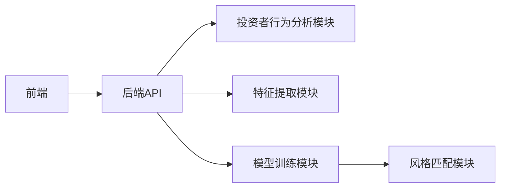
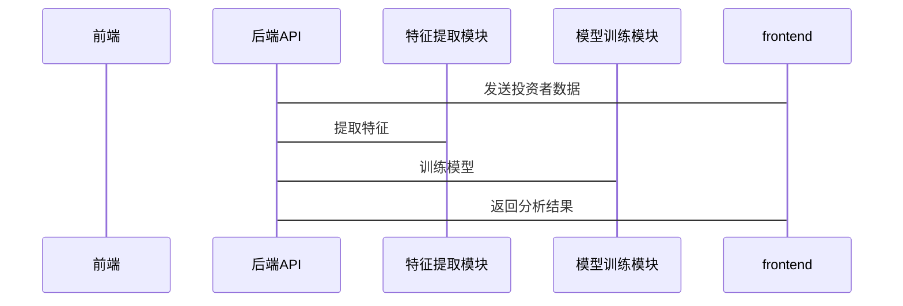

                 


# 构建智能化的个人投资风格分析与匹配系统

> 关键词：智能化、个人投资、风格分析、机器学习、匹配系统

> 摘要：本文详细探讨了如何构建智能化的个人投资风格分析与匹配系统。通过结合机器学习和大数据分析技术，系统地分析个人投资者的行为特征、风险偏好和投资决策模式，从而实现个性化的投资风格匹配。文章从背景、核心概念、算法原理、系统设计、项目实战到最佳实践，全面阐述了构建这一系统的各个方面，为投资者和相关技术人士提供了理论和实践指导。

---

# 第1章：智能化个人投资风格分析与匹配系统背景

## 1.1 投资风格分析的背景与意义

### 1.1.1 传统投资风格分析的局限性
传统的投资风格分析主要依赖于投资者的自我报告和简单的统计分析，存在以下问题：
- **主观性**：投资者可能无法准确描述自己的投资风格，或者故意掩饰某些特征。
- **静态性**：传统方法往往只在某一时间点进行分析，忽视了投资风格的动态变化。
- **低效性**：手动分析大量数据耗时耗力，难以应对海量投资者的需求。

### 1.1.2 智能化分析的必要性
随着大数据和人工智能技术的发展，智能化分析成为可能：
- **高效性**：通过自动化数据处理和机器学习算法，可以快速分析大量数据。
- **准确性**：利用算法模型可以更客观地识别投资风格。
- **动态性**：系统可以实时更新数据，捕捉投资风格的变化。

### 1.1.3 系统化投资决策的重要性
系统化投资决策可以帮助投资者：
- 减少情绪化决策的影响。
- 提高决策的科学性和准确性。
- 优化投资组合，提升收益。

## 1.2 个人投资风格的定义与分类

### 1.2.1 个人投资风格的定义
个人投资风格是指投资者在决策过程中的偏好、行为模式和策略选择。它反映了投资者的风险承受能力、收益预期和交易习惯。

### 1.2.2 基于风险偏好的分类
根据投资者的风险偏好，可以将投资风格分为：
- **保守型**：低风险承受能力，注重本金安全。
- **稳健型**：中等风险承受能力，追求稳定收益。
- **进取型**：高风险承受能力，追求高收益。

### 1.2.3 基于行为特征的分类
根据投资者的行为特征，可以将投资风格分为：
- **价值型**：注重低估值，长期持有优质资产。
- **成长型**：关注高增长潜力的公司，愿意承担较高风险。
- **技术型**：依赖技术分析，频繁交易捕捉短期波动。

## 1.3 当前投资风格分析的现状与挑战

### 1.3.1 数据获取的难度
- **数据量大**：需要收集大量的交易记录、市场数据和投资者行为数据。
- **数据多样性**：数据来源广泛，包括市场数据、新闻、社交媒体等。

### 1.3.2 分析方法的局限性
- **传统方法**：依赖统计分析和专家判断，主观性强，效率低。
- **新兴技术**：机器学习和深度学习在投资风格分析中的应用还处于探索阶段。

### 1.3.3 系统化匹配的挑战
- **个性化需求**：每个投资者的投资风格都是独特的，系统需要高度个性化。
- **动态变化**：投资风格会随着市场环境和个人情况的变化而变化，系统需要实时更新和调整。

---

# 第2章：智能化投资风格分析的核心概念

## 2.1 投资者行为分析

### 2.1.1 行为数据的采集与处理
行为数据包括：
- **交易记录**：买入、卖出、持仓时间等。
- **市场数据**：市场指数、股票价格、成交量等。
- **情绪数据**：社交媒体、新闻 sentiment 等。

### 2.1.2 基于机器学习的行为建模
通过机器学习算法，分析投资者的行为特征，识别其投资风格。例如：
- 使用聚类分析将投资者分为不同的类型。
- 使用分类模型预测投资者的风格类别。

## 2.2 投资决策模型

### 2.2.1 基于特征的分类模型
- **特征提取**：从行为数据中提取特征，如交易频率、平均持仓时间等。
- **分类模型**：使用逻辑回归、随机森林等模型进行分类。

### 2.2.2 基于深度学习的生成模型
- **生成模型**：如GAN（生成对抗网络）可以生成虚拟投资者行为数据，用于训练和测试。

## 2.3 系统架构设计

### 2.3.1 系统模块划分
- **数据采集模块**：收集投资者行为数据。
- **特征提取模块**：提取关键特征。
- **模型训练模块**：训练分类或生成模型。
- **风格匹配模块**：根据模型结果匹配最优投资策略。

### 2.3.2 数据流与业务流设计
数据流：
1. 采集投资者行为数据。
2. 提取特征并进行预处理。
3. 训练模型，生成投资风格分类。
4. 匹配最优投资策略。

业务流：
1. 投资者输入交易数据。
2. 系统分析并分类。
3. 提供个性化投资建议。

---

# 第3章：智能化投资风格分析的算法原理

## 3.1 基于机器学习的分析方法

### 3.1.1 线性回归模型
- **线性回归**：用于预测连续型变量，如投资回报率。
- **公式**：$$ y = \beta_0 + \beta_1x_1 + \beta_2x_2 + ... + \beta_nx_n $$

### 3.1.2 支持向量机（SVM）
- **SVM**：用于分类问题，适合小样本数据。
- **流程图**：
  ```mermaid
  graph LR
    A[输入数据] --> B[数据预处理] --> C[特征提取] --> D[训练模型] --> E[输出结果]
  ```

### 3.1.3 随机森林与梯度提升树
- **随机森林**：通过集成多个决策树提高准确性。
- **梯度提升树**：逐步优化模型，减少误差。

## 3.2 基于深度学习的分析方法

### 3.2.1 神经网络基础
- **神经网络**：通过多层神经元模拟人脑进行学习。
- **公式**：$$ y = \sigma(wx + b) $$

### 3.2.2 卷积神经网络（CNN）
- **CNN**：适合处理图像数据，也可用于时间序列分析。
- **流程图**：
  ```mermaid
  graph LR
    A[输入数据] --> B[卷积层] --> C[池化层] --> D[全连接层] --> E[输出结果]
  ```

### 3.2.3 循环神经网络（RNN）
- **RNN**：适合处理时间序列数据，如交易记录。
- **公式**：$$ h_t = \sigma(W_{hh}h_{t-1} + W_{xh}x_t) $$

## 3.3 算法选择与优化

### 3.3.1 算法性能评估指标
- **准确率**：分类正确的比例。
- **召回率**：识别出正样本的比例。
- **F1分数**：综合准确率和召回率的指标。

### 3.3.2 超参数调整
- **网格搜索**：遍历所有可能的超参数组合，找到最优组合。
- **随机搜索**：随机选择超参数组合，减少计算量。

---

# 第4章：智能化投资风格分析的系统设计

## 4.1 系统功能设计

### 4.1.1 领域模型（Mermaid类图）


### 4.1.2 系统架构设计（Mermaid架构图）


### 4.1.3 系统接口设计
- **前端接口**：接收投资者数据，返回分析结果。
- **后端接口**：处理数据，调用模型进行分析。

### 4.1.4 系统交互（Mermaid序列图）


---

# 第5章：智能化投资风格分析的项目实战

## 5.1 环境安装与配置

### 5.1.1 安装Python
```bash
python --version
pip install --upgrade pip
```

### 5.1.2 安装依赖库
```bash
pip install numpy pandas scikit-learn tensorflow
```

## 5.2 核心代码实现

### 5.2.1 数据预处理
```python
import pandas as pd

data = pd.read_csv('investor_data.csv')
data.dropna(inplace=True)
```

### 5.2.2 特征提取
```python
from sklearn.preprocessing import StandardScaler

scaler = StandardScaler()
features = scaler.fit_transform(data[['交易频率', '平均持仓时间', '收益波动率']])
```

### 5.2.3 模型训练
```python
from sklearn.ensemble import RandomForestClassifier

model = RandomForestClassifier(n_estimators=100, random_state=42)
model.fit(features, data['风格标签'])
```

### 5.2.4 风格匹配
```python
import numpy as np

new_investor = np.array([[0.5, 0.3, 0.2]])
predicted_style = model.predict(new_investor)
print(predicted_style)
```

## 5.3 实际案例分析
假设我们有以下投资者数据：
```python
investor_data = {
    '交易频率': [0.8, 0.4, 0.6],
    '平均持仓时间': [30, 60, 180],
    '收益波动率': [0.2, 0.1, 0.3]
}
```
通过模型分析，预测其投资风格为“稳健型”。

---

# 第6章：智能化投资风格分析的最佳实践

## 6.1 小结
- **智能化分析**：通过机器学习和深度学习技术，可以更准确地分析投资风格。
- **系统化匹配**：利用系统架构设计，实现个性化的投资策略匹配。

## 6.2 注意事项
- **数据隐私**：确保投资者数据的安全性和隐私性。
- **模型更新**：定期更新模型，适应市场变化。
- **用户体验**：提供友好的用户界面，方便投资者使用。

## 6.3 拓展阅读
- **推荐书籍**：《Python机器学习实战》、《深度学习入门：基于Python》
- **在线资源**：Coursera的“机器学习”课程、Kaggle上的相关项目

---

# 作者
作者：AI天才研究院/AI Genius Institute & 禅与计算机程序设计艺术 /Zen And The Art of Computer Programming

