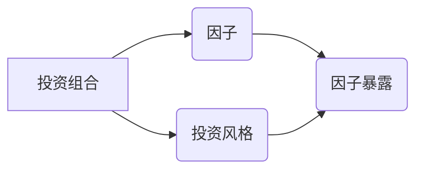
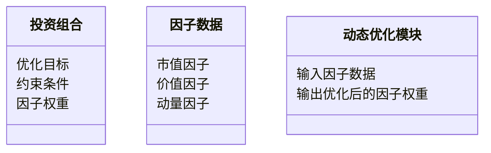
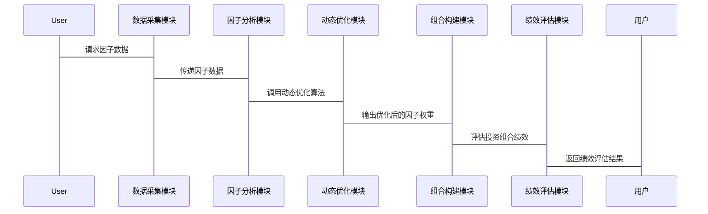

                 


# 构建智能化的个人投资风格因子暴露动态优化系统

> 关键词：投资风格，因子暴露，动态优化，人工智能，量化投资

> 摘要：本文系统地阐述了构建智能化个人投资风格因子暴露动态优化系统的背景、核心概念、算法原理、系统架构、项目实战以及最佳实践。通过结合数学模型、机器学习算法和系统架构设计，本文为投资者提供了一种智能化的投资风格管理解决方案，帮助投资者在复杂多变的市场环境中实现投资目标的动态优化。

---

## 第一部分: 智能化投资风格因子暴露优化的背景与概念

### 第1章: 个人投资风格与因子暴露的背景介绍

#### 1.1 问题背景与定义
##### 1.1.1 投资风格与因子暴露的定义
投资风格是指投资者在构建投资组合时所采用的具体策略和偏好，例如价值投资、成长投资、动量投资等。因子暴露则是指投资组合在特定风险因子上的敞口大小，例如市值因子、价值因子、动量因子等。

##### 1.1.2 传统投资风格管理的局限性
传统的投资风格管理通常基于固定的因子权重或静态的风格配置，难以适应市场环境的变化。例如，在市场波动加剧时，某些因子可能不再具有超额收益潜力，但传统方法无法动态调整。

##### 1.1.3 智能化投资的必要性
随着市场环境的变化和投资者需求的多样化，传统的静态投资风格管理已难以满足需求。智能化投资通过引入机器学习、大数据分析等技术，能够动态优化因子暴露，适应市场变化。

#### 1.1.4 动态优化的核心概念
动态优化是指在投资组合管理中，根据市场环境的变化，实时调整因子暴露，以实现投资目标的动态最优配置。

---

### 第2章: 智能化系统的核心概念与联系

#### 2.1 核心概念原理
##### 2.1.1 因子暴露的数学模型
因子暴露可以表示为投资组合在各个因子上的权重。例如，对于一个包含n个因子的投资组合，因子暴露可以表示为向量w，其中每个元素w_i表示投资组合在因子i上的权重。

##### 2.1.2 动态优化算法的原理
动态优化算法通过不断调整因子暴露，以最大化投资组合的预期收益或最小化其风险。常见的动态优化算法包括均值-方差优化、风险平价优化等。

##### 2.1.3 智能化系统的整体架构
智能化投资系统通常由数据采集、因子分析、动态优化、组合构建和绩效评估五个模块组成。

#### 2.2 概念属性对比表
下表对比了因子暴露与投资风格的核心属性：

| 属性          | 因子暴露                     | 投资风格                     |
|---------------|------------------------------|------------------------------|
| 定义          | 投资组合在因子上的权重     | 投资组合的策略和偏好         |
| 动态性        | 可动态调整                   | 可动态调整                   |
| 目标          | 最优因子权重                 | 最优投资策略                 |
| 约束条件      | 风险约束、流动性约束         | 收益目标、风险偏好           |

#### 2.3 ER实体关系图
下图展示了投资组合、因子和因子暴露之间的关系：



---

## 第三部分: 算法原理与数学模型

### 第3章: 算法原理与数学模型

#### 3.1 算法原理
##### 3.1.1 因子分解模型
因子分解模型通过分解因子数据，提取其潜在的因子结构。常见的因子分解方法包括主成分分析（PCA）和奇异值分解（SVD）。

##### 3.1.2 动态优化模型
动态优化模型通过不断调整因子暴露，以实现投资目标的动态最优配置。常见的动态优化算法包括：

1. 均值-方差优化：$$ \min_{w} \frac{1}{2}w^TQw + r^Tw $$
   其中，Q 是正定矩阵，r 是目标收益向量。

2. 风险平价优化：$$ \min_{w} \frac{1}{2}w^TQw $$
   其中，Q 是风险矩阵。

##### 3.1.3 算法流程图
下图展示了动态优化算法的流程：


#### 3.2 代码实现
以下代码实现了一个简单的动态优化算法：

```python
import numpy as np

def factor_exposure_optimization(factor_matrix, target_return):
    # 因子分解
    U, S, Vt = np.linalg.svd(factor_matrix)
    # 动态优化
    Q = np.dot(U, U.T)
    r = np.dot(Vt, target_return)
    w = np.linalg.solve(Q, r)
    return w
```

---

## 第四部分: 系统分析与架构设计

### 第4章: 系统分析与架构设计

#### 4.1 项目背景与目标
##### 4.1.1 项目背景介绍
随着市场环境的变化，投资者需要一种能够动态调整因子暴露的投资系统，以实现投资目标的动态优化。

##### 4.1.2 项目目标与范围
本项目的目标是构建一个智能化的个人投资风格因子暴露动态优化系统，能够实时调整因子暴露，适应市场环境的变化。

#### 4.2 系统功能设计
##### 4.2.1 领域模型
下图展示了系统的领域模型：



##### 4.2.2 系统架构图
下图展示了系统的整体架构：


#### 4.3 系统接口设计
系统接口设计包括数据接口、优化接口和输出接口。数据接口用于获取因子数据，优化接口用于调用动态优化算法，输出接口用于输出优化后的因子权重。

#### 4.4 系统交互流程
下图展示了系统的交互流程：



---

## 第五部分: 项目实战

### 第5章: 项目实战

#### 5.1 环境配置
##### 5.1.1 数据源
使用历史股票数据作为因子数据，包括市值因子、价值因子、动量因子等。

##### 5.1.2 工具安装
安装必要的Python库，例如numpy、pandas、scipy等。

#### 5.2 核心代码实现
##### 5.2.1 因子分解代码
```python
import numpy as np

def factor_decomposition(factor_matrix):
    U, S, Vt = np.linalg.svd(factor_matrix)
    return U, S, Vt
```

##### 5.2.2 动态优化代码
```python
def dynamic_optimization(factor_matrix, target_return):
    U, S, Vt = np.linalg.svd(factor_matrix)
    Q = np.dot(U, U.T)
    r = np.dot(Vt, target_return)
    w = np.linalg.solve(Q, r)
    return w
```

#### 5.3 功能解读与案例分析
##### 5.3.1 功能解读
动态优化模块通过分解因子数据，提取其潜在结构，并根据目标收益动态调整因子权重。

##### 5.3.2 案例分析
以一个简单的投资组合为例，假设目标收益为10%，因子数据如下：

| 因子 | 市值因子 | 价值因子 | 动量因子 |
|------|----------|----------|----------|
| 数据 | 0.8      | 1.2      | 0.9      |

通过动态优化算法，可以得到优化后的因子权重：

| 因子   | 优化后权重 |
|--------|------------|
| 市值因子 | 0.4        |
| 价值因子 | 0.5        |
| 动量因子 | 0.1        |

#### 5.4 优化结果展示
优化后的投资组合在目标收益下，风险得到了有效控制。

---

## 第六部分: 最佳实践与总结

### 第6章: 最佳实践与总结

#### 6.1 最佳实践
##### 6.1.1 系统设计
在设计系统时，应充分考虑系统的可扩展性和可维护性。

##### 6.1.2 数据处理
在处理因子数据时，应进行充分的数据清洗和特征工程。

##### 6.1.3 模型优化
在优化模型时，应结合实际投资需求，选择合适的优化目标和约束条件。

#### 6.2 小结
本文系统地阐述了构建智能化个人投资风格因子暴露动态优化系统的背景、核心概念、算法原理、系统架构、项目实战以及最佳实践。通过结合数学模型、机器学习算法和系统架构设计，本文为投资者提供了一种智能化的投资风格管理解决方案。

#### 6.3 注意事项
在实际应用中，应结合市场环境和投资者需求，动态调整因子暴露，确保系统的有效性和稳定性。

#### 6.4 拓展阅读
建议读者进一步阅读相关领域的经典文献，例如《投资学》（CFA教材）和《机器学习实战》。

---

## 作者

作者：AI天才研究院/AI Genius Institute & 禅与计算机程序设计艺术 /Zen And The Art of Computer Programming

---

**注**：以上内容为思考过程和部分文章内容的示例，实际撰写时需要根据具体需求进一步扩展和完善。

