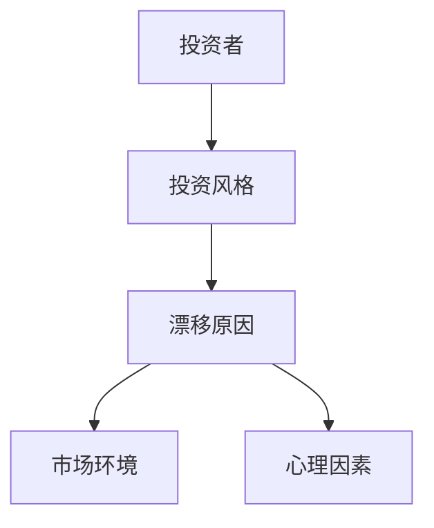
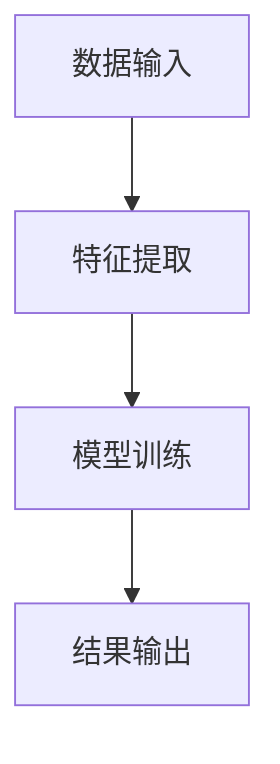
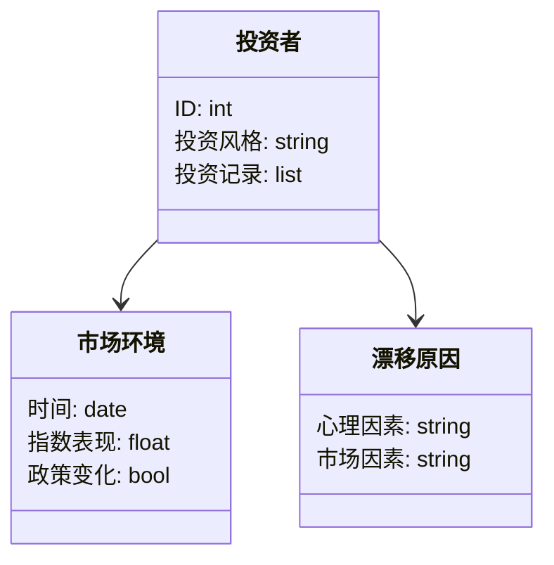
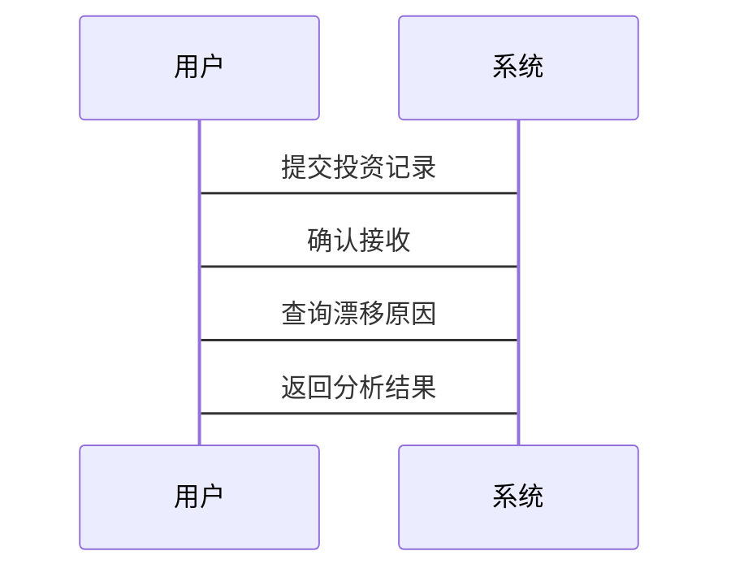

                 


# 构建智能化的个人投资风格漂移原因分析系统

> 关键词：投资风格漂移，原因分析，智能化系统，数据挖掘，机器学习

> 摘要：本文旨在探讨如何构建一个智能化的系统，用于分析和预测个人投资风格漂移的原因。通过结合数据挖掘和机器学习算法，本文提出了一种系统化的方法，从数据采集、特征提取到模型构建，最终实现对投资风格漂移的精准分析和预警。

---

# 第一部分: 背景介绍与核心概念

## 第1章: 投资风格漂移的背景与问题描述

### 1.1 投资风格漂移的定义与背景

投资风格漂移（Investment Style Drift）是指投资者在实际操作中，其实际投资组合与最初设定的投资策略或风格出现偏离的现象。这种漂移可能是由于市场环境变化、投资者情绪波动、管理决策偏差等多种因素引起的。

#### 1.1.1 投资风格的基本概念

投资风格（Investment Style）是投资者在选择和管理资产时所遵循的一套特定规则、策略或偏好。常见的投资风格包括价值投资、成长投资、指数投资等。每种风格都有其独特的特征和适用场景。

#### 1.1.2 投资风格漂移的定义

投资风格漂移是指投资者在实际操作中，由于各种内外部因素的影响，导致其实际投资组合偏离最初设定的投资风格。这种漂移可能带来收益与风险的不匹配，影响投资目标的实现。

#### 1.1.3 投资风格漂移的背景与现状

近年来，随着金融市场波动加剧和投资者行为的复杂化，投资风格漂移问题日益显著。特别是在个人投资者中，由于情绪波动、信息过载和认知偏差等因素，投资风格漂移现象尤为普遍。

---

### 1.2 投资风格漂移的原因分析

#### 1.2.1 市场环境变化

市场环境的变化，如经济周期波动、行业趋势变化等，可能导致投资者调整其投资策略，从而引发风格漂移。

#### 1.2.2 投资者心理因素

投资者的心理因素，如贪婪和恐惧，常常导致其在市场波动中偏离原定策略，从而引发风格漂移。

#### 1.2.3 管理层决策偏差

在机构投资者中，管理层的决策偏差（如过度自信）也可能导致投资风格的偏离。

#### 1.2.4 其他影响因素

包括政策变化、突发事件、信息不对称等，也可能影响投资者的投资行为，导致风格漂移。

---

## 第2章: 个人投资风格漂移的核心概念

### 2.1 投资风格漂移的分类

#### 2.1.1 按时间维度分类

- **短期漂移**：由于市场短期波动引起的投资风格偏离。
- **长期漂移**：由于长期市场环境变化或投资策略调整引起的投资风格偏离。

#### 2.1.2 按影响因素分类

- **外部因素**：市场环境、政策变化等。
- **内部因素**：投资者心理、决策偏差等。

#### 2.1.3 按结果表现分类

- **轻微漂移**：偏离程度较小，不影响整体投资目标。
- **显著漂移**：偏离程度较大，可能影响投资收益和风险。

---

### 2.2 核心概念与联系

#### 2.2.1 投资风格漂移的实体关系图



---

### 2.3 投资风格漂移的边界与外延

#### 2.3.1 边界定义

投资风格漂移的分析应限定于个人投资者的范围内，且主要关注可量化的因素。

#### 2.3.2 外延分析

投资风格漂移的分析可扩展至机构投资者，也可延伸至不同类型的投资风格（如股票、债券、基金等）。

#### 2.3.3 相关概念对比

- **投资风格漂移**：与投资组合偏离相关，但不同于投资组合的风险和收益波动。

---

# 第二部分: 算法原理与数学模型

## 第3章: 投资风格漂移分析的算法原理

### 3.1 数据分析方法

#### 3.1.1 时间序列分析

时间序列分析适用于分析投资风格漂移的动态变化。常用模型包括ARIMA（自回归积分滑动平均模型）。

#### 3.1.2 聚类分析

聚类分析可用于将投资风格漂移的原因进行分类。K-means算法是一种常用的无监督学习算法。

#### 3.1.3 回归分析

回归分析可用于分析投资风格漂移的主要影响因素。线性回归模型适用于单变量分析。

---

### 3.2 机器学习算法

#### 3.2.1 监督学习模型

- **随机森林**：适用于分类和回归任务，适合多变量分析。
- **支持向量机（SVM）**：适用于分类任务。

#### 3.2.2 非监督学习模型

- **K-means**：适用于聚类分析。

#### 3.2.3 深度学习模型

- **神经网络**：适用于复杂的非线性关系分析。

---

### 3.3 算法流程图



---

## 第4章: 数学模型与公式

### 4.1 时间序列模型

#### 4.1.1 ARIMA模型

$$ARIMA(p, d, q)$$

其中：
- \( p \) 表示自回归阶数
- \( d \) 表示差分阶数
- \( q \) 表示移动平均阶数

---

### 4.2 聚类分析模型

#### 4.2.1 K-means算法

目标函数：
$$J = \sum_{i=1}^{k} \sum_{j=1}^{n_i} (x_{ij} - \mu_i)^2$$

其中：
- \( k \) 表示聚类数
- \( n_i \) 表示第 \( i \) 个聚类的样本数
- \( x_{ij} \) 表示第 \( i \) 聚类的第 \( j \) 个样本
- \( \mu_i \) 表示第 \( i \) 聚类的中心点

---

### 4.3 回归分析模型

#### 4.3.1 线性回归

模型公式：
$$y = \beta_0 + \beta_1x + \epsilon$$

其中：
- \( y \) 表示目标变量
- \( x \) 表示自变量
- \( \beta_0 \) 表示截距
- \( \beta_1 \) 表示回归系数
- \( \epsilon \) 表示误差项

---

### 4.4 机器学习模型

#### 4.4.1 随机森林

随机森林是一种基于决策树的集成学习模型，适用于分类和回归任务。

---

# 第三部分: 系统分析与架构设计

## 第5章: 系统分析与需求定义

### 5.1 问题场景介绍

#### 5.1.1 投资者行为分析

分析投资者的投资行为，识别投资风格漂移的迹象。

#### 5.1.2 市场环境监测

监测市场环境的变化，评估其对投资风格的影响。

#### 5.1.3 投资风格漂移预警

建立预警机制，及时提醒投资者潜在风险。

---

### 5.2 领域模型设计



---

## 第6章: 系统架构设计

### 6.1 系统架构图


---

### 6.2 系统接口设计

- **数据接口**：与数据源（如股票数据库、市场数据API）对接。
- **用户接口**：提供用户输入和结果展示。

---

## 第7章: 系统交互设计

### 7.1 系统交互流程图



---

# 第四部分: 项目实战

## 第8章: 项目实战与实现

### 8.1 环境安装

安装必要的Python库：
```bash
pip install pandas numpy scikit-learn
```

---

### 8.2 核心代码实现

#### 8.2.1 数据预处理

```python
import pandas as pd

# 加载数据
data = pd.read_csv('investment_data.csv')

# 数据清洗
data.dropna(inplace=True)
data = data[['id', 'investment_style', 'returns']]
```

---

#### 8.2.2 模型训练

```python
from sklearn.cluster import KMeans

# 特征提取
X = data[['returns']]

# 训练模型
model = KMeans(n_clusters=3, random_state=42)
model.fit(X)

# 预测结果
labels = model.predict(X)
```

---

#### 8.2.3 结果解读

```python
# 可视化结果
import matplotlib.pyplot as plt

plt.scatter(X, data.index, c=labels, cmap='viridis')
plt.xlabel('Returns')
plt.ylabel('Index')
plt.show()
```

---

## 第9章: 项目总结与优化

### 9.1 项目总结

通过本项目，我们成功构建了一个智能化的个人投资风格漂移原因分析系统。系统能够采集数据、分析原因并提供预警。

### 9.2 优化方向

- **数据源扩展**：引入更多市场数据。
- **模型优化**：尝试更复杂的深度学习模型。
- **用户界面优化**：提升用户体验。

---

# 作者：AI天才研究院/AI Genius Institute & 禅与计算机程序设计艺术 /Zen And The Art of Computer Programming

---

以上是《构建智能化的个人投资风格漂移原因分析系统》的技术博客文章大纲及内容概要。通过系统化的分析和实践，我们能够更好地理解投资风格漂移的原因，并通过智能化的方法进行预测和管理。

