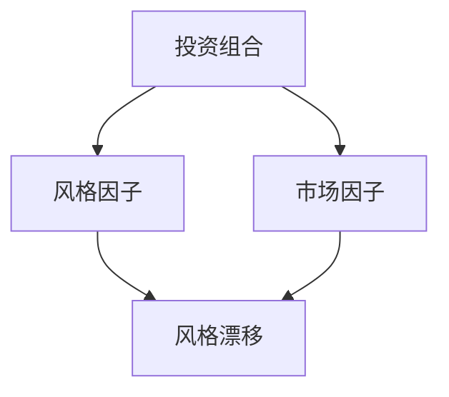
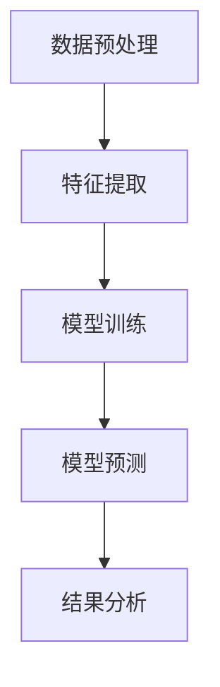
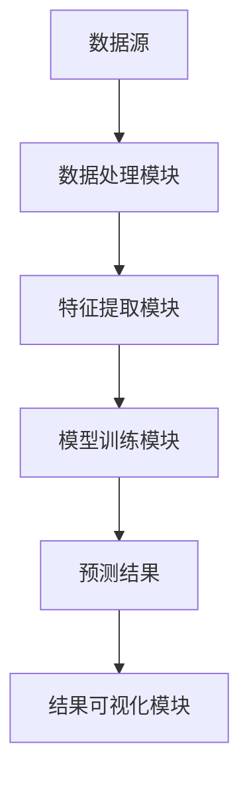

                 


# 构建智能化的个人投资风格漂移检测系统

> 关键词：投资风格漂移，风险管理，机器学习，时间序列分析，系统架构，Python实现

> 摘要：本文将详细介绍如何构建一个智能化的个人投资风格漂移检测系统。通过分析投资风格漂移的背景、核心概念、算法原理、系统架构以及实际项目实现，我们将探讨如何利用技术手段有效检测和管理投资风格漂移，从而帮助投资者规避潜在风险，优化投资策略。

---

## 第1章: 投资风格漂移检测的背景与问题

### 1.1 投资风格漂移的定义与背景
投资风格漂移是指投资组合的实际表现与其预期的投资风格出现偏离的现象。这种偏离可能源于市场波动、管理策略调整或外部经济环境变化。及时检测投资风格漂移，可以帮助投资者规避潜在风险，优化投资组合。

### 1.2 投资风格漂移检测的核心问题
- **问题背景**：投资风格漂移可能导致投资组合的风险超出预期，影响投资收益。
- **问题描述**：如何量化投资组合与预期风格之间的差异？如何实时监控这种差异？
- **问题解决**：通过技术手段，构建一个智能化的检测系统，实现对投资风格漂移的实时监控和预警。

### 1.3 风险管理与投资风格漂移
风险管理是投资过程中至关重要的一环。投资风格漂移可能导致投资组合的风险失控，因此，检测投资风格漂移是风险管理的重要组成部分。

## 第2章: 投资风格漂移检测的核心概念与联系

### 2.1 投资风格漂移检测的原理
- **定义**：通过比较投资组合的实际表现与预期风格，检测是否存在显著差异。
- **方法**：基于时间序列分析和机器学习算法，构建检测模型。

### 2.2 核心概念的属性特征对比
- **投资组合与基准**：投资组合的表现与基准指数的对比。
- **风格因子与市场因子**：风格因子是投资组合的特征，市场因子是外部市场因素。
- **时间序列与横截面数据**：时间序列数据用于分析动态变化，横截面数据用于分析静态特征。

### 2.3 实体关系图与概念结构


## 第3章: 投资风格漂移检测算法原理

### 3.1 时间序列分析方法
- **ARIMA模型**：用于分析投资组合的收益序列，检测其与预期风格的偏离。
- **GARCH模型**：用于分析投资组合的风险序列，评估波动性变化。

### 3.2 机器学习方法
- **支持向量机（SVM）**：用于分类投资风格漂移的状态。
- **随机森林（Random Forest）**：用于特征重要性分析，识别影响风格漂移的关键因素。
- **神经网络（ANN）**：用于非线性关系建模，捕捉复杂的投资风格漂移模式。

### 3.3 算法流程图


### 3.4 核心算法的Python实现
#### 时间序列分析的Python代码示例
```python
import pandas as pd
from statsmodels.tsa.arima.model import ARIMA

# 假设data是一个时间序列数据集
model = ARIMA(data, order=(5, 1, 0))
model_fit = model.fit()
predictions = model_fit.forecast(steps=len(data))
```

#### 机器学习模型的Python代码示例
```python
from sklearn.ensemble import RandomForestClassifier
from sklearn.metrics import accuracy_score

# 假设X是特征矩阵，y是标签
model = RandomForestClassifier()
model.fit(X, y)
y_pred = model.predict(X_test)
print("Accuracy:", accuracy_score(y_test, y_pred))
```

## 第4章: 系统架构设计

### 4.1 系统功能设计
- **数据采集**：获取投资组合的实时数据和市场数据。
- **特征提取**：从数据中提取关键特征，用于风格漂移检测。
- **模型训练与预测**：基于特征训练模型，预测风格漂移状态。
- **结果可视化与预警**：将检测结果可视化，并设置预警机制。

### 4.2 系统架构图


### 4.3 接口与交互设计
- **数据接口**：定义数据输入和输出接口。
- **用户接口**：提供友好的用户界面，方便用户查看检测结果。

## 第5章: 项目实战

### 5.1 环境安装
- **Python环境**：安装Python 3.8及以上版本。
- **依赖库安装**：使用pip安装所需的依赖库，如pandas、scikit-learn、statsmodels等。

### 5.2 核心代码实现
#### 数据预处理
```python
import pandas as pd

data = pd.read_csv('investment_data.csv')
data = data.dropna()
```

#### 模型训练
```python
from sklearn.ensemble import RandomForestClassifier

model = RandomForestClassifier()
model.fit(X_train, y_train)
```

#### 案例分析
- **案例背景**：某投资组合的预期风格是价值投资，但近期表现与成长股类似。
- **数据处理**：清洗数据，提取关键特征。
- **模型预测**：预测投资风格是否发生漂移。
- **结果解读**：根据预测结果，分析漂移的原因，并提出优化建议。

## 第6章: 优化与扩展

### 6.1 模型优化
- **超参数调整**：使用网格搜索优化模型性能。
- **特征工程**：引入更多的特征，如市场情绪指标。

### 6.2 系统扩展
- **多模型集成**：结合多种算法，提高检测准确性。
- **实时监控**：实现实时数据处理和预警机制。

### 6.3 实际应用中的注意事项
- **数据质量**：确保数据的准确性和完整性。
- **模型解释性**：选择可解释性较强的模型，便于分析结果。
- **维护与更新**：定期更新模型，适应市场变化。

## 第7章: 总结与展望

### 7.1 总结
本文详细介绍了构建智能化投资风格漂移检测系统的核心概念、算法原理和系统架构。通过项目实战和案例分析，展示了系统的实际应用价值。

### 7.2 展望
未来，随着人工智能技术的发展，投资风格漂移检测系统将更加智能化和自动化。可以通过引入更复杂的时间序列模型和深度学习算法，进一步提高检测的准确性和实时性。

## 作者

作者：AI天才研究院/AI Genius Institute & 禅与计算机程序设计艺术 /Zen And The Art of Computer Programming

