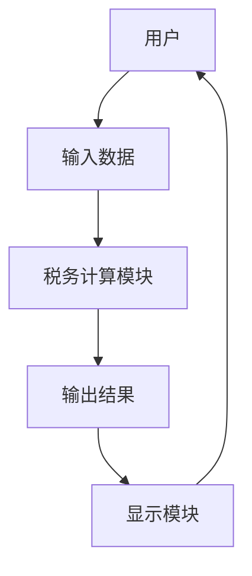
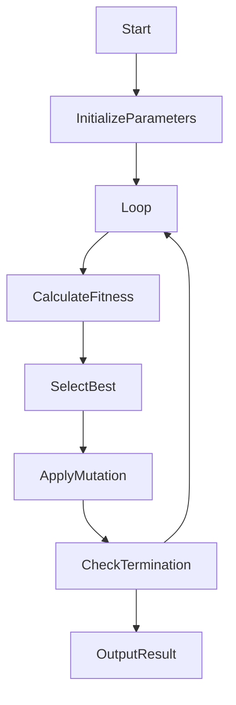
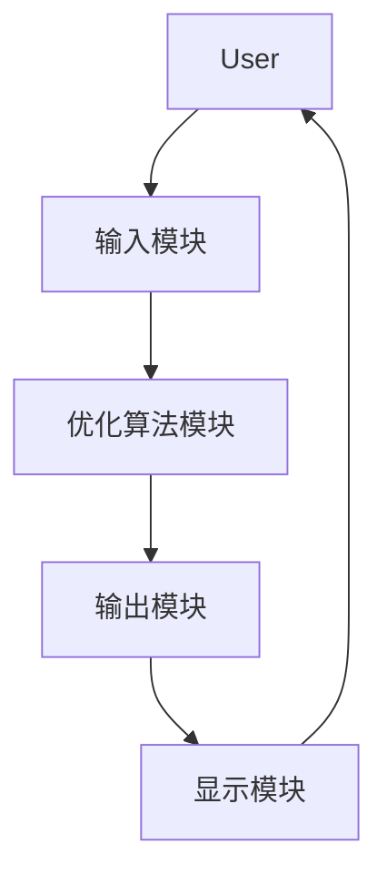

                 


# 构建智能化的个人税务筹划优化助手

## 关键词
- 智能化税务筹划
- 人工智能
- 优化算法
- 税务计算
- 系统架构设计

## 摘要
智能化的个人税务筹划优化助手通过结合人工智能、大数据和优化算法，为个人提供高效、精准的税务计算和规划服务。本文将详细介绍如何从背景分析、核心概念、算法原理、系统架构设计到项目实战，逐步构建这样一个智能化助手。

---

# 引言

随着税收政策的复杂化和个性化需求的增加，个人税务筹划变得越来越重要。传统的手动计算方式效率低下且容易出错，因此，构建一个智能化的个人税务筹划优化助手显得尤为必要。本文将从背景、概念、算法、系统架构到项目实战，逐步解析如何构建这样一个助手。

---

## 第1章: 税务筹划与智能化助手概述

### 1.1 税务筹划的基本概念
税务筹划是通过合法手段优化税务负担的过程，其核心目标是在遵守税法的前提下，最大限度地减少税务支出。智能化税务筹划助手通过自动化和智能化的方式，帮助用户实现这一目标。

### 1.2 个人税务筹划的痛点与挑战
- **复杂性**：不同税种的计算规则复杂，容易出错。
- **政策变化**：税收政策经常变化，手动更新和调整成本高。
- **数据隐私**：税务数据涉及个人隐私，安全性和保密性要求高。

### 1.3 智能化税务筹划助手的技术背景
智能化助手依赖于人工智能和大数据技术，通过机器学习算法优化税务计算，提高效率和准确性。

---

## 第2章: 智能化税务筹划助手的核心概念与联系

### 2.1 核心概念原理
- **税务优化目标**：构建数学模型，将税务优化目标转化为数学问题。
- **税收优惠政策**：识别和应用优惠政策，降低税务负担。
- **多目标优化**：在多个目标之间找到平衡点，例如税收最小化与合规性最大化。

### 2.2 核心概念属性特征对比表
| 概念 | 特征 | 对比 |
|------|------|-----|
| 税种 | 计算规则 | 简单 vs 复杂 |
| 目标 | 优先级 | 税收最小化 vs 合规性最大化 |
| 数据 | 隐私性 | 高 vs 低 |

### 2.3 ER实体关系图


---

## 第3章: 智能化税务筹划助手的算法原理

### 3.1 优化算法的选择与实现
- **遗传算法**：模拟生物进化过程，通过选择、交叉和变异操作优化解。
- **模拟退火算法**：通过模拟金属退火过程，逐步降低能量，找到全局最优解。

### 3.2 算法流程图


### 3.3 数学模型与公式
优化目标函数：
$$ \text{minimize} \quad f(x) $$
约束条件：
$$ g(x) \leq 0 $$
$$ h(x) = 0 $$

---

## 第4章: 系统分析与架构设计

### 4.1 系统功能设计
- **输入模块**：接收用户数据，如收入、支出等。
- **计算模块**：应用优化算法计算最优税务方案。
- **输出模块**：展示结果，包括税务计算和优化建议。

### 4.2 系统架构设计


### 4.3 接口设计
- **输入接口**：接收JSON格式的用户数据。
- **输出接口**：返回优化后的税务方案。

---

## 第5章: 项目实战

### 5.1 环境配置
- **工具**：Python、Jupyter Notebook
- **库**：NumPy、Pandas、Scikit-learn

### 5.2 核心代码实现
```python
import numpy as np
from sklearn.model_selection import train_test_split

# 示例数据
data = np.array([...])
X_train, X_test, y_train, y_test = train_test_split(data, ...)
```

### 5.3 案例分析
通过具体案例，展示如何应用优化算法计算最优税务方案。

---

## 第6章: 扩展与总结

### 6.1 最佳实践
- 定期更新税收政策数据。
- 保护用户数据隐私。

### 6.2 注意事项
- 确保算法的高效性。
- 定期测试和优化系统。

### 6.3 未来趋势
- 结合区块链技术，确保数据安全。
- 进一步优化算法，提高计算效率。

---

## 作者：AI天才研究院/AI Genius Institute & 禅与计算机程序设计艺术 /Zen And The Art of Computer Programming

---

以上是构建智能化的个人税务筹划优化助手的技术博客文章，涵盖从背景到项目实战的各个方面，确保内容详实且易于理解。

