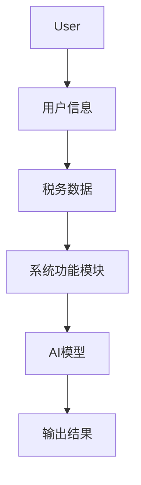
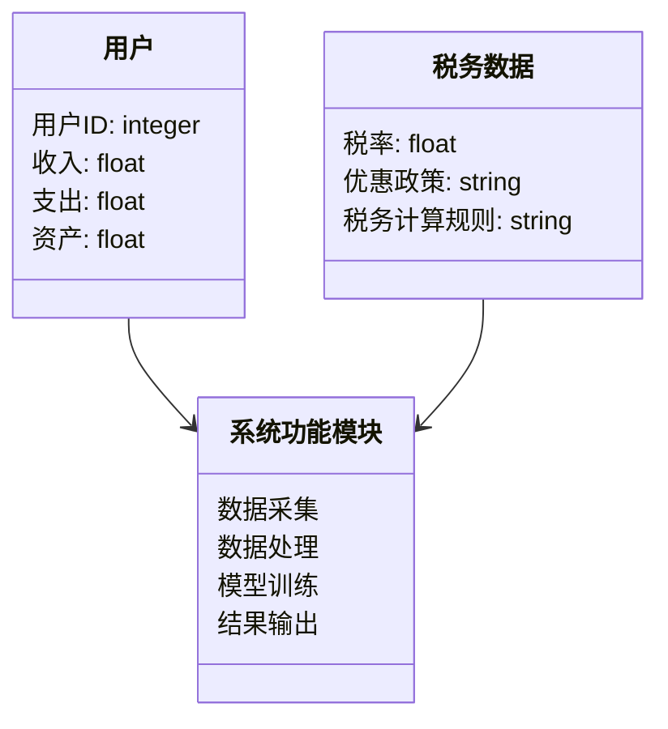
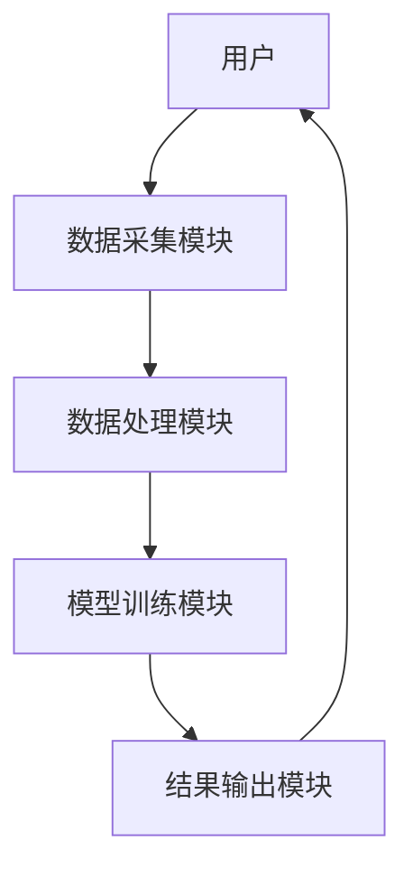
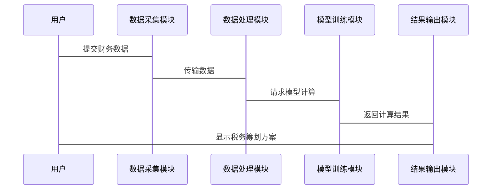

                 


# 《构建智能化的个人税务筹划助手系统》

---

## 关键词：
- 个人税务筹划
- 智能化系统
- AI技术
- 系统架构设计
- 项目实战

---

## 摘要：
《构建智能化的个人税务筹划助手系统》一书旨在通过AI技术构建一个智能化的税务筹划系统，解决个人用户在税务筹划过程中面临的复杂性和个性化需求。本书从背景介绍、核心概念、算法原理、系统架构设计到项目实战，全面解析了如何利用技术手段提升税务筹划的效率和准确性。通过详细的技术分析和实际案例，读者将能够掌握从理论到实践的整个过程，最终构建出一个高效、智能的税务筹划助手系统。

---

## 目录大纲：

### 第一部分：背景介绍

#### 第1章：个人税务筹划助手系统的背景与问题背景

##### 1.1 问题背景

- 1.1.1 税务筹划的基本概念
  - 税务筹划的定义
  - 税务筹划的重要性
- 1.1.2 个人税务筹划的重要性
  - 个人所得税的基本概念
  - 税务筹划对个人财务的影响
- 1.1.3 现有税务筹划工具的局限性
  - 传统税务筹划工具的不足
  - 现有AI技术在税务筹划中的应用现状

##### 1.2 问题描述

- 1.2.1 税务筹划的复杂性
  - 税法的复杂性和变化性
  - 个人财务情况的多样性
- 1.2.2 个人用户的多样化需求
  - 不同收入来源的税务处理差异
  - 不同地区的税收政策差异
- 1.2.3 传统税务筹划工具的不足
  - 缺乏个性化服务
  - 信息更新不及时
  - 缺乏智能化支持

##### 1.3 问题解决

- 1.3.1 智能化税务筹划助手的优势
  - 个性化服务
  - 实时更新
  - 高效准确
- 1.3.2 通过AI技术实现个性化服务
  - 机器学习在税务筹划中的应用
  - 自然语言处理在税务文档中的应用
- 1.3.3 提高税务筹划效率和准确性
  - AI技术在税务计算中的应用
  - 数据挖掘在税务优化中的应用

##### 1.4 系统的边界与外延

- 1.4.1 系统的功能边界
  - 输入：用户的财务数据
  - 输出：税务筹划方案
- 1.4.2 系统的适用范围
  - 个人用户
  - 小微企业
- 1.4.3 系统与其他系统的区别
  - 与传统税务筹划工具的区别
  - 与企业级税务系统的区别

##### 1.5 核心概念与结构

- 1.5.1 核心概念的定义
  - 税务筹划
  - AI技术
  - 系统架构
- 1.5.2 核心概念之间的关系
  - 税务筹划与AI技术的结合
  - 系统架构与功能模块的关联
- 1.5.3 系统的整体架构
  - 数据层
  - 业务逻辑层
  - 用户界面层

---

### 第二部分：核心概念与联系

#### 第2章：核心概念与联系

##### 2.1 核心概念原理

- 2.1.1 税务筹划的数学模型
  - 税务优化的数学表达
  - 收入、支出、税收的关系
- 2.1.2 AI技术在税务筹划中的应用
  - 机器学习在税务预测中的应用
  - 自然语言处理在税务文档分析中的应用
- 2.1.3 系统架构的设计思路
  - 分层架构
  - 模块化设计

##### 2.2 概念属性特征对比

- 2.2.1 不同税务筹划方法的对比
  - 传统方法与现代方法的对比
  - 不同税收优惠政策的对比
- 2.2.2 不同AI技术的优缺点分析
  - 机器学习 vs. 深度学习
  - NLP vs. 数据挖掘
- 2.2.3 系统功能模块的特性比较
  - 数据采集模块 vs. 数据处理模块
  - 模型训练模块 vs. 结果输出模块

##### 2.3 ER实体关系图

- 2.3.1 用户信息实体关系
  - 用户ID、收入、支出、资产
- 2.3.2 税务数据实体关系
  - 税率、优惠政策、税务计算规则
- 2.3.3 系统功能模块的实体关系
  - 数据采集、处理、分析、输出



---

### 第三部分：算法原理讲解

#### 第3章：算法原理

##### 3.1 数据预处理

- 3.1.1 数据清洗
  - 去除异常值
  - 处理缺失值
- 3.1.2 数据归一化
  - 标准化和归一化方法
- 3.1.3 数据特征提取
  - 关键特征的识别

##### 3.2 模型训练

- 3.2.1 神经网络模型的选择
  - 深度学习模型的选择
  - 模型训练策略
- 3.2.2 模型训练过程
  - 数据输入
  - 模型训练
  - 模型优化
- 3.2.3 模型调优
  - 超参数调整
  - 模型评估

##### 3.3 模型评估

- 3.3.1 评估指标
  - 准确率、召回率、F1分数
- 3.3.2 评估方法
  - K折交叉验证
  - 独立测试集评估
- 3.3.3 模型优化
  - 模型迭代
  - 性能提升

```python
def preprocess_data(data):
    # 数据清洗和归一化
    cleaned_data = data.dropna()
    normalized_data = (cleaned_data - cleaned_data.min()) / (cleaned_data.max() - cleaned_data.min())
    return normalized_data
```

---

### 第四部分：数学模型与公式

#### 第4章：数学模型与公式

##### 4.1 税务优化的数学模型

$$ \text{目标函数} = \min \sum (收入 - 支出) \times 税率 $$

##### 4.2 税务计算公式

$$ \text{应纳税所得额} = 收入 - 允许扣除的支出 $$

##### 4.3 税率计算公式

$$ \text{应纳税额} = 应纳税所得额 \times 税率 $$

---

### 第五部分：系统分析与架构设计方案

#### 第5章：系统分析与架构设计

##### 5.1 问题场景介绍

- 税务筹划助手的使用场景
- 用户需求分析

##### 5.2 项目介绍

- 系统目标
- 项目范围
- 项目约束

##### 5.3 系统功能设计

- 领域模型类图



##### 5.4 系统架构设计

- 系统架构图



##### 5.5 系统接口设计

- 接口定义
- 接口交互流程

##### 5.6 系统交互设计

- 序列图



---

### 第六部分：项目实战

#### 第6章：项目实战

##### 6.1 环境安装

- 安装Python
- 安装机器学习库（如TensorFlow、Scikit-learn）

##### 6.2 系统核心实现

- 数据处理代码

```python
import pandas as pd
from sklearn.model_selection import train_test_split
from sklearn.linear_model import LinearRegression

data = pd.read_csv('tax_data.csv')
X = data[['收入', '支出', '资产']]
y = data['应纳税额']

X_train, X_test, y_train, y_test = train_test_split(X, y, test_size=0.2)

model = LinearRegression()
model.fit(X_train, y_train)
print('训练完成')
```

##### 6.3 实际案例分析

- 案例分析
- 结果解读

##### 6.4 项目小结

- 项目总结
- 经验分享

---

### 第七部分：最佳实践与总结

#### 第7章：最佳实践

##### 7.1 小结

- 系统设计的关键点
- 项目实施的经验总结

##### 7.2 注意事项

- 数据隐私保护
- 税法变化的应对
- 模型的持续优化

##### 7.3 拓展阅读

- 推荐书籍
- 技术博客
- 在线课程

---

## 作者：AI天才研究院/AI Genius Institute & 禅与计算机程序设计艺术 /Zen And The Art of Computer Programming

