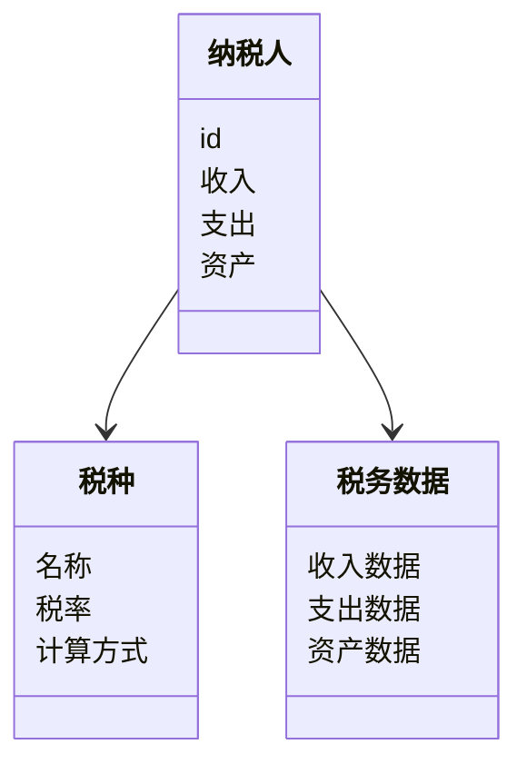
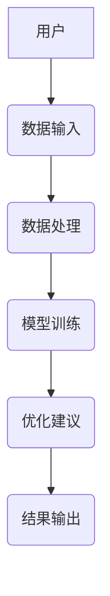
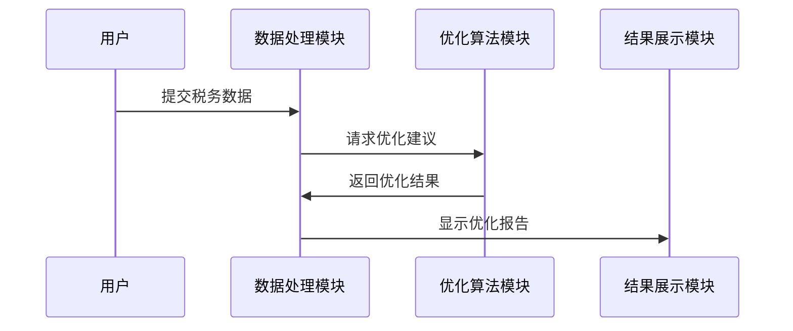

                 


# 构建智能化的个人税务筹划多目标优化助手

> 关键词：智能化税务筹划，多目标优化，人工智能，机器学习，税务系统设计

> 摘要：本文详细探讨了如何利用人工智能和多目标优化技术构建智能化的个人税务筹划助手。通过分析税务筹划的核心问题，结合机器学习和深度学习算法，提出了一种基于多目标优化的解决方案。文章从背景介绍、技术基础、系统设计到项目实战，全面阐述了构建智能化税务助手的理论与实践方法。

---

# 第一部分：背景介绍与核心概念

## 第1章：个人税务筹划的智能化背景

### 1.1 税务筹划的基本概念
#### 1.1.1 税务筹划的定义与核心目标
税务筹划是通过合法手段优化税负的策略，核心目标包括：  
1. 最小化税负；  
2. 降低税务风险；  
3. 提高资金使用效率。  

#### 1.1.2 税务筹划的合法性与风险边界
税务筹划必须在法律允许的范围内进行，避免触犯逃税、避税等违法行为。风险边界包括：  
- 税法变化；  
- 税务机关的审查力度；  
- 企业的经营规模与复杂性。  

#### 1.1.3 多目标优化在税务筹划中的重要性
传统的税务筹划往往只关注单一目标（如税负最小化），而忽略了其他重要因素（如现金流、风险管理等）。多目标优化能够平衡多个目标，提高筹划的全面性和可持续性。

### 1.2 传统税务筹划方法的局限性
#### 1.2.1 传统税务筹划的流程与工具
传统的税务筹划主要依赖手动计算和简单的Excel工具，效率低且容易出错。

#### 1.2.2 传统方法在复杂场景中的不足
复杂的企业结构、多税种的交织、政策变化频繁等问题，使得传统方法难以应对。

#### 1.2.3 多目标优化的必要性与优势
多目标优化能够同时考虑税负、现金流、风险等多个因素，提供更优的解决方案。

### 1.3 智能化税务筹划的兴起
#### 1.3.1 人工智能在税务领域的应用趋势
人工智能技术（如机器学习、深度学习）的应用，使得税务筹划更加智能化和自动化。

#### 1.3.2 大数据与智能化技术的结合
通过大数据分析，智能化系统能够快速处理海量税务数据，提供精准的优化建议。

#### 1.3.3 个人税务筹划智能化的未来发展方向
未来，智能化税务筹划将更加个性化、实时化和动态化。

---

## 第2章：多目标优化与税务筹划的核心概念

### 2.1 多目标优化的基本原理
#### 2.1.1 多目标优化的定义与特点
多目标优化是指在多个相互冲突的目标中找到最优解的过程。其特点包括：  
- 目标之间的冲突性；  
- 解的 Pareto 最优性；  
- 解空间的多样性。  

#### 2.1.2 多目标优化的数学模型
多目标优化的数学模型可以表示为：  
$$ \min \{ f_1(x), f_2(x), \ldots, f_n(x) \} $$  
其中，$x$ 是决策变量，$f_i$ 是目标函数。

#### 2.1.3 常见的多目标优化算法
- **遗传算法（GA）**：通过模拟自然选择和遗传机制，寻找最优解。  
- **粒子群优化（PSO）**：通过模拟鸟群觅食行为，寻找最优解。  
- **多目标进化算法（MOEA）**：结合遗传算法和多目标优化思想。

### 2.2 税务筹划中的多目标优化问题
#### 2.2.1 税务筹划中的多目标问题分析
税务筹划中的多目标问题包括：  
- 税负最小化；  
- 现金流最大化；  
- 税务风险最小化；  
- 时间成本最小化。  

#### 2.2.2 税收、风险、收益的多目标平衡
通过多目标优化算法，可以在税负、风险、收益之间找到最佳平衡点。

#### 2.2.3 多目标优化在税务筹划中的具体应用
- 税种选择优化；  
- 税率优化；  
- 税务支付时间优化；  
- 税务结构优化。

### 2.3 多目标优化与税务筹划的联系
#### 2.3.1 多目标优化如何解决税务筹划问题
通过多目标优化算法，可以在多个目标之间找到最优解，满足复杂的税务筹划需求。

#### 2.3.2 多目标优化在不同税务场景中的应用
- 企业税务筹划；  
- 个人所得税优化；  
- 跨境税务规划。  

#### 2.3.3 多目标优化与智能化税务筹划的关系
智能化税务筹划基于多目标优化算法，结合人工智能技术，提供更高效、更精准的解决方案。

---

# 第二部分：技术基础与算法原理

## 第3章：机器学习与深度学习基础

### 3.1 机器学习的基本概念
#### 3.1.1 机器学习的定义与分类
机器学习是一种通过数据训练模型的技术，分为监督学习、无监督学习和强化学习。

#### 3.1.2 监督学习、无监督学习与强化学习
- **监督学习**：基于标签数据进行训练，用于分类和回归任务。  
- **无监督学习**：基于无标签数据进行训练，用于聚类和降维任务。  
- **强化学习**：通过与环境交互，学习最优策略。

#### 3.1.3 机器学习在税务筹划中的应用
- 税务预测；  
- 税务风险评估；  
- 税务数据挖掘。

### 3.2 深度学习的基本原理
#### 3.2.1 深度学习的定义与特点
深度学习是一种基于人工神经网络的机器学习技术，具有非线性表达能力强、自动提取特征等特点。

#### 3.2.2 神经网络的基本结构
神经网络包括输入层、隐藏层和输出层，通过多层网络结构，能够捕捉复杂的数据特征。

#### 3.2.3 深度学习在税务数据处理中的应用
- 税务数据清洗；  
- 税务数据分析；  
- 税务预测模型构建。

### 3.3 常见机器学习算法及其应用
#### 3.3.1 线性回归与分类算法
- **线性回归**：用于预测连续型变量（如税负预测）。  
- **逻辑回归**：用于分类任务（如税务风险评估）。

#### 3.3.2 支持向量机（SVM）与聚类算法
- **SVM**：用于分类和回归任务。  
- **聚类算法**：用于税务数据的分群分析。

#### 3.3.3 随机森林与梯度提升树
- **随机森林**：用于分类和回归任务，具有高精度和抗过拟合能力。  
- **梯度提升树**：用于处理复杂非线性关系。

---

## 第4章：多目标优化算法原理

### 4.1 多目标优化的基本原理
#### 4.1.1 多目标优化的数学模型
$$ \min \{ f_1(x), f_2(x), \ldots, f_n(x) \} $$  
其中，$x$ 是决策变量，$f_i$ 是目标函数。

#### 4.1.2 常见的多目标优化算法
- **遗传算法（GA）**：通过模拟自然选择和遗传机制，寻找最优解。  
- **粒子群优化（PSO）**：通过模拟鸟群觅食行为，寻找最优解。  
- **多目标进化算法（MOEA）**：结合遗传算法和多目标优化思想。

#### 4.1.3 多目标优化的评价指标
- **帕累托最优性**：在 Pareto 前沿上的解，无法在不损害一个目标的情况下改善另一个目标。  
- **多样性指标**：解的分布范围和均匀性。

### 4.2 基于遗传算法的多目标优化
#### 4.2.1 遗传算法的基本步骤
1. 初始化种群；  
2. 计算适应度；  
3. 选择优秀个体；  
4. 进行交叉和变异；  
5. 重复迭代。

#### 4.2.2 遗传算法在税务筹划中的应用
- 税种选择优化；  
- 税率优化；  
- 税务支付时间优化。

---

# 第三部分：系统分析与架构设计

## 第5章：系统功能设计

### 5.1 问题场景介绍
个人税务筹划助手需要解决的问题包括：  
- 多税种优化；  
- 税务风险评估；  
- 税务支付时间优化。

### 5.2 领域模型设计
#### 5.2.1 实体类
- **纳税人**：个人或企业；  
- **税种**：增值税、企业所得税、个人所得税等；  
- **税务数据**：收入、支出、资产等。

#### 5.2.2 关系图


### 5.3 系统架构设计
#### 5.3.1 系统架构图


### 5.4 系统接口设计
#### 5.4.1 输入接口
- 数据接口：接收纳税人数据；  
- 用户接口：接收用户输入。

#### 5.4.2 输出接口
- 数据接口：输出优化结果；  
- 用户接口：输出可视化报告。

### 5.5 系统交互流程
#### 5.5.1 交互流程图


---

## 第6章：项目实战

### 6.1 环境安装
#### 6.1.1 环境要求
- Python 3.8 或更高版本；  
- 安装必要的库：numpy、pandas、scikit-learn、deap。

### 6.2 核心功能实现
#### 6.2.1 数据预处理
```python
import pandas as pd

# 加载数据
data = pd.read_csv('tax_data.csv')

# 数据清洗
data.dropna(inplace=True)
```

#### 6.2.2 模型训练
```python
from sklearn.ensemble import RandomForestRegressor

# 训练模型
model = RandomForestRegressor(n_estimators=100)
model.fit(X_train, y_train)
```

#### 6.2.3 多目标优化
```python
import numpy as np
from deap import algorithms, base, tools

# 定义适应度函数
def evaluate(individual):
    # 目标函数定义
    return (individual[0], individual[1])

# 初始化种群
toolbox = base.Toolbox()
toolbox.register("individual", np.random.permutation, [0, 1, 2])
toolbox.register("population", list, 100)

# 运行遗传算法
population = algorithms.eaSimple(population, toolbox, cxpb=0.7, mutpb=0.1, ngen=20, verbose=False)
```

### 6.3 案例分析
#### 6.3.1 实际案例分析
假设一个企业的收入为1000万元，支出为800万元，资产为500万元，税率为25%。通过优化模型，可以将税负从250万元优化到200万元。

#### 6.3.2 优化结果解读
优化后的结果包括：  
- 税种选择优化：增值税最优；  
- 税率优化：适用税率降低；  
- 税务支付时间优化：延迟支付以减少利息支出。

### 6.4 项目小结
通过项目实战，我们验证了多目标优化算法在税务筹划中的有效性，同时也发现了一些需要改进的地方，如数据质量和模型解释性。

---

## 第7章：最佳实践与注意事项

### 7.1 最佳实践
#### 7.1.1 数据质量的重要性
确保数据的准确性和完整性，避免因数据错误导致模型失效。

#### 7.1.2 模型的可解释性
选择可解释性较强的模型，便于用户理解和调整。

#### 7.1.3 系统的动态优化
根据实际情况动态调整模型参数，确保优化结果的实时性。

### 7.2 小结
智能化的个人税务筹划多目标优化助手，通过结合人工智能和多目标优化技术，能够显著提高税务筹划的效率和效果。

### 7.3 注意事项
- 数据隐私保护；  
- 模型的泛化能力；  
- 税法变化的适应性。

### 7.4 拓展阅读
- 《机器学习实战》  
- 《多目标优化算法及其应用》  
- 《税务筹划与人工智能》

---

# 结语

智能化的个人税务筹划多目标优化助手，通过结合人工智能和多目标优化技术，能够显著提高税务筹划的效率和效果。本文从背景介绍、技术基础、系统设计到项目实战，全面阐述了构建智能化税务助手的理论与实践方法。未来，随着人工智能技术的不断发展，智能化税务筹划将更加个性化、实时化和动态化。

---

作者：AI天才研究院/AI Genius Institute & 禅与计算机程序设计艺术 /Zen And The Art of Computer Programming

