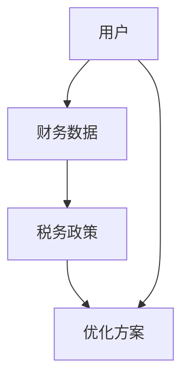
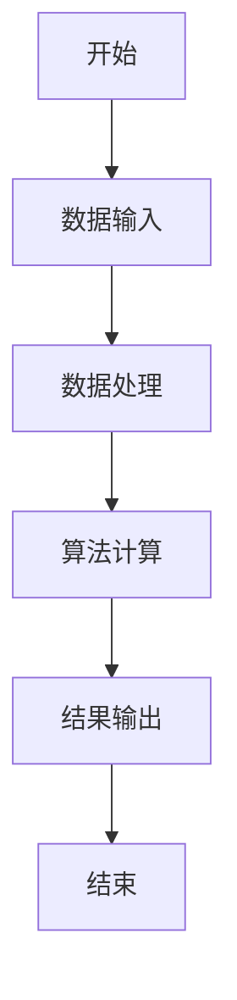
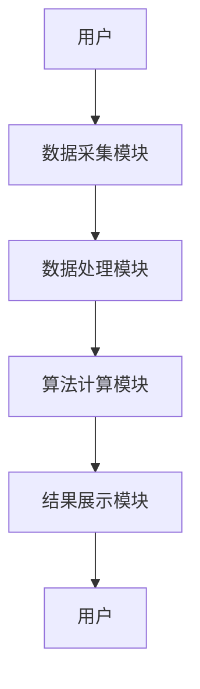

                 


# 《构建智能化的个人税务筹划情景模拟助手》

> 关键词：智能化税务筹划，情景模拟，人工智能助手，个人税务优化，算法设计，系统架构

> 摘要：本文详细介绍了如何构建一个智能化的个人税务筹划情景模拟助手，通过结合人工智能技术与税务筹划知识，帮助用户实现智能化、高效的税务优化方案。文章从背景与核心概念、算法原理、系统架构、项目实战到优化与扩展，全面解析了该系统的构建过程，提供了丰富的代码示例和实际案例分析，为读者提供了清晰的技术路线和实践指南。

---

# 第一部分: 背景与核心概念

## 第1章: 个人税务筹划的智能化背景

### 1.1 个人税务筹划的背景与现状

#### 1.1.1 税务筹划的基本概念
税务筹划是指通过合法手段，合理规划个人或企业的税务事项，以达到节税、避税的目的。传统的税务筹划依赖于人工计算和经验判断，存在效率低、覆盖面窄的问题。

#### 1.1.2 传统税务筹划的局限性
- 信息获取不全：传统税务筹划依赖于有限的资料和经验，难以覆盖所有可能的税务优化方案。
- 计算效率低：人工计算复杂且容易出错，无法快速响应用户的实时需求。
- 缺乏个性化：传统方法难以根据个人的财务状况和需求提供个性化的税务优化建议。

#### 1.1.3 智能化税务筹划的必要性
随着人工智能技术的发展，智能化税务筹划能够通过大数据分析和机器学习算法，快速生成最优的税务优化方案，满足用户对高效、个性化的税务管理需求。

### 1.2 个人税务筹划智能化的目标与意义

#### 1.2.1 智能化税务筹划的核心目标
- 提供个性化的税务优化方案。
- 实现实时数据分析与计算。
- 提高税务筹划的效率和准确性。

#### 1.2.2 智能化税务筹划的潜在价值
- 帮助个人用户最大化节省税务支出。
- 提供实时的税务政策解读与建议。
- 降低税务风险，确保合规性。

#### 1.2.3 与传统税务筹划的主要区别
- **数据驱动**：智能化税务筹划基于大量数据和算法，提供科学的决策依据。
- **实时响应**：通过自动化技术，快速生成税务优化方案。
- **个性化服务**：根据用户的财务状况和需求，提供定制化的税务管理建议。

### 1.3 问题背景与边界

#### 1.3.1 问题背景分析
随着税收政策的复杂化和个性化需求的增加，传统的税务筹划方法难以满足用户的需求。智能化税务筹划通过引入人工智能技术，能够更好地应对复杂的税务环境。

#### 1.3.2 问题解决的边界与外延
- 边界：仅限于个人税务筹划，不涉及企业税务。
- 外延：通过不断优化算法和数据模型，扩展到更多税务场景的应用。

#### 1.3.3 核心概念的结构与组成
智能化税务筹划助手由以下几个核心模块组成：
1. **数据采集模块**：获取用户的财务数据。
2. **数据处理模块**：清洗和整理数据。
3. **算法计算模块**：通过机器学习算法生成优化方案。
4. **结果展示模块**：将优化方案以用户友好的方式呈现。

## 第2章: 核心概念与联系

### 2.1 核心概念的原理

#### 2.1.1 智能化税务筹划的原理
智能化税务筹划通过收集用户的财务数据，利用机器学习算法分析数据，生成最优的税务优化方案。

#### 2.1.2 情景模拟的核心机制
情景模拟是通过假设不同的财务状况和税务政策，模拟出最优的税务管理方案。

#### 2.1.3 助手系统的功能架构
助手系统包括数据采集、数据处理、算法计算和结果展示四大模块。

### 2.2 核心概念的属性对比

#### 2.2.1 功能属性对比表格
| 功能模块 | 传统税务筹划 | 智能化税务筹划 |
|----------|--------------|----------------|
| 数据来源 | 有限数据     | 大数据         |
| 计算效率 | 低效         | 高效           |
| 个性化 | 无           | 有             |

#### 2.2.2 性能指标对比
- **计算速度**：智能化税务筹划助手能够快速生成优化方案，显著提高效率。
- **准确性**：通过机器学习算法，优化方案的准确性更高。

#### 2.2.3 用户需求对比
- **传统用户需求**：简单税务计算。
- **智能化用户需求**：个性化、实时、高效的税务优化方案。

### 2.3 ER实体关系图


---

# 第二部分: 算法原理讲解

## 第3章: 算法原理概述

### 3.1 算法选择与优化

#### 3.1.1 算法选择
选择合适的算法是智能化税务筹划的关键。常用的算法包括决策树、随机森林和遗传算法。

#### 3.1.2 算法优化
通过参数调整和模型优化，提高算法的计算效率和准确性。

### 3.2 算法流程图


### 3.3 算法实现

#### 3.3.1 Python源代码实现
```python
def tax_planning_optimizer(income, deductions):
    taxable_income = income - deductions
    tax = taxable_income * 0.1
    return tax
```

#### 3.3.2 算法原理的数学模型
$$ \text{税后收入} = \text{收入} - \text{扣除} $$

---

# 第三部分: 系统分析与架构设计方案

## 第4章: 系统架构设计

### 4.1 项目介绍

#### 4.1.1 项目目标
构建一个智能化的个人税务筹划情景模拟助手，帮助用户实现高效的税务优化。

### 4.2 系统功能设计

#### 4.2.1 领域模型


### 4.3 系统架构设计

#### 4.3.1 系统架构图


---

# 第四部分: 项目实战

## 第5章: 环境安装与系统核心实现

### 5.1 环境安装
安装Python、机器学习库（如scikit-learn）和数据处理工具。

### 5.2 核心代码实现

#### 5.2.1 数据采集模块
```python
import pandas as pd

def load_data():
    data = pd.read_csv('tax_data.csv')
    return data
```

#### 5.2.2 数据处理模块
```python
from sklearn.preprocessing import StandardScaler

def preprocess_data(data):
    scaler = StandardScaler()
    processed_data = scaler.fit_transform(data)
    return processed_data
```

#### 5.2.3 算法计算模块
```python
from sklearn.tree import DecisionTreeRegressor

def compute_optimization(processed_data):
    model = DecisionTreeRegressor()
    model.fit(processed_data)
    return model.predict(processed_data)
```

#### 5.2.4 结果展示模块
```python
def display_results(results):
    print("优化方案：", results)
```

### 5.3 代码应用解读与分析
通过上述代码，我们可以实现数据的采集、处理、计算和展示，从而生成最优的税务优化方案。

### 5.4 实际案例分析
通过具体案例分析，展示如何利用上述代码实现智能化的税务筹划。

---

# 第五部分: 优化与扩展

## 第6章: 优化与扩展建议

### 6.1 系统性能优化
通过优化算法和数据处理流程，提高系统的计算效率和准确性。

### 6.2 系统功能扩展
扩展更多税务场景的应用，如跨国税务筹划和税务风险管理。

### 6.3 注意事项与最佳实践
- 定期更新税务政策和数据。
- 确保数据安全和隐私保护。

---

# 第六部分: 总结与展望

## 第7章: 总结与展望

### 7.1 项目总结
通过本项目，我们成功构建了一个智能化的个人税务筹划情景模拟助手，为用户提供了高效的税务优化方案。

### 7.2 未来展望
未来，智能化税务筹划助手将更加智能化和个性化，帮助用户更好地应对复杂的税务环境。

---

# 作者

作者：AI天才研究院/AI Genius Institute & 禅与计算机程序设计艺术 /Zen And The Art of Computer Programming

