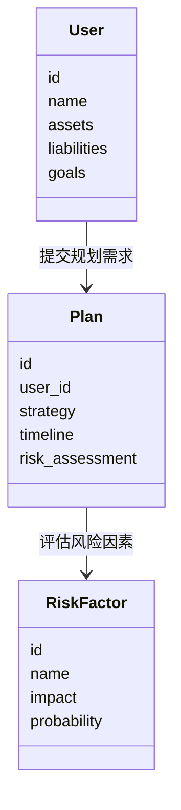
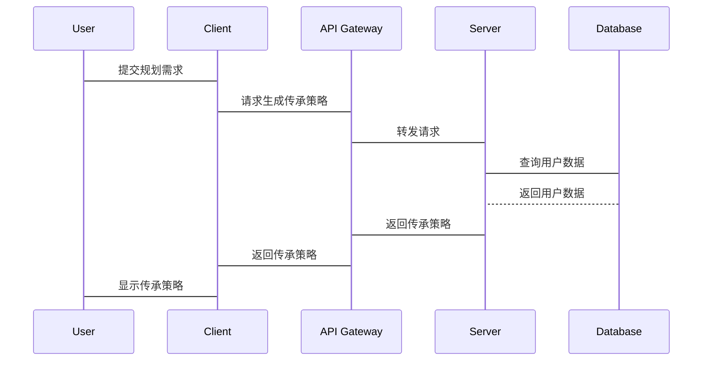

                 


# 构建智能化的个人财富传承规划助手

## 关键词：人工智能，财富传承，智能化助手，风险管理，个性化规划

## 摘要：  
随着数字化时代的到来，个人财富管理需求日益增长，而传统财富传承规划方式存在效率低下、个性化不足和风险评估不全面等问题。本文通过分析智能化个人财富传承规划助手的核心概念、算法原理、系统架构及其实现方案，探讨如何利用人工智能技术构建高效、个性化的财富传承规划工具。文章内容涵盖从背景介绍到系统设计、项目实战及最佳实践的完整流程，旨在为读者提供深入的技术洞见和实践指导。

---

# 第1章: 智能化个人财富传承规划助手的背景介绍

## 1.1 智能化财富传承规划的背景
### 1.1.1 数字化时代下的财富管理需求
随着全球经济的快速发展，个人财富积累速度加快，人们对财富管理和传承的需求日益增长。传统财富传承规划依赖于人工咨询和经验判断，效率低下且难以满足个性化需求。数字化技术的普及为财富管理带来了新的机遇，特别是人工智能技术的快速发展，为构建智能化财富传承规划助手提供了技术基础。

### 1.1.2 人工智能在财富传承中的应用潜力
人工智能技术（AI）在数据分析、模式识别和自动化决策方面具有显著优势。通过自然语言处理（NLP）、机器学习（ML）和深度学习（DL）等技术，AI能够帮助用户分析复杂的财富数据，制定个性化的传承规划，并实时监控和调整策略。此外，AI还可以预测市场风险，优化资产配置，从而提高财富传承的效率和安全性。

### 1.1.3 当前财富传承规划的主要问题与痛点
传统财富传承规划存在以下主要问题：
1. **效率低下**：依赖人工咨询，耗时长且成本高。
2. **个性化不足**：传统规划方式难以满足不同用户的个性化需求。
3. **风险评估不全面**：传统方法难以全面考虑市场波动、法律风险和税务优化等因素。
4. **数据孤岛**：用户财富数据分散在不同平台，难以整合和分析。

### 1.1.4 智能化助手的核心价值
智能化财富传承规划助手通过整合多源数据、利用AI算法和自动化技术，能够实现以下价值：
1. **提高效率**：快速分析用户资产、负债和财务目标，生成个性化规划方案。
2. **降低风险**：通过实时数据分析和风险评估模型，优化资产配置，降低财富传承中的潜在风险。
3. **动态调整**：根据市场变化和用户需求，动态优化传承策略。

## 1.2 财富传承规划的定义与目标
### 1.2.1 财富传承规划的基本概念
财富传承规划是指通过法律、税务、资产配置等手段，确保个人财富在代际传承中的安全、合法和最大化。智能化财富传承规划助手通过技术手段，帮助用户制定和优化传承策略。

### 1.2.2 个人财富传承的主要目标
1. **资产保值与增值**：通过合理的资产配置和投资策略，确保财富在传承过程中不贬值。
2. **风险防控**：识别和规避法律、税务和市场波动等潜在风险。
3. **个性化与灵活性**：根据用户的财务目标和家庭结构，制定个性化的传承方案。

### 1.2.3 财富传承规划的核心要素
1. **资产配置**：根据用户的财务目标和风险承受能力，制定最优的资产分配方案。
2. **风险评估**：分析市场波动、法律风险和税务优化等因素，制定应对策略。
3. **动态调整**：根据市场变化和用户需求，实时优化传承策略。

## 1.3 智能化助手的核心价值
### 1.3.1 提高财富传承规划的效率
智能化助手通过整合多源数据和自动化技术，能够快速生成个性化传承方案，显著提高效率。

### 1.3.2 个性化与智能化的结合
通过机器学习和数据分析，智能化助手能够根据用户的财务目标和家庭结构，制定个性化的传承策略。

### 1.3.3 降低财富传承中的风险
智能化助手通过实时数据分析和风险评估模型，优化资产配置，降低传承过程中的潜在风险。

## 1.4 本章小结
本章介绍了智能化个人财富传承规划助手的背景、核心概念和核心价值。通过分析传统财富传承规划的痛点和智能化助手的优势，为后续章节的展开奠定了基础。

---

# 第2章: 智能化财富传承规划助手的核心概念与联系

## 2.1 核心概念原理
### 2.1.1 人工智能在财富传承中的应用
人工智能技术（AI）在财富传承中的应用主要体现在以下几个方面：
1. **数据分析与挖掘**：通过机器学习算法分析用户的财务数据，识别潜在的风险和机会。
2. **自然语言处理（NLP）**：通过NLP技术分析用户的需求和意图，提供个性化的建议。
3. **自动化决策**：通过深度学习模型优化资产配置和传承策略。

### 2.1.2 数据驱动的财富分析模型
数据驱动的财富分析模型通过整合多源数据，利用机器学习算法生成个性化的传承规划。模型的核心在于对用户资产、负债和财务目标的全面分析。

### 2.1.3 智能化规划算法的基本原理
智能化规划算法的基本原理是通过机器学习模型对用户的财务数据进行分析，生成个性化的传承方案。模型的关键在于对用户需求的理解和对市场风险的预测。

## 2.2 核心概念属性特征对比
| 特征 | 传统财富传承规划 | 智能化财富传承规划 |
|------|------------------|---------------------|
| 数据来源 | 线下咨询与纸质记录 | 多源数据整合与实时更新 |
| 分析方式 | 人工分析与经验判断 | 数据驱动与算法分析 |
| 输出结果 | 单一化建议 | 个性化与动态调整方案 |

## 2.3 实体关系图
```mermaid
erDiagram
    user {
        id
        name
        age
        assets
        liabilities
        goals
    }
    plan {
        id
        user_id
        strategy
        timeline
        risk_assessment
    }
    risk_factors {
        id
        name
        impact
        probability
    }
    user --> plan : 提交规划需求
    plan --> risk_factors : 评估风险因素
```

## 2.4 本章小结
本章详细介绍了智能化财富传承规划助手的核心概念与联系，通过对比传统规划和智能化规划的差异，展示了智能化助手在数据分析、风险评估和个性化规划方面的优势。

---

# 第3章: 智能化财富传承规划助手的算法原理

## 3.1 算法概述
智能化财富传承规划助手的核心算法是基于机器学习的风险评估与资产配置模型。模型的目标是根据用户的财务数据和市场环境，生成最优的传承策略。

## 3.2 算法工作流程
### 3.2.1 数据预处理
1. 数据清洗：去除异常值和缺失数据。
2. 数据归一化：将不同维度的数据进行标准化处理。

### 3.2.2 模型训练
1. 特征选择：提取影响财富传承的主要特征。
2. 模型训练：使用随机森林或神经网络等算法训练风险评估模型。

### 3.2.3 结果输出
1. 风险评估：生成风险评分和应对策略。
2. 资产配置：制定最优的资产分配方案。

## 3.3 算法实现代码
```python
import numpy as np
import pandas as pd
from sklearn.ensemble import RandomForestRegressor
from sklearn.model_selection import train_test_split

# 数据加载与预处理
data = pd.read_csv('wealth_data.csv')
X = data.drop(columns=['risk_score'])
y = data['risk_score']

# 数据分割
X_train, X_test, y_train, y_test = train_test_split(X, y, test_size=0.2, random_state=42)

# 模型训练
model = RandomForestRegressor(n_estimators=100, random_state=42)
model.fit(X_train, y_train)

# 模型预测
y_pred = model.predict(X_test)

# 模型评估
from sklearn.metrics import mean_squared_error
mse = mean_squared_error(y_test, y_pred)
print(f"均方误差: {mse}")
```

## 3.4 算法数学模型
### 3.4.1 风险评估模型
$$ \text{风险评分} = \sum_{i=1}^{n} w_i \cdot x_i $$
其中，$w_i$是特征$x_i$的权重，$x_i$是特征值。

### 3.4.2 资产配置模型
$$ \text{资产分配比例} = \frac{\text{特征权重}}{\sum_{i=1}^{n} \text{特征权重}} $$

## 3.5 本章小结
本章详细介绍了智能化财富传承规划助手的核心算法，包括数据预处理、模型训练和结果输出的流程。通过代码示例和数学公式，展示了算法的实现细节和应用场景。

---

# 第4章: 智能化财富传承规划助手的系统分析与架构设计

## 4.1 问题场景介绍
智能化财富传承规划助手需要解决的主要问题包括：
1. 数据整合与分析。
2. 风险评估与资产配置。
3. 个性化传承策略生成。

## 4.2 系统功能设计
### 4.2.1 领域模型


### 4.2.2 系统架构


## 4.3 系统接口设计
### 4.3.1 用户接口
1. 提交规划需求：用户输入资产、负债和财务目标。
2. 获取传承策略：用户查看生成的个性化传承方案。

### 4.3.2 系统接口
1. 数据接口：与第三方数据源（如银行、税务机构）对接。
2. API接口：提供RESTful API供其他系统调用。

## 4.4 系统交互流程图


## 4.5 本章小结
本章通过系统分析与架构设计，展示了智能化财富传承规划助手的整体架构和系统交互流程。通过领域模型和系统架构图，明确了系统的功能模块和交互流程。

---

# 第5章: 智能化财富传承规划助手的项目实战

## 5.1 环境安装
### 5.1.1 安装Python环境
建议使用Anaconda或Miniconda，安装Python 3.8及以上版本。

### 5.1.2 安装依赖库
安装以下依赖库：
```bash
pip install numpy pandas scikit-learn mermaid4jupyter
```

## 5.2 系统核心实现
### 5.2.1 数据预处理
```python
import pandas as pd
import numpy as np

# 加载数据
data = pd.read_csv('wealth_data.csv')

# 数据清洗
data.dropna(inplace=True)
data.drop_duplicates(inplace=True)

# 数据归一化
from sklearn.preprocessing import StandardScaler
scaler = StandardScaler()
scaled_data = scaler.fit_transform(data.drop(columns='risk_score'))
```

### 5.2.2 模型训练
```python
from sklearn.ensemble import RandomForestRegressor
from sklearn.model_selection import train_test_split

# 数据分割
X = scaled_data
y = data['risk_score']
X_train, X_test, y_train, y_test = train_test_split(X, y, test_size=0.2, random_state=42)

# 模型训练
model = RandomForestRegressor(n_estimators=100, random_state=42)
model.fit(X_train, y_train)

# 模型预测
y_pred = model.predict(X_test)
```

### 5.2.3 结果输出
```python
from sklearn.metrics import mean_squared_error
mse = mean_squared_error(y_test, y_pred)
print(f"均方误差: {mse}")
```

## 5.3 代码解读与分析
### 5.3.1 数据预处理
1. 加载数据：读取CSV文件中的财富数据。
2. 数据清洗：去除缺失值和重复值。
3. 数据归一化：对数据进行标准化处理，确保模型训练效果。

### 5.3.2 模型训练
1. 数据分割：将数据分为训练集和测试集。
2. 模型训练：使用随机森林回归模型进行训练。
3. 模型预测：使用训练好的模型进行预测。

### 5.3.3 结果输出
1. 模型评估：计算均方误差，评估模型的预测效果。

## 5.4 实际案例分析
### 5.4.1 案例背景
假设用户A有1000万元的资产，包括房产、股票和存款。用户的目标是将资产传承给下一代，同时规避税务风险。

### 5.4.2 数据分析
通过模型分析，发现房产和存款的风险较低，但股票投资存在较大的市场波动风险。

### 5.4.3 传承策略
1. 房产：直接过户给下一代。
2. 股票：配置保险箱信托，规避税务风险。
3. 存款：设立家族信托基金，确保资金的安全性。

## 5.5 项目小结
本章通过实际案例展示了智能化财富传承规划助手的实现过程，包括环境安装、数据预处理、模型训练和结果输出。通过案例分析，验证了智能化助手在个性化传承规划中的优势。

---

# 第6章: 智能化财富传承规划助手的最佳实践

## 6.1 小结
智能化财富传承规划助手通过人工智能技术，显著提高了财富传承规划的效率和个性化程度。通过数据驱动的分析模型和自动化决策算法，能够帮助用户制定最优的传承策略。

## 6.2 注意事项
1. 数据隐私：确保用户数据的安全性和隐私性。
2. 模型优化：根据实际需求不断优化算法和模型。
3. 个性化服务：根据不同用户的需求，提供定制化的传承规划。

## 6.3 拓展阅读
1. 《机器学习实战》
2. 《Python数据处理与分析》
3. 《财富传承的法律与税务优化》

---

# 作者：AI天才研究院/AI Genius Institute & 禅与计算机程序设计艺术 /Zen And The Art of Computer Programming

