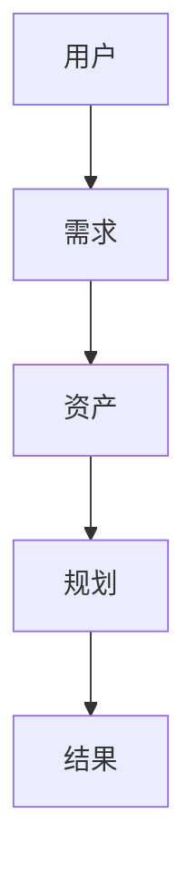
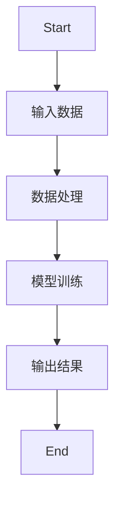
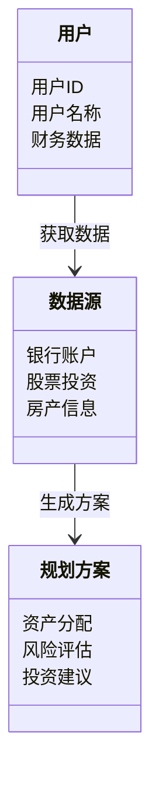
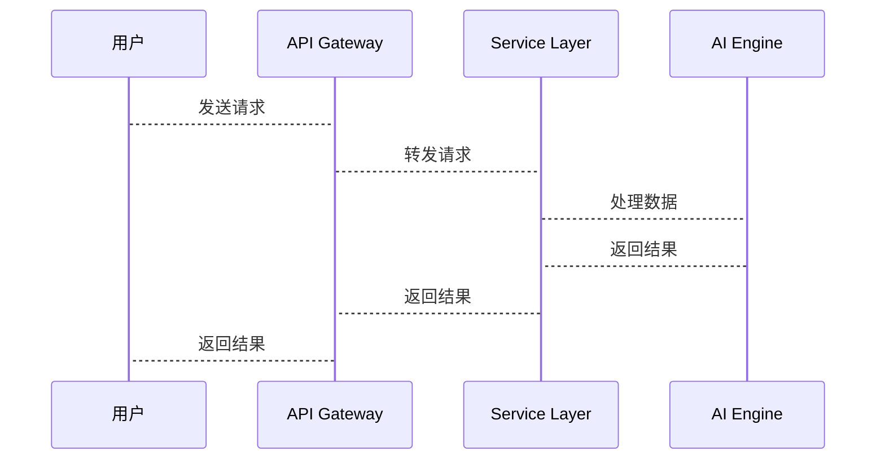

                 


# 构建智能化的个人财富传承规划助手

> 关键词：人工智能、财富传承、规划助手、大数据分析、自然语言处理

> 摘要：随着人工智能和大数据技术的快速发展，个人财富传承规划的智能化需求日益增长。本文旨在探讨如何利用AI技术构建智能化的个人财富传承规划助手，通过背景分析、核心概念、算法原理、系统设计、项目实战等多维度的深入解析，为读者提供一套完整的解决方案。文章最后还展望了未来的发展趋势，并提供了相关的实践建议。

---

## 第一部分: 智能化个人财富传承规划助手的背景与核心概念

### 第1章: 背景介绍与问题分析

#### 1.1 财富传承规划的重要性

##### 1.1.1 传统财富传承的痛点

财富传承是一个复杂而敏感的过程，涉及法律、税务、投资等多个领域。传统的财富传承规划主要依赖人工咨询，存在以下痛点：

- **信息孤岛**：传统规划往往无法整合多维度的财富数据，导致规划不够全面。
- **效率低下**：人工分析海量数据耗时耗力，难以满足个性化需求。
- **缺乏动态调整**：市场环境不断变化，传统的静态规划难以应对突发事件。

##### 1.1.2 数字化时代对财富传承的新要求

随着数字化技术的普及，用户对财富传承规划的需求也在不断升级：

- **实时性**：用户希望规划能够根据市场波动实时调整。
- **个性化**：每个人的财务状况和目标不同，需要定制化的解决方案。
- **易用性**：用户希望操作简单，能够通过移动端或网页端轻松完成规划。

##### 1.1.3 智能化规划的必要性

智能化规划能够解决传统规划的痛点，满足用户对高效、精准、个性化的财富传承需求。通过AI技术，规划助手可以实现：

- **自动化数据收集与分析**：快速整合用户的财务、法律、税务等数据。
- **智能推荐与优化**：根据市场变化和用户需求，动态调整规划方案。
- **可视化与交互式体验**：通过直观的界面，让用户轻松理解并参与规划过程。

#### 1.2 个人财富传承规划助手的定义与目标

##### 1.2.1 核心概念的界定

个人财富传承规划助手（以下简称“助手”）是一种基于人工智能和大数据技术的智能工具，旨在帮助用户制定、优化和执行财富传承计划。其核心功能包括：

- **需求分析**：通过自然语言处理技术，了解用户的财务状况、目标和偏好。
- **数据整合**：从多个来源收集用户的资产、负债、收入等信息。
- **规划生成**：基于数据分析和AI算法，生成个性化的财富传承方案。
- **动态调整**：根据市场变化和用户反馈，实时优化规划方案。

##### 1.2.2 助手的主要功能与目标

- **功能**：  
  - 数据采集与分析  
  - 风险评估与预警  
  - 投资策略推荐  
  - 法律合规性检查  
  - 动态调整与优化  

- **目标**：  
  - 提供精准的财富传承规划，确保用户的资产安全和最大化收益。  
  - 降低人为错误，提高规划的可靠性和可执行性。  
  - 提升用户体验，让用户能够轻松参与和管理财富传承过程。

##### 1.2.3 边界与外延分析

- **边界**：助手仅专注于财富传承规划的辅助工作，不涉及实际的法律文书撰写或资产过户等操作。  
- **外延**：未来可能扩展到更广泛的财富管理领域，如投资决策、税务优化等。

#### 1.3 助手与传统财富管理工具的对比

##### 1.3.1 对比维度与特征分析

| 对比维度 | 传统工具 | 智能化助手 |
|----------|-----------|------------|
| 数据处理能力 | 数据量小，处理效率低 | 数据量大，处理速度快 |
| 个性化程度 | 有限，依赖人工经验 | 高度个性化，基于AI分析 |
| 实时性 | 较低，难以动态调整 | 实时更新，动态优化 |

##### 1.3.2 助手的核心优势

- **高效性**：通过AI算法快速处理海量数据，缩短规划时间。  
- **精准性**：基于大数据分析，提供更精准的规划建议。  
- **适应性**：能够根据市场变化和用户需求动态调整规划方案。  

##### 1.3.3 适用场景与限制

- **适用场景**：  
  - 高净值用户的财富传承规划。  
  - 中小企业的财富管理需求。  
  - 复杂的跨国财富传承问题。  

- **限制**：  
  - 无法替代专业律师或财务顾问的角色。  
  - 对于非常规的复杂情况，可能需要人工干预。  

#### 1.4 本章小结

本章通过分析财富传承规划的痛点和新需求，明确了智能化助手的定义、功能和目标，并通过对比传统工具，突出了智能化助手的核心优势和适用场景。

---

### 第2章: 智能化财富传承助手的核心概念与联系

#### 2.1 核心概念原理

##### 2.1.1 人工智能在财富传承中的应用

人工智能（AI）通过以下方式在财富传承中发挥作用：

- **需求分析**：利用自然语言处理技术，分析用户的财务目标和偏好。  
- **数据整合**：通过机器学习模型，整合用户的资产、负债、收入等数据。  
- **风险评估**：基于AI算法，评估用户的财务风险，并制定应对策略。  

##### 2.1.2 大数据分析与财富规划的关系

大数据分析为财富传承规划提供了以下支持：

- **数据采集**：从多个数据源（如银行、税务、资产等）获取用户的财务信息。  
- **模式识别**：通过数据分析，识别用户的消费习惯、投资偏好等模式。  
- **趋势预测**：基于历史数据，预测未来的市场趋势和用户需求。  

##### 2.1.3 自然语言处理在需求分析中的作用

自然语言处理（NLP）技术用于解析用户的文本输入，提取关键信息：

- **意图识别**：识别用户的财务需求，如“我想将资产分配给我的三个孩子”。  
- **实体识别**：提取关键实体，如“资产总额为1000万美元”。  
- **情感分析**：分析用户的语言中的情感倾向，帮助理解用户的真实需求。  

#### 2.2 核心概念属性对比表

| 概念 | 属性 | 描述 |
|------|------|------|
| AI算法 | 精准度 | 高度依赖数据质量和算法模型 |
| 数据分析 | 时效性 | 需要实时更新和处理 |
| 自然语言处理 | 理解能力 | 取决于模型训练数据和语言复杂度 |

#### 2.3 ER实体关系图



#### 2.4 本章小结

本章通过分析人工智能、大数据分析和自然语言处理在财富传承中的作用，明确了智能化助手的核心概念和各概念之间的关系。

---

### 第3章: 算法原理与实现

#### 3.1 算法原理概述

##### 3.1.1 机器学习在财富预测中的应用

机器学习（ML）用于预测用户的财富变化趋势：

- **时间序列分析**：通过历史数据预测未来的资产价值。  
- **回归分析**：预测资产的增值或贬值趋势。  
- **聚类分析**：识别用户的资产分布模式。  

##### 3.1.2 自然语言处理的需求解析流程

NLP技术用于解析用户的自然语言输入，主要包括以下步骤：

1. **分词**：将输入文本分割成词语或短语。  
2. **词性标注**：识别每个词语的词性（如名词、动词）。  
3. **句法分析**：分析句子的语法结构。  
4. **意图识别**：确定用户的财务需求类型。  
5. **实体识别**：提取关键实体信息。  

##### 3.1.3 综合算法的协同机制

综合算法通过协同工作，实现从数据处理到结果输出的全流程：

- **数据预处理**：清洗和标准化数据。  
- **特征提取**：提取关键特征用于模型训练。  
- **模型训练**：基于训练数据训练AI模型。  
- **结果输出**：根据输入数据生成规划方案。  

#### 3.2 算法实现流程图



#### 3.3 核心算法代码示例

##### 时间序列分析代码

```python
import pandas as pd
from sklearn.preprocessing import MinMaxScaler
from keras.models import Sequential
from keras.layers import LSTM, Dense

# 数据预处理
data = pd.read_csv('wealth_data.csv')
scaler = MinMaxScaler()
scaled_data = scaler.fit_transform(data)

# 模型训练
model = Sequential()
model.add(LSTM(128, input_shape=(None, 1)))
model.add(Dense(1))
model.compile(loss='mean_squared_error', optimizer='adam')

# 训练模型
model.fit(scaled_data[:-100], scaled_data[100:], epochs=100, batch_size=32)
```

##### 风险评估代码

```python
import numpy as np
from sklearn.ensemble import RandomForestRegressor

# 数据预处理
features = ['资产', '负债', '收入']
target = '风险评分'

# 训练模型
model = RandomForestRegressor(n_estimators=100)
model.fit(X_train, y_train)

# 预测风险
new_data = np.array([[1000000, 500000, 100000]])
predicted_risk = model.predict(new_data)
```

#### 3.4 本章小结

本章通过详细讲解算法的原理和实现，展示了如何利用机器学习和自然语言处理技术构建智能化的财富传承规划助手。

---

## 第二部分: 系统分析与架构设计

### 第4章: 系统分析与架构设计

#### 4.1 系统分析

##### 4.1.1 问题场景介绍

用户希望通过智能化助手完成财富传承规划，主要需求包括：

- **数据采集**：整合用户的财务数据。  
- **规划生成**：根据数据生成个性化规划方案。  
- **动态调整**：实时更新规划方案。  

##### 4.1.2 项目介绍

本项目旨在开发一款基于AI的财富传承规划助手，主要包括以下功能模块：

- **用户界面**：提供友好的交互界面。  
- **数据分析模块**：处理用户数据并生成分析结果。  
- **AI规划模块**：基于数据分析结果生成规划方案。  
- **动态调整模块**：根据市场变化优化规划方案。  

#### 4.2 系统功能设计

##### 4.2.1 领域模型



##### 4.2.2 系统架构设计


#### 4.3 系统接口设计

##### 4.3.1 接口描述

| 接口名称 | 描述 | 输入 | 输出 |
|----------|------|------|------|
| getUserData | 获取用户数据 | 用户ID | 用户数据 |
| generatePlan | 生成规划方案 | 用户数据 | 规划方案 |
| updatePlan | 更新规划方案 | 市场数据 | 更新后的方案 |

##### 4.3.2 交互流程



#### 4.4 本章小结

本章通过系统分析和架构设计，明确了智能化助手的实现方案和技术路线。

---

## 第三部分: 项目实战

### 第5章: 项目实战

#### 5.1 环境安装

##### 5.1.1 安装依赖

```bash
pip install numpy pandas scikit-learn keras tensorflow
```

#### 5.2 系统核心实现源代码

##### 5.2.1 数据采集模块

```python
import pandas as pd
import requests

def get_data(api_key):
    url = f'https://api.example.com/wealth_data?api_key={api_key}'
    response = requests.get(url)
    data = pd.DataFrame(response.json())
    return data
```

##### 5.2.2 AI规划模块

```python
from keras.models import load_model

def generate_plan(data):
    model = load_model('plan_generator.h5')
    processed_data = preprocess(data)
    plan = model.predict(processed_data)
    return plan
```

##### 5.2.3 动态调整模块

```python
import numpy as np
from sklearn.ensemble import RandomForestRegressor

def update_plan(new_data):
    model = RandomForestRegressor(n_estimators=100)
    model.fit(X_train, y_train)
    updated_plan = model.predict(new_data)
    return updated_plan
```

#### 5.3 代码应用解读与分析

##### 5.3.1 数据采集模块

该模块通过API接口获取用户的财务数据，并将其转换为DataFrame格式以便后续处理。

##### 5.3.2 AI规划模块

该模块加载预训练的神经网络模型，对数据进行预处理后，生成个性化的财富传承规划方案。

##### 5.3.3 动态调整模块

该模块基于随机森林回归模型，根据最新的市场数据动态调整规划方案，确保规划的最优性。

#### 5.4 实际案例分析和详细讲解剖析

##### 5.4.1 案例背景

假设用户A是一位高净值客户，资产总额为1000万美元，希望将资产分配给三个孩子，并确保在市场波动中资产的保值和增值。

##### 5.4.2 数据采集与分析

通过API接口获取用户的财务数据，包括资产、负债、收入等信息，并进行清洗和预处理。

##### 5.4.3 规划生成

基于AI模型生成个性化的财富传承方案，包括资产分配比例、投资策略、风险评估等内容。

##### 5.4.4 动态调整

根据市场变化和用户反馈，实时更新规划方案，确保其最优性。

#### 5.5 本章小结

本章通过实际案例展示了智能化财富传承规划助手的实现过程，包括数据采集、AI规划和动态调整等步骤。

---

## 第四部分: 总结与展望

### 第6章: 总结与展望

#### 6.1 本章总结

本文详细探讨了智能化个人财富传承规划助手的构建过程，涵盖了背景分析、核心概念、算法原理、系统设计和项目实战等多个方面。通过AI技术的应用，智能化助手能够高效、精准地满足用户的财富传承需求。

#### 6.2 未来展望

未来，智能化财富传承规划助手将在以下几个方面进一步发展：

- **更复杂场景的支持**：应对更多复杂的财富传承需求。  
- **更智能的交互方式**：引入虚拟现实（VR）和增强现实（AR）技术，提供更直观的交互体验。  
- **更广泛的应用领域**：扩展到更多财富管理领域，如投资决策、税务优化等。  

#### 6.3 最佳实践 Tips

- **数据安全**：确保用户数据的安全性，避免数据泄露。  
- **模型优化**：持续优化AI模型，提高规划的准确性和可靠性。  
- **用户教育**：加强对用户的教育，提升其对智能化工具的认知和使用能力。  

#### 6.4 本章小结

本章总结了本文的主要内容，并展望了未来的发展方向，同时提供了一些实用的建议。

---

## 作者：AI天才研究院/AI Genius Institute & 禅与计算机程序设计艺术/Zen And The Art of Computer Programming

---

以上是《构建智能化的个人财富传承规划助手》的完整目录大纲和部分内容。希望对您有所帮助！

