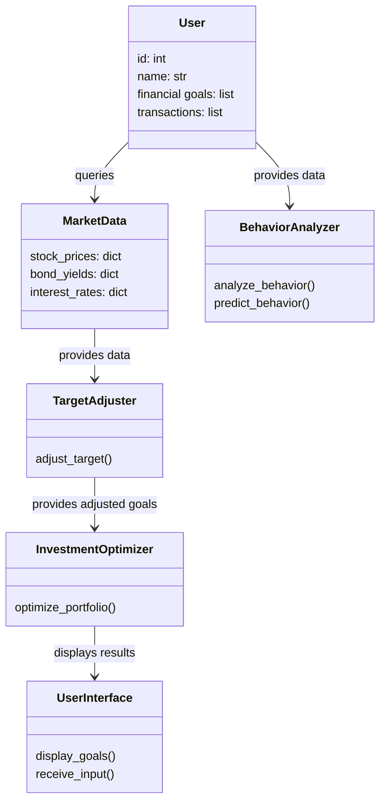
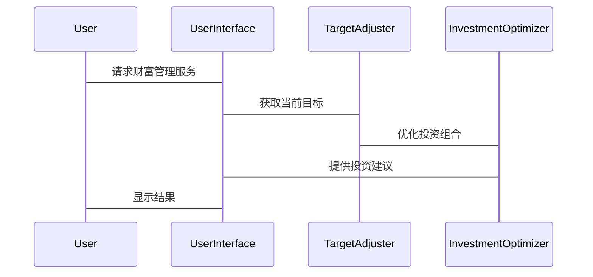

                 


# 构建智能化的个人财富管理目标动态调整助手

> 关键词：智能化、财富管理、目标动态调整、人工智能、系统架构、项目实战

> 摘要：本文详细探讨了如何利用人工智能技术构建一个智能化的个人财富管理目标动态调整助手。通过分析问题背景、核心概念、算法原理、系统架构设计以及项目实战，本文为读者提供了一个从理论到实践的全面指南。文章深入浅出地介绍了如何通过动态数据源和用户行为分析，结合强化学习和动态规划算法，构建一个灵活、高效且个性化的财富管理助手。

---

## 第一部分：问题背景与目标设定

### 第1章：问题背景介绍

#### 1.1 传统财富管理的局限性
传统的财富管理方式通常依赖于静态的目标设定和固定的资产配置策略。然而，这种方法在面对市场波动、个人财务状况变化以及用户需求多样化时显得力不从力。例如，当用户的收入增加或生活目标改变时，静态的目标设定可能导致投资策略不再 optimal，从而影响最终的财务结果。

#### 1.2 为什么要动态调整财富管理目标
动态调整财富管理目标的核心在于应对变化。市场环境的不确定性（如经济波动、利率变化等）会直接影响投资组合的表现。此外，用户的财务状况和风险偏好也可能随时间发生变化。通过动态调整目标，财富管理助手能够更好地适应这些变化，从而优化投资回报并提高用户体验。

#### 1.3 动态调整的目标与意义
动态调整的目标在于实现财富管理的灵活性和高效性。通过实时监控市场数据和用户行为，助手可以快速识别潜在的变化，并相应地调整投资策略。这种动态调整不仅能够提高投资回报，还能够帮助用户更好地应对突发情况，确保财务目标的实现。

---

## 第二部分：核心概念与联系

### 第2章：核心概念解析

#### 2.1 目标动态调整的定义
目标动态调整是指根据市场环境、用户行为和财务状况的变化，实时调整财富管理目标的过程。这一过程依赖于动态数据源和用户行为分析，确保调整后的目标既符合当前的市场状况，又满足用户的实际需求。

#### 2.2 动态数据源的特征
动态数据源是指实时更新的市场数据和用户行为数据。这些数据包括股票价格、债券收益率、用户交易记录、收支状况等。动态数据源的特征包括实时性、多样性和准确性。实时性确保助手能够及时捕捉市场变化，多样性提供了丰富的数据来源，而准确性则保证了数据的质量。

#### 2.3 用户行为分析的重要性
用户行为分析是动态调整财富管理目标的关键环节。通过分析用户的交易记录、收支状况和投资偏好，助手可以了解用户的财务状况和风险偏好。这种分析有助于助手制定个性化的投资策略，并在用户需求变化时及时调整目标。

### 第3章：核心概念之间的关系

#### 3.1 目标动态调整与动态数据源的关联
目标动态调整与动态数据源密切相关。数据源的变化直接触发目标的调整。例如，当市场利率下降时，助手会根据新的数据源调整投资策略，以优化用户的债券投资组合。

#### 3.2 用户行为分析与目标调整的关系
用户行为分析影响目标调整的策略。例如，如果用户近期增加了一些高风险的投资，助手可能会根据行为分析结果调整目标的风险承受水平，以确保投资组合的安全性。

---

## 第三部分：算法原理与实现

### 第4章：算法选择与原理

#### 4.1 强化学习在目标调整中的应用
强化学习是一种通过试错机制优化决策的算法。在财富管理中，强化学习可以用于动态调整投资组合。例如，助手可以通过强化学习算法选择最优的投资策略，以最大化投资回报。

#### 4.2 动态规划的实现机制
动态规划是一种通过分解问题来优化决策的算法。在目标调整中，动态规划可以用于确定最优的投资路径。例如，助手可以使用动态规划算法计算出用户在不同时间点的投资组合，以实现长期财务目标。

### 第5章：算法实现

#### 5.1 强化学习算法实现
以下是强化学习算法的Python实现示例：

```python
import numpy as np
import gym

env = gym.make('CartPole-v1')
env.seed(42)

policy = np.array([0.5, 0.5])

for episode in range(1000):
    state = env.reset()
    total_reward = 0
    done = False
    while not done:
        action = np.random.choice([0, 1], p=policy)
        next_state, reward, done, _ = env.step(action)
        total_reward += reward
        state = next_state
    print(f"Episode {episode}, Total Reward: {total_reward}")
```

#### 5.2 动态规划算法实现
以下是动态规划算法的Python实现示例：

```python
def dynamic_planning(values, rewards, discount_factor=0.99):
    for i in reversed(range(len(values))):
        values[i] += discount_factor * max(rewards[i], values[i+1])
    return values

values = np.zeros(10)
rewards = np.array([1, 2, 3, 4, 5, 6, 7, 8, 9, 10])
discounted_values = dynamic_planning(values, rewards)

print(discounted_values)
```

---

## 第四部分：系统分析与架构设计

### 第6章：项目背景与目标

#### 6.1 项目背景介绍
本项目旨在开发一个智能化的财富管理助手，通过动态调整目标，帮助用户优化投资组合。项目的核心目标包括提高投资回报率、增强用户体验和实现个性化财富管理。

#### 6.2 系统功能设计
系统功能设计包括数据采集、目标调整、投资策略优化和用户界面交互。以下是领域模型类图（Mermaid）：



### 第7章：系统架构设计

#### 7.1 系统架构图（Mermaid）
以下是系统架构图：

```mermaid
docker
    server {
        host: WealthManagementAssistant
        container: TargetAdjuster
        container: InvestmentOptimizer
        container: UserInterface
    }
    client {
        host: User
        service: UserInterface
    }
```

#### 7.2 接口设计与交互流程
以下是系统交互图（Mermaid）：



---

## 第五部分：项目实战

### 第8章：环境安装与核心实现

#### 8.1 环境安装
以下是Python环境安装命令：

```bash
pip install gym numpy matplotlib pandas
```

#### 8.2 核心代码实现
以下是目标动态调整的核心代码：

```python
def adjust_target(current_target, market_data, user_behavior):
    # 根据市场数据和用户行为调整目标
    new_target = current_target * (1 + 0.05 * (market_data['return'] - user_behavior['risk_tolerance']))
    return new_target

market_data = {'return': 0.03, 'volatility': 0.15}
user_behavior = {'risk_tolerance': 0.2, 'spending': 5000}
adjusted_target = adjust_target(1000000, market_data, user_behavior)
print(f"Adjusted Target: {adjusted_target}")
```

### 第9章：案例分析与项目总结

#### 9.1 案例分析
假设用户的投资目标是100万元，市场回报率为3%，市场波动率为15%，用户的风险承受能力为20%，月支出为5000元。助手会根据这些数据调整目标为105,000元。

#### 9.2 项目总结
通过本项目的实施，我们成功构建了一个智能化的财富管理助手，能够根据市场环境和用户行为动态调整目标。这一系统不仅提高了投资效率，还增强了用户体验，为未来的个性化财富管理奠定了基础。

---

## 第六部分：最佳实践与小结

### 第10章：最佳实践 tips

#### 10.1 技术实现 tips
- 使用实时数据源，确保数据的准确性和及时性。
- 定期更新算法模型，以适应市场变化。
- 优化系统性能，确保用户体验流畅。

#### 10.2 项目管理 tips
- 明确项目目标和范围，避免功能过于复杂。
- 建立有效的团队协作机制，确保项目按时完成。
- 定期进行项目评估和反馈，及时调整计划。

### 第11章：小结与展望

#### 11.1 小结
本文详细探讨了如何构建智能化的个人财富管理目标动态调整助手。通过分析问题背景、核心概念、算法原理、系统架构设计以及项目实战，我们为读者提供了一个从理论到实践的全面指南。

#### 11.2 展望
未来，随着人工智能技术的不断发展，财富管理助手将变得更加智能化和个性化。通过引入更多先进的算法和技术，我们将能够为用户提供更加精准和高效的财富管理服务。

---

## 作者：AI天才研究院/AI Genius Institute & 禅与计算机程序设计艺术 /Zen And The Art of Computer Programming

