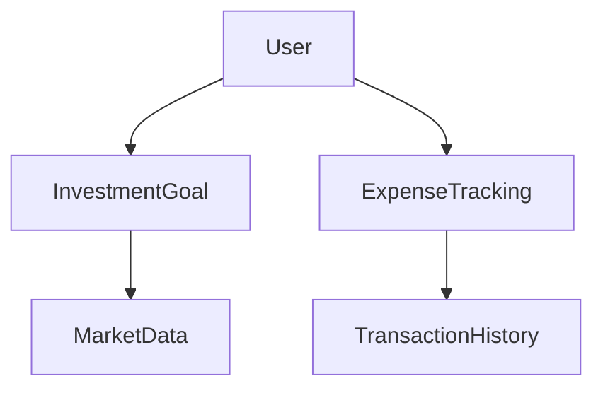
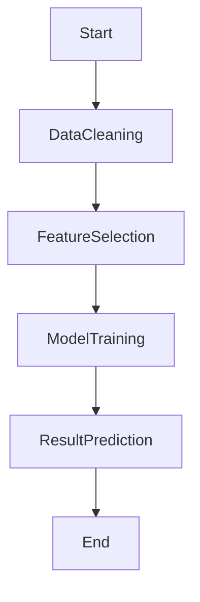
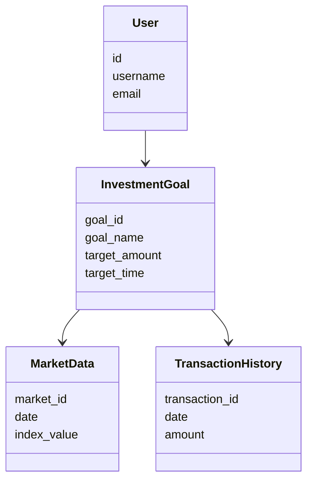
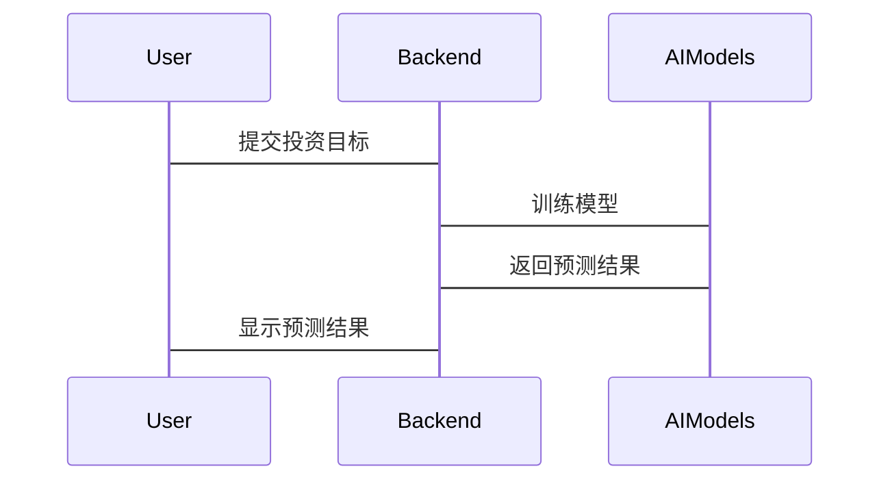

                 


# 构建智能化的个人财富管理目标跟踪助手

## 关键词：个人财富管理，人工智能，目标跟踪，数据驱动，智能化助手

## 摘要：  
本文将详细探讨如何利用人工智能技术构建智能化的个人财富管理目标跟踪助手。通过分析当前财富管理中的痛点，结合AI技术，提出一种高效的目标跟踪解决方案。文章从背景介绍、核心概念、算法原理、系统架构到项目实战，逐步展开，最终实现一个智能化的财富管理助手。

---

# 第一部分: 背景介绍

# 第1章: 个人财富管理目标跟踪的背景与挑战

## 1.1 问题背景
### 1.1.1 个人财富管理的重要性
个人财富管理是每个人都需要关注的重要课题，包括投资、支出、风险管理等方面。通过科学的目标跟踪，可以帮助用户更好地实现财务自由。

### 1.1.2 目标跟踪的必要性
设定财务目标（如投资回报率、储蓄目标）是实现财富增长的关键。然而，目标的实现需要持续的跟踪和调整。

### 1.1.3 当前存在的主要问题
- 数据分散：用户的财务数据可能分布在不同的平台（银行、支付宝、股票账户等），难以统一管理。
- 知识不足：普通用户缺乏专业的财务知识，难以制定合理的投资策略。
- 人工跟踪效率低：手动记录和跟踪目标耗时耗力，容易遗漏和错误。

## 1.2 问题描述
### 1.2.1 财富管理目标的多样性
用户的财务目标可能包括短期储蓄、长期投资、应急基金等，目标的多样性增加了管理的复杂性。

### 1.2.2 数据收集与处理的复杂性
财务数据可能涉及多种格式（如银行对账单、支付宝流水、股票交易记录等），需要进行清洗和结构化处理。

### 1.2.3 用户行为分析的挑战
用户的行为（如消费习惯、投资偏好）需要通过数据分析来挖掘规律，从而提供个性化的建议。

## 1.3 问题解决
### 1.3.1 引入人工智能的优势
AI技术可以自动处理数据、分析用户行为、提供个性化建议，从而提高目标跟踪的效率和准确性。

### 1.3.2 智能化目标跟踪的实现路径
通过AI技术实现数据整合、智能分析和个性化推荐，帮助用户更好地管理财务目标。

### 1.3.3 技术与业务的结合点
AI技术与财务目标跟踪的结合点在于数据处理、预测模型和用户交互。

## 1.4 边界与外延
### 1.4.1 系统功能的边界
系统主要关注目标跟踪和管理，不涉及具体的交易操作（如股票买卖）。

### 1.4.2 与相关系统的交互
系统需要与银行、支付宝等第三方服务进行数据交互，但不直接参与交易。

### 1.4.3 功能的可扩展性
系统设计应具有可扩展性，未来可以加入更多的功能（如税务规划、保险推荐）。

## 1.5 概念结构与核心要素组成
### 1.5.1 核心概念的层次结构
- 上层：用户需求（目标设定、跟踪、调整）。
- 中层：数据处理、模型分析。
- 下层：技术实现（AI算法、数据存储）。

### 1.5.2 核心要素的定义与关系
- 数据：用户财务数据、市场数据。
- 模型：预测模型、推荐模型。
- 用户：目标设定者、数据提供者。

### 1.5.3 系统架构的初步设想
- 前端：用户交互界面。
- 后端：数据处理、模型计算。
- 数据存储：数据库、第三方接口。

---

# 第二部分: 核心概念与联系

# 第2章: 智能化财富管理助手的核心概念

## 2.1 核心概念原理
### 2.1.1 数据驱动的财富管理
通过收集和分析用户数据，提供个性化的财务建议。

### 2.1.2 AI在目标跟踪中的应用
利用机器学习模型预测目标实现的可能性，并提供调整建议。

### 2.1.3 个性化推荐机制
根据用户的财务状况和行为习惯，推荐适合的投资策略。

## 2.2 核心概念属性特征对比
| 特征         | 数据驱动的财富管理 | AI在目标跟踪中的应用 | 个性化推荐机制 |
|--------------|--------------------|----------------------|----------------|
| 数据来源     | 用户财务数据       | 市场数据、用户行为    | 用户行为、目标 |
| 处理方式     | 数据清洗、结构化   | 预测、分类           | 推荐算法       |
| 输出结果     | 财务报告、建议     | 预测结果、调整建议   | 投资策略       |

## 2.3 ER实体关系图架构


---

# 第三部分: 算法原理

# 第3章: 基于机器学习的目标跟踪算法

## 3.1 算法原理
### 3.1.1 数据预处理
- 数据清洗：去除无效数据。
- 数据结构化：将非结构化数据转化为结构化数据。

### 3.1.2 特征选择
- 重要特征：投资金额、目标时间、市场波动。

### 3.1.3 模型训练
- 使用线性回归模型预测目标实现的可能性。

## 3.2 算法流程


## 3.3 算法实现
### 3.3.1 Python代码示例
```python
import pandas as pd
from sklearn.linear_model import LinearRegression
from sklearn.metrics import mean_squared_error

# 数据加载
data = pd.read_csv('wealth_data.csv')

# 特征选择
X = data[['investment_amount', 'time_period']]
y = data['target_achieved']

# 模型训练
model = LinearRegression()
model.fit(X, y)

# 预测结果
predictions = model.predict(X)
print('预测结果:', predictions)
print('均方误差:', mean_squared_error(y, predictions))
```

### 3.3.2 数学模型与公式
$$ y = \beta_0 + \beta_1 x_1 + \beta_2 x_2 + \epsilon $$
其中：
- $y$ 是目标实现的概率。
- $x_1$ 是投资金额。
- $x_2$ 是目标时间。
- $\beta_0$ 是截距。
- $\beta_1, \beta_2$ 是回归系数。
- $\epsilon$ 是误差项。

---

# 第四部分: 系统分析与架构设计

# 第4章: 系统分析与架构设计方案

## 4.1 问题场景介绍
系统需要帮助用户跟踪投资目标，预测目标实现的可能性，并提供调整建议。

## 4.2 项目介绍
本项目旨在构建一个智能化的财富管理助手，利用AI技术实现目标跟踪和管理。

## 4.3 系统功能设计
### 4.3.1 领域模型


## 4.4 系统架构设计


## 4.5 系统接口设计
- 用户接口：REST API。
- 数据接口：与第三方数据源（如银行API）对接。

## 4.6 系统交互设计


---

# 第五部分: 项目实战

# 第5章: 项目实战

## 5.1 环境安装
安装必要的Python库（如pandas、scikit-learn）。

## 5.2 系统核心实现源代码
### 5.2.1 数据处理代码
```python
import pandas as pd

# 加载数据
data = pd.read_csv('wealth_data.csv')

# 数据清洗
data.dropna(inplace=True)

# 数据结构化
data['date'] = pd.to_datetime(data['date'])
```

### 5.2.2 模型训练代码
```python
from sklearn.linear_model import LinearRegression

# 特征选择
X = data[['investment_amount', 'time_period']]
y = data['target_achieved']

# 模型训练
model = LinearRegression()
model.fit(X, y)
```

### 5.2.3 模型预测代码
```python
# 预测结果
predictions = model.predict(X)
print('预测结果:', predictions)
```

## 5.3 代码应用解读与分析
- 数据清洗：去除无效数据。
- 特征选择：选择关键特征进行预测。
- 模型训练：使用线性回归模型进行预测。

## 5.4 实际案例分析
分析一个用户的财务数据，展示如何通过系统实现目标跟踪。

---

# 第六部分: 最佳实践

# 第6章: 最佳实践与总结

## 6.1 小结
智能化的财富管理助手可以帮助用户更高效地管理财务目标。

## 6.2 注意事项
- 数据隐私保护。
- 模型的可解释性。
- 系统的可扩展性。

## 6.3 拓展阅读
推荐相关书籍和资源，帮助读者进一步学习。

---

# 作者：AI天才研究院/AI Genius Institute & 禅与计算机程序设计艺术 /Zen And The Art of Computer Programming

