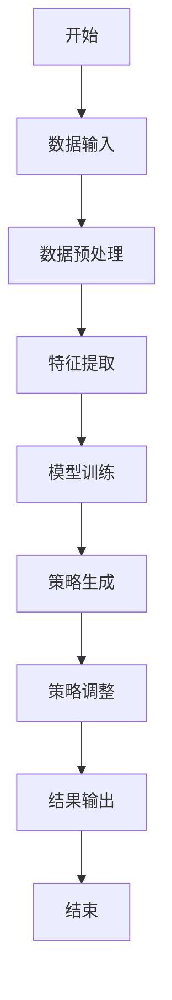
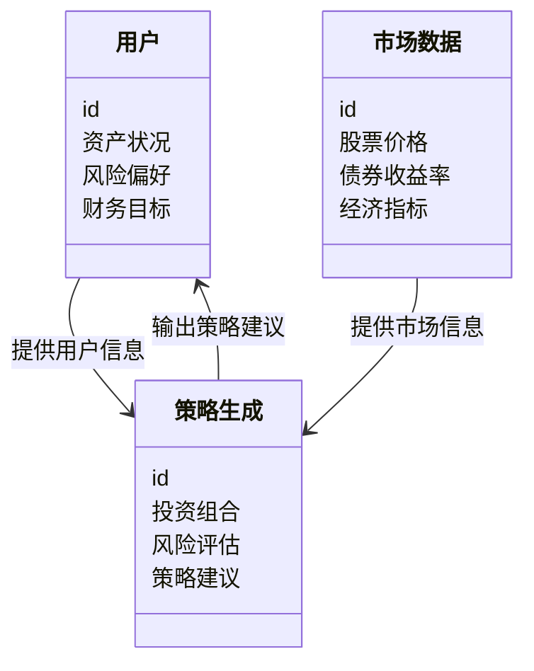
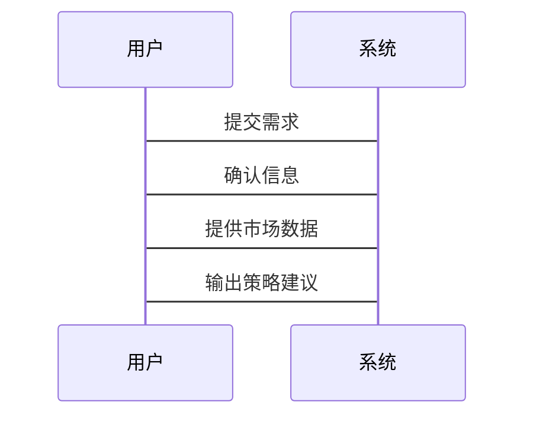

                 


# 《构建智能化的个人财富管理策略动态生成与调整助手》

> 关键词：智能化财富管理、动态生成、策略调整、人工智能、个人 finance

> 摘要：随着数字化与智能化时代的到来，个人财富管理面临着前所未有的挑战和机遇。传统的财富管理方法已经难以满足现代人多样化和个性化的财务需求。本文将深入探讨如何利用人工智能技术，构建一个智能化的个人财富管理策略动态生成与调整助手。通过分析用户需求、市场环境和风险偏好，结合先进的算法和系统架构设计，提出一种动态生成和优化财富管理策略的方法。本文将从背景介绍、核心概念、算法原理、系统架构设计、项目实战到最佳实践等方面，详细阐述这一智能化助手的构建过程，为读者提供一份全面的技术指南。

----------------------------------------------------------------

# 第一部分: 背景介绍

# 第1章: 个人财富管理智能化的背景与需求

## 1.1 问题背景
### 1.1.1 传统个人财富管理的局限性
传统个人财富管理依赖于人工咨询和静态策略，难以适应市场变化和个性化需求。用户往往需要花费大量时间进行市场分析和策略调整，效率低下且容易出错。

### 1.1.2 数字化与智能化时代的财富管理需求
随着大数据、人工智能和机器学习技术的发展，智能化工具能够实时分析市场数据、用户行为和风险偏好，动态生成和优化财富管理策略，满足现代人对高效、精准和个性化的财富管理需求。

### 1.1.3 个人财富管理的痛点与挑战
- 财富目标多样化：用户可能有资产保值、增值、税务优化等多种目标。
- 市场环境动态变化：经济波动、政策变化等会影响财富管理策略的有效性。
- 用户行为个性化：不同用户的财务状况、风险承受能力和投资偏好差异大。

## 1.2 问题描述
### 1.2.1 财富管理目标的多样性
用户可能有不同的财富目标，如短期理财、长期投资、资产配置等，需要动态调整策略以满足不同目标。

### 1.2.2 市场环境的动态变化
市场环境的不确定性（如经济波动、政策变化）要求财富管理策略能够实时调整，以应对潜在风险。

### 1.2.3 用户行为的个性化与复杂性
用户的行为和需求可能随时变化，助手需要能够快速响应并提供相应的策略调整建议。

## 1.3 问题解决
### 1.3.1 智能化助手的核心目标
通过智能化算法，实时分析用户需求和市场环境，动态生成和优化财富管理策略，帮助用户实现财富目标。

### 1.3.2 动态生成与调整的必要性
市场环境和用户需求的动态变化要求策略能够实时更新，以保持其有效性和适用性。

### 1.3.3 技术实现的关键路径
- 数据采集与处理：获取用户行为、市场数据等信息。
- 算法设计：基于机器学习的策略生成与优化算法。
- 系统架构：构建高效的智能化助手系统。

## 1.4 边界与外延
### 1.4.1 功能边界
- 数据输入：用户信息、市场数据等。
- 数据处理：分析和建模。
- 策略输出：生成和调整策略。

### 1.4.2 与传统财富管理的区别
- 传统财富管理依赖人工咨询，策略静态。
- 智能化助手基于实时数据和机器学习，策略动态调整。

### 1.4.3 与其他智能化工具的对比
- 金融领域的智能化工具专注于策略生成与优化。
- 其他领域（如健康管理）的工具关注个性化建议。

## 1.5 核心要素组成
### 1.5.1 数据输入
- 用户信息：资产状况、风险偏好、财务目标等。
- 市场数据：股票价格、利率、经济指标等。

### 1.5.2 算法处理
- 数据分析：使用机器学习模型进行预测和分类。
- 策略生成：基于分析结果生成投资组合建议。

### 1.5.3 输出结果
- 动态调整的财富管理策略。
- 风险评估与预警。

## 1.6 本章小结
本章分析了个人财富管理智能化的背景，阐述了传统方法的局限性和智能化助手的需求。明确了核心问题和解决路径，为后续章节的算法设计和系统实现奠定了基础。

----------------------------------------------------------------

# 第二部分: 核心概念与联系

# 第2章: 智能化财富管理助手的核心概念

## 2.1 核心概念原理
### 2.1.1 用户画像与需求分析
通过收集和分析用户的资产状况、风险偏好、财务目标等信息，构建用户画像，为个性化策略生成提供基础。

### 2.1.2 市场数据与风险评估
实时采集和分析市场数据，评估不同投资标的的风险和收益，为策略生成提供数据支持。

### 2.1.3 策略生成与优化
基于用户画像和市场数据，利用机器学习算法生成和优化财富管理策略，确保策略的有效性和适应性。

## 2.2 核心概念属性特征对比

| 概念       | 属性特征               |
|------------|------------------------|
| 用户画像    | 个性化、动态性、全面性  |
| 市场数据    | 实时性、多样性、复杂性  |
| 策略生成    | 智能性、动态性、可解释性 |

## 2.3 ER实体关系图架构

```mermaid
erd
    entity 用户画像 {
        id
        资产状况
        风险偏好
        财务目标
    }
    
    entity 市场数据 {
        id
        股票价格
        利率
        经济指标
    }
    
    entity 策略生成 {
        id
        投资组合
        风险评估
        策略建议
    }
    
    relationship 用户画像 -- 市场数据: 数据输入
    relationship 用户画像 -- 策略生成: 个性化策略
    relationship 市场数据 -- 策略生成: 数据支持
```

## 2.4 本章小结
本章详细阐述了智能化财富管理助手的核心概念，通过用户画像、市场数据和策略生成的对比与关系分析，为后续的算法设计和系统实现提供了理论基础。

----------------------------------------------------------------

# 第三部分: 算法原理讲解

# 第3章: 动态生成与调整的算法原理

## 3.1 动态生成与调整的算法思路
### 3.1.1 问题建模
- 用户需求：资产保值、增值、税务优化等。
- 市场变量：股票价格、债券收益率、汇率等。
- 风险偏好：保守型、平衡型、进取型。

### 3.1.2 算法选择
- 使用机器学习模型，如回归分析和分类算法，进行策略生成与优化。

## 3.2 算法流程



## 3.3 算法实现细节
### 3.3.1 数据预处理
- 数据清洗：处理缺失值、异常值。
- 数据标准化：统一数据格式和单位。

### 3.3.2 特征提取
- 从市场数据中提取关键特征，如波动率、收益比率等。

### 3.3.3 模型训练
- 使用回归分析预测市场趋势。
- 使用分类算法识别市场状态（牛市、熊市）。

## 3.4 算法代码实现

```python
import pandas as pd
from sklearn.linear_model import LinearRegression

# 数据预处理
data = pd.read_csv('market_data.csv')
data = data.dropna()  # 删除缺失值

# 特征提取
features = data[['stock_price', 'bond_yield', 'economic_indicator']]
target = data['market_trend']

# 模型训练
model = LinearRegression()
model.fit(features, target)

# 预测市场趋势
new_data = pd.read_csv('new_market_data.csv')
new_features = new_data[['stock_price', 'bond_yield', 'economic_indicator']]
predicted_trend = model.predict(new_features)
```

## 3.5 算法的数学模型和公式
### 3.5.1 回归分析模型
$$ y = \beta_0 + \beta_1 x_1 + \beta_2 x_2 + \dots + \beta_n x_n + \epsilon $$
其中，$y$ 是目标变量，$x_i$ 是特征变量，$\beta_i$ 是回归系数，$\epsilon$ 是误差项。

### 3.5.2 分类算法模型
使用逻辑回归进行分类：
$$ P(y=1|x) = \frac{1}{1 + e^{-(\beta_0 + \beta_1 x_1 + \dots + \beta_n x_n)}} $$

## 3.6 通俗易懂的例子
假设用户希望进行股票投资，助手通过分析历史数据和市场趋势，预测股票价格将上涨，建议用户增加股票持仓比例。如果市场趋势发生变化，助手会动态调整策略，建议用户减少股票持仓，转投债券或其他资产。

## 3.7 本章小结
本章详细讲解了动态生成与调整算法的原理和实现，通过代码和数学模型展示了如何利用机器学习技术生成和优化财富管理策略。

----------------------------------------------------------------

# 第四部分: 系统分析与架构设计方案

# 第4章: 智能化助手的系统架构设计

## 4.1 问题场景介绍
用户希望在市场变化时，系统能够实时调整财富管理策略，满足个性化需求。

## 4.2 项目介绍
本项目旨在构建一个智能化的个人财富管理助手，帮助用户动态生成和调整财富管理策略。

## 4.3 系统功能设计



## 4.4 系统架构设计


## 4.5 系统接口设计
### 4.5.1 API接口
- GET /users: 获取用户信息
- POST /strategies: 生成策略
- PUT /adjustments: 调整策略

## 4.6 系统交互流程



## 4.7 本章小结
本章从系统架构的角度，详细设计了智能化助手的结构和接口，为后续的项目实现奠定了基础。

----------------------------------------------------------------

# 第五部分: 项目实战

# 第5章: 智能化助手的项目实现

## 5.1 环境安装
- 安装Python和必要的库：
  ```bash
  pip install pandas scikit-learn matplotlib
  ```

## 5.2 系统核心实现源代码

```python
import pandas as pd
from sklearn.linear_model import LinearRegression
from sklearn.metrics import mean_squared_error

# 数据加载
data = pd.read_csv('market_data.csv')

# 数据预处理
data = data.dropna()

# 特征与目标分离
features = data[['stock_price', 'bond_yield', 'economic_indicator']]
target = data['market_trend']

# 模型训练
model = LinearRegression()
model.fit(features, target)

# 预测与评估
new_data = pd.read_csv('new_market_data.csv')
new_features = new_data[['stock_price', 'bond_yield', 'economic_indicator']]
predictions = model.predict(new_features)
mse = mean_squared_error(new_data['market_trend'], predictions)
print(f'均方误差: {mse}')
```

## 5.3 代码应用解读与分析
### 5.3.1 数据加载与预处理
读取市场数据并处理缺失值，确保数据的完整性和一致性。

### 5.3.2 特征与目标分离
将特征变量和目标变量分开，用于模型训练和预测。

### 5.3.3 模型训练与预测
使用线性回归模型训练，并对新数据进行预测，评估模型的准确性。

## 5.4 实际案例分析
### 5.4.1 案例背景
用户A有50万元资产，风险偏好为平衡型，希望进行资产配置。

### 5.4.2 数据分析
市场数据表明股票价格近期上涨，债券收益率下降。

### 5.4.3 策略生成
基于模型预测，建议用户增加股票持仓比例至60%，债券持仓比例至30%，现金储备10%。

## 5.5 项目小结
本章通过实际案例展示了智能化助手的项目实现过程，从数据处理到模型训练，再到策略生成，详细解读了每个步骤的操作和结果。

----------------------------------------------------------------

# 第六部分: 最佳实践

# 第6章: 智能化助手的最佳实践

## 6.1 小结
智能化助手通过实时分析市场数据和用户需求，动态生成和优化财富管理策略，帮助用户实现财富目标。

## 6.2 注意事项
- 数据隐私保护：确保用户数据的安全性和隐私性。
- 模型可解释性：复杂的模型可能导致用户不信任，需注重模型的可解释性。
- 系统稳定性：确保系统在高并发和极端市场情况下的稳定性。

## 6.3 拓展阅读
- 《机器学习实战》：深入理解机器学习算法的应用。
- 《金融时间序列分析》：掌握金融市场数据的分析方法。
- 《系统架构设计》：学习复杂系统的架构设计技巧。

## 6.4 本章小结
本章总结了智能化助手的最佳实践，提出了注意事项和拓展阅读的方向，帮助读者进一步提升理解和应用能力。

----------------------------------------------------------------

# 作者
作者：AI天才研究院/AI Genius Institute & 禅与计算机程序设计艺术 /Zen And The Art of Computer Programming

----------------------------------------------------------------

# 版权声明
本文版权归作者所有，未经授权，不得转载。如需转载请注明出处。

