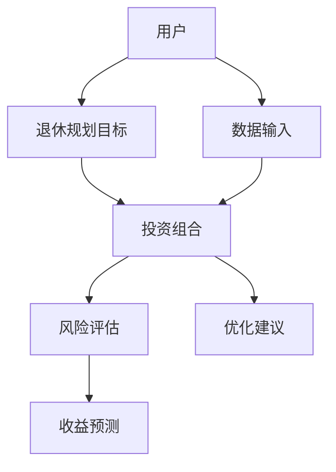
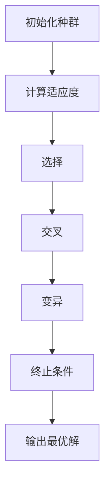
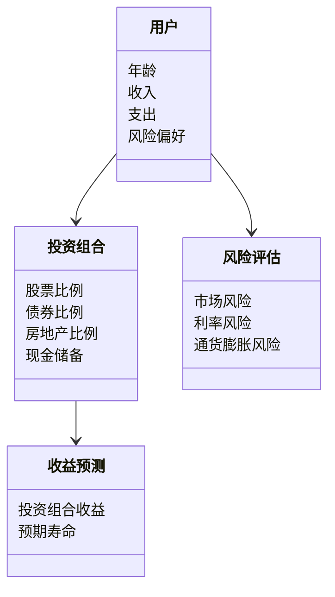
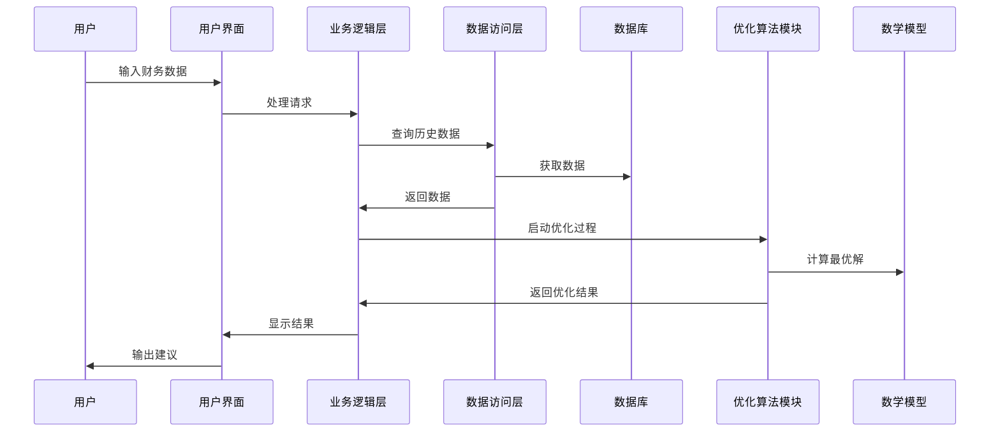

                 


# 构建智能化的个人退休规划优化助手

## 关键词：
- 智能化退休规划
- 优化助手
- 人工智能
- 退休规划算法
- 数理模型

## 摘要：
本文详细探讨了如何构建一个智能化的个人退休规划优化助手，通过结合人工智能和优化算法，帮助个人实现精准、个性化的退休规划。文章从问题背景、核心概念、算法原理、系统架构到项目实战，全面解析了智能化退休规划助手的构建过程，包括数据驱动的优化方法、动态调整的规划策略以及基于数学模型的算法实现。

---

# 第一部分：智能化个人退休规划优化助手的背景与概念

## 第1章：个人退休规划的背景与挑战

### 1.1 退休规划的重要性

#### 1.1.1 退休规划的定义与目标
退休规划是指为个人在退休后能够维持一定的生活水平而进行的财务规划。其核心目标是确保在退休后有足够的资金来源，同时在生命周期的不同阶段进行合理的资产配置和风险管理。

#### 1.1.2 当前退休规划的主要问题
传统的退休规划往往依赖于简单的财务模型和经验判断，存在以下问题：
- **缺乏动态性**：未能及时调整以应对市场变化和个人生活状况的改变。
- **计算复杂性**：复杂的数学模型和多目标优化问题难以手工解决。
- **个性化不足**：未能充分考虑个人的收入水平、消费习惯和风险偏好。

#### 1.1.3 智能化退休规划的必要性
随着人工智能和大数据技术的发展，智能化退休规划成为可能。通过机器学习和优化算法，可以实时调整规划策略，提供个性化的建议，从而提高规划的准确性和可行性。

---

### 1.2 个人退休规划的复杂性

#### 1.2.1 退休规划涉及的主要因素
退休规划需要综合考虑以下因素：
- **收入与支出**：包括退休前的收入、退休后的支出水平。
- **资产配置**：不同资产类别（股票、债券、房地产等）的风险和收益特征。
- **时间跨度**：从当前年龄到退休年龄的储蓄期，以及退休后的生活周期。
- **通货膨胀**：影响未来 purchasing power 的重要因素。
- **税收政策**：不同地区的税收政策对资产配置的影响。

#### 1.2.2 不同生命周期阶段的规划需求
在不同的生命周期阶段，退休规划的需求和目标有所不同：
- **年轻阶段**：注重资产的快速积累和风险较高的投资。
- **中年阶段**：注重平衡风险和收益，逐步调整资产配置。
- **退休阶段**：注重稳健投资和风险控制。

#### 1.2.3 退休规划中的不确定性与风险
退休规划面临多种不确定性，例如：
- **市场风险**：股票市场波动对投资组合的影响。
- **长寿风险**：超过预期寿命的退休时间对资金的需求增加。
- **通货膨胀风险**：通胀对购买力的侵蚀。

---

### 1.3 智能化退休规划的优势

#### 1.3.1 数据驱动的精准规划
通过收集和分析大量的市场数据和用户数据，智能化系统能够提供更精准的预测和建议。

#### 1.3.2 人工智能在退休规划中的应用潜力
人工智能技术，如机器学习和深度学习，可以用于：
- **模式识别**：识别市场趋势和用户行为模式。
- **预测模型**：构建复杂的数学模型来预测未来收益和风险。
- **智能推荐**：基于用户特征和市场数据，推荐个性化的投资组合。

#### 1.3.3 智能化规划的可扩展性和可维护性
智能化系统能够快速适应市场变化和用户需求的变化，具有良好的扩展性和可维护性。

---

## 1.4 本章小结
本章从退休规划的重要性和复杂性入手，分析了传统退休规划的局限性，以及智能化退休规划助手的必要性和优势。通过数据驱动和人工智能技术，智能化退休规划助手能够提供更精准、个性化的建议，帮助用户实现财务自由。

---

## 第2章：智能化退休规划优化助手的核心概念

### 2.1 智能化退休规划优化助手的定义
智能化退休规划优化助手是一种基于人工智能和优化算法的工具，旨在为用户提供个性化的退休规划建议。它能够根据用户的财务状况、风险偏好和市场环境，动态调整投资组合和储蓄计划。

---

### 2.2 核心概念的属性对比

#### 2.2.1 数据驱动 vs. 传统经验驱动
| 属性 | 数据驱动 | 传统经验驱动 |
|------|----------|--------------|
| 基础 | 大数据分析 | 专家经验 | 
| 精度 | 高 | 低 |
| 适应性 | 强 | 弱 |

#### 2.2.2 个性化 vs. 标准化
| 属性 | 个性化 | 标准化 |
|------|--------|--------|
| 适用性 | 高 | 低 |
| 灵活性 | 强 | 弱 |

#### 2.2.3 动态调整 vs. 静态规划
| 属性 | 动态调整 | 静态规划 |
|------|--------|--------|
| 响应速度 | 快 | 慢 |
| 适应性 | 强 | 弱 |

---

### 2.3 实体关系图
以下是退休规划优化助手的核心实体关系图：



从图中可以看出，用户通过输入数据，系统生成投资组合，并根据风险评估和收益预测，提供优化建议。

---

## 2.4 本章小结
本章通过对比分析数据驱动与传统经验驱动、个性化与标准化、动态调整与静态规划等核心概念，帮助读者理解智能化退休规划优化助手的关键属性和优势。

---

## 第3章：优化算法原理

### 3.1 常用优化算法概述

#### 3.1.1 遗传算法
遗传算法是一种模拟生物进化过程的优化算法，适用于解决复杂的多目标优化问题。其主要步骤包括：
1. 初始化种群
2. 计算适应度
3. 选择
4. 交叉
5. 变异
6. 重复

#### 3.1.2 模拟退火算法
模拟退火算法是一种全局优化算法，适用于解决复杂的非线性优化问题。其核心思想是通过模拟金属退火过程，逐步降低系统的能量。

#### 3.1.3 线性规划与非线性规划
线性规划适用于解决线性目标函数和约束条件的优化问题，而非线性规划则适用于更复杂的非线性问题。

---

### 3.2 基于遗传算法的退休规划优化流程

#### 3.2.1 遗传算法流程图


#### 3.2.2 遗传算法的数学模型
遗传算法的目标函数可以表示为：
$$
\text{Maximize} \quad f(x) = \sum_{i=1}^{n} w_i x_i
$$
其中，$x_i$ 是决策变量，$w_i$ 是权重系数。

#### 3.2.3 遗传算法的Python实现
以下是基于遗传算法的退休规划优化助手的Python代码示例：

```python
import random

def fitness(individual):
    # 计算适应度函数
    return sum(w * x for w, x in zip(weights, individual))

def evolve(population, fitness_func):
    # 选择
    population.sort(key=lambda x: -fitness_func(x))
    selected = population[:int(len(population)/2)]

    # 交叉
    new_population = []
    for i in range(len(selected)):
        parent1 = selected[i]
        parent2 = selected[(i+1) % len(selected)]
        child = []
        for j in range(len(parent1)):
            if j % 2 == 0:
                child.append(parent1[j])
            else:
                child.append(parent2[j])
        new_population.append(child)
    
    return new_population

# 初始化种群
population = [[random.random() for _ in range(n)] for _ in range(pop_size)]
weights = [...]  # 权重系数
pop_size = 100  # 种群大小

# 进化
for _ in range(max_iter):
    population = evolve(population, fitness)
```

---

## 3.3 本章小结
本章详细介绍了遗传算法和其他优化算法在退休规划中的应用，通过数学模型和代码实现，帮助读者理解如何利用优化算法解决复杂的退休规划问题。

---

## 第4章：系统分析与架构设计方案

### 4.1 问题场景介绍
退休规划优化助手需要解决的核心问题是：如何根据用户的财务状况和市场环境，动态调整投资组合，实现最优的退休规划。

---

### 4.2 项目介绍

#### 4.2.1 系统功能设计
以下是退休规划优化助手的领域模型：



#### 4.2.2 系统架构设计
以下是退休规划优化助手的系统架构图：


#### 4.2.3 系统接口设计
以下是退休规划优化助手的接口设计：



---

## 4.3 本章小结
本章通过系统分析和架构设计，详细阐述了退休规划优化助手的实现方案，包括领域模型、系统架构和接口设计。

---

## 第5章：项目实战

### 5.1 环境安装

#### 5.1.1 安装Python
```bash
python --version
pip install --upgrade pip
```

#### 5.1.2 安装依赖库
```bash
pip install numpy pandas matplotlib
```

---

### 5.2 系统核心实现

#### 5.2.1 数据预处理
```python
import pandas as pd

# 加载数据
data = pd.read_csv('retire_data.csv')

# 数据清洗
data.dropna(inplace=True)
data = data[['age', 'income', 'expenses', 'risk_preference']]
```

#### 5.2.2 优化算法实现
```python
import numpy as np

def optimize_portfolio(weights, max_iter=100):
    pop_size = 100
    n = len(weights)
    population = np.random.random((pop_size, n))
    
    for _ in range(max_iter):
        fitness = np.array([sum(w * x for w, x in zip(weights, ind)) for ind in population])
        population = evolve(population, fitness)
    
    return population[fitness.argmax()]
```

---

### 5.3 案例分析

#### 5.3.1 数据分析
假设用户年龄为35岁，年收入为10万元，年支出为8万元，风险偏好为中等。

#### 5.3.2 算法优化
```python
weights = [0.4, 0.3, 0.2, 0.1]  # 股票、债券、房地产、现金的权重
optimal_portfolio = optimize_portfolio(weights)
```

#### 5.3.3 结果解读
优化后的投资组合可能为：股票40%，债券30%，房地产20%，现金10%。

---

## 5.4 本章小结
本章通过实战案例，详细展示了退休规划优化助手的实现过程，包括数据预处理、算法优化和结果解读。

---

## 第6章：最佳实践、小结、注意事项和拓展阅读

### 6.1 最佳实践

#### 6.1.1 数据质量的重要性
确保输入数据的准确性和完整性。

#### 6.1.2 算法选择的策略
根据具体问题选择合适的优化算法。

#### 6.1.3 系统维护的必要性
定期更新数据和调整算法参数，以适应市场变化。

---

### 6.2 小结
本文详细探讨了智能化退休规划优化助手的构建过程，从背景分析到算法实现，再到系统架构设计，为读者提供了一个全面的技术指导。

---

### 6.3 注意事项

- **数据隐私**：确保用户数据的安全性和隐私性。
- **算法鲁棒性**：在不同市场环境下测试算法的鲁棒性。
- **用户体验**：设计直观易用的用户界面。

---

### 6.4 拓展阅读
- 《Modern Portfolio Theory and Investment Analysis》
- 《Intelligent Systems and Their Components》
- 《Python for Data Analysis》

---

## 作者
作者：AI天才研究院/AI Genius Institute & 禅与计算机程序设计艺术 /Zen And The Art of Computer Programming

---

希望这篇文章能为您提供有价值的见解和实用的技术指导！

