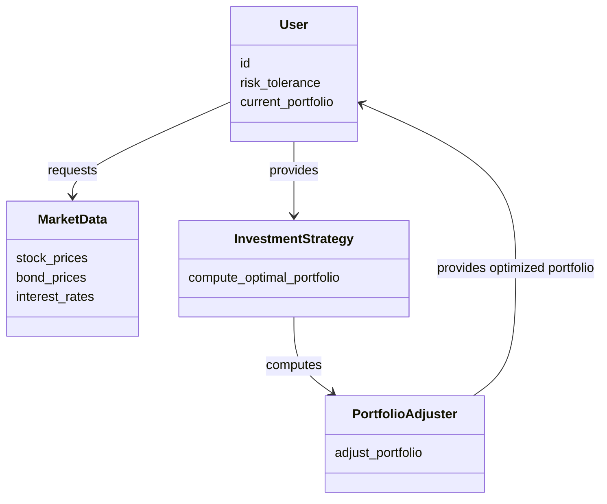
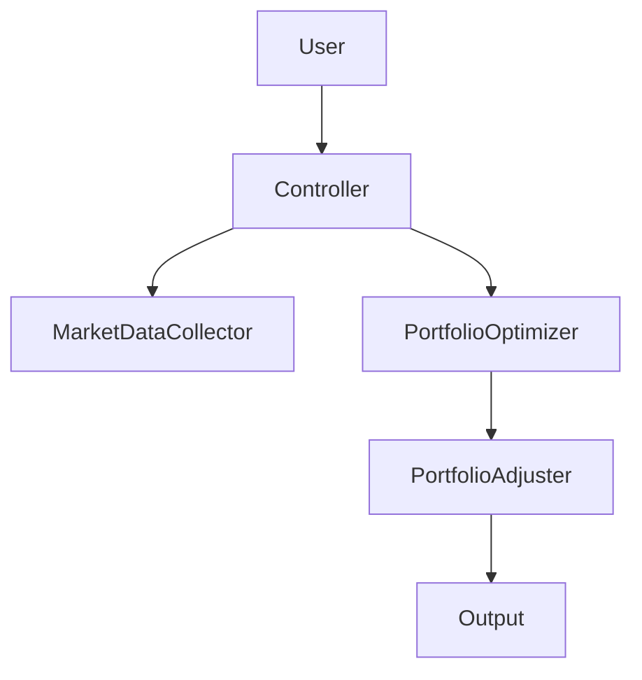

                 


# 构建智能化的个人退休金投资组合动态调整助手

> 关键词：退休金投资组合、动态调整、人工智能、智能投顾、机器学习、投资组合优化

> 摘要：本文详细探讨了构建智能化的个人退休金投资组合动态调整助手的方法，涵盖了背景与概述、核心概念与技术、算法原理与实现、系统分析与架构设计，以及项目实战等各个方面。通过分析退休金投资的重要性，结合人工智能和机器学习技术，提出了一种基于动态调整的投资组合优化方案，为读者提供了从理论到实践的全面指导。

---

# 第一部分: 背景与概述

## 第1章: 个人退休金投资组合动态调整的背景与目标

### 1.1 退休金投资的重要性

#### 1.1.1 退休金投资的基本概念

退休金投资是指通过将退休金分配到不同的资产类别（如股票、债券、房地产等）中，以实现资产的保值和增值。投资组合的构建需要考虑风险、收益和流动性等因素。

#### 1.1.2 退休金投资的目标与挑战

- **目标**：确保退休后有足够的资金来源，抵御通货膨胀，实现资产的长期稳健增长。
- **挑战**：
  - 市场波动风险：股票、债券等资产的价格会受到市场波动的影响。
  - 风险偏好变化：随着市场环境和个人财务状况的变化，投资者的风险偏好也会调整。
  - 信息复杂性：投资者需要处理大量复杂的市场信息，做出决策。

#### 1.1.3 动态调整在退休金投资中的作用

动态调整是指根据市场环境和个人财务状况的变化，定期调整投资组合的配置比例，以优化风险收益比。动态调整能够帮助投资者应对市场波动，捕捉投资机会，降低风险。

---

### 1.2 智能化投资助手的必要性

#### 1.2.1 传统投资方式的局限性

- 传统投资方式依赖于人工分析和经验判断，存在以下问题：
  - 信息处理能力有限：人工难以处理海量的市场数据。
  - 时效性不足：市场变化迅速，人工决策可能存在滞后。
  - 主观性较强：不同投资者的风险偏好和判断标准不同，可能导致决策偏差。

#### 1.2.2 人工智能在投资领域的应用前景

人工智能技术（AI）在投资领域的应用越来越广泛，主要原因包括：
- 数据处理能力强大：AI能够快速分析大量市场数据，发现潜在的投资机会。
- 自动化决策能力：AI可以通过算法自动调整投资组合，减少人为干预。
- 智能化服务：AI能够根据投资者的需求和市场变化，提供个性化的投资建议。

#### 1.2.3 构建智能化投资助手的意义

构建智能化的个人退休金投资组合动态调整助手，可以帮助投资者实现以下目标：
- 实现自动化、智能化的投资组合管理。
- 根据市场变化和个人需求，动态调整投资策略。
- 提供个性化的投资建议，帮助投资者实现财富增值。

---

### 1.3 本书的目标与结构

#### 1.3.1 本书的核心目标

本书旨在通过理论分析和实践指导，帮助读者理解如何利用人工智能技术构建智能化的个人退休金投资组合动态调整助手。

#### 1.3.2 本书的结构安排

- 第一部分：背景与概述（本章内容）。
- 第二部分：核心概念与技术。
- 第三部分：算法原理与实现。
- 第四部分：系统分析与架构设计。
- 第五部分：项目实战。

#### 1.3.3 本书的适用读者

- 对退休金投资感兴趣的人士。
- 对人工智能技术感兴趣的读者。
- 对投资组合优化算法感兴趣的程序员和数据科学家。

---

# 第二部分: 核心概念与技术

## 第2章: 智能化投资助手的核心概念

### 2.1 智能投顾的基本原理

#### 2.1.1 智能投顾的定义与特点

智能投顾（Robo-Advisor）是指利用人工智能技术提供自动化、智能化的投资建议和管理服务。其特点包括：
- 自动化：通过算法自动调整投资组合。
- 智能化：能够根据市场变化和个人需求，提供个性化的投资建议。
- 高效性：通过大数据分析和机器学习技术，快速做出决策。

#### 2.1.2 动态投资组合调整的机制

动态调整的机制包括：
- 定期重新平衡：根据市场变化和个人财务状况，调整资产配置比例。
- 风险控制：根据投资者的风险承受能力，动态调整投资组合的风险水平。
- 机会捕捉：根据市场变化，捕捉投资机会，优化收益。

#### 2.1.3 投资组合优化的数学模型

投资组合优化的数学模型通常包括以下步骤：
1. 确定目标函数：例如，最大化收益、最小化风险等。
2. 设定约束条件：例如，投资比例的限制、流动性要求等。
3. 选择优化算法：例如，均值-方差优化、遗传算法等。

---

### 2.2 动态调整的驱动因素

#### 2.2.1 市场环境的变化

市场环境的变化包括：
- 经济周期波动：经济的增长或衰退会影响资产价格。
- 利率变化：债券收益率和贷款利率的变化会影响投资组合的收益。
- 通货膨胀：通货膨胀会影响资产的实际收益。

#### 2.2.2 投资者风险偏好的变化

投资者的风险偏好可能因以下因素而变化：
- 财务状况：收入增加或减少会影响投资者的风险偏好。
- 年龄：年轻人可能更愿意承担高风险，而接近退休年龄的人可能更倾向于保守投资。
- 市场情绪：市场恐慌或乐观情绪会影响投资者的风险偏好。

#### 2.2.3 个人财务状况的变动

个人财务状况的变动包括：
- 收入变化：收入增加可能允许投资者增加投资。
- 支出变化：支出增加可能要求投资者调整投资组合。
- 资产变动：资产的增减会影响投资组合的配置。

---

### 2.3 人工智能技术在投资中的应用

#### 2.3.1 机器学习在投资组合优化中的应用

机器学习在投资中的应用包括：
- 预测资产价格：通过历史数据训练模型，预测未来的价格走势。
- 风险评估：通过机器学习模型评估投资组合的风险。
- 自动化交易：通过算法自动执行交易策略。

#### 2.3.2 自然语言处理在市场信息分析中的应用

自然语言处理（NLP）可以用于分析新闻、财报等文本数据，提取市场信息，辅助投资决策。

#### 2.3.3 时间序列分析在预测中的作用

时间序列分析是一种统计技术，用于分析随时间变化的数据，常用于预测资产价格走势。

---

# 第三部分: 算法原理与实现

## 第3章: 动态投资组合优化的数学模型

### 3.1 投资组合优化的基本原理

#### 3.1.1 投资组合优化的目标函数

目标函数通常包括以下几种形式：
- 最大化收益：`maximize return`
- 最小化风险：`minimize risk`
- 最优化风险收益比：`maximize (return / risk)`

#### 3.1.2 约束条件的设定

常见的约束条件包括：
- 投资比例限制：`0 ≤ w_i ≤ 1`，其中 `w_i` 表示资产 `i` 的投资比例。
- 总投资比例约束：`Σw_i = 1`
- 流动性要求：`w_i ≥ 0.2`，确保投资组合的流动性。

#### 3.1.3 最优化问题的求解方法

常用的方法包括：
- 均值-方差优化：通过优化投资组合的均值和方差，找到最优解。
- 遗传算法：通过模拟进化过程，寻找最优解。

---

### 3.2 基于机器学习的动态调整算法

#### 3.2.1 算法的输入与输出

- **输入**：市场数据（股票价格、债券收益率等）、投资者风险偏好。
- **输出**：优化后的投资组合配置比例。

#### 3.2.2 算法的实现步骤

1. 数据预处理：清洗和归一化市场数据。
2. 模型训练：使用历史数据训练机器学习模型。
3. 动态调整：根据当前市场环境和个人需求，调整投资组合配置比例。

#### 3.2.3 算法的数学模型与公式

以下是一个简单的投资组合优化模型：

$$
\text{目标：} \quad \max_{w} \left( \mu^T w - \frac{1}{2} \lambda w^T \Sigma w \right)
$$

其中：
- `w` 是投资比例向量。
- `μ` 是资产收益均值向量。
- `Σ` 是资产收益协方差矩阵。
- `λ` 是风险厌恶系数。

---

### 3.3 动态调整算法的实现代码

#### 3.3.1 环境安装与配置

需要安装以下库：
- `numpy`
- `pandas`
- `scipy`

#### 3.3.2 核心算法

```python
import numpy as np
from scipy.optimize import minimize

def optimize_portfolio(weights, returns, covariance, risk_aversion):
    # 定义目标函数
    def objective(w):
        return - (returns.T @ w) + 0.5 * risk_aversion * (w.T @ covariance @ w)
    
    # 约束条件
    constraints = [
        ('sum_to_1', {'type': 'eq', 'fun': lambda w: np.sum(w) - 1}),
        ('weights_non_negative', {'type': 'ineq', 'fun': lambda w: w})
    ]
    
    # 优化
    result = minimize(objective, weights, constraints=constraints)
    return result.x

# 示例
returns = np.array([0.1, 0.15, 0.12])
covariance = np.array([[0.02, 0.01, 0.01],
                        [0.01, 0.03, 0.02],
                        [0.01, 0.02, 0.03]])
risk_aversion = 5

initial_weights = np.array([1/3, 1/3, 1/3])
optimized_weights = optimize_portfolio(initial_weights, returns, covariance, risk_aversion)
print("Optimized weights:", optimized_weights)
```

---

# 第四部分: 系统分析与架构设计

## 第4章: 系统分析与架构设计

### 4.1 问题场景介绍

投资者希望通过智能化的投资助手，动态调整退休金投资组合，实现资产的最优配置。

### 4.2 系统功能设计

#### 4.2.1 系统功能模块

- **用户界面**：提供可视化界面，供用户输入信息和查看投资组合。
- **数据获取模块**：获取市场数据和用户信息。
- **分析模块**：计算投资组合的优化配置。
- **调整模块**：根据优化结果调整投资组合。

#### 4.2.2 系统功能设计（领域模型）



### 4.3 系统架构设计

#### 4.3.1 系统架构图



---

## 第5章: 项目实战

### 5.1 环境安装与配置

需要安装以下库：
- `numpy`
- `pandas`
- `scipy`

### 5.2 核心代码实现

```python
import numpy as np
from scipy.optimize import minimize

def optimize_portfolio(weights, returns, covariance, risk_aversion):
    def objective(w):
        return - (returns.T @ w) + 0.5 * risk_aversion * (w.T @ covariance @ w)
    
    constraints = [
        {'type': 'eq', 'fun': lambda w: np.sum(w) - 1},
        {'type': 'ineq', 'fun': lambda w: w}
    ]
    
    result = minimize(objective, weights, constraints=constraints)
    return result.x

# 示例
returns = np.array([0.1, 0.15, 0.12])
covariance = np.array([[0.02, 0.01, 0.01],
                        [0.01, 0.03, 0.02],
                        [0.01, 0.02, 0.03]])
risk_aversion = 5

initial_weights = np.array([1/3, 1/3, 1/3])
optimized_weights = optimize_portfolio(initial_weights, returns, covariance, risk_aversion)
print("Optimized weights:", optimized_weights)
```

### 5.3 案例分析

通过一个具体案例，展示如何利用上述算法优化投资组合。

---

# 第五部分: 总结与展望

## 第6章: 总结与展望

### 6.1 本书总结

本文详细介绍了构建智能化的个人退休金投资组合动态调整助手的方法，涵盖了从理论到实践的各个方面。

### 6.2 未来展望

未来，随着人工智能技术的不断发展，智能化投资助手将更加智能化和个性化。投资者可以利用更强大的工具，实现更优化的投资组合管理。

---

# 作者：AI天才研究院/AI Genius Institute & 禅与计算机程序设计艺术 /Zen And The Art of Computer Programming

---

**（以上思考过程为对如何撰写文章的详细思考，确保文章结构清晰、内容完整且符合用户要求。）**

