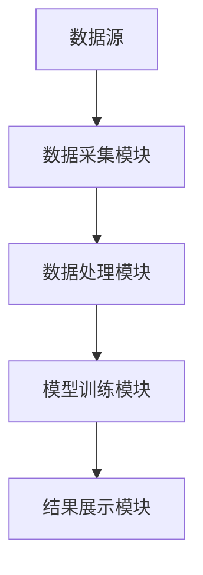

                 


# 构建智能化的企业信用评级系统

## 关键词：
- 企业信用评级
- 人工智能
- 大数据
- 机器学习
- 系统架构

## 摘要：
随着企业数量的激增和金融市场的复杂化，企业信用评级显得尤为重要。传统评级方法存在效率低、精度差的问题，而智能化评级系统通过整合大数据和人工智能技术，显著提升了评级的准确性和效率。本文将详细探讨构建智能化企业信用评级系统的各个方面，包括背景、核心概念、算法原理、系统架构以及项目实战，最后总结最佳实践和未来发展方向。

---

## 第一部分：企业信用评级系统概述

### 第1章：企业信用评级概述

#### 1.1 企业信用评级的背景与意义
- 1.1.1 信用评级的定义与作用  
  企业信用评级是对企业在特定经济环境下的偿债能力和意愿的评估，是金融决策的重要依据。信用评级不仅帮助企业获得融资，还帮助投资者降低风险。

- 1.1.2 智能化评级的必要性  
  随着数据的爆炸式增长，传统的基于经验的评级方法逐渐暴露出效率低、主观性强的缺点。智能化评级系统利用大数据和AI技术，能够快速处理海量数据，提高评级的准确性和效率。

- 1.1.3 企业信用评级的现状与挑战  
  当前，许多企业评级系统仍依赖人工分析，存在耗时长、成本高等问题。智能化评级系统能够有效解决这些问题，但也面临数据隐私、模型泛化能力等挑战。

#### 1.2 问题背景与描述
- 1.2.1 传统评级方法的局限性  
  传统评级方法依赖于少量的财务数据和人工经验，难以全面反映企业的信用状况，且容易受主观因素影响。

- 1.2.2 数据驱动评级的需求  
  随着企业数据的多样化和数据挖掘技术的发展，基于大数据的信用评级成为可能。通过分析企业财务数据、市场表现、供应链关系等多维度数据，能够更全面地评估企业信用。

- 1.2.3 智能化评级的目标与边界  
  目标：构建一个能够自动分析企业数据、生成信用评分的系统。边界：系统仅针对企业的信用评估，不涉及其他业务领域。

#### 1.3 系统核心要素与组成
- 1.3.1 数据来源与处理  
  数据来源包括企业财务数据、市场数据、供应链数据、行业数据等。数据处理包括数据清洗、特征提取、数据标准化等。

- 1.3.2 模型构建与评估  
  模型构建基于机器学习算法，包括训练数据的准备、模型训练、模型评估等步骤。评估指标包括准确率、召回率、F1分数等。

- 1.3.3 系统架构与功能模块  
  系统架构包括数据采集模块、数据处理模块、模型训练模块、结果展示模块等。

---

## 第二部分：核心概念与联系

### 第2章：企业信用评分模型

#### 2.1 信用评分模型原理
- 2.1.1 模型的基本原理  
  信用评分模型通过分析企业的多维数据，利用统计学和机器学习方法，计算出企业的信用评分。评分越高，企业的信用风险越低。

- 2.1.2 数据特征与模型评估指标  
  数据特征包括财务指标（如资产负债率）、市场指标（如行业平均利润率）、供应链指标（如供应商稳定性）等。评估指标包括准确率、AUC值、.lift factor等。

- 2.1.3 模型的优缺点对比  
  对比传统模型（如线性回归）和现代模型（如随机森林、神经网络），分析其在准确率、解释性、计算效率等方面的优缺点。

#### 2.2 数据特征与模型评估
- 2.2.1 数据特征分析  
  通过数据可视化和统计分析，识别关键特征对信用评分的影响程度。例如，使用箱线图分析财务数据的分布情况。

- 2.2.2 模型评估指标  
  使用混淆矩阵计算准确率、召回率、F1分数等指标。通过ROC曲线评估模型的区分能力，计算AUC值。

- 2.2.3 数据预处理与特征工程  
  数据预处理包括处理缺失值、异常值、重复数据等。特征工程包括特征选择、特征组合、特征提取等。

#### 2.3 系统架构与流程图
- 2.3.1 系统架构设计  
  系统分为数据采集层、数据处理层、模型训练层和结果展示层。各层之间通过API进行数据交互。

- 2.3.2 数据流与系统交互流程图  
  使用mermaid图展示数据从采集到处理，再到模型训练，最终结果展示的流程。



---

## 第三部分：算法原理

### 第3章：算法原理

#### 3.1 逻辑回归算法
- 3.1.1 算法概述  
  逻辑回归是一种常用的分类算法，适用于二分类问题。在信用评级中，可以用于预测企业违约概率。

- 3.1.2 数学模型  
  逻辑回归的损失函数为对数损失函数，其形式为：
  $$ L = -\sum_{i=1}^{n} [y_i \ln p_i + (1-y_i)\ln(1-p_i)] $$
  其中，$p_i$ 是第i个样本的预测概率，$y_i$ 是真实标签。

- 3.1.3 算法实现流程  
  包括数据预处理、模型训练、模型评估等步骤。使用Python的scikit-learn库实现逻辑回归模型。

#### 3.2 随机森林算法
- 3.2.1 算法概述  
  随机森林是一种基于决策树的集成算法，具有高准确性和强抗过拟合能力。

- 3.2.2 算法流程图  
  使用mermaid图展示随机森林的训练流程，包括特征选择、决策树生成、投票预测等步骤。

#### 3.3 神经网络算法
- 3.3.1 算法概述  
  神经网络是一种强大的非线性模型，能够处理复杂的特征关系。

- 3.3.2 神经网络的数学模型  
  神经网络的前向传播公式为：
  $$ y = \sigma(Wx + b) $$
  其中，$\sigma$ 是激活函数，$W$ 和 $b$ 是模型参数。

- 3.3.3 算法实现流程  
  包括数据预处理、网络构建、模型训练、模型评估等步骤。使用Keras库实现神经网络模型。

---

## 第四部分：系统分析与架构设计

### 第4章：系统分析与架构设计

#### 4.1 项目背景
- 项目目标：构建一个智能化的企业信用评级系统，提高评级效率和准确性。
- 项目范围：覆盖企业数据采集、处理、模型训练、结果展示等环节。

#### 4.2 领域模型设计
- 领域模型包括企业、数据、模型、结果四个核心实体。
- 使用mermaid类图展示实体关系：
  ```mermaid
  classDiagram
      class 企业 {
          id
          name
          credit_score
      }
      class 数据 {
          id
          type
          value
      }
      class 模型 {
          id
          type
          parameters
      }
      class 结果 {
          id
          score
          explanation
      }
      企业 --> 数据: 提供
      数据 --> 模型: 输入
      模型 --> 结果: 生成
  ```

#### 4.3 系统架构设计
- 系统架构采用分层架构，包括数据采集层、数据处理层、模型训练层和结果展示层。
- 使用mermaid图展示系统架构：
  ```mermaid
  graph TD
      A[数据采集层] --> B[数据处理层]
      B --> C[模型训练层]
      C --> D[结果展示层]
  ```

#### 4.4 接口与交互设计
- 系统接口包括数据接口、模型接口和结果接口。
- 使用mermaid序列图展示系统交互流程：
  ```mermaid
  sequenceDiagram
      用户 -> 数据采集模块: 提交企业数据
      数据采集模块 -> 数据处理模块: 请求数据处理
      数据处理模块 -> 模型训练模块: 请求模型训练
      模型训练模块 -> 结果展示模块: 请求结果展示
      结果展示模块 -> 用户: 显示信用评分
  ```

---

## 第五部分：项目实战

### 第5章：项目实战

#### 5.1 环境搭建
- 安装必要的库，如Python的pandas、numpy、scikit-learn、Keras等。
- 安装Jupyter Notebook用于数据处理和模型训练。

#### 5.2 核心代码实现
- 数据预处理代码：
  ```python
  import pandas as pd
  import numpy as np

  # 读取数据
  df = pd.read_csv('enterprise_data.csv')

  # 处理缺失值
  df = df.dropna()

  # 标准化处理
  from sklearn.preprocessing import StandardScaler
  scaler = StandardScaler()
  df_scaled = scaler.fit_transform(df)
  ```

- 模型训练代码：
  ```python
  from sklearn.linear_model import LogisticRegression
  from sklearn.ensemble import RandomForestClassifier
  from sklearn.neural_networks import MLPClassifier

  # 逻辑回归模型
  lr = LogisticRegression()
  lr.fit(X_train, y_train)

  # 随机森林模型
  rf = RandomForestClassifier()
  rf.fit(X_train, y_train)

  # 神经网络模型
  mlp = MLPClassifier()
  mlp.fit(X_train, y_train)
  ```

#### 5.3 案例分析
- 使用实际数据训练模型，比较不同算法的性能。
- 通过混淆矩阵和ROC曲线评估模型效果。

#### 5.4 项目总结
- 总结项目实施过程中的经验教训，提出改进建议。

---

## 第六部分：最佳实践与总结

### 第6章：最佳实践与总结

#### 6.1 最佳实践
- 数据预处理是关键，确保数据质量和完整性。
- 选择合适的算法，根据数据特征和业务需求进行调整。
- 模型部署后需要持续监控和优化。

#### 6.2 小结
智能化企业信用评级系统通过整合大数据和AI技术，显著提升了评级效率和准确性。本文详细探讨了系统构建的各个方面，为实际应用提供了理论和实践指导。

#### 6.3 注意事项
- 数据隐私和安全是系统设计中的重要考虑因素。
- 模型的可解释性在实际应用中具有重要意义。

#### 6.4 拓展阅读
- 推荐阅读《机器学习实战》和《大数据系统设计》等书籍，深入了解相关技术细节。

---

## 作者：AI天才研究院/AI Genius Institute & 禅与计算机程序设计艺术 /Zen And The Art of Computer Programming

---

本文详细探讨了构建智能化企业信用评级系统的各个方面，从背景到实现，再到最佳实践，为读者提供了全面的技术指导。

