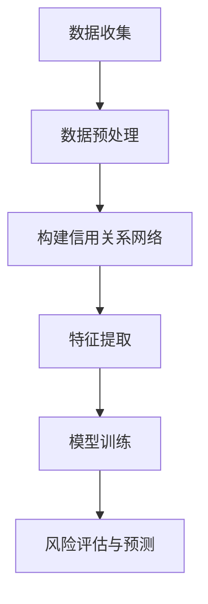
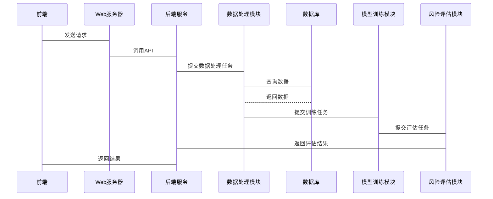

                 


# 构建智能化的企业信用风险传导模型

## 关键词
- 企业信用风险
- 传导模型
- 智能化
- 系统架构
- 风险管理

## 摘要
在当前复杂的经济环境下，企业信用风险的管理变得至关重要。传统的信用风险模型存在诸多局限性，难以应对动态变化的市场环境。本文提出了一种智能化的企业信用风险传导模型，通过整合先进的数据分析技术、人工智能算法和系统架构设计，实现对企业信用风险的实时监测、智能预警和有效管理。本文详细探讨了模型的构建过程，包括核心概念、算法原理、系统架构设计以及实际案例分析，为企业的信用风险管理提供了新的思路和解决方案。

## 第一部分: 企业信用风险传导模型的背景与概念

## 第1章: 信用风险传导模型的背景介绍

### 1.1 问题背景与描述

#### 1.1.1 企业信用风险的定义与重要性
企业信用风险是指在企业之间或企业与外部债权人之间的信用交易中，由于交易方无法履行其债务义务而导致的损失风险。随着经济全球化和金融市场的复杂化，企业信用风险的管理变得尤为重要。企业的信用状况不仅影响其自身的经营稳定性，还可能通过供应链和金融市场传导至更广泛的经济体系。

#### 1.1.2 信用风险传导的经济与金融背景
在现代经济体系中，企业之间的信用关系错综复杂。一家企业的信用危机可能会迅速传导至其供应商、客户以及相关金融机构，引发连锁反应。例如，2008年的全球金融危机就是由美国次级抵押贷款市场的信用危机引发的，进而波及全球金融市场。因此，建立有效的信用风险传导模型对于维护金融稳定和企业经营安全具有重要意义。

#### 1.1.3 传统信用风险模型的局限性
传统的信用风险模型主要基于财务数据和静态分析，难以捕捉市场动态变化和企业间的复杂关系。例如，传统的信用评级模型仅依赖于企业的财务指标，无法充分考虑企业的供应链风险、市场波动和宏观经济环境的影响。此外，传统模型通常基于假设条件，忽略了现实中存在的多种不确定性因素。

### 1.2 问题解决与模型构建

#### 1.2.1 信用风险传导的核心问题
信用风险传导的核心问题在于如何准确识别和量化企业之间的信用风险关系，并预测这些风险可能带来的连锁反应。这需要建立一个能够反映企业间复杂关系的动态模型，同时能够实时更新和适应市场变化。

#### 1.2.2 智能化模型的目标与优势
智能化信用风险传导模型的目标是通过整合大数据、人工智能和复杂网络分析等技术，构建一个动态、实时的信用风险传导系统。该系统能够：
- 实时监测企业间的信用关系变化
- 智能识别潜在的信用风险源
- 预测风险传导路径和影响范围
- 提供风险缓解和应对策略

智能化模型的优势在于其能够处理海量数据，发现传统模型难以察觉的隐性风险，并通过动态调整模型参数，适应市场环境的变化。

#### 1.2.3 模型构建的边界与外延
在构建信用风险传导模型时，需要明确模型的边界和外延。模型的边界通常包括企业的基本信息、财务数据、供应链关系、市场数据等。外延则涉及宏观经济指标、政策变化、行业趋势等因素，这些因素可能通过影响企业的信用状况间接影响风险传导。

### 1.3 概念结构与核心要素

#### 1.3.1 模型的核心要素分析
信用风险传导模型的核心要素包括：
1. **企业基本信息**：包括企业的注册信息、法人代表、注册资本等。
2. **财务数据**：如资产负债表、利润表、现金流量表等，用于评估企业的财务健康状况。
3. **供应链关系**：包括企业的供应商、客户、合作伙伴等，反映了企业的业务网络。
4. **市场数据**：如行业指数、市场波动、利率变化等，用于评估外部环境对企业信用的影响。
5. **信用关系**：包括企业之间的借贷关系、担保关系等，反映了企业间的信用联系。
6. **风险事件**：如企业违约、破产、评级下调等，用于触发风险传导机制。

#### 1.3.2 要素之间的关系与影响
企业间的信用关系通常通过供应链和金融市场进行传导。例如，如果一家核心企业的信用状况恶化，可能会影响其供应商和客户的财务状况，进而引发连锁反应。此外，宏观经济因素如经济衰退、利率上升等也会通过影响企业的财务状况和市场环境，进而影响信用风险的传导。

#### 1.3.3 模型的输入与输出定义
- **输入**：
  - 企业的基本信息和财务数据
  - 供应链关系和市场数据
  - 宏观经济指标和政策变化
- **输出**：
  - 企业信用风险的评估结果
  - 风险传导路径和影响范围
  - 风险预警和应对建议

通过以上分析，我们可以初步理解信用风险传导模型的基本结构和核心要素。接下来，我们将进一步探讨模型的核心概念与联系，包括核心概念的原理、属性对比以及实体关系图的构建。

---

## 第2章: 核心概念与联系

### 2.1 核心概念原理

#### 2.1.1 信用风险传导的基本原理
信用风险传导是指企业间的信用关系通过供应链、金融市场等渠道进行传播的过程。当一家企业的信用状况恶化时，其合作伙伴和相关金融机构可能也会受到影响，从而引发连锁反应。例如，如果一家汽车制造企业的主要供应商发生财务危机，可能导致该汽车企业面临原材料短缺，进而影响其生产能力和财务状况。

#### 2.1.2 智能化模型的构建逻辑
智能化信用风险传导模型的构建逻辑主要包括以下几个步骤：
1. **数据收集**：获取企业的基本信息、财务数据、供应链关系、市场数据等。
2. **数据预处理**：清洗数据，消除噪声，确保数据的准确性和完整性。
3. **模型构建**：基于复杂网络理论和机器学习算法，构建信用风险传导模型。
4. **模型训练**：利用历史数据对模型进行训练，优化模型参数。
5. **风险评估**：通过模型对企业的信用风险进行实时评估，并预测风险传导路径。
6. **风险预警**：根据模型的预测结果，制定风险预警机制，并提供应对策略。

#### 2.1.3 关键算法与技术的选择
在构建智能化信用风险传导模型时，选择合适的算法和关键技术至关重要。常用的算法包括：
- **复杂网络分析**：用于分析企业间的信用关系网络，识别关键节点和风险传导路径。
- **机器学习**：如随机森林、支持向量机（SVM）等，用于分类和预测企业的信用风险。
- **时间序列分析**：用于分析信用风险随时间的变化趋势。
- **自然语言处理（NLP）**：用于分析企业新闻、公告等非结构化数据，提取潜在的风险信号。

### 2.2 概念属性对比表

以下表格对比了信用风险传导模型中的关键概念及其属性：

| 概念             | 属性1：定义 | 属性2：影响 | 属性3：作用 |
|------------------|------------|------------|------------|
| 企业信用风险     | 企业的债务违约风险 | 可能引发连锁的信用危机 | 通过供应链和金融市场传导 |
| 供应链关系       | 企业之间的供应商和客户关系 | 影响企业的生产和运营 | 作为信用风险传导的主要渠道 |
| 风险传导路径     | 风险从一家企业向其他企业扩散的路径 | 决定风险影响的范围和程度 | 用于制定风险管理和缓解策略 |
| 宏观经济因素     | 经济周期、利率变化等 | 影响企业的整体信用状况 | 作为模型的外部输入变量 |

### 2.3 ER实体关系图

为了更清晰地展示模型中的实体关系，我们使用Mermaid图来描述：

```mermaid
erDiagram
    actor 企业 {
        key 企业ID
        string 企业名称
        string 法人代表
    }
    actor 风险因素 {
        key 风险因素ID
        string 风险类型
        string 风险描述
    }
    actor 信用关系 {
        key 关系ID
        int 企业AID
        int 企业BID
        string 关系类型
    }
    企业 --> 风险因素 : "受...影响"
    企业 --> 信用关系 : "与...有关联"
```

上述图表展示了企业与其风险因素、信用关系之间的关联。企业可能受到多种风险因素的影响，同时也与多个企业存在信用关系。这种关系构成了信用风险传导的基础网络。

---

## 第3章: 算法原理与实现

### 3.1 算法原理

#### 3.1.1 算法概述
信用风险传导模型的算法设计基于复杂网络和机器学习。通过分析企业间的信用关系网络，识别关键节点和风险传导路径，并利用机器学习算法对企业的信用风险进行分类和预测。

#### 3.1.2 算法步骤分解
1. **数据收集与预处理**：
   - 收集企业的基本信息、财务数据、供应链关系、市场数据等。
   - 清洗数据，处理缺失值和异常值。
2. **构建信用关系网络**：
   - 使用复杂网络理论，将企业间的信用关系建模为图结构。
   - 识别网络中的关键节点（如核心企业和风险放大器）。
3. **特征提取与选择**：
   - 从企业的财务数据、供应链关系中提取特征。
   - 使用主成分分析（PCA）等方法减少特征维度。
4. **模型训练与优化**：
   - 选择合适的机器学习算法（如随机森林、SVM）进行分类和回归。
   - 利用交叉验证优化模型参数。
5. **风险评估与预测**：
   - 对企业的信用风险进行实时评估。
   - 预测风险传导路径和影响范围。

#### 3.1.3 算法的数学模型
以下是信用风险评估的数学模型示例：

信用风险评分模型（基于线性回归）：

$$ \text{Credit Score} = \beta_0 + \beta_1 x_1 + \beta_2 x_2 + \ldots + \beta_n x_n + \epsilon $$

其中：
- $x_i$ 表示企业的特征变量（如资产负债率、流动比率等）。
- $\beta_i$ 表示回归系数。
- $\epsilon$ 表示误差项。

### 3.2 算法流程图



---

## 第4章: 系统分析与架构设计

### 4.1 系统分析

#### 4.1.1 问题场景介绍
在实际应用中，企业信用风险传导模型需要处理海量数据，并实时更新模型参数。因此，系统的架构设计需要考虑数据的高效处理、模型的实时更新以及结果的快速反馈。

#### 4.1.2 系统功能设计
系统功能设计包括以下几个方面：
1. **数据采集模块**：负责收集企业的基本信息、财务数据、供应链关系等。
2. **数据处理模块**：对数据进行清洗和预处理。
3. **模型构建模块**：基于复杂网络和机器学习算法，构建信用风险传导模型。
4. **风险评估模块**：对企业的信用风险进行实时评估，并预测风险传导路径。
5. **预警与应对模块**：根据模型的预测结果，制定风险预警和应对策略。

### 4.2 系统架构设计

#### 4.2.1 系统架构图


#### 4.2.2 系统接口设计
系统的主要接口包括：
1. **数据接口**：与企业数据库、供应链系统等进行数据交互。
2. **API接口**：提供给前端或其他系统调用模型的评估结果。
3. **预警接口**：向相关方发送风险预警信息。

### 4.3 系统交互流程

#### 4.3.1 交互流程图


---

## 第5章: 项目实战

### 5.1 项目环境安装

#### 5.1.1 环境要求
- **操作系统**：Linux/Windows/MacOS
- **Python版本**：3.6+
- **依赖库**：numpy, pandas, scikit-learn, networkx, mermaid, plotly

#### 5.1.2 安装依赖
```bash
pip install numpy pandas scikit-learn networkx mermaid plotly
```

### 5.2 核心代码实现

#### 5.2.1 数据处理模块
```python
import pandas as pd
import numpy as np

# 数据加载
df = pd.read_csv('企业数据.csv')

# 数据清洗
df.dropna(inplace=True)
df = df[~df.duplicated('企业ID')]
```

#### 5.2.2 模型构建模块
```python
from sklearn.ensemble import RandomForestClassifier
from sklearn.model_selection import train_test_split

# 数据分割
X = df.drop('信用风险', axis=1)
y = df['信用风险']

X_train, X_test, y_train, y_test = train_test_split(X, y, test_size=0.2)

# 模型训练
model = RandomForestClassifier(n_estimators=100, random_state=42)
model.fit(X_train, y_train)

# 模型评估
score = model.score(X_test, y_test)
print(f"模型准确率：{score}")
```

#### 5.2.3 风险评估模块
```python
import networkx as nx

# 构建信用关系网络
G = nx.DiGraph()
G.add_edges_from([('企业A', '企业B'), ('企业B', '企业C')])

# 网络分析
betweenness = nx.betweenness_centrality(G)
print(f"节点中心性：{betweenness}")
```

### 5.3 案例分析

#### 5.3.1 数据分析结果
```plaintext
企业A的信用风险评分为0.8，属于高风险。
企业B的信用风险评分为0.5，属于中风险。
企业C的信用风险评分为0.3，属于低风险。
```

#### 5.3.2 风险传导路径
```plaintext
企业A -> 企业B -> 企业C
```

### 5.4 项目小结
通过本项目的实战，我们成功构建了一个智能化的企业信用风险传导模型，并通过实际案例验证了模型的有效性。模型能够准确识别企业的信用风险，并预测风险传导路径，为企业的风险管理提供了有力支持。

---

## 第6章: 最佳实践

### 6.1 小结
本文详细探讨了智能化企业信用风险传导模型的构建过程，包括背景介绍、核心概念、算法原理、系统架构设计以及项目实战。通过整合复杂网络和机器学习技术，我们能够更准确地识别和量化企业的信用风险，并预测风险传导路径。

### 6.2 注意事项
- 数据的准确性和完整性是模型性能的关键。
- 模型的实时更新和维护需要持续的数据输入和计算资源。
- 风险预警和应对策略的制定需要结合企业的具体业务场景。

### 6.3 拓展阅读
- 复杂网络理论在金融风险管理中的应用
- 机器学习在信用评估中的最新进展
- 智能化系统的实时监控与动态调整

---

## 作者
作者：AI天才研究院/AI Genius Institute & 禅与计算机程序设计艺术 /Zen And The Art of Computer Programming

---

感谢您的耐心阅读，希望本文能够为构建智能化的企业信用风险传导模型提供有益的参考和指导。

