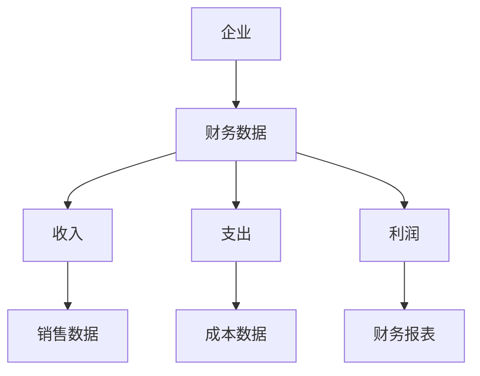
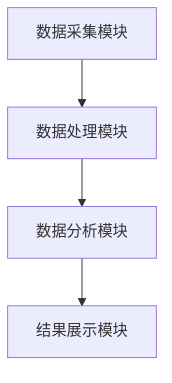
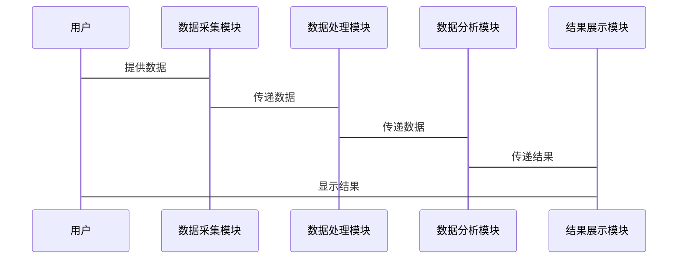

                 


# 构建智能化的企业财务分析系统

## 关键词：智能化财务分析系统，人工智能，企业财务，算法原理，系统架构，项目实战

## 摘要：本文详细介绍了构建智能化企业财务分析系统的背景、核心概念、算法原理、系统架构设计以及项目实战。通过对比传统财务分析系统的局限性，探讨了人工智能技术在财务分析中的应用潜力，提出了智能化财务分析系统的构建方法，并通过具体案例展示了如何利用支持向量机、随机森林和神经网络等算法实现智能化分析。文章最后总结了系统的关键点和未来的发展方向。

---

## 第一部分：背景介绍

### 第1章：问题背景与描述

#### 1.1 问题背景
- 1.1.1 传统企业财务分析的痛点
  - 数据处理效率低下
  - 分析结果依赖人工经验
  - 缺乏实时性和灵活性

- 1.1.2 数据爆炸对企业财务分析的影响
  - 数据量剧增，难以处理
  - 数据复杂性增加，分析难度加大
  - 数据实时性要求提高

- 1.1.3 人工智能在财务分析中的应用潜力
  - 提高数据处理效率
  - 增强分析准确性
  - 实现实时监控和预测

#### 1.2 问题描述
- 1.2.1 传统财务分析的局限性
  - 数据处理能力有限
  - 分析结果依赖人工经验
  - 缺乏灵活性和可扩展性

- 1.2.2 数据复杂性带来的挑战
  - 数据量大，难以处理
  - 数据类型多样，分析复杂
  - 数据实时性要求高

- 1.2.3 企业对智能化财务分析的需求
  - 提高分析效率
  - 增强决策能力
  - 实现智能化管理

#### 1.3 问题解决
- 1.3.1 智能化财务分析的核心目标
  - 提高数据处理效率
  - 增强分析准确性
  - 实现实时监控和预测

- 1.3.2 数据驱动的财务分析方法
  - 数据挖掘
  - 数据可视化
  - 数据建模

- 1.3.3 人工智能技术在财务分析中的应用
  - 支持向量机
  - 随机森林
  - 神经网络

#### 1.4 边界与外延
- 1.4.1 智能化财务分析的边界
  - 数据范围
  - 分析范围
  - 使用场景

- 1.4.2 相关概念的外延
  - 数据挖掘
  - 数据可视化
  - 数据建模

- 1.4.3 核心要素组成
  - 数据
  - 算法
  - 系统架构

---

## 第二部分：核心概念与联系

### 第2章：核心概念原理

#### 2.1 核心概念原理
- 2.1.1 数据处理与分析的原理
  - 数据预处理
  - 数据清洗
  - 数据建模

- 2.1.2 人工智能在财务分析中的应用原理
  - 数据特征提取
  - 数据分类与预测
  - 数据聚类

- 2.1.3 系统架构与功能模块的原理
  - 数据采集模块
  - 数据处理模块
  - 数据分析模块
  - 结果展示模块

#### 2.2 概念属性特征对比
| 概念 | 传统财务分析系统 | 智能化财务分析系统 |
|------|------------------|-------------------|
| 数据处理能力 | 简单数据处理 | 复杂数据处理与挖掘 |
| 分析能力 | 人工分析为主 | AI自动分析为主 |
| 实时性 | 低 | 高 |
| 灵活性 | 低 | 高 |
| 可扩展性 | 有限 | 强 |

#### 2.3 ER实体关系图架构


---

## 第三部分：算法原理

### 第3章：算法原理讲解

#### 3.1 支持向量机（SVM）
- 3.1.1 算法原理
  - 数据映射到高维空间
  - 找到最优超平面
  - 分类问题

- 3.1.2 优化目标
  $$ \text{最小化} \frac{1}{2} ||w||^2 + C \sum_{i=1}^n \xi_i $$
  $$ \text{约束条件} y_i (w \cdot x_i + b) \geq 1 - \xi_i, \xi_i \geq 0 $$

- 3.1.3 对偶问题
  $$ \max_{\alpha} \sum_{i=1}^n \alpha_i - \frac{1}{2} \sum_{i=1}^n \sum_{j=1}^n \alpha_i \alpha_j y_i y_j K(x_i, x_j) $$
  $$ \text{约束条件} 0 \leq \alpha_i \leq C $$

- 3.1.4 代码实现
  ```python
  from sklearn import svm

  # 创建数据集
  X = [[0, 0], [1, 1], [1, 0], [0, 1]]
  y = [0, 1, 1, 1]

  # 创建SVM分类器
  clf = svm.SVC(kernel='linear')
  clf.fit(X, y)
  ```

#### 3.2 随机森林（Random Forest）
- 3.2.1 算法原理
  - 决策树集成
  - 随机选择特征
  - 袋装法

- 3.2.2 核心算法
  - ID3/C4.5/C5.0
  - 信息增益

- 3.2.3 代码实现
  ```python
  from sklearn.ensemble import RandomForestClassifier

  # 创建数据集
  X = [[0, 0], [1, 1], [1, 0], [0, 1]]
  y = [0, 1, 1, 1]

  # 创建随机森林分类器
  clf = RandomForestClassifier(n_estimators=10)
  clf.fit(X, y)
  ```

#### 3.3 神经网络（Neural Network）
- 3.3.1 算法原理
  - 层次化结构
  - 激活函数
  - 反向传播

- 3.3.2 网络结构
  - 输入层
  - 隐藏层
  - 输出层

- 3.3.3 代码实现
  ```python
  import torch
  import torch.nn as nn

  # 创建神经网络模型
  class Net(nn.Module):
      def __init__(self):
          super(Net, self).__init__()
          self.fc1 = nn.Linear(2, 4)
          self.fc2 = nn.Linear(4, 2)
          self.fc3 = nn.Linear(2, 1)

      def forward(self, x):
          x = torch.relu(self.fc1(x))
          x = torch.relu(self.fc2(x))
          x = torch.sigmoid(self.fc3(x))
          return x

  net = Net()
  ```

---

## 第四部分：系统分析与架构设计

### 第4章：系统分析与架构设计

#### 4.1 问题场景介绍
- 数据来源
- 数据类型
- 分析目标

#### 4.2 项目介绍
- 项目目标
- 项目范围
- 项目技术选型

#### 4.3 系统功能设计
- 数据采集模块
- 数据处理模块
- 数据分析模块
- 结果展示模块

#### 4.4 系统架构设计


#### 4.5 系统接口设计
- 数据接口
- 分析接口
- 展示接口

#### 4.6 系统交互设计


---

## 第五部分：项目实战

### 第5章：项目实战

#### 5.1 环境安装
- Python安装
- 库的安装（如numpy, pandas, scikit-learn）

#### 5.2 系统核心实现
- 数据采集
- 数据处理
- 数据分析
- 结果展示

#### 5.3 代码应用解读与分析
- 数据预处理代码
- 模型训练代码
- 结果展示代码

#### 5.4 实际案例分析
- 数据来源
- 数据分析
- 结果解读

#### 5.5 项目小结
- 项目总结
- 经验教训

---

## 第六部分：总结与展望

### 第6章：总结与展望

#### 6.1 核心知识点总结
- 传统财务分析系统的局限性
- 人工智能技术的应用
- 系统架构设计

#### 6.2 未来发展方向
- 更复杂的数据分析
- 更先进的算法研究
- 更智能化的系统设计

#### 6.3 最佳实践 Tips
- 数据预处理的重要性
- 算法选择的策略
- 系统架构设计的注意事项

#### 6.4 小结
- 本文总结了构建智能化企业财务分析系统的背景、核心概念、算法原理、系统架构设计以及项目实战。

---

## 作者：AI天才研究院 & 禅与计算机程序设计艺术

