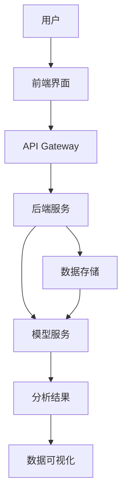

                 


# 《构建智能化的企业财务报表分析系统》

---

## 关键词：
- 企业财务报表
- 智能化分析
- 机器学习
- 数据可视化
- 系统架构

---

## 摘要：
《构建智能化的企业财务报表分析系统》一书旨在探讨如何利用人工智能技术提升企业财务报表分析的效率和准确性。通过结合机器学习、自然语言处理和数据可视化等技术，本书详细讲解了智能化财务报表分析的核心概念、算法原理、系统架构以及实际项目实现。从理论到实践，本书为财务人员、数据科学家和IT开发人员提供了全面的指导，帮助他们在企业数字化转型中构建高效可靠的智能化财务分析系统。

---

# 第一部分：智能化财务报表分析的背景与基础

## 第1章：企业财务报表分析的智能化背景

### 1.1 财务报表分析的重要性
- **1.1.1 财务报表的基本概念**：资产负债表、利润表、现金流量表的核心作用。
- **1.1.2 传统财务分析的局限性**：人工分析效率低、主观性强，难以应对海量数据。
- **1.1.3 智能化分析的必要性**：数据爆炸时代，智能化分析成为企业决策的关键工具。

### 1.2 智能化财务报表分析的定义与特点
- **1.2.1 智能化分析的定义**：利用AI技术自动解析和预测财务数据。
- **1.2.2 核心特点**：实时性、准确性、可扩展性。
- **1.2.3 与传统分析的主要区别**：从被动分析到主动预测的转变。

### 1.3 智能化财务分析的价值与意义
- **1.3.1 提高分析效率**：自动化处理海量数据，减少人工误差。
- **1.3.2 增强决策能力**：通过预测模型提供精准的财务见解。
- **1.3.3 推动企业智能化转型**：构建数据驱动的财务管理体系。

## 第2章：智能化财务分析的核心概念与联系

### 2.1 财务报表分析的主要数据来源
- **2.1.1 财务数据**：资产负债表、利润表、现金流量表。
- **2.1.2 非财务数据**：市场数据、行业趋势、公司治理信息。
- **2.1.3 数据预处理**：清洗、整合和标准化。

### 2.2 财务报表分析的主要方法
- **2.2.1 基本财务指标分析**：流动比率、速动比率、净利润率。
- **2.2.2 财务趋势分析**：时间序列分析，识别财务数据的波动趋势。
- **2.2.3 财务比率分析**：评估企业财务健康状况的关键指标。

### 2.3 智能化分析的核心技术
- **2.3.1 机器学习**：用于预测财务数据和识别异常值。
- **2.3.2 自然语言处理（NLP）**：解析财务报告中的文本信息。
- **2.3.3 数据可视化**：直观展示财务数据和分析结果。

### 2.4 核心概念对比分析
- **2.4.1 财务指标与机器学习模型的对比**：传统指标的局限性与AI模型的优越性。
- **2.4.2 传统分析方法与智能化分析方法的对比**：效率、准确性和可扩展性的对比。

### 2.5 系统架构的ER实体关系图
```mermaid
erDiagram
    customer[企业] {
        <属性>
        企业ID : string
        企业名称 : string
        所属行业 : string
    }
    financial_report[财务报表] {
        <属性>
        报表ID : string
        企业ID : string
        报表日期 : date
    }
    analysis_model[分析模型] {
        <属性>
        模型ID : string
        模型名称 : string
        模型类型 : string
    }
    relationship[关联关系] {
        企业 --> 财务报表 : 一个企业对应多份财务报表
        财务报表 --> 分析模型 : 每份报表使用多个分析模型
    }
}
```

---

# 第二部分：智能化财务报表分析的算法原理

## 第3章：算法原理与实现

### 3.1 常见的机器学习算法及其应用
- **3.1.1 线性回归**：用于预测财务指标的趋势。
- **3.1.2 支持向量机（SVM）**：用于分类问题，如财务健康状况评估。
- **3.1.3 随机森林**：用于特征重要性分析和分类预测。
- **3.1.4 神经网络**：用于复杂非线性关系的建模。

### 3.2 算法原理的数学模型
#### 3.2.1 线性回归模型
$$ y = \beta_0 + \beta_1x + \epsilon $$

#### 3.2.2 随机森林算法
- **树的构建**：基于随机特征和样本构建多棵决策树。
- **投票机制**：通过多数投票决定最终结果。

### 3.3 算法实现的Python代码示例
```python
from sklearn.ensemble import RandomForestClassifier
from sklearn.metrics import accuracy_score

# 加载数据
data = pd.read_csv('financial_data.csv')
X = data.drop('target', axis=1)
y = data['target']

# 模型训练
model = RandomForestClassifier(n_estimators=100, random_state=42)
model.fit(X_train, y_train)

# 模型预测
y_pred = model.predict(X_test)

# 评估准确率
print("Accuracy:", accuracy_score(y_test, y_pred))
```

### 3.4 算法对比与优化
- **3.4.1 不同算法的性能对比**：基于准确率、召回率和F1值进行评估。
- **3.4.2 超参数优化**：使用网格搜索或随机搜索优化模型性能。

---

# 第三部分：智能化财务报表分析的系统架构设计

## 第4章：系统分析与架构设计

### 4.1 项目背景与目标
- **4.1.1 项目背景**：企业财务数据的复杂性和分析需求的多样性。
- **4.1.2 项目目标**：构建一个高效、可扩展的智能化财务分析平台。

### 4.2 系统功能设计
- **4.2.1 数据采集模块**：从财务系统中获取数据。
- **4.2.2 数据处理模块**：清洗、转换和标准化数据。
- **4.2.3 模型训练模块**：训练机器学习模型。
- **4.2.4 结果展示模块**：可视化分析结果。

### 4.3 系统架构设计


### 4.4 接口设计与交互流程
- **4.4.1 API接口定义**：RESTful API的设计。
- **4.4.2 用户交互流程**：用户请求分析，系统返回结果。

---

# 第四部分：智能化财务报表分析的项目实战

## 第5章：项目实战与实现

### 5.1 环境配置与工具安装
- **5.1.1 Python环境搭建**：安装Python 3.8及以上版本。
- **5.1.2 依赖库安装**：安装Pandas、Scikit-learn、Plotly等库。

### 5.2 核心代码实现
```python
import pandas as pd
from sklearn.model_selection import train_test_split
from sklearn.ensemble import RandomForestClassifier
from sklearn.metrics import classification_report

# 加载数据
data = pd.read_csv('financial_data.csv')

# 数据预处理
data = data.dropna()
X = data.drop('target', axis=1)
y = data['target']

# 划分训练集和测试集
X_train, X_test, y_train, y_test = train_test_split(X, y, test_size=0.2, random_state=42)

# 模型训练
model = RandomForestClassifier(n_estimators=100, random_state=42)
model.fit(X_train, y_train)

# 模型预测
y_pred = model.predict(X_test)

# 模型评估
print(classification_report(y_test, y_pred))
```

### 5.3 功能解读与分析结果展示
- **5.3.1 模型评估**：准确率、召回率、F1值。
- **5.3.2 结果可视化**：使用Plotly或Matplotlib展示分析结果。

### 5.4 案例分析与经验总结
- **5.4.1 实际案例分析**：通过具体企业数据展示分析过程。
- **5.4.2 项目经验总结**：常见问题及解决方案。

---

# 第五部分：总结与展望

## 第6章：总结与未来展望

### 6.1 全书总结
- **6.1.1 核心内容回顾**：智能化财务报表分析的关键技术与实现方法。
- **6.1.2 项目实战经验**：从理论到实践的完整流程。

### 6.2 未来发展方向
- **6.2.1 更高级的算法应用**：如深度学习、强化学习在财务分析中的应用。
- **6.2.2 多模态数据融合**：结合文本、图像等多种数据源进行分析。
- **6.2.3 与其他系统的集成**：与ERP系统、财务管理系统无缝对接。

### 6.3 最佳实践 Tips
- **数据质量的重要性**：确保数据的准确性和完整性。
- **模型可解释性**：选择可解释性强的模型，便于业务人员理解。
- **持续优化**：定期更新模型，适应业务变化。

---

## 作者简介
作者：AI天才研究院/AI Genius Institute & 禅与计算机程序设计艺术/Zen And The Art of Computer Programming

---

通过以上目录结构和内容安排，本书将为企业财务人员、数据科学家和IT开发人员提供一个系统化的指导框架，帮助他们高效构建智能化的企业财务报表分析系统，推动企业的数字化转型和智能化发展。

